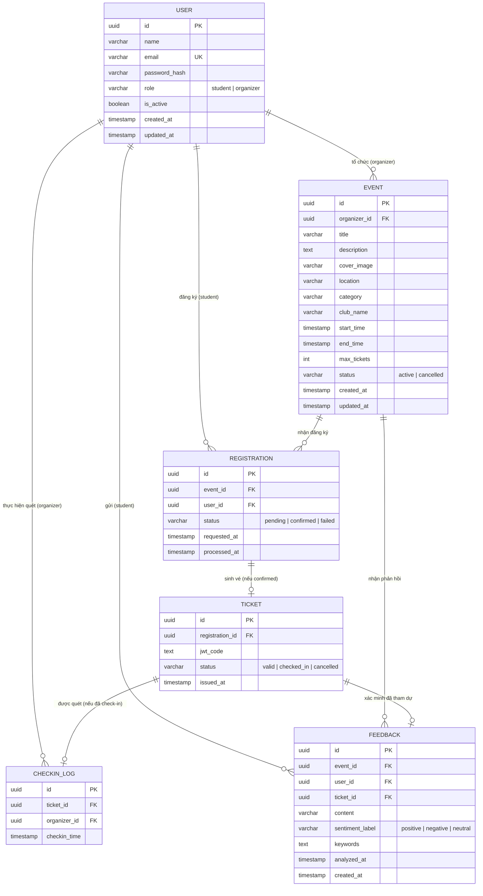

```mermaid
erDiagram
    USER {
        uuid id PK
        varchar name
        varchar email UK
        varchar password_hash
        varchar role "student | organizer"
        boolean is_active
        timestamp created_at
        timestamp updated_at
    }

    EVENT {
        uuid id PK
        uuid organizer_id FK
        varchar title
        text description
        varchar cover_image
        varchar location
        varchar category
        varchar club_name
        timestamp start_time
        timestamp end_time
        int max_tickets
        varchar status "active | cancelled"
        timestamp created_at
        timestamp updated_at
    }

    REGISTRATION {
        uuid id PK
        uuid event_id FK
        uuid user_id FK
        varchar status "pending | confirmed | failed"
        timestamp requested_at
        timestamp processed_at
    }

    TICKET {
        uuid id PK
        uuid registration_id FK
        text jwt_code
        varchar status "valid | checked_in | cancelled"
        timestamp issued_at
    }

    FEEDBACK {
        uuid id PK
        uuid event_id FK
        uuid user_id FK
        uuid ticket_id FK
        varchar content
        varchar sentiment_label "positive | negative | neutral"
        text keywords
        timestamp analyzed_at
        timestamp created_at
    }

    CHECKIN_LOG {
        uuid id PK
        uuid ticket_id FK
        uuid organizer_id FK
        timestamp checkin_time
    }

    USER ||--o{ EVENT : "tổ chức (organizer)"
    USER ||--o{ REGISTRATION : "đăng ký (student)"
    USER ||--o{ FEEDBACK : "gửi (student)"
    USER ||--o{ CHECKIN_LOG : "thực hiện quét (organizer)"
    EVENT ||--o{ REGISTRATION : "nhận đăng ký"
    EVENT ||--o{ FEEDBACK : "nhận phản hồi"
    REGISTRATION ||--o| TICKET : "sinh vé (nếu confirmed)"
    TICKET ||--o| CHECKIN_LOG : "được quét (nếu đã check-in)"
    TICKET ||--o| FEEDBACK : "xác minh đã tham dự"
```