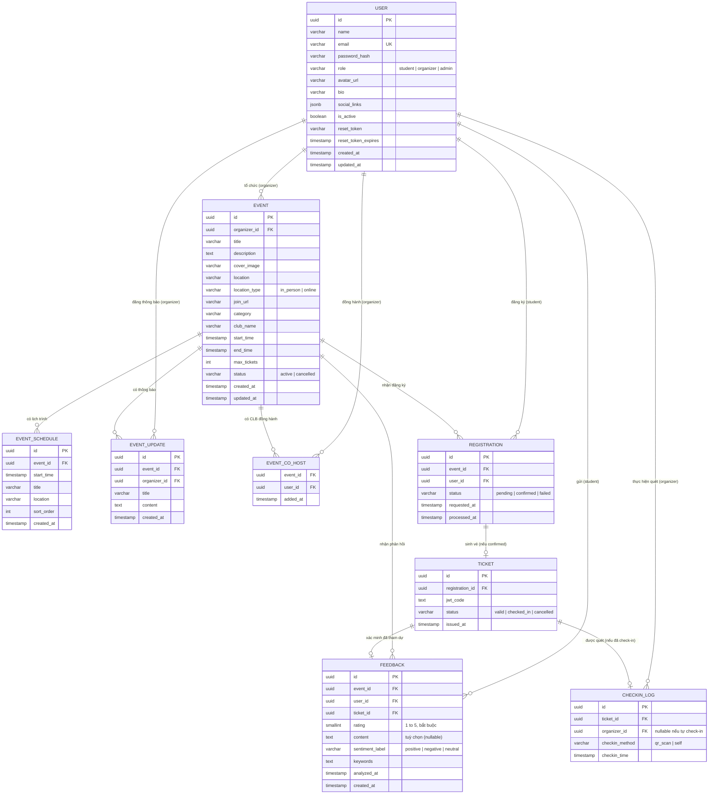

# UniEvent Flow — Entity Relationship Diagram

_Cập nhật theo phạm vi 37 FR (xem SRS v0.3.1 mục 2.1)._
_Phiên bản: 0.2.0._
_Nguồn tham chiếu để xây dựng `SCHEMA.sql`._

So với bản gốc (6 bảng), sơ đồ dưới đây bổ sung:

- `users`: cột `avatar_url`, `bio`, `social_links` (JSONB); vai trò `admin` thêm vào `role`.
- `events`: cột `location_type` (`in_person` | `online`), `join_url`.
- `feedbacks`: cột `rating` (bắt buộc); `content` chuyển thành nullable.
- `checkin_logs`: cột `checkin_method` (`qr_scan` | `self`); `organizer_id` chuyển thành nullable.
- 3 bảng mới: `event_schedule`, `event_updates`, `event_co_hosts`.

## Ghi chú thiết kế

- **`event_co_hosts`** thuần liên kết hiển thị, không có cột quyền hạn (BR-46 trong SRS). Ràng buộc "`user_id` phải có `role = organizer`" được kiểm tra ở tầng service, không ràng buộc được bằng `CHECK` cấp CSDL (Postgres không cho `CHECK` tham chiếu bảng khác mà không dùng trigger).
- **`checkin_logs.organizer_id`** nullable: `NULL` khi `checkin_method = 'self'` (sinh viên tự check-in sự kiện online — FR-36); bắt buộc khi `checkin_method = 'qr_scan'`. Ràng buộc này được thêm ở cấp `CHECK` trong `SCHEMA.sql` (`chk_checkin_method_organizer`).
- **`events.location`** / **`events.join_url`**: bắt buộc có giá trị tuỳ theo `location_type` — ràng buộc `chk_event_location_fields` trong `SCHEMA.sql` thực thi điều này ở tầng CSDL (bổ sung so với bản nháp thay đổi ban đầu, vốn chỉ định nghĩa ở tầng service).
- **`tickets_remaining`** (số vé còn lại) không phải cột trong bảng `events` — nguồn dữ liệu thật là bộ đếm trên Redis, khởi tạo bằng `max_tickets` khi tạo sự kiện. View `v_event_registration_stats` trong `SCHEMA.sql` chỉ dùng để đối soát định kỳ, không thay thế Redis.
