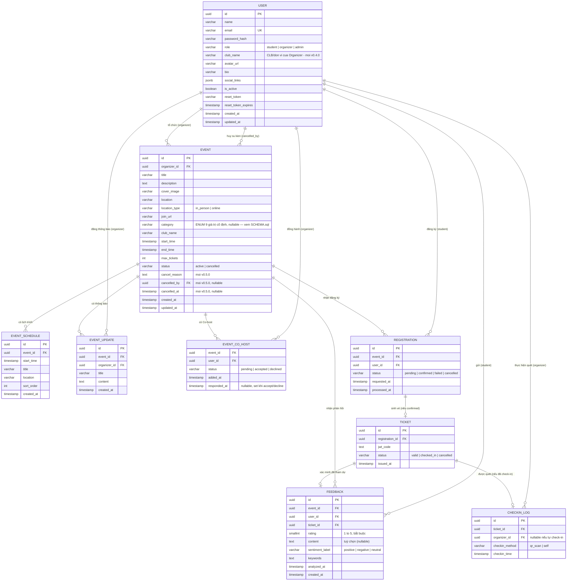

# UniEvent Flow — Entity Relationship Diagram

_Phiên bản: **v0.4.1** — đồng bộ theo SRS v0.6.6 (mục 2.1), khớp SCHEMA.sql v0.4.1 và API v0.4.4._

> **v0.4.1 (Giai đoạn 1 — rà soát đồng bộ):** chỉ cập nhật tham chiếu phiên bản (SRS v0.6.1 → v0.6.6). **Không phát sinh thay đổi cấu trúc dữ liệu** — mô hình 9 bảng giữ nguyên như v0.4.0. Các FR thêm ở SRS v0.6.2→v0.6.6 (FR-39/40/41/42) đều là endpoint đọc/nghiệp vụ trên schema sẵn có, không thêm bảng/cột/enum.

> **Trạng thái:** bản chốt, dùng làm đầu vào để xây dựng SCHEMA.sql. Không phát sinh thay đổi cấu trúc dữ liệu ở Đợt 3 và Đợt 4 — toàn bộ thay đổi lược đồ đã hoàn tất ở Đợt 1 (cột `users.club_name`, giá trị enum `registration_status.cancelled`) và Đợt 2 (ba cột ghi vết huỷ sự kiện trên bảng `events`).
>
> **Bốn điểm cần bám sát khi hiện thực SCHEMA.sql:** (a) view `v_event_registration_stats` phải đếm `registrations` theo `status IN ('confirmed','pending')`, không chỉ `confirmed` — SRS BR-35 và script đối soát NFR-27 đều phụ thuộc điều này; (b) unique index `uq_registration_active_per_user_event` giữ nguyên phạm vi `WHERE status IN ('pending','confirmed')` để bản ghi `cancelled`/`failed` rơi ra khỏi ràng buộc, cho phép sinh viên đăng ký lại (SRS BR-49); (c) giữ `UNIQUE` trên `checkin_logs.ticket_id` — đây là lớp phòng vệ cuối cùng chống check-in trùng (SRS mục 5.6.2); (d) NFR-44 yêu cầu đo hiệu năng tìm kiếm trước và sau khi bật `pg_trgm` kèm chỉ mục GIN, nên chỉ mục này nên được tách thành một câu lệnh riêng có thể bật/tắt để phục vụ phép đo.

So với bản gốc (6 bảng), sơ đồ dưới đây bổ sung:

- `users`: cột `avatar_url`, `bio`, `social_links` (JSONB); vai trò `admin` thêm vào `role`.
- `events`: cột `location_type` (`in_person` | `online`), `join_url`.
- `feedbacks`: cột `rating` (bắt buộc); `content` chuyển thành nullable.
- `checkin_logs`: cột `checkin_method` (`qr_scan` | `self`); `organizer_id` chuyển thành nullable.
- 3 bảng mới: `event_schedule`, `event_updates`, `event_co_hosts`.

**⭐ Thay đổi ở v0.5.0** (theo Đợt 2 Báo cáo rà soát, SRS v0.5.1):

- `events`: **thêm 3 cột ghi vết huỷ sự kiện** — `cancel_reason` (text, nullable), `cancelled_by` (uuid, FK → users.id, nullable, ON DELETE SET NULL), `cancelled_at` (timestamptz, nullable). Phục vụ SRS BR-106: Quản trị viên buộc huỷ sự kiện (FR-30) **bắt buộc** nhập lý do 10–500 ký tự; chủ sự kiện tự huỷ (FR-11) ghi cancelled_by = chính mình, cancel_reason có thể để trống. Trước v0.5.0 không có cách nào truy ngược ai đã huỷ một sự kiện và vì sao — trong khi đây là hành động duy nhất trong hệ thống cho phép ghi đè quyền sở hữu và huỷ vé của người khác.
- **Không có thay đổi cấu trúc nào khác ở Đợt 2.** Các quy tắc mới về TTL giữ chỗ, khoá check-in nguyên tử, cache trạng thái tài khoản (SRS BR-88, BR-91, CBR 7) đều nằm trên Redis — chủ đích là không phình cấu trúc PostgreSQL cho dữ liệu tạm thời. FR-40 (tải ảnh lên) không cần cột mới vì `events.cover_image` và `users.avatar_url` đã sẵn sàng nhận URL.

**Thay đổi trước đó ở v0.4.0** (theo Đợt 1 Báo cáo rà soát tài liệu 21/07/2026, SRS v0.5.0):

- `users`: **thêm cột `club_name`** (varchar 150, nullable) — tên CLB/đơn vị mà tài khoản Ban tổ chức đại diện. Nhập khi Quản trị viên tạo tài khoản (FR-38, BR-92), chủ tài khoản sửa được qua FR-06 (BR-17), hiển thị trên hồ sơ công khai FR-33 (BR-26), và điền sẵn cho `events.club_name` khi tạo sự kiện. Trước v0.4.0 trường này được nhập ở biểu mẫu nhưng **không có nơi lưu trữ**.
- `registrations.status`: **thêm giá trị `cancelled`** vào tập enum (`pending | confirmed | failed | cancelled`) — trạng thái đích khi sinh viên tự huỷ đăng ký (FR-34, SRS BR-56). Trước v0.4.0 chỉ `tickets.status` được đổi, khiến bản ghi đã huỷ vẫn bị hệ thống coi là đang hoạt động: sinh viên không đăng ký lại được (vướng unique index `uq_registration_active_per_user_event`), vẫn nhận email nhắc lịch, dashboard đếm sai, và guard giảm `max_tickets` chặn nhầm.

**Thay đổi trước đó ở v0.3.0** (theo phiên rà soát scope 21/07/2026, SRS v0.4.0→v0.4.2):

- `events.category`: đổi từ `varchar` tự do sang **ENUM cố định 9 giá trị** (`event_category`) — SRS BR-28b.
- `event_co_hosts`: thêm cột `status` (`pending | accepted | declined`) và `responded_at` — Co-host giờ có quyền thao tác thật (đăng thông báo/lịch trình/check-in) sau khi `accepted`, không còn thuần hiển thị — SRS BR-44→46e.
- `users.social_links`: bộ khoá JSONB cố định đổi thành `{facebook, website, tiktok, discord, instagram, zalo}`.
- **Không có bảng mới nào** cho FR-38 (Admin tạo tài khoản Organizer, Provisioning-based) — đây chỉ là một luồng INSERT khác vào bảng `users` có sẵn (do Admin gọi thay vì người dùng tự đăng ký), không cần thực thể riêng.

## Ghi chú thiết kế

- **`event_co_hosts`** ⭐ **sửa v0.3.0**: giờ có quyền thao tác thật (đăng thông báo FR-31, quản lý lịch trình FR-32, check-in FR-19→22) khi `status = accepted` — không còn thuần hiển thị như bản trước (BR-44→46e trong SRS). Ràng buộc "`user_id` phải có `role = organizer`" và "`user_id` khác `organizer_id` của chính sự kiện" (không tự mời, BR-45b) đều kiểm tra ở tầng service, không ràng buộc được bằng `CHECK` cấp CSDL (Postgres không cho `CHECK` tham chiếu bảng khác mà không dùng trigger). Mời lại người `declined` → cập nhật (upsert) lại bản ghi hiện có về `pending` (không tạo dòng trùng, nhờ PK composite `(event_id, user_id)`); mời lại người đã `accepted` → từ chối ở tầng service (`CO_HOST_ALREADY_ACCEPTED`), **không** tự động đưa về `pending` để tránh vô tình tước quyền đang có hiệu lực (SRS BR-46).
- **`events.category`** ⭐ **mới v0.3.0**: đổi từ `varchar` tự do sang `ENUM event_category` (9 giá trị cố định, xem `SCHEMA.sql`) để tránh lỗi chính tả và tăng độ chính xác khi lọc/tìm kiếm (FR-13); vẫn nullable/tuỳ chọn, không ép mặc định `other`.
- **`checkin_logs.organizer_id`** nullable: `NULL` khi `checkin_method = 'self'` (sinh viên tự check-in sự kiện online — FR-36); bắt buộc khi `checkin_method = 'qr_scan'`. Ràng buộc này được thêm ở cấp `CHECK` trong `SCHEMA.sql` (`chk_checkin_method_organizer`). Lưu ý: `organizer_id` ở đây vẫn có thể là một Co-host `accepted` chứ không chỉ chủ sự kiện — cột tên `organizer_id` mang tính lịch sử, ngữ nghĩa thực tế là "người thực hiện quét" (chủ sự kiện hoặc Co-host).
- **`events.location`** / **`events.join_url`**: bắt buộc có giá trị tuỳ theo `location_type` — ràng buộc `chk_event_location_fields` trong `SCHEMA.sql` thực thi điều này ở tầng CSDL (bổ sung so với bản nháp thay đổi ban đầu, vốn chỉ định nghĩa ở tầng service).
- **`registrations.status = cancelled`** ⭐ **mới v0.4.0**: bổ sung để FR-34 (tự huỷ đăng ký) có một trạng thái kết thúc thực sự ở phía Registration, không chỉ ở phía Ticket. Kèm theo đó, mọi truy vấn đếm "người đang giữ chỗ" phải dùng `status IN ('confirmed','pending')` thay vì chỉ `confirmed` (SRS BR-35), và unique index `uq_registration_active_per_user_event` giữ nguyên phạm vi `WHERE status IN ('pending','confirmed')` — nhờ đó bản ghi `cancelled`/`failed` tự động rơi ra khỏi ràng buộc và sinh viên được phép đăng ký lại (SRS BR-49).
- **`users.club_name`** ⭐ **mới v0.4.0**: chuỗi tự do, **không** phải khoá ngoại tới một bảng CLB — hệ thống không quản lý danh mục CLB tập trung (SRS mục 1.2). Tồn tại song song với `events.club_name`: giá trị ở `users` là đơn vị mà tài khoản đại diện, giá trị ở `events` là đơn vị đứng tên của từng sự kiện cụ thể (mặc định sao chép từ `users.club_name` nhưng sửa được). Hai giá trị **không** bị ràng buộc phải trùng nhau, cho phép trường hợp đứng tên hộ hoặc phối hợp liên đơn vị.
- **Bù trừ tồn kho vé Redis ↔ PostgreSQL** ⭐ **ghi chú mới v0.4.0**: bộ đếm vé trên Redis là nguồn dữ liệu thật cho luồng đăng ký, nhưng mọi nhánh thoát khỏi luồng thành công đều phải hoàn vé về bộ đếm — worker thất bại hoặc hết TTL giữ chỗ 60 giây (SRS BR-88/BR-89), và người dùng tự huỷ (SRS BR-56). Ở chiều ngược lại, khi `events.max_tickets` thay đổi thì bộ đếm phải được `INCRBY delta` tương ứng (SRS BR-90). Đây là lý do cột `tickets_remaining_db` trong view `v_event_registration_stats` tồn tại: dùng để đối soát định kỳ hai nguồn, không thay thế Redis.
- **`tickets_remaining`** (số vé còn lại) không phải cột trong bảng `events` — nguồn dữ liệu thật là bộ đếm trên Redis, khởi tạo bằng `max_tickets` khi tạo sự kiện. View `v_event_registration_stats` trong `SCHEMA.sql` chỉ dùng để đối soát định kỳ, không thay thế Redis.
- **FR-38 (Admin tạo tài khoản Organizer, Provisioning-based)** ⭐ mới v0.3.0: không có thực thể/bảng riêng — chỉ là một `INSERT` khác nguồn gốc vào bảng `users` sẵn có (`role = 'organizer'`, do Admin gọi thay vì tự đăng ký, mật khẩu tạm sinh ngẫu nhiên gửi qua email). Xem SRS UC-38, BR-82→86.
