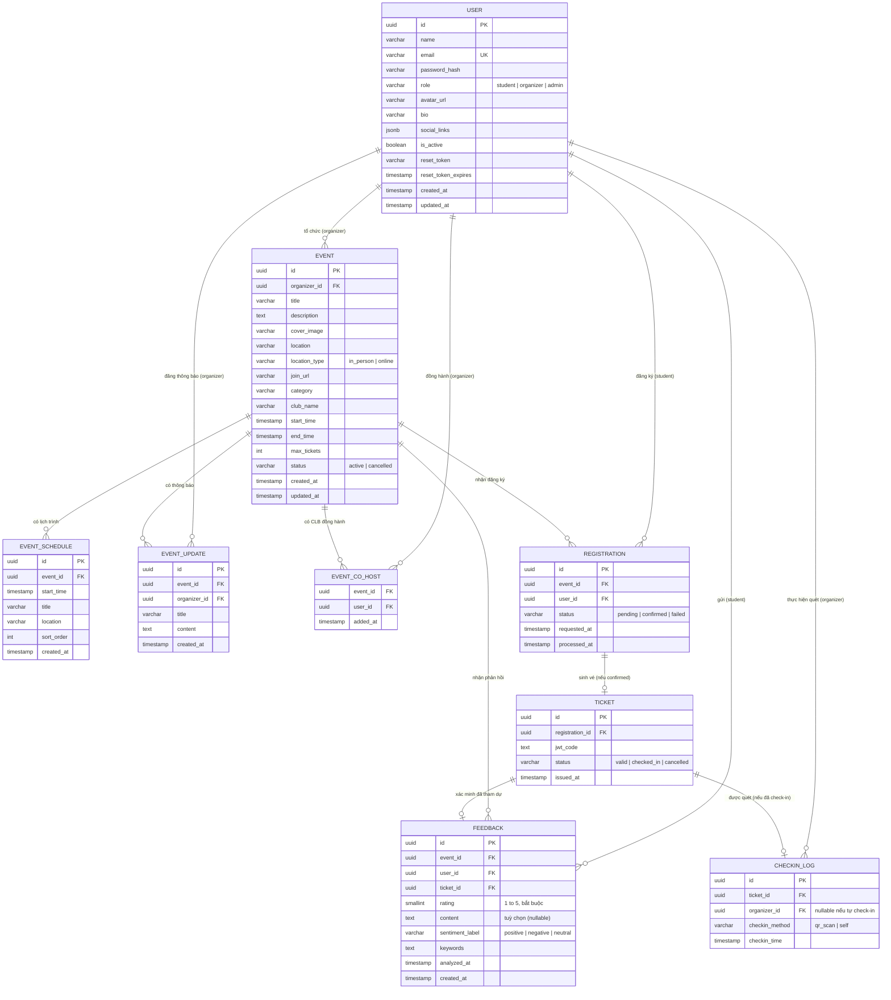

> **Ghi chú phiên bản Markdown này:** Đây là bản chuyển đổi sang Markdown của `SRS_v0_3_1.docx`, dùng làm ngữ cảnh cho Claude Code khi xây dựng backend. So với bản gốc: (1) đã lược bỏ mục 4 "Mockups Screen" (không cần thiết cho backend); (2) sơ đồ ERD ở mục 2.1 được thay bằng Mermaid code lấy nguyên văn từ `ERD_v0_2_0.md` thay vì hình ảnh. Toàn bộ nội dung khác (Use Case, Business Rules, Messages, NFR...) giữ nguyên.

_UniEvent Flow — SRS_

**Software Requirement Specification (SRS)**

**UniEvent Flow**

**Nền tảng Đặt lịch Sự kiện ****&**** Quản lý Check-in Học đường**

Version: 0.3.1

| **Tên thành viên**   | **Mã sinh viên** | **Khóa** | **Chuyên ngành**   |
| -------------------- | ---------------- | -------- | ------------------ |
| Trần Đình Nhật Quang | 23T1020425       | K47      | Công nghệ phần mềm |
| Hồ Tiến Dũng         | 23T1020122       | K47      | Công nghệ phần mềm |

**Huế, Jul 2026**

**Revision History**

| **Date**   | **Version** | **Author**           | **Change Description**                                                                                                                                                                                                                                                                                                                                                                                                                                                                                                                                                                                                                                                                                                                                                                                                                                                   |
| ---------- | ----------- | -------------------- | ------------------------------------------------------------------------------------------------------------------------------------------------------------------------------------------------------------------------------------------------------------------------------------------------------------------------------------------------------------------------------------------------------------------------------------------------------------------------------------------------------------------------------------------------------------------------------------------------------------------------------------------------------------------------------------------------------------------------------------------------------------------------------------------------------------------------------------------------------------------------ |
| 13/07/2026 | 0.1.0       | Trần Đình Nhật Quang | Chuyển đổi bản SRS cũ của nhóm sang bản chính thức                                                                                                                                                                                                                                                                                                                                                                                                                                                                                                                                                                                                                                                                                                                                                                                                                       |
| 14/07/2026 | 0.1.1       | Trần Đình Nhật Quang | Cập nhật nội dung cho phần 1 & 2                                                                                                                                                                                                                                                                                                                                                                                                                                                                                                                                                                                                                                                                                                                                                                                                                                         |
| 14/07/2026 | 0.2.0       | Hồ Tiến Dũng         | Thiết kế Use Case Diagram                                                                                                                                                                                                                                                                                                                                                                                                                                                                                                                                                                                                                                                                                                                                                                                                                                                |
| 14/07/2026 | 0.2.1       | Hồ Tiến Dũng         | Thiết kế Use Case Specification cho UC - Quên mật khẩu                                                                                                                                                                                                                                                                                                                                                                                                                                                                                                                                                                                                                                                                                                                                                                                                                   |
| 14/07/2026 | 0.2.2       | Trần Đình Nhật Quang | Cập nhật nội dung phần 3 (module quản lý tài khoản)                                                                                                                                                                                                                                                                                                                                                                                                                                                                                                                                                                                                                                                                                                                                                                                                                      |
| 15/07/2026 | 0.2.3       | Trần Đình Nhật Quang | Cập nhật nội dung phần 2.4, 5 và 6                                                                                                                                                                                                                                                                                                                                                                                                                                                                                                                                                                                                                                                                                                                                                                                                                                       |
| 17/07/2026 | 0.3.0       | Trần Đình Nhật Quang | Viết lại toàn diện theo quyết định mở rộng phạm vi 28→37 FR (UniEventFlow_thay_doi_v2.md): bổ sung Actor Quản trị viên; thêm module Quản trị hệ thống và các FR-29→37 (Admin, Lịch trình, Thông báo, CLB đồng hành, Tự huỷ đăng ký, Nhắc lịch, Check-in online); cập nhật FR-01/06/08/23. Hoàn thiện bảng Use Case "# │ UC Name │ Description" (2.4) và Ma trận phân quyền (2.5) cho toàn bộ 7 module. Viết đầy đủ Đặc tả Use Case (mục 3) cho toàn bộ 37 FR, chuẩn hoá lại mã Business Rule liên tục BR-01→BR-81 (khắc phục lỗi trùng mã ở bản trước). Cập nhật sơ đồ ERD (mục 2.1) theo schema mới. Thêm khung tiêu đề cho toàn bộ màn hình ở mục 4 (chưa đưa nội dung mockup, theo đúng phạm vi phiên làm việc này). Bổ sung Assumption về mô hình 1 Ban tổ chức/sự kiện; sửa nội dung NFR Interfaces (loại bỏ nội dung sao chép từ template FPT chưa được thay thế). |
| 17/07/2026 | 0.3.1       | Trần Đình Nhật Quang | Đồng bộ hoá với ERD.md/SCHEMA.sql/API.md v2.0 sau khi các tài liệu này được viết lại: bổ sung MSG-27→32 vào mục 5.1 (Messages List) cho 5 mã lỗi mới xuất hiện trong API.md v2.0 nhưng chưa có trong SRS v0.3.0 (RATING_REQUIRED, NOT_ATTENDED, DUPLICATE_FEEDBACK, EVENT_NOT_ONLINE, CO_HOST_NOT_ORGANIZER, REGISTRATION_NOT_CANCELLABLE). Không có thay đổi về phạm vi/FR.                                                                                                                                                                                                                                                                                                                                                                                                                                                                                             |

# **Table of Contents**

_(Nhấn chuột phải vào bảng bên dưới trong Word → **"**Update Field**"** → **"**Update entire table**"** để cập nhật số trang)_

# **1. Giới thiệu**

## **1.1 Mục đích tài liệu**

Tài liệu Đặc tả Yêu cầu Phần mềm (Software Requirements Specification – SRS) này nhằm mục đích:

- Xác định rõ các mục tiêu nghiệp vụ (business objectives), chức năng nghiệp vụ (business functions) và nhóm người dùng liên quan đến hệ thống UniEvent Flow.

- Xác định các quy trình nghiệp vụ mà giải pháp phải hỗ trợ.

- Tạo nền tảng thông tin thống nhất, tạo sự hiểu biết chung (Common Understanding) giữa các bên liên quan (2 thành viên nhóm, giảng viên hướng dẫn và hội đồng phản biện) về các yêu cầu chức năng của hệ thống.

- Làm cơ sở để xây dựng tiêu chí nghiệm thu (acceptance test), đảm bảo sản phẩm bàn giao đáp ứng đúng các yêu cầu đã được đặc tả.

Mục đích của tài liệu này là thu thập và phân tích tất cả các ý tưởng khác nhau đã được đưa ra để định hình hệ thống, cũng như các yêu cầu của nó đối với người tiêu dùng. Đồng thời, nhóm sẽ dự đoán và sắp xếp cách thức sản phẩm này sẽ được sử dụng để hiểu rõ hơn về dự án, phác thảo các khái niệm có thể được phát triển sau này, và ghi lại những ý tưởng đang được xem xét nhưng có thể bị loại bỏ trong quá trình phát triển sản phẩm.

## **1.2 Tổng quan**

UniEvent Flow là nền tảng web hỗ trợ các câu lạc bộ, tổ chức và phòng ban sinh viên trong việc quản lý toàn bộ vòng đời của một sự kiện học đường: tạo sự kiện (trực tiếp hoặc trực tuyến), đăng ký/đặt vé, phát hành vé điện tử dạng mã QR, check-in tại cổng (hoặc tự check-in đối với sự kiện trực tuyến), thu thập – phân tích cảm xúc phản hồi sau sự kiện, cùng các tính năng hỗ trợ vận hành: lịch trình chi tiết, feed thông báo, CLB đồng hành, tự huỷ đăng ký, nhắc lịch qua email và một lớp quản trị hệ thống (Admin).

Hệ thống giải quyết hai lỗ hổng chính của cách làm thủ công hiện nay (đăng ký qua mạng xã hội/Google Forms):

- Không kiểm soát được sức chứa sự kiện theo thời gian thực dẫn tới nhận đăng ký vượt số lượng chỗ.

- Thiếu công cụ theo dõi người tham dự thực tế cũng như phân tích phản hồi sau sự kiện một cách có hệ thống.

Giá trị kỹ thuật cốt lõi của hệ thống nằm ở hai bài toán thực tế: xử lý đăng ký đồng thời với số lượng vé giới hạn mà không bị bán vượt (oversell) thông qua Redis atomic operations kết hợp hàng đợi BullMQ, và xác thực vé tại cổng với độ trễ dưới 1 giây bằng vé điện tử JWT tự xác thực. Hai bài toán này giữ nguyên là trọng tâm kỹ thuật của đồ án sau khi mở rộng phạm vi; các FR mới (29→37) chủ yếu bổ sung chiều rộng nghiệp vụ (breadth) — quản trị, lịch trình, thông báo, tự huỷ vé — dựa trên cùng nền tảng dữ liệu và kiến trúc đã có, không thay đổi hai giá trị kỹ thuật cốt lõi nêu trên.

Tác nhân và vai trò (Actors and Roles):

| **Tác nhân (Actor)**    | **Vai trò (Roles)**                                                                                                                                                                                                                                                                                                                                                                                    |
| ----------------------- | ------------------------------------------------------------------------------------------------------------------------------------------------------------------------------------------------------------------------------------------------------------------------------------------------------------------------------------------------------------------------------------------------------ |
| Sinh viên (Student)     | Tìm kiếm và xem thông tin chi tiết về sự kiện. Đăng ký/đặt vé tham dự sự kiện, tự huỷ đăng ký khi cần. Nhận vé điện tử dạng mã QR mã hoá JWT. Xem lịch sử vé đã đăng ký. Tự check-in đối với sự kiện trực tuyến. Gửi phản hồi (rating bắt buộc, nhận xét tuỳ chọn) sau khi đã tham dự. Xem hồ sơ công khai của Ban tổ chức.                                                                            |
| Ban tổ chức (Organizer) | Tạo và quản lý sự kiện do CLB/phòng ban của mình tổ chức (trực tiếp hoặc trực tuyến). Quản lý lịch trình chi tiết và đăng thông báo cập nhật cho sự kiện. Gắn CLB/Ban tổ chức khác làm đơn vị đồng hành (chỉ hiển thị). Check-in cho người tham dự tại cổng bằng cách quét mã QR. Xem báo cáo thống kê đăng ký theo thời gian thực và báo cáo phân loại cảm xúc/từ khoá phàn nàn phổ biến từ phản hồi. |
| Quản trị viên (Admin)   | Vô hiệu hoá hoặc kích hoạt lại tài khoản người dùng vi phạm chính sách sử dụng. Buộc huỷ bất kỳ sự kiện nào vi phạm chính sách, bỏ qua kiểm tra quyền sở hữu. Giám sát vận hành ở tầm toàn hệ thống.                                                                                                                                                                                                   |
| Hệ thống (System)       | Kiểm soát tồn kho vé theo thời gian thực qua Redis (chống bán vượt). Điều phối hàng đợi xử lý bất đồng bộ (BullMQ): sinh vé, gửi email vé, gửi email nhắc lịch trước sự kiện, gửi email đặt lại mật khẩu. Sinh và xác thực JWT/QR tại thời điểm check-in. Ghi nhận tự check-in cho sự kiện trực tuyến. Gọi LLM API để phân tích cảm xúc phản hồi.                                                      |

Các thực thể nằm ngoài phạm vi quản lý của hệ thống:

- Câu lạc bộ / Phòng ban — chỉ được lưu dưới dạng chuỗi văn bản tự do (club_name) trên thực thể Event; riêng CLB/Ban tổ chức đồng hành (FR-37) là liên kết đến một tài khoản Organizer đã tồn tại (bảng event_co_hosts), không phải văn bản tự do, để có thể click-to-profile (FR-33).

- Danh mục / loại hình sự kiện (category) — trường văn bản tự do (free-text varchar), không phải danh mục cố định dạng enum.

Giả định quan trọng về mô hình tổ chức: mỗi sự kiện chỉ có duy nhất một Ban tổ chức chịu trách nhiệm chính (events.organizer_id), quyết định mọi thao tác sửa/huỷ/xem báo cáo (requireOwnership). Mô hình đa tổ chức có quyền quản lý (multi-host) đã được cân nhắc và loại bỏ khỏi phạm vi 7 tuần; nhu cầu hiển thị nhiều CLB tham gia một sự kiện được đáp ứng qua cơ chế "đồng hành" (co-host) thuần hiển thị, không có quyền thao tác.

## **1.3 Đối tượng sử dụng tài liệu và gợi ý đọc**

Tài liệu này hướng đến các đối tượng đọc sau:

- Development Team (Quang, Dũng): Dùng để thống nhất phạm vi, phân công vai trò, trực tiếp thiết kế chi tiết, code, unit test và tích hợp.

- Giảng viên hướng dẫn: Sử dụng để đánh giá tính khả thi của phạm vi đồ án và định hướng điều chỉnh nếu cần.

- Hội đồng đánh giá: Sử dụng làm căn cứ nghiệm thu, đánh giá kết quả thực hiện.

## **1.4 Từ viết tắt (Abbreviations)**

| **Từ viết tắt** | **Giải thích**                                                                          |
| --------------- | --------------------------------------------------------------------------------------- |
| SRS             | Software Requirements Specification (Đặc tả yêu cầu phần mềm)                           |
| FR / NFR        | Functional Requirement / Non-Functional Requirement (Yêu cầu chức năng / Phi chức năng) |
| UC              | Use Case                                                                                |
| BR              | Business Rule                                                                           |
| CBR             | Common Business Rules                                                                   |
| MSG             | Message                                                                                 |
| JWT             | JSON Web Token                                                                          |
| JSONB           | Kiểu dữ liệu JSON dạng nhị phân của PostgreSQL, dùng lưu social_links                   |
| LLM             | Large Language Model                                                                    |
| REST API        | Tiêu chuẩn kiến trúc giao tiếp qua HTTP.                                                |
| MVP             | Minimum Viable Product                                                                  |

## **1.5 Tài liệu tham chiếu**

- URD.xlsx — Tài liệu yêu cầu người dùng (User Requirements Document). Lưu ý: tại thời điểm phiên bản SRS này, URD.xlsx liệt kê 27 FR gốc và chưa được đồng bộ theo phạm vi 37 FR hiện tại; việc cập nhật URD.xlsx nằm ngoài phạm vi của phiên làm việc này và sẽ thực hiện ở bước tiếp theo.

- ERD.md — Sơ đồ quan hệ thực thể chi tiết (Mermaid). Sơ đồ tại mục 2.1 của tài liệu này đã được cập nhật theo phạm vi 37 FR; ERD.md/SCHEMA.sql/API.md dạng file riêng sẽ được đồng bộ lại ở phiên làm việc kế tiếp.

- API.md — Đặc tả REST API, là nguồn tham chiếu cho các Business Rule ở mục 3 của tài liệu này.

- SCHEMA.sql — Định nghĩa cấu trúc CSDL PostgreSQL hiện hành.

- UniEventFlow_thay_doi_v2.md — Đặc tả tổng hợp các quyết định mở rộng phạm vi 28 FR → 37 FR, dùng làm đầu vào chính để biên soạn phiên bản SRS này.

# **2. Yêu cầu tổng quan mức cao (High Level Requirements)**

Phần này mô tả tổng quan về các chức năng hệ thống hoặc quy trình nghiệp vụ được thể hiện trong các sơ đồ khác nhau. Nó trình bày các loại người dùng, quyền hạn được cấp cho họ để thực hiện các chức năng hệ thống cụ thể và trình tự cần thiết để hoàn thành một quy trình nghiệp vụ (nếu có).

## **2.1 Sơ đồ quan hệ thực thể (Entity Relationship Diagram)**

Sơ đồ dưới đây minh hoạ các thực thể dữ liệu chính của hệ thống sau khi mở rộng phạm vi lên 37 FR, tương ứng với 9 bảng trong SCHEMA.sql: users, events, event_schedule, event_updates, event_co_hosts, registrations, tickets, feedbacks, checkin_logs. So với bản trước, users bổ sung avatar_url/bio/social_links và vai trò admin; events bổ sung location_type/join_url; feedbacks bổ sung rating; checkin_logs bổ sung checkin_method và cho phép organizer_id NULL (tự check-in).

_Hình 1: Sơ đồ quan hệ thực thể (ERD) hệ thống UniEvent Flow — cập nhật theo phạm vi 37 FR (nguồn: ERD_v0.2.0.md)_

**Ghi chú thiết kế (từ ERD_v0.2.0.md):**

- `event_co_hosts` thuần liên kết hiển thị, không có cột quyền hạn (BR-46). Ràng buộc "`user_id` phải có `role = organizer`" được kiểm tra ở tầng service, không ràng buộc được bằng `CHECK` cấp CSDL.
- `checkin_logs.organizer_id` nullable: `NULL` khi `checkin_method = 'self'` (FR-36); bắt buộc khi `checkin_method = 'qr_scan'`. Ràng buộc `CHECK` tương ứng: `chk_checkin_method_organizer` trong SCHEMA.sql.
- `events.location` / `events.join_url`: bắt buộc tuỳ theo `location_type` — ràng buộc `chk_event_location_fields` trong SCHEMA.sql.
- `tickets_remaining` không phải cột trong bảng `events` — nguồn dữ liệu thật là bộ đếm trên Redis, khởi tạo bằng `max_tickets` khi tạo sự kiện. View `v_event_registration_stats` chỉ dùng để đối soát định kỳ, không thay thế Redis.

## **2.2 Lược đồ quy trình nghiệp vụ (Workflow)**

Các lược đồ quy trình chi tiết (activity diagram) cho từng module dưới đây sẽ được vẽ ở bước thiết kế tiếp theo; mục này giữ vai trò khung mục lục và tóm tắt luồng chính bằng văn bản để nhóm và giảng viên thống nhất trước khi vẽ.

### **2.2.1 Auth module overview**

Đăng ký (kèm xác thực mã Ban tổ chức nếu role=organizer) → Đăng nhập (rate-limit qua Redis) → cấp JWT → các thao tác hồ sơ (xem/sửa/đổi mật khẩu) → Quên mật khẩu (2 giai đoạn qua reset_token).

_[Sơ đồ hoạt động (activity diagram) chi tiết cho luồng **"**Auth module overview**"** sẽ được bổ sung ở bước thiết kế chi tiết tiếp theo.]_

### **2.2.2 Event management**

Tạo sự kiện (chọn in_person/online) → khởi tạo bộ đếm Redis → Sửa/Huỷ (kiểm tra ownership, guard max_tickets) → Đăng thông báo & quản lý lịch trình → gắn CLB đồng hành.

_[Sơ đồ hoạt động (activity diagram) chi tiết cho luồng **"**Event management**"** sẽ được bổ sung ở bước thiết kế chi tiết tiếp theo.]_

### **2.2.3 Đăng ký ****&**** Vé điện tử (Registration ****&**** Ticket)**

Đăng ký → Redis atomic decrement (còn vé/hết vé) → BullMQ sinh vé + gửi email → Sinh viên xem vé → có thể tự huỷ (hoàn vé về Redis) → hệ thống tự gửi email nhắc lịch trước giờ diễn ra.

_[Sơ đồ hoạt động (activity diagram) chi tiết cho luồng **"**Đăng ký **&** Vé điện tử (Registration **&** Ticket)**"** sẽ được bổ sung ở bước thiết kế chi tiết tiếp theo.]_

### **2.2.4 Check-in tại cổng sự kiện (Gate Check-in)**

Sự kiện in_person: quét QR → xác thực JWT đồng bộ (<1s) → ghi log bất đồng bộ. Sự kiện online: sinh viên tự bấm "Xác nhận tham dự" → ghi log với checkin_method=self, organizer_id=NULL.

_[Sơ đồ hoạt động (activity diagram) chi tiết cho luồng **"**Check-in tại cổng sự kiện (Gate Check-in)**"** sẽ được bổ sung ở bước thiết kế chi tiết tiếp theo.]_

### **2.2.5 Phản hồi ****&**** Phân tích cảm xúc bằng AI (Feedback ****&**** AI Sentiment)**

Điều kiện: ticket.status=checked_in (đạt được từ cả 2 luồng check-in ở 2.2.4) → gửi phản hồi (rating bắt buộc + content tuỳ chọn) → gộp batch → gọi LLM → lưu sentiment_label/keywords.

_[Sơ đồ hoạt động (activity diagram) chi tiết cho luồng **"**Phản hồi **&** Phân tích cảm xúc bằng AI (Feedback **&** AI Sentiment)**"** sẽ được bổ sung ở bước thiết kế chi tiết tiếp theo.]_

### **2.2.6 Quản trị hệ thống (System Administration)**

Quản trị viên đăng nhập (role=admin) → tra cứu người dùng/sự kiện → vô hiệu hoá tài khoản hoặc buộc huỷ sự kiện (bỏ qua ownership) → hành động được ghi nhận.

_[Sơ đồ hoạt động (activity diagram) chi tiết cho luồng **"**Quản trị hệ thống (System Administration)**"** sẽ được bổ sung ở bước thiết kế chi tiết tiếp theo.]_

## **2.3 Sơ đồ chuyển trạng thái (State Transition Diagram)**

Ba thực thể có vòng đời trạng thái rõ ràng là Event, Registration và Ticket. Việc mở rộng phạm vi 37 FR tái sử dụng nguyên trạng các state machine này (tự huỷ đăng ký dùng lại ticket.status=cancelled sẵn có; tự check-in online dùng lại ticket.status=checked_in sẵn có) — không phát sinh trạng thái mới nào.

### **2.3.1 Event**

active → cancelled (một chiều, soft-cancel qua UC-12 do chủ sự kiện hoặc UC-37 do Admin thực hiện, cùng đích trạng thái).

_[Sơ đồ chuyển trạng thái sẽ được bổ sung ở bước thiết kế chi tiết tiếp theo.]_

### **2.3.2 Registration**

pending → confirmed | failed (xử lý bởi worker BullMQ, không quay lại pending).

_[Sơ đồ chuyển trạng thái sẽ được bổ sung ở bước thiết kế chi tiết tiếp theo.]_

### **2.3.3 Ticket**

valid → checked_in (qua quét QR tại cổng HOẶC tự check-in sự kiện online); valid → cancelled (qua tự huỷ đăng ký HOẶC huỷ sự kiện); checked_in là trạng thái cuối, không thể huỷ từ đây (BR-55).

_[Sơ đồ chuyển trạng thái sẽ được bổ sung ở bước thiết kế chi tiết tiếp theo.]_

## **2.4 Sơ đồ Use Case (Use Case Diagram)**

Sơ đồ trường hợp sử dụng ở đây thể hiện mục tiêu cụ thể hoặc cách người dùng tương tác với hệ thống. Hình elip ở ranh giới hệ thống đại diện cho trường hợp sử dụng/chức năng của hệ thống, trong khi hình người que đại diện cho tác nhân/người dùng của hệ thống. Đường thẳng nối tác nhân và trường hợp sử dụng cho thấy tác nhân có thể thực hiện chức năng đó trong hệ thống để đạt được mục tiêu.

### **2.4.1 Quản lý tài khoản**

_[Sơ đồ Use Case (hình vẽ actor–ellipse) cho module **"**Quản lý tài khoản**"** sẽ được bổ sung ở bước thiết kế chi tiết tiếp theo.]_

_Figure 11: Use Case Diagram for Account Management Module_

| **#** | **UC Name**                                                     | **Description**                                                                                                                                                                                  |
| ----- | --------------------------------------------------------------- | ------------------------------------------------------------------------------------------------------------------------------------------------------------------------------------------------ |
| 1     | Đăng ký (Register)                                              | Cho phép người dùng tạo định danh mới trên hệ thống với vai trò Sinh viên hoặc Ban tổ chức. Nếu chọn vai trò Ban tổ chức, hệ thống yêu cầu nhập thêm Mã đăng ký Ban tổ chức để xác thực (FR-01). |
| 2     | Đăng nhập (Log in)                                              | Xác thực danh tính người dùng, cấp phát JWT Access Token (FR-02).                                                                                                                                |
| 3     | Đăng xuất (Log out)                                             | Kết thúc phiên làm việc hiện tại của người dùng (FR-03).                                                                                                                                         |
| 4     | Đổi mật khẩu (Change Password)                                  | Cho phép người dùng đã đăng nhập tự đổi mật khẩu tài khoản của mình (FR-04).                                                                                                                     |
| 5     | Xem thông tin cá nhân (View Profile)                            | Truy xuất hồ sơ cá nhân của người dùng hiện tại (FR-05).                                                                                                                                         |
| 6     | Cập nhật thông tin cá nhân (Update Profile)                     | Chỉnh sửa họ tên, ảnh đại diện, tiểu sử và liên kết mạng xã hội (FR-06).                                                                                                                         |
| 7     | Quên mật khẩu (Forgot Password)                                 | Khôi phục quyền truy cập tài khoản qua email đã đăng ký (FR-07).                                                                                                                                 |
| 8     | Xem hồ sơ công khai Ban tổ chức (View Organizer Public Profile) | Cho phép mọi người xem trang hồ sơ công khai của một Ban tổ chức, gồm thông tin cơ bản và danh sách sự kiện đang tổ chức (FR-33).                                                                |

### **2.4.2 Quản lý sự kiện**

_[Sơ đồ Use Case (hình vẽ actor–ellipse) cho module **"**Quản lý sự kiện**"** sẽ được bổ sung ở bước thiết kế chi tiết tiếp theo.]_

_Figure 12: Use Case Diagram for Event Management Module_

| **#** | **UC Name**                                         | **Description**                                                                                                                                      |
| ----- | --------------------------------------------------- | ---------------------------------------------------------------------------------------------------------------------------------------------------- |
| 1     | Tạo sự kiện (Create Event)                          | Cho phép Ban tổ chức tạo sự kiện mới, chọn hình thức Trực tiếp (In Person) hoặc Trực tuyến (Online) (FR-08).                                         |
| 2     | Xem chi tiết sự kiện (View Event Detail)            | Hiển thị thông tin chi tiết của một sự kiện kèm số vé còn lại theo thời gian thực (FR-09).                                                           |
| 3     | Sửa sự kiện (Update Event)                          | Cho phép Ban tổ chức chỉnh sửa thông tin sự kiện do mình phụ trách (FR-10).                                                                          |
| 4     | Huỷ sự kiện (Cancel Event)                          | Cho phép Ban tổ chức huỷ (soft-cancel) sự kiện do mình phụ trách (FR-11).                                                                            |
| 5     | Xem danh sách sự kiện phụ trách (View My Events)    | Hiển thị danh sách sự kiện mà Ban tổ chức đang đăng nhập phụ trách (FR-12).                                                                          |
| 6     | Tìm kiếm, lọc sự kiện (Search & Filter Events)      | Cho phép tìm kiếm và lọc sự kiện công khai theo từ khoá, danh mục, CLB, khoảng thời gian (FR-13).                                                    |
| 7     | Đăng thông báo cập nhật sự kiện (Post Event Update) | Cho phép Ban tổ chức đăng thông báo mới lên trang sự kiện để thông tin đến người đã đăng ký (FR-31).                                                 |
| 8     | Quản lý lịch trình sự kiện (Manage Event Schedule)  | Cho phép Ban tổ chức thêm, sửa, xoá các mốc thời gian trong lịch trình chi tiết của sự kiện (FR-32).                                                 |
| 9     | Gắn CLB/Ban tổ chức đồng hành (Add Event Co-host)   | Cho phép chủ sự kiện gắn thêm một hoặc nhiều Ban tổ chức khác làm đơn vị đồng hành — chỉ mang tính hiển thị, không có quyền quản lý sự kiện (FR-37). |

### **2.4.3 Đăng ký ****&**** Vé điện tử**

_[Sơ đồ Use Case (hình vẽ actor–ellipse) cho module **"**Đăng ký **&** Vé điện tử**"** sẽ được bổ sung ở bước thiết kế chi tiết tiếp theo.]_

_Figure 13: Use Case Diagram for Registration **&** Ticket Module_

| **#** | **UC Name**                                             | **Description**                                                                                                |
| ----- | ------------------------------------------------------- | -------------------------------------------------------------------------------------------------------------- |
| 1     | Đăng ký / đặt vé (Register for Event)                   | Cho phép Sinh viên đăng ký tham dự một sự kiện, hệ thống chống bán vượt vé qua Redis atomic decrement (FR-14). |
| 2     | Sinh mã vé QR/JWT (Generate Ticket)                     | Hệ thống sinh vé điện tử (JWT/QR) sau khi Registration được xử lý thành công (FR-15).                          |
| 3     | Gửi vé qua email bất đồng bộ (Send Ticket Email)        | Hệ thống gửi email chứa vé điện tử cho sinh viên qua hàng đợi bất đồng bộ (FR-16).                             |
| 4     | Xem danh sách vé cá nhân (View My Tickets)              | Cho phép Sinh viên xem danh sách toàn bộ vé đã đăng ký (FR-17).                                                |
| 5     | Xem chi tiết một vé (View Ticket Detail)                | Cho phép Sinh viên xem chi tiết một vé kèm mã QR (FR-18).                                                      |
| 6     | Tự huỷ đăng ký (Cancel My Registration)                 | Cho phép Sinh viên tự huỷ một đăng ký đã xác nhận, hệ thống hoàn lại vé vào bộ đếm Redis (FR-34).              |
| 7     | Gửi email nhắc lịch trước sự kiện (Send Event Reminder) | Hệ thống tự động gửi email nhắc lịch cho các vé đã xác nhận trước giờ sự kiện diễn ra (FR-35).                 |

### **2.4.4 Check-in tại cổng sự kiện**

_[Sơ đồ Use Case (hình vẽ actor–ellipse) cho module **"**Check-in tại cổng sự kiện**"** sẽ được bổ sung ở bước thiết kế chi tiết tiếp theo.]_

_Figure 14: Use Case Diagram for Gate Check-in Module_

| **#** | **UC Name**                                                     | **Description**                                                                                                  |
| ----- | --------------------------------------------------------------- | ---------------------------------------------------------------------------------------------------------------- |
| 1     | Xác thực & giải mã QR khi check-in (Scan & Verify QR)           | Cho phép Ban tổ chức quét mã QR tại cổng, hệ thống xác thực chữ ký JWT và trả kết quả trong dưới 1 giây (FR-19). |
| 2     | Ghi nhận check-in (Record Check-in Log)                         | Hệ thống ghi nhận lịch sử check-in và cập nhật trạng thái vé (FR-20).                                            |
| 3     | Xem lịch sử check-in (View Check-in History)                    | Cho phép Ban tổ chức xem danh sách người đã check-in của sự kiện mình phụ trách (FR-21).                         |
| 4     | Xuất danh sách CSV (Export Check-in CSV)                        | Cho phép Ban tổ chức xuất danh sách check-in ra file CSV (FR-22).                                                |
| 5     | Tự check-in sự kiện trực tuyến (Self Check-in for Online Event) | Cho phép Sinh viên tự xác nhận tham dự đối với sự kiện trực tuyến, không cần quét QR tại cổng (FR-36).           |

### **2.4.5 Phản hồi ****&**** Phân tích cảm xúc bằng AI**

_[Sơ đồ Use Case (hình vẽ actor–ellipse) cho module **"**Phản hồi **&** Phân tích cảm xúc bằng AI**"** sẽ được bổ sung ở bước thiết kế chi tiết tiếp theo.]_

_Figure 15: Use Case Diagram for Feedback **&** AI Sentiment Module_

| **#** | **UC Name**                                                  | **Description**                                                                                                                       |
| ----- | ------------------------------------------------------------ | ------------------------------------------------------------------------------------------------------------------------------------- |
| 1     | Gửi phản hồi sau sự kiện (Submit Feedback)                   | Cho phép Sinh viên đã tham dự (ticket.status = checked_in) gửi đánh giá sao (1–5, bắt buộc) kèm nội dung nhận xét (tuỳ chọn) (FR-23). |
| 2     | Xem danh sách phản hồi (View Feedback List)                  | Cho phép Ban tổ chức xem danh sách phản hồi của sự kiện mình phụ trách, lọc theo nhãn cảm xúc (FR-24).                                |
| 3     | Gọi LLM API phân tích cảm xúc (Run Sentiment Analysis)       | Cho phép Ban tổ chức kích hoạt phân tích cảm xúc hàng loạt cho các phản hồi chưa xử lý, hoặc hệ thống tự động chạy theo lịch (FR-25). |
| 4     | Lưu nhãn cảm xúc & từ khoá (Save Sentiment Label & Keywords) | Hệ thống lưu kết quả phân loại cảm xúc và từ khoá nổi bật sau khi LLM xử lý xong (FR-26).                                             |

### **2.4.6 Dashboard ****&**** Báo cáo thống kê**

_[Sơ đồ Use Case (hình vẽ actor–ellipse) cho module **"**Dashboard **&** Báo cáo thống kê**"** sẽ được bổ sung ở bước thiết kế chi tiết tiếp theo.]_

_Figure 16: Use Case Diagram for Dashboard **&** Statistics Module_

| **#** | **UC Name**                                           | **Description**                                                                                           |
| ----- | ----------------------------------------------------- | --------------------------------------------------------------------------------------------------------- |
| 1     | Xem dashboard đăng ký (View Registration Dashboard)   | Cho phép Ban tổ chức xem số liệu tổng hợp về đăng ký, check-in theo thời gian thực (FR-27).               |
| 2     | Xem báo cáo phân loại cảm xúc (View Sentiment Report) | Cho phép Ban tổ chức xem báo cáo phân loại cảm xúc, từ khoá phổ biến và điểm phản hồi trung bình (FR-28). |

### **2.4.7 Quản trị hệ thống**

_[Sơ đồ Use Case (hình vẽ actor–ellipse) cho module **"**Quản trị hệ thống**"** sẽ được bổ sung ở bước thiết kế chi tiết tiếp theo.]_

_Figure 17: Use Case Diagram for System Administration Module_

| **#** | **UC Name**                                                               | **Description**                                                                                    |
| ----- | ------------------------------------------------------------------------- | -------------------------------------------------------------------------------------------------- |
| 1     | Vô hiệu hoá / kích hoạt tài khoản người dùng (Toggle User Account Status) | Cho phép Quản trị viên vô hiệu hoá hoặc kích hoạt lại tài khoản của bất kỳ người dùng nào (FR-29). |
| 2     | Buộc huỷ sự kiện (Force Cancel Event)                                     | Cho phép Quản trị viên buộc huỷ bất kỳ sự kiện nào, bỏ qua kiểm tra quyền sở hữu (FR-30).          |

## **2.5 Ma trận phân quyền (Permission Matrix)**

Permission Matrix ánh xạ chức năng và vai trò người dùng cho ứng dụng UniEvent Flow, cập nhật đầy đủ cho toàn bộ 37 FR và vai trò Quản trị viên (Admin) mới bổ sung, được mô tả như sau:

Chú thích:

| **Ký hiệu** | **Ý nghĩa**                                                                                                |
| ----------- | ---------------------------------------------------------------------------------------------------------- |
| X           | Người dùng có quyền thực hiện chức năng này với tất cả các record.                                         |
| X (Public)  | Người dùng có quyền thực hiện chức năng mà không yêu cầu đăng nhập.                                        |
| X*          | Người dùng chỉ có quyền thực hiện chức năng này với các record đang chờ xử lý hoặc thuộc về người dùng đó. |

**Nhóm 1: Quản lý tài khoản**

| **Chức năng**                           | **Sinh viên (Student)** | **Ban tổ chức (Organizer)** | **Quản trị viên (Admin)** | **Hệ thống (System)** |
| --------------------------------------- | ----------------------- | --------------------------- | ------------------------- | --------------------- |
| Đăng ký tài khoản (FR-01)               | X (Public)              | X (Public)                  |                           |                       |
| Đăng nhập (FR-02)                       | X (Public)              | X (Public)                  | X (Public)                |                       |
| Đăng xuất (FR-03)                       | X                       | X                           | X                         |                       |
| Đổi mật khẩu (FR-04)                    | X*                      | X*                          | X*                        |                       |
| Xem thông tin cá nhân (FR-05)           | X*                      | X*                          | X*                        |                       |
| Cập nhật thông tin cá nhân (FR-06)      | X*                      | X*                          |                           |                       |
| Quên mật khẩu (FR-07)                   | X (Public)              | X (Public)                  |                           |                       |
| Xem hồ sơ công khai Ban tổ chức (FR-33) | X (Public)              | X (Public)                  | X (Public)                |                       |

**Nhóm 2: Quản lý sự kiện (Event Management)**

| **Chức năng**                                | **Sinh viên (Student)** | **Ban tổ chức (Organizer)** | **Quản trị viên (Admin)** | **Hệ thống (System)** |
| -------------------------------------------- | ----------------------- | --------------------------- | ------------------------- | --------------------- |
| Tạo sự kiện (FR-08)                          |                         | X                           |                           |                       |
| Xem chi tiết sự kiện (FR-09)                 | X (Public)              | X (Public)                  | X (Public)                |                       |
| Sửa sự kiện (FR-10)                          |                         | X*                          |                           |                       |
| Xoá / Huỷ sự kiện (FR-11)                    |                         | X*                          |                           |                       |
| Xem danh sách sự kiện đang phụ trách (FR-12) |                         | X*                          |                           |                       |
| Tìm kiếm, lọc sự kiện (FR-13)                | X (Public)              | X (Public)                  | X (Public)                |                       |
| Đăng thông báo cập nhật sự kiện (FR-31)      |                         | X*                          |                           |                       |
| Quản lý lịch trình sự kiện (FR-32)           |                         | X*                          |                           |                       |
| Gắn CLB/Ban tổ chức đồng hành (FR-37)        |                         | X*                          |                           |                       |

**Nhóm 3: Đăng ký ****&**** Vé điện tử (Registration ****&**** Ticket)**

| **Chức năng**                             | **Sinh viên (Student)** | **Ban tổ chức (Organizer)** | **Quản trị viên (Admin)** | **Hệ thống (System)** |
| ----------------------------------------- | ----------------------- | --------------------------- | ------------------------- | --------------------- |
| Đăng ký / đặt vé (FR-14)                  | X                       |                             |                           |                       |
| Sinh mã vé QR/JWT (FR-15)                 |                         |                             |                           | X                     |
| Gửi vé qua email bất đồng bộ (FR-16)      |                         |                             |                           | X                     |
| Xem danh sách vé cá nhân (FR-17)          | X*                      |                             |                           |                       |
| Xem chi tiết một vé (FR-18)               | X*                      |                             |                           |                       |
| Tự huỷ đăng ký (FR-34)                    | X*                      |                             |                           |                       |
| Gửi email nhắc lịch trước sự kiện (FR-35) |                         |                             |                           | X                     |

**Nhóm 4: Check-in tại cổng sự kiện (Gate Check-in)**

| **Chức năng**                              | **Sinh viên (Student)** | **Ban tổ chức (Organizer)** | **Quản trị viên (Admin)** | **Hệ thống (System)** |
| ------------------------------------------ | ----------------------- | --------------------------- | ------------------------- | --------------------- |
| Xác thực & giải mã QR khi check-in (FR-19) |                         | X*                          |                           | X                     |
| Ghi nhận check-in / CheckinLog (FR-20)     |                         | X*                          |                           | X                     |
| Xem lịch sử check-in (FR-21)               |                         | X*                          |                           |                       |
| Xuất danh sách CSV (FR-22)                 |                         | X*                          |                           |                       |
| Tự check-in sự kiện trực tuyến (FR-36)     | X*                      |                             |                           |                       |

**Module 5: Phản hồi ****&**** Phân tích cảm xúc bằng AI (Feedback ****&**** AI Sentiment)**

| **Chức năng**                         | **Sinh viên (Student)** | **Ban tổ chức (Organizer)** | **Quản trị viên (Admin)** | **Hệ thống (System)** |
| ------------------------------------- | ----------------------- | --------------------------- | ------------------------- | --------------------- |
| Gửi phản hồi sau sự kiện (FR-23)      | X*                      |                             |                           |                       |
| Xem danh sách phản hồi (FR-24)        |                         | X*                          |                           |                       |
| Gọi LLM API phân tích cảm xúc (FR-25) |                         | X*                          |                           | X                     |
| Lưu nhãn cảm xúc & từ khoá (FR-26)    |                         |                             |                           | X                     |

**Module 6: Dashboard ****&**** Báo cáo thống kê (Dashboard ****&**** Statistics)**

| **Chức năng**                         | **Sinh viên (Student)** | **Ban tổ chức (Organizer)** | **Quản trị viên (Admin)** | **Hệ thống (System)** |
| ------------------------------------- | ----------------------- | --------------------------- | ------------------------- | --------------------- |
| Xem dashboard đăng ký (FR-27)         |                         | X*                          |                           |                       |
| Xem báo cáo phân loại cảm xúc (FR-28) |                         | X*                          |                           |                       |

**Module 7: Quản trị hệ thống (System Administration)**

| **Chức năng**                                        | **Sinh viên (Student)** | **Ban tổ chức (Organizer)** | **Quản trị viên (Admin)** | **Hệ thống (System)** |
| ---------------------------------------------------- | ----------------------- | --------------------------- | ------------------------- | --------------------- |
| Vô hiệu hoá / kích hoạt tài khoản người dùng (FR-29) |                         |                             | X                         |                       |
| Buộc huỷ sự kiện (FR-30)                             |                         |                             | X                         |                       |

# **3. Đặc tả Use Case (Use Case Specifications)**

Phần này đặc tả chi tiết các yêu cầu chức năng của hệ thống dưới dạng use case, gồm đầu vào, hành vi và kết quả đầu ra mong đợi cho toàn bộ 37 FR. Mã Business Rule (BR) được đánh số lại tuần tự và duy nhất trong toàn tài liệu (BR-01 → BR-81), khắc phục lỗi trùng mã BR ở bản nháp trước.

## **3.1 Quản lý tài khoản**

### **3.1.1 UC-01: Đăng ký tài khoản mới (FR-01)**

| **Mục tiêu (Objective):**            | Cho phép người dùng chưa có tài khoản tạo tài khoản mới bằng email và mật khẩu, chọn vai trò Sinh viên hoặc Ban tổ chức. Nếu chọn vai trò Ban tổ chức, hệ thống yêu cầu xác thực thêm Mã đăng ký Ban tổ chức. |
| ------------------------------------ | ------------------------------------------------------------------------------------------------------------------------------------------------------------------------------------------------------------- |
| **Tác nhân (Actor):**                | Khách (chưa đăng nhập) — sẽ trở thành Sinh viên hoặc Ban tổ chức sau khi đăng ký thành công.                                                                                                                  |
| **Sự kiện kích hoạt (Trigger):**     | Người dùng chọn "Đăng ký" trên màn hình đăng nhập và điền đầy đủ thông tin.                                                                                                                                   |
| **Điều kiện trước (Pre-condition):** | Người dùng chưa có tài khoản trong hệ thống với email đang nhập.                                                                                                                                              |
| **Điều kiện sau (Post-condition):**  | Tài khoản được tạo thành công trong CSDL với mật khẩu được mã hoá; nếu vai trò là Ban tổ chức, mã đăng ký đã được xác thực hợp lệ.                                                                            |

#### _**Business Rules**_

| **Step** | **BR Code** | **Description**                                                                                                                                                                                                                                     |
| -------- | ----------- | --------------------------------------------------------------------------------------------------------------------------------------------------------------------------------------------------------------------------------------------------- |
| 1        | **BR-01**   | **Validation Rules: **Áp dụng CBR1: nếu [Họ tên], [Email], [Mật khẩu] để trống hoặc sai định dạng/độ dài tối thiểu, hệ thống hiển thị lỗi tương ứng. Nếu [Vai trò] không thuộc {student, organizer}, hệ thống trả lỗi "Vai trò không hợp lệ".       |
| 2        | **BR-02**   | **Uniqueness Rule: **Hệ thống tra cứu [Email] đã tồn tại chưa (ràng buộc UNIQUE ở CSDL trên cột email). Nếu đã tồn tại, trả lỗi EMAIL_ALREADY_EXISTS (HTTP 409).                                                                                    |
| 3        | **BR-03**   | **Organizer Code Rule: **Nếu [Vai trò] = organizer, request bắt buộc kèm trường organizerCode; hệ thống so khớp với biến môi trường lưu mã đăng ký Ban tổ chức (.env). Không khớp → trả lỗi INVALID_ORGANIZER_CODE (HTTP 422), không tạo tài khoản. |
| 4        | **BR-04**   | **Creating Rule: **Băm [Mật khẩu] bằng bcrypt trước khi lưu (NFR-08). Thiết lập is_active = true, role theo lựa chọn, created_at/updated_at = thời điểm hiện tại. Trả HTTP 201 kèm thông tin user vừa tạo (không gồm password_hash).                |

### **3.1.2 UC-02: Đăng nhập (FR-02)**

| **Mục tiêu (Objective):**            | Xác thực danh tính người dùng đã có tài khoản và cấp phát JWT Access Token để truy cập các chức năng yêu cầu đăng nhập. |
| ------------------------------------ | ----------------------------------------------------------------------------------------------------------------------- |
| **Tác nhân (Actor):**                | Sinh viên, Ban tổ chức, Quản trị viên.                                                                                  |
| **Sự kiện kích hoạt (Trigger):**     | Người dùng nhập email/mật khẩu và chọn "Đăng nhập".                                                                     |
| **Điều kiện trước (Pre-condition):** | Người dùng đã có tài khoản hợp lệ trong hệ thống.                                                                       |
| **Điều kiện sau (Post-condition):**  | Người dùng nhận được accessToken hợp lệ trong 2 giờ để gọi các API yêu cầu xác thực.                                    |

#### _**Business Rules**_

| **Step** | **BR Code** | **Description**                                                                                                                                                                                                         |
| -------- | ----------- | ----------------------------------------------------------------------------------------------------------------------------------------------------------------------------------------------------------------------- |
| 1        | **BR-05**   | **Validation Rules: **Nếu [Email] hoặc [Mật khẩu] để trống, hệ thống hiển thị lỗi bắt buộc nhập (CBR1).                                                                                                                 |
| 2        | **BR-06**   | **Rate Limiting Rule: **POST /auth/login áp dụng rate limit qua Redis (express-rate-limit + rate-limit-redis). Vượt ngưỡng → HTTP 429.                                                                                  |
| 3        | **BR-07**   | **Authentication Rule: **So khớp mật khẩu nhập với password_hash bằng bcrypt.compare. Sai email hoặc mật khẩu → thông báo lỗi chung INVALID_CREDENTIALS (HTTP 401), không tiết lộ email nào sai.                        |
| 4        | **BR-08**   | **Account Status Rule: **Nếu is_active = false (tài khoản đã bị Quản trị viên vô hiệu hoá — FR-29), từ chối đăng nhập dù mật khẩu đúng, trả lỗi ACCOUNT_DISABLED (HTTP 403).                                            |
| 5        | **BR-09**   | **Token Issuance Rule: **Sinh JWT { sub: userId, role, iat, exp }, ký bằng secret server. Access token hiệu lực 2 giờ, không kèm refresh token trong phạm vi 7 tuần. Trả HTTP 200 kèm { accessToken, expiresIn, user }. |

### **3.1.3 UC-03: Đăng xuất (FR-03)**

| **Mục tiêu (Objective):**            | Cho phép người dùng đã đăng nhập kết thúc phiên làm việc hiện tại.       |
| ------------------------------------ | ------------------------------------------------------------------------ |
| **Tác nhân (Actor):**                | Sinh viên, Ban tổ chức, Quản trị viên.                                   |
| **Sự kiện kích hoạt (Trigger):**     | Người dùng chọn "Đăng xuất".                                             |
| **Điều kiện trước (Pre-condition):** | Người dùng đã đăng nhập (có accessToken hợp lệ).                         |
| **Điều kiện sau (Post-condition):**  | Phiên làm việc kết thúc; accessToken không còn được sử dụng phía client. |

#### _**Business Rules**_

| **Step** | **BR Code** | **Description**                                                                                                                                                                                                                                 |
| -------- | ----------- | ----------------------------------------------------------------------------------------------------------------------------------------------------------------------------------------------------------------------------------------------- |
| 1        | **BR-10**   | **Session Termination Rule: **JWT là stateless nên đăng xuất chủ yếu thực hiện ở client (xoá token). Server trả HTTP 204 khi nhận yêu cầu hợp lệ. Có thể bổ sung blacklist token trên Redis (TTL = thời gian còn lại) — không bắt buộc cho MVP. |

### **3.1.4 UC-04: Đổi mật khẩu (FR-04)**

| **Mục tiêu (Objective):**            | Cho phép người dùng đã đăng nhập tự đổi mật khẩu tài khoản của chính mình.             |
| ------------------------------------ | -------------------------------------------------------------------------------------- |
| **Tác nhân (Actor):**                | Sinh viên, Ban tổ chức, Quản trị viên.                                                 |
| **Sự kiện kích hoạt (Trigger):**     | Người dùng chọn "Đổi mật khẩu" trong trang hồ sơ cá nhân.                              |
| **Điều kiện trước (Pre-condition):** | Người dùng đã đăng nhập.                                                               |
| **Điều kiện sau (Post-condition):**  | Mật khẩu mới được băm và lưu thành công; các lần đăng nhập sau phải dùng mật khẩu mới. |

#### _**Business Rules**_

| **Step** | **BR Code** | **Description**                                                                                                                                                  |
| -------- | ----------- | ---------------------------------------------------------------------------------------------------------------------------------------------------------------- |
| 1        | **BR-11**   | **Validation Rules: **Áp dụng CBR1 cho [Mật khẩu hiện tại] và [Mật khẩu mới] (không để trống, đủ độ dài tối thiểu).                                              |
| 2        | **BR-12**   | **Verification Rule: **So khớp [Mật khẩu hiện tại] với password_hash bằng bcrypt.compare. Không khớp → từ chối, thông báo "Mật khẩu hiện tại không đúng".        |
| 3        | **BR-13**   | **Update Rule: **Băm lại [Mật khẩu mới] bằng bcrypt trước khi ghi đè (NFR-08). Không log/trả plaintext mật khẩu ở bất kỳ đâu. Cập nhật updated_at, trả HTTP 200. |

### **3.1.5 UC-05: Xem thông tin cá nhân (FR-05)**

| **Mục tiêu (Objective):**            | Cho phép người dùng đã đăng nhập xem thông tin hồ sơ tài khoản của chính mình. |
| ------------------------------------ | ------------------------------------------------------------------------------ |
| **Tác nhân (Actor):**                | Sinh viên, Ban tổ chức, Quản trị viên.                                         |
| **Sự kiện kích hoạt (Trigger):**     | Người dùng chọn mục "Hồ sơ của tôi".                                           |
| **Điều kiện trước (Pre-condition):** | Người dùng đã đăng nhập thành công.                                            |
| **Điều kiện sau (Post-condition):**  | Thông tin cá nhân được hiển thị chính xác.                                     |

#### _**Business Rules**_

| **Step** | **BR Code** | **Description**                                                                                                                                            |
| -------- | ----------- | ---------------------------------------------------------------------------------------------------------------------------------------------------------- |
| 1        | **BR-14**   | **Ownership Rule: **Danh tính người dùng lấy từ trường sub trong JWT, không nhận id từ query string/path param, đảm bảo chỉ xem được hồ sơ của chính mình. |
| 2        | **BR-15**   | **Display Rule: **Trường password_hash không bao giờ được đưa vào response.                                                                                |

### **3.1.6 UC-06: Cập nhật thông tin cá nhân (FR-06)**

| **Mục tiêu (Objective):**            | Cho phép người dùng đã đăng nhập cập nhật họ tên, ảnh đại diện, tiểu sử và liên kết mạng xã hội trong hồ sơ cá nhân. |
| ------------------------------------ | -------------------------------------------------------------------------------------------------------------------- |
| **Tác nhân (Actor):**                | Sinh viên, Ban tổ chức, Quản trị viên.                                                                               |
| **Sự kiện kích hoạt (Trigger):**     | Người dùng chỉnh sửa thông tin và chọn "Lưu thay đổi" trên trang hồ sơ.                                              |
| **Điều kiện trước (Pre-condition):** | Người dùng đã đăng nhập thành công.                                                                                  |
| **Điều kiện sau (Post-condition):**  | Thông tin hồ sơ được cập nhật thành công và phản ánh ngay trên giao diện.                                            |

#### _**Business Rules**_

| **Step** | **BR Code** | **Description**                                                                                                                                                                                                                                       |
| -------- | ----------- | ----------------------------------------------------------------------------------------------------------------------------------------------------------------------------------------------------------------------------------------------------- |
| 1        | **BR-16**   | **Validation Rules: **Áp dụng CBR1 cho các trường bắt buộc gửi lên (ví dụ [Họ tên] không được để trống nếu có gửi trường này).                                                                                                                        |
| 2        | **BR-17**   | **Field Restriction Rule: **PATCH /users/me chỉ cho phép sửa {name, avatarUrl, bio, socialLinks}. Không cho phép sửa [email], [role], [password_hash] qua endpoint này — đổi mật khẩu dùng UC-04; đổi email không hỗ trợ trong 7 tuần (out-of-scope). |
| 3        | **BR-18**   | **Social Links Format Rule: **socialLinks lưu dạng JSONB, là object với khoá thuộc tập cho phép (instagram, x, youtube, tiktok, ...); giá trị không phải object hợp lệ → lỗi validation 400.                                                          |
| 4        | **BR-19**   | **Update Rule: **Trigger CSDL set_updated_at_users tự động gán lại updated_at. Trả HTTP 200 kèm thông tin user đã cập nhật.                                                                                                                           |

### **3.1.7 UC-07: Quên mật khẩu (FR-07)**

| **Mục tiêu (Objective):**            | Cho phép người dùng chưa đăng nhập (đã quên mật khẩu) khôi phục quyền truy cập tài khoản qua email đã đăng ký, gồm 2 giai đoạn: yêu cầu đặt lại và đặt mật khẩu mới.                       |
| ------------------------------------ | ------------------------------------------------------------------------------------------------------------------------------------------------------------------------------------------ |
| **Tác nhân (Actor):**                | Khách (chưa đăng nhập) — Sinh viên hoặc Ban tổ chức đã có tài khoản.                                                                                                                       |
| **Sự kiện kích hoạt (Trigger):**     | Người dùng chọn liên kết "Quên mật khẩu?" trên màn hình đăng nhập.                                                                                                                         |
| **Điều kiện trước (Pre-condition):** | Giai đoạn 1: người dùng nhập email đã đăng ký (hệ thống không xác nhận tài khoản có tồn tại hay không). Giai đoạn 2: người dùng đã nhận email chứa liên kết đặt lại mật khẩu còn hiệu lực. |
| **Điều kiện sau (Post-condition):**  | Mật khẩu mới được thiết lập thành công cho tài khoản.                                                                                                                                      |

#### _**Business Rules**_

| **Step** | **BR Code** | **Description**                                                                                                                                                             |
| -------- | ----------- | --------------------------------------------------------------------------------------------------------------------------------------------------------------------------- |
| 1        | **BR-20**   | **Validation Rule (Giai đoạn 1): **Nếu [Email] để trống hoặc sai định dạng, hiển thị lỗi tương ứng (CBR1).                                                                  |
| 2        | **BR-21**   | **Anti Email-Enumeration Rule: **POST /auth/forgot-password luôn trả HTTP 202 bất kể email có tồn tại hay không, tránh lộ thông tin email đã đăng ký.                       |
| 3        | **BR-22**   | **Token Generation Rule: **Nếu email tồn tại, sinh reset_token ngẫu nhiên, lưu vào users.reset_token; thiết lập reset_token_expires = now + 20 phút.                        |
| 4        | **BR-23**   | **Async Email Rule: **Email chứa liên kết đặt lại (kèm reset_token) gửi bất đồng bộ qua BullMQ, không chặn luồng phản hồi chính (NFR-04).                                   |
| 5        | **BR-24**   | **Token Validation Rule (Giai đoạn 2): **Kiểm tra [token] khớp reset_token của một User VÀ chưa vượt quá reset_token_expires. Vi phạm → lỗi RESET_TOKEN_EXPIRED (HTTP 400). |
| 6        | **BR-25**   | **Reset Rule: **Token hợp lệ → băm [Mật khẩu mới] bằng bcrypt, cập nhật password_hash; set reset_token = NULL, reset_token_expires = NULL (one-time use). Trả HTTP 200.     |

### **3.1.8 UC-08: Xem hồ sơ công khai Ban tổ chức (FR-33)**

| **Mục tiêu (Objective):**            | Cho phép bất kỳ ai (kể cả khách chưa đăng nhập) xem trang hồ sơ công khai của một Ban tổ chức, gồm thông tin cơ bản và danh sách sự kiện đang tổ chức. |
| ------------------------------------ | ------------------------------------------------------------------------------------------------------------------------------------------------------ |
| **Tác nhân (Actor):**                | Sinh viên, Khách (Public).                                                                                                                             |
| **Sự kiện kích hoạt (Trigger):**     | Người dùng nhấp vào tên/avatar của một Ban tổ chức từ trang chi tiết sự kiện hoặc trang CLB đồng hành.                                                 |
| **Điều kiện trước (Pre-condition):** | userId tương ứng tồn tại trong hệ thống.                                                                                                               |
| **Điều kiện sau (Post-condition):**  | Trang hồ sơ công khai của Ban tổ chức được hiển thị.                                                                                                   |

#### _**Business Rules**_

| **Step** | **BR Code** | **Description**                                                                                                                                                                                                                                                                                          |
| -------- | ----------- | -------------------------------------------------------------------------------------------------------------------------------------------------------------------------------------------------------------------------------------------------------------------------------------------------------- |
| 1        | **BR-26**   | **Visibility Rule: **GET /organizers/:userId chỉ trả dữ liệu nếu user.role = organizer; nếu không phải hoặc không tồn tại → HTTP 404. Trường trả về giới hạn: name, avatarUrl, bio, socialLinks và danh sách sự kiện status=active do organizer này tổ chức — không bao giờ trả email hay password_hash. |
| 2        | **BR-27**   | **Public Access Rule: **Endpoint không yêu cầu đăng nhập (Public).                                                                                                                                                                                                                                       |

## **3.2 Quản lý sự kiện**

### **3.2.1 UC-09: Tạo sự kiện (FR-08)**

| **Mục tiêu (Objective):**            | Cho phép Ban tổ chức tạo một sự kiện mới, chọn hình thức Trực tiếp (In Person) hoặc Trực tuyến (Online). |
| ------------------------------------ | -------------------------------------------------------------------------------------------------------- |
| **Tác nhân (Actor):**                | Ban tổ chức.                                                                                             |
| **Sự kiện kích hoạt (Trigger):**     | Ban tổ chức chọn "Tạo sự kiện" và điền biểu mẫu.                                                         |
| **Điều kiện trước (Pre-condition):** | Người dùng đã đăng nhập với vai trò organizer.                                                           |
| **Điều kiện sau (Post-condition):**  | Sự kiện được tạo với status = active; bộ đếm vé còn lại trên Redis được khởi tạo bằng max_tickets.       |

#### _**Business Rules**_

| **Step** | **BR Code** | **Description**                                                                                                                                                                                 |
| -------- | ----------- | ----------------------------------------------------------------------------------------------------------------------------------------------------------------------------------------------- |
| 1        | **BR-28**   | **Validation Rules: **Bắt buộc title, start_time, end_time, max_tickets > 0; end_time phải sau start_time (ràng buộc chk_event_time_range).                                                     |
| 2        | **BR-29**   | **Role Rule: **Chỉ role = organizer được gọi (requireRole('organizer')).                                                                                                                        |
| 3        | **BR-30**   | **Location Type Rule: **Nếu locationType = in_person, trường location bắt buộc; nếu locationType = online, trường joinUrl bắt buộc. Thiếu trường tương ứng → lỗi validation HTTP 400.           |
| 4        | **BR-31**   | **Redis Initialization Rule: **Khi tạo thành công, hệ thống khởi tạo bộ đếm vé còn lại trên Redis bằng max_tickets — đây là nguồn dữ liệu duy nhất cho luồng đăng ký chống oversell (SRS §5.2). |

### **3.2.2 UC-10: Xem chi tiết sự kiện (FR-09)**

| **Mục tiêu (Objective):**            | Hiển thị thông tin chi tiết của một sự kiện, kèm số vé còn lại theo thời gian thực. |
| ------------------------------------ | ----------------------------------------------------------------------------------- |
| **Tác nhân (Actor):**                | Sinh viên, Ban tổ chức, Khách (Public).                                             |
| **Sự kiện kích hoạt (Trigger):**     | Người dùng nhấp vào một sự kiện từ danh sách hoặc kết quả tìm kiếm.                 |
| **Điều kiện trước (Pre-condition):** | eventId tồn tại.                                                                    |
| **Điều kiện sau (Post-condition):**  | Thông tin sự kiện được hiển thị chính xác, gồm ticketsRemaining thời gian thực.     |

#### _**Business Rules**_

| **Step** | **BR Code** | **Description**                                                                                                                                                              |
| -------- | ----------- | ---------------------------------------------------------------------------------------------------------------------------------------------------------------------------- |
| 1        | **BR-32**   | **Public Access Rule: **GET /events/:eventId không yêu cầu đăng nhập.                                                                                                        |
| 2        | **BR-33**   | **Real-time Ticket Count Rule: **Trường ticketsRemaining đọc trực tiếp từ Redis tại thời điểm request, không đọc từ PostgreSQL, đảm bảo phản ánh đúng số vé thực tế còn lại. |

### **3.2.3 UC-11: Sửa sự kiện (FR-10)**

| **Mục tiêu (Objective):**            | Cho phép Ban tổ chức chỉnh sửa thông tin sự kiện do mình phụ trách.           |
| ------------------------------------ | ----------------------------------------------------------------------------- |
| **Tác nhân (Actor):**                | Ban tổ chức (chủ sự kiện).                                                    |
| **Sự kiện kích hoạt (Trigger):**     | Ban tổ chức chọn "Chỉnh sửa" trên trang quản lý sự kiện.                      |
| **Điều kiện trước (Pre-condition):** | Người dùng đã đăng nhập và là chủ sự kiện (event.organizer_id = req.user.id). |
| **Điều kiện sau (Post-condition):**  | Thông tin sự kiện được cập nhật thành công.                                   |

#### _**Business Rules**_

| **Step** | **BR Code** | **Description**                                                                                                                                                                        |
| -------- | ----------- | -------------------------------------------------------------------------------------------------------------------------------------------------------------------------------------- |
| 1        | **BR-34**   | **Ownership Rule: **Chỉ organizer_id = req.user.id mới sửa được (requireOwnership); khác → HTTP 403 FORBIDDEN_NOT_OWNER.                                                               |
| 2        | **BR-35**   | **Max Tickets Guard Rule: **Nếu max_tickets mới nhỏ hơn số registration.status = 'confirmed' hiện tại của sự kiện, hệ thống từ chối và trả lỗi MAX_TICKETS_BELOW_CONFIRMED (HTTP 422). |

### **3.2.4 UC-12: Huỷ sự kiện (FR-11)**

| **Mục tiêu (Objective):**            | Cho phép Ban tổ chức huỷ (soft-cancel) sự kiện do mình phụ trách.                                  |
| ------------------------------------ | -------------------------------------------------------------------------------------------------- |
| **Tác nhân (Actor):**                | Ban tổ chức (chủ sự kiện).                                                                         |
| **Sự kiện kích hoạt (Trigger):**     | Ban tổ chức chọn "Huỷ sự kiện" và xác nhận.                                                        |
| **Điều kiện trước (Pre-condition):** | Người dùng là chủ sự kiện; sự kiện đang ở status = active và chưa bắt đầu (start_time > hiện tại). |
| **Điều kiện sau (Post-condition):**  | Sự kiện chuyển sang status = cancelled; các vé liên quan chuyển sang cancelled.                    |

#### _**Business Rules**_

| **Step** | **BR Code** | **Description**                                                                                                                                                                                   |
| -------- | ----------- | ------------------------------------------------------------------------------------------------------------------------------------------------------------------------------------------------- |
| 1        | **BR-36**   | **Ownership Rule:** Áp dụng cùng quy tắc với BR-34 cho hành động huỷ.                                                                                                                             |
| 2        | **BR-37**   | **Soft-cancel Rule:** Đổi status → cancelled, không dùng DELETE và không xoá dữ liệu (soft-cancel). Các tickets liên quan chuyển sang cancelled.                                                  |
| 3        | **BR-37b**  | **Not-Started Rule:** Chỉ cho phép huỷ khi sự kiện chưa diễn ra (event.start_time > thời điểm hiện tại). Sự kiện đã bắt đầu hoặc đã kết thúc → từ chối, trả lỗi EVENT_ALREADY_STARTED (HTTP 422). |
| 4        | BR-37c      | Idempotency Rule: Nếu event.status đã là cancelled, từ chối huỷ lại, trả lỗi EVENT_ALREADY_CANCELLED (HTTP 409).                                                                                  |

### **3.2.5 UC-13: Xem danh sách sự kiện phụ trách (FR-12)**

| **Mục tiêu (Objective):**            | Hiển thị danh sách sự kiện mà Ban tổ chức đang đăng nhập phụ trách. |
| ------------------------------------ | ------------------------------------------------------------------- |
| **Tác nhân (Actor):**                | Ban tổ chức.                                                        |
| **Sự kiện kích hoạt (Trigger):**     | Ban tổ chức chọn mục "Sự kiện của tôi".                             |
| **Điều kiện trước (Pre-condition):** | Người dùng đã đăng nhập với vai trò organizer.                      |
| **Điều kiện sau (Post-condition):**  | Danh sách sự kiện do chính Ban tổ chức này tạo được hiển thị.       |

#### _**Business Rules**_

| **Step** | **BR Code** | **Description**                                                                               |
| -------- | ----------- | --------------------------------------------------------------------------------------------- |
| 1        | **BR-38**   | **Ownership Filter Rule: **GET /events/mine chỉ trả về sự kiện có organizer_id = req.user.id. |

### **3.2.6 UC-14: Tìm kiếm, lọc sự kiện (FR-13)**

| **Mục tiêu (Objective):**            | Cho phép tìm kiếm và lọc sự kiện công khai theo từ khoá, danh mục, CLB, khoảng thời gian. |
| ------------------------------------ | ----------------------------------------------------------------------------------------- |
| **Tác nhân (Actor):**                | Sinh viên, Ban tổ chức, Khách (Public).                                                   |
| **Sự kiện kích hoạt (Trigger):**     | Người dùng nhập từ khoá hoặc chọn bộ lọc trên trang danh sách sự kiện.                    |
| **Điều kiện trước (Pre-condition):** | Không yêu cầu.                                                                            |
| **Điều kiện sau (Post-condition):**  | Danh sách sự kiện thoả điều kiện lọc được hiển thị, phân trang.                           |

#### _**Business Rules**_

| **Step** | **BR Code** | **Description**                                                                                                                |
| -------- | ----------- | ------------------------------------------------------------------------------------------------------------------------------ |
| 1        | **BR-39**   | **Public Search Rule: **GET /events không yêu cầu đăng nhập; hỗ trợ query q, category, club_name, from, to, page, limit, sort. |

### **3.2.7 UC-15: Đăng thông báo cập nhật sự kiện (FR-31)**

| **Mục tiêu (Objective):**            | Cho phép Ban tổ chức đăng thông báo mới lên trang sự kiện để thông tin đến những người đã đăng ký. |
| ------------------------------------ | -------------------------------------------------------------------------------------------------- |
| **Tác nhân (Actor):**                | Ban tổ chức (chủ sự kiện).                                                                         |
| **Sự kiện kích hoạt (Trigger):**     | Ban tổ chức chọn "Đăng thông báo" trong trang quản lý sự kiện.                                     |
| **Điều kiện trước (Pre-condition):** | Người dùng là chủ sự kiện.                                                                         |
| **Điều kiện sau (Post-condition):**  | Thông báo mới xuất hiện trên feed của trang chi tiết sự kiện, hiển thị mới nhất trước.             |

#### _**Business Rules**_

| **Step** | **BR Code** | **Description**                                                                                                 |
| -------- | ----------- | --------------------------------------------------------------------------------------------------------------- |
| 1        | **BR-40**   | **Ownership Rule: **Chỉ chủ sự kiện (event.organizer_id = req.user.id) được đăng thông báo cho sự kiện đó.      |
| 2        | **BR-41**   | **Content Rule: **title và content bắt buộc, không để trống. Danh sách thông báo (GET) sắp xếp created_at DESC. |

### **3.2.8 UC-16: Quản lý lịch trình sự kiện (FR-32)**

| **Mục tiêu (Objective):**            | Cho phép Ban tổ chức thêm, sửa, xoá các mốc thời gian trong lịch trình chi tiết của sự kiện (ví dụ: 8:00 Khai mạc, 9:00 Toạ đàm...). |
| ------------------------------------ | ------------------------------------------------------------------------------------------------------------------------------------ |
| **Tác nhân (Actor):**                | Ban tổ chức (chủ sự kiện).                                                                                                           |
| **Sự kiện kích hoạt (Trigger):**     | Ban tổ chức thao tác trên tab "Lịch trình" của trang quản lý sự kiện.                                                                |
| **Điều kiện trước (Pre-condition):** | Người dùng là chủ sự kiện.                                                                                                           |
| **Điều kiện sau (Post-condition):**  | Lịch trình sự kiện được cập nhật và hiển thị đúng thứ tự trên trang chi tiết sự kiện.                                                |

#### _**Business Rules**_

| **Step** | **BR Code** | **Description**                                                                                                           |
| -------- | ----------- | ------------------------------------------------------------------------------------------------------------------------- |
| 1        | **BR-42**   | **Ownership Rule: **Chỉ chủ sự kiện được thêm/sửa/xoá mốc lịch trình (bảng event_schedule).                               |
| 2        | **BR-43**   | **Ordering Rule: **start_time và title bắt buộc cho mỗi mốc; trường sort_order quyết định thứ tự hiển thị trên giao diện. |

### **3.2.9 UC-17: Gắn CLB/Ban tổ chức đồng hành (FR-37)**

| **Mục tiêu (Objective):**            | Cho phép chủ sự kiện gắn thêm một hoặc nhiều Ban tổ chức khác làm đơn vị đồng hành, chỉ mang tính hiển thị.                 |
| ------------------------------------ | --------------------------------------------------------------------------------------------------------------------------- |
| **Tác nhân (Actor):**                | Ban tổ chức (chủ sự kiện).                                                                                                  |
| **Sự kiện kích hoạt (Trigger):**     | Ban tổ chức chọn "Thêm CLB đồng hành" và tìm kiếm Ban tổ chức muốn gắn.                                                     |
| **Điều kiện trước (Pre-condition):** | Người dùng là chủ sự kiện; Ban tổ chức được chọn đã có tài khoản trong hệ thống.                                            |
| **Điều kiện sau (Post-condition):**  | Ban tổ chức được gắn xuất hiện trong mảng coHosts trên trang chi tiết sự kiện, có thể click để xem hồ sơ công khai (UC-08). |

#### _**Business Rules**_

| **Step** | **BR Code** | **Description**                                                                                                                                                       |
| -------- | ----------- | --------------------------------------------------------------------------------------------------------------------------------------------------------------------- |
| 1        | **BR-44**   | **Ownership Rule: **Chỉ chủ sự kiện (organizer_id) được thêm/xoá co-host — không thay đổi logic requireOwnership hiện có.                                             |
| 2        | **BR-45**   | **Co-host Eligibility Rule: **user_id được gắn phải có role = organizer đã tồn tại; kiểm tra ở tầng service (PostgreSQL không ràng buộc CHECK tham chiếu bảng khác).  |
| 3        | **BR-46**   | **No-Privilege Rule: **Co-host không có bất kỳ quyền chỉnh sửa/quản lý nào lên sự kiện — bảng event_co_hosts không có cột quyền hạn, chỉ dùng để hiển thị tên/avatar. |

## **3.3 Đăng ký ****&**** Vé điện tử**

### **3.3.1 UC-18: Đăng ký / đặt vé (FR-14)**

| **Mục tiêu (Objective):**            | Cho phép Sinh viên đăng ký tham dự một sự kiện; hệ thống đảm bảo không phát hành vé vượt số lượng cấu hình dù có tải đồng thời lớn. |
| ------------------------------------ | ----------------------------------------------------------------------------------------------------------------------------------- |
| **Tác nhân (Actor):**                | Sinh viên.                                                                                                                          |
| **Sự kiện kích hoạt (Trigger):**     | Sinh viên chọn "Đăng ký tham dự" trên trang chi tiết sự kiện.                                                                       |
| **Điều kiện trước (Pre-condition):** | Sinh viên đã đăng nhập; sự kiện đang active và chưa diễn ra.                                                                        |
| **Điều kiện sau (Post-condition):**  | Registration được tạo ở trạng thái pending, đang chờ worker xử lý thành confirmed hoặc failed.                                      |

#### _**Business Rules**_

| **Step** | **BR Code** | **Description**                                                                                                                                                                 |
| -------- | ----------- | ------------------------------------------------------------------------------------------------------------------------------------------------------------------------------- |
| 1        | **BR-47**   | **Atomic Decrement Rule: **Backend chạy Lua script trên Redis: kiểm tra và giảm 1 vé trong đúng một lệnh gọi nguyên tử, loại bỏ race condition giữa các request đồng thời.      |
| 2        | **BR-48**   | **Sold-out Rule: **Hết vé → trả ngay HTTP 409 SOLD_OUT, không chạm PostgreSQL, không tạo Registration.                                                                          |
| 3        | **BR-49**   | **Duplicate Prevention Rule: **1 sinh viên chỉ có tối đa 1 Registration ở trạng thái pending/confirmed cho cùng 1 sự kiện (unique index uq_registration_active_per_user_event). |
| 4        | **BR-50**   | **Async Processing Rule: **Còn vé → tạo Registration (status=pending), đẩy job vào BullMQ, trả ngay HTTP 202 { registrationId, status: pending }.                               |

### **3.3.2 UC-19: Sinh mã vé QR/JWT (FR-15)**

| **Mục tiêu (Objective):**            | Hệ thống sinh vé điện tử (JWT/QR) sau khi một Registration được worker xử lý thành công. |
| ------------------------------------ | ---------------------------------------------------------------------------------------- |
| **Tác nhân (Actor):**                | Hệ thống (Worker BullMQ).                                                                |
| **Sự kiện kích hoạt (Trigger):**     | Worker nhận job xử lý Registration từ hàng đợi.                                          |
| **Điều kiện trước (Pre-condition):** | Registration đang ở trạng thái pending và đã được xác nhận còn vé ở bước UC-18.          |
| **Điều kiện sau (Post-condition):**  | Registration chuyển sang confirmed; một Ticket mới được tạo với jwt_code duy nhất.       |

#### _**Business Rules**_

| **Step** | **BR Code** | **Description**                                                                                                                                                                            |
| -------- | ----------- | ------------------------------------------------------------------------------------------------------------------------------------------------------------------------------------------ |
| 1        | **BR-51**   | **Ticket Generation Rule: **Worker sinh JWT ký bằng secret server, mã hoá registration_id/event_id/ticket_id vào payload; cập nhật registrations.status = confirmed, processed_at = now(). |

### **3.3.3 UC-20: Gửi vé qua email bất đồng bộ (FR-16)**

| **Mục tiêu (Objective):**            | Hệ thống gửi email chứa vé điện tử cho sinh viên ngay sau khi vé được sinh, không làm chậm luồng chính. |
| ------------------------------------ | ------------------------------------------------------------------------------------------------------- |
| **Tác nhân (Actor):**                | Hệ thống (Worker BullMQ).                                                                               |
| **Sự kiện kích hoạt (Trigger):**     | Ticket được tạo thành công ở UC-19.                                                                     |
| **Điều kiện trước (Pre-condition):** | Ticket tồn tại và ở trạng thái valid.                                                                   |
| **Điều kiện sau (Post-condition):**  | Email chứa vé điện tử được gửi đến địa chỉ email của sinh viên.                                         |

#### _**Business Rules**_

| **Step** | **BR Code** | **Description**                                                                                                                                                                    |
| -------- | ----------- | ---------------------------------------------------------------------------------------------------------------------------------------------------------------------------------- |
| 1        | **BR-52**   | **Queue Rule: **Gửi email qua hàng đợi BullMQ riêng, không chặn luồng xử lý Registration. Job được lưu bền (persist) trên Redis, không mất khi server khởi động lại (Reliability). |

### **3.3.4 UC-21: Xem danh sách vé cá nhân (FR-17)**

| **Mục tiêu (Objective):**            | Cho phép Sinh viên xem danh sách toàn bộ vé mình đã đăng ký. |
| ------------------------------------ | ------------------------------------------------------------ |
| **Tác nhân (Actor):**                | Sinh viên.                                                   |
| **Sự kiện kích hoạt (Trigger):**     | Sinh viên chọn mục "Vé của tôi".                             |
| **Điều kiện trước (Pre-condition):** | Sinh viên đã đăng nhập.                                      |
| **Điều kiện sau (Post-condition):**  | Danh sách vé của sinh viên được hiển thị.                    |

#### _**Business Rules**_

| **Step** | **BR Code** | **Description**                                                                                   |
| -------- | ----------- | ------------------------------------------------------------------------------------------------- |
| 1        | **BR-53**   | **Ownership Rule: **GET /users/me/tickets chỉ trả về vé thuộc registration.user_id = req.user.id. |

### **3.3.5 UC-22: Xem chi tiết một vé (FR-18)**

| **Mục tiêu (Objective):**            | Cho phép Sinh viên xem chi tiết một vé kèm mã QR để sử dụng khi check-in. |
| ------------------------------------ | ------------------------------------------------------------------------- |
| **Tác nhân (Actor):**                | Sinh viên.                                                                |
| **Sự kiện kích hoạt (Trigger):**     | Sinh viên chọn một vé từ danh sách "Vé của tôi".                          |
| **Điều kiện trước (Pre-condition):** | Sinh viên là chủ sở hữu vé.                                               |
| **Điều kiện sau (Post-condition):**  | Chi tiết vé và mã QR được hiển thị.                                       |

#### _**Business Rules**_

| **Step** | **BR Code** | **Description**                                                                                                                                             |
| -------- | ----------- | ----------------------------------------------------------------------------------------------------------------------------------------------------------- |
| 1        | **BR-54**   | **Ownership ****&**** QR Rendering Rule: **Chỉ chủ vé xem được (kiểm tra qua registration.user_id); response trả kèm qrCodeDataUrl sinh từ ticket.jwt_code. |

### **3.3.6 UC-23: Tự huỷ đăng ký (FR-34)**

| **Mục tiêu (Objective):**            | Cho phép Sinh viên tự huỷ một đăng ký đã xác nhận khi không thể tham dự, trả lại vé cho hệ thống. |
| ------------------------------------ | ------------------------------------------------------------------------------------------------- |
| **Tác nhân (Actor):**                | Sinh viên.                                                                                        |
| **Sự kiện kích hoạt (Trigger):**     | Sinh viên chọn "Huỷ đăng ký" trên trang chi tiết vé.                                              |
| **Điều kiện trước (Pre-condition):** | Sinh viên là chủ registration; registration đang ở trạng thái confirmed; ticket chưa checked_in.  |
| **Điều kiện sau (Post-condition):**  | ticket.status = cancelled; bộ đếm vé còn lại trên Redis được cộng lại 1.                          |

#### _**Business Rules**_

| **Step** | **BR Code** | **Description**                                                                                                                                                                                  |
| -------- | ----------- | ------------------------------------------------------------------------------------------------------------------------------------------------------------------------------------------------ |
| 1        | **BR-55**   | **Ownership ****&**** Status Rule: **Chỉ sinh viên sở hữu registration ở trạng thái confirmed mới huỷ được. Vé đã checked_in không được huỷ, trả lỗi CANNOT_CANCEL_CHECKED_IN_TICKET (HTTP 422). |
| 2        | **BR-56**   | **Counter Restoration Rule: **Huỷ thành công → hệ thống tăng lại 1 đơn vị bộ đếm vé còn lại trên Redis (đối xứng với bước giảm ở BR-47) và set ticket.status = cancelled.                        |

### **3.3.7 UC-24: Gửi email nhắc lịch trước sự kiện (FR-35)**

| **Mục tiêu (Objective):**            | Hệ thống tự động gửi email nhắc lịch cho các vé đã xác nhận trước giờ sự kiện diễn ra. |
| ------------------------------------ | -------------------------------------------------------------------------------------- |
| **Tác nhân (Actor):**                | Hệ thống (Worker BullMQ — sendEventReminder).                                          |
| **Sự kiện kích hoạt (Trigger):**     | Job được lên lịch tự động dựa trên event.start_time.                                   |
| **Điều kiện trước (Pre-condition):** | Sự kiện đang active; tồn tại registration.status = confirmed cho sự kiện đó.           |
| **Điều kiện sau (Post-condition):**  | Email nhắc lịch được gửi tới toàn bộ sinh viên có vé đã xác nhận.                      |

#### _**Business Rules**_

| **Step** | **BR Code** | **Description**                                                                                                  |
| -------- | ----------- | ---------------------------------------------------------------------------------------------------------------- |
| 1        | **BR-57**   | **Scheduling Rule: **Job BullMQ lên lịch chạy theo event.start_time trừ N giờ (N cấu hình được).                 |
| 2        | **BR-58**   | **Recipient Rule: **Gửi tới toàn bộ user có registration.status = confirmed cho sự kiện đó, mỗi vé nhận 1 email. |

## **3.4 Check-in tại cổng sự kiện**

### **3.4.1 UC-25: Xác thực ****&**** giải mã QR khi check-in (FR-19)**

| **Mục tiêu (Objective):**            | Cho phép Ban tổ chức quét mã QR của sinh viên tại cổng; hệ thống xác thực vé và trả kết quả tức thời.                                           |
| ------------------------------------ | ----------------------------------------------------------------------------------------------------------------------------------------------- |
| **Tác nhân (Actor):**                | Ban tổ chức (chủ sự kiện).                                                                                                                      |
| **Sự kiện kích hoạt (Trigger):**     | Ban tổ chức quét mã QR bằng camera trình duyệt (WebRTC getUserMedia).                                                                           |
| **Điều kiện trước (Pre-condition):** | Ban tổ chức là chủ sự kiện; sự kiện có location_type = in_person.                                                                               |
| **Điều kiện sau (Post-condition):**  | Kết quả xác thực (valid/already_checked_in/invalid_signature/event_mismatch/cancelled_ticket) được trả về và hiển thị ngay trên giao diện quét. |

#### _**Business Rules**_

| **Step** | **BR Code** | **Description**                                                                                                                                                                                                             |
| -------- | ----------- | --------------------------------------------------------------------------------------------------------------------------------------------------------------------------------------------------------------------------- |
| 1        | **BR-59**   | **Signature Verification Rule: **Xác thực chữ ký JWT bằng secret server. Sai chữ ký → result = invalid_signature.                                                                                                           |
| 2        | **BR-60**   | **Performance Rule (NFR-01): **Phản hồi đồng bộ trong ≤ 1 giây/request, thử với ≥ 5 lượt quét/giây tại một cổng. Chỉ áp dụng cho sự kiện location_type = in_person; không áp dụng cho luồng tự check-in trực tuyến (UC-29). |
| 3        | **BR-61**   | **Duplicate Check-in Rule: **Nếu ticket.status đã là checked_in → result = already_checked_in, không ghi log mới.                                                                                                           |

### **3.4.2 UC-26: Ghi nhận check-in / CheckinLog (FR-20)**

| **Mục tiêu (Objective):**            | Hệ thống ghi nhận lịch sử check-in hợp lệ và cập nhật trạng thái vé.     |
| ------------------------------------ | ------------------------------------------------------------------------ |
| **Tác nhân (Actor):**                | Hệ thống.                                                                |
| **Sự kiện kích hoạt (Trigger):**     | UC-25 trả kết quả result = valid.                                        |
| **Điều kiện trước (Pre-condition):** | Vé hợp lệ, chưa được check-in trước đó.                                  |
| **Điều kiện sau (Post-condition):**  | Bản ghi checkin_logs mới được tạo; ticket.status chuyển sang checked_in. |

#### _**Business Rules**_

| **Step** | **BR Code** | **Description**                                                                                                                                                                              |
| -------- | ----------- | -------------------------------------------------------------------------------------------------------------------------------------------------------------------------------------------- |
| 1        | **BR-62**   | **Async Write Rule: **Ghi checkin_logs và cập nhật ticket.status ngay sau khi trả response cho request quét (fire-and-forget hoặc queue nhẹ), không làm chậm phản hồi chính, đảm bảo NFR-01. |

### **3.4.3 UC-27: Xem lịch sử check-in (FR-21)**

| **Mục tiêu (Objective):**            | Cho phép Ban tổ chức xem danh sách người đã check-in của sự kiện mình phụ trách. |
| ------------------------------------ | -------------------------------------------------------------------------------- |
| **Tác nhân (Actor):**                | Ban tổ chức (chủ sự kiện).                                                       |
| **Sự kiện kích hoạt (Trigger):**     | Ban tổ chức chọn tab "Lịch sử check-in" trên trang quản lý sự kiện.              |
| **Điều kiện trước (Pre-condition):** | Ban tổ chức là chủ sự kiện.                                                      |
| **Điều kiện sau (Post-condition):**  | Danh sách check-in được hiển thị, có thể phân trang.                             |

#### _**Business Rules**_

| **Step** | **BR Code** | **Description**                                                                 |
| -------- | ----------- | ------------------------------------------------------------------------------- |
| 1        | **BR-63**   | **Ownership Rule: **GET /events/:eventId/checkins chỉ cho chủ sự kiện truy cập. |

### **3.4.4 UC-28: Xuất danh sách CSV (FR-22)**

| **Mục tiêu (Objective):**            | Cho phép Ban tổ chức xuất danh sách check-in của sự kiện ra file CSV. |
| ------------------------------------ | --------------------------------------------------------------------- |
| **Tác nhân (Actor):**                | Ban tổ chức (chủ sự kiện).                                            |
| **Sự kiện kích hoạt (Trigger):**     | Ban tổ chức chọn "Xuất CSV" trên trang lịch sử check-in.              |
| **Điều kiện trước (Pre-condition):** | Ban tổ chức là chủ sự kiện.                                           |
| **Điều kiện sau (Post-condition):**  | File CSV chứa danh sách check-in được tải về.                         |

#### _**Business Rules**_

| **Step** | **BR Code** | **Description**                                                                                                                    |
| -------- | ----------- | ---------------------------------------------------------------------------------------------------------------------------------- |
| 1        | **BR-64**   | **Export Rule: **GET /events/:eventId/checkins/export trả trực tiếp Content-Type: text/csv, không lưu file trung gian trên server. |

### **3.4.5 UC-29: Tự check-in sự kiện trực tuyến (FR-36)**

| **Mục tiêu (Objective):**            | Cho phép Sinh viên tự xác nhận tham dự đối với sự kiện trực tuyến, thay thế cho việc quét QR tại cổng vốn không áp dụng được. |
| ------------------------------------ | ----------------------------------------------------------------------------------------------------------------------------- |
| **Tác nhân (Actor):**                | Sinh viên.                                                                                                                    |
| **Sự kiện kích hoạt (Trigger):**     | Sinh viên chọn "Xác nhận tham dự" trong lúc/trước sự kiện trực tuyến diễn ra.                                                 |
| **Điều kiện trước (Pre-condition):** | Sinh viên là chủ vé; event.location_type = online; ticket.status = valid.                                                     |
| **Điều kiện sau (Post-condition):**  | ticket.status chuyển sang checked_in; điều kiện gửi feedback (UC-30) được thoả mãn giống như sự kiện trực tiếp.               |

#### _**Business Rules**_

| **Step** | **BR Code** | **Description**                                                                                                                                                                                                                       |
| -------- | ----------- | ------------------------------------------------------------------------------------------------------------------------------------------------------------------------------------------------------------------------------------- |
| 1        | **BR-65**   | **Event Type Guard Rule: **POST /tickets/:ticketId/self-checkin chỉ hoạt động nếu event.location_type = online; gọi cho sự kiện in_person → lỗi HTTP 422.                                                                             |
| 2        | **BR-66**   | **Self Check-in Rule: **Hệ thống ghi checkin_logs với organizer_id = NULL, checkin_method = self, cập nhật ticket.status = checked_in. Nhờ vậy FR-23 (điều kiện gửi feedback yêu cầu checked_in) vẫn nhất quán cho cả 2 loại sự kiện. |

## **3.5 Phản hồi ****&**** Phân tích cảm xúc bằng AI**

### **3.5.1 UC-30: Gửi phản hồi sau sự kiện (FR-23)**

| **Mục tiêu (Objective):**            | Cho phép Sinh viên đã tham dự gửi đánh giá sao (bắt buộc) kèm nội dung nhận xét (tuỳ chọn) cho sự kiện.     |
| ------------------------------------ | ----------------------------------------------------------------------------------------------------------- |
| **Tác nhân (Actor):**                | Sinh viên.                                                                                                  |
| **Sự kiện kích hoạt (Trigger):**     | Sinh viên chọn "Gửi phản hồi" sau khi sự kiện kết thúc.                                                     |
| **Điều kiện trước (Pre-condition):** | Sinh viên có ticket.status = checked_in cho sự kiện đó (đã tham dự); chưa từng gửi feedback cho ticket này. |
| **Điều kiện sau (Post-condition):**  | Bản ghi Feedback mới được tạo, chờ được phân tích cảm xúc (nếu có content).                                 |

#### _**Business Rules**_

| **Step** | **BR Code** | **Description**                                                                                                                                                                                                                          |
| -------- | ----------- | ---------------------------------------------------------------------------------------------------------------------------------------------------------------------------------------------------------------------------------------- |
| 1        | **BR-67**   | **Attendance Condition Rule: **Chỉ chấp nhận nếu ticket.status = checked_in cho sự kiện đó — điều kiện "đã tham dự", áp dụng chung cho cả check-in tại cổng (UC-25/26) lẫn tự check-in online (UC-29).                                   |
| 2        | **BR-68**   | **Rating Required Rule: **Trường rating bắt buộc, giá trị nguyên trong khoảng 1–5 (ràng buộc CHECK ở CSDL). Thiếu hoặc sai khoảng → lỗi validation HTTP 400.                                                                             |
| 3        | **BR-69**   | **Content Optional Rule: **Trường content không bắt buộc (cột content đã được nới lỏng NOT NULL) — cho phép sinh viên chỉ đánh giá sao mà không cần viết nhận xét, đúng theo form đã chốt ("Chia sẻ thêm cảm nhận... — không bắt buộc"). |
| 4        | **BR-70**   | **One Feedback Per Ticket Rule: **Mỗi ticket chỉ gửi được tối đa 1 feedback (ràng buộc UNIQUE feedbacks.ticket_id).                                                                                                                      |

### **3.5.2 UC-31: Xem danh sách phản hồi (FR-24)**

| **Mục tiêu (Objective):**            | Cho phép Ban tổ chức xem danh sách phản hồi của sự kiện mình phụ trách, lọc theo nhãn cảm xúc.   |
| ------------------------------------ | ------------------------------------------------------------------------------------------------ |
| **Tác nhân (Actor):**                | Ban tổ chức (chủ sự kiện).                                                                       |
| **Sự kiện kích hoạt (Trigger):**     | Ban tổ chức chọn tab "Phản hồi" trên trang quản lý sự kiện.                                      |
| **Điều kiện trước (Pre-condition):** | Ban tổ chức là chủ sự kiện.                                                                      |
| **Điều kiện sau (Post-condition):**  | Danh sách phản hồi (kèm rating, content nếu có, sentiment_label nếu đã phân tích) được hiển thị. |

#### _**Business Rules**_

| **Step** | **BR Code** | **Description**                                                                                                                                |
| -------- | ----------- | ---------------------------------------------------------------------------------------------------------------------------------------------- |
| 1        | **BR-71**   | **Ownership Rule: **GET /events/:eventId/feedbacks chỉ cho chủ sự kiện truy cập; hỗ trợ lọc sentiment=positive│negative│neutral và phân trang. |

### **3.5.3 UC-32: Gọi LLM API phân tích cảm xúc (FR-25)**

| **Mục tiêu (Objective):**            | Phân tích cảm xúc hàng loạt cho các phản hồi chưa xử lý bằng LLM API, kích hoạt thủ công hoặc tự động theo lịch. |
| ------------------------------------ | ---------------------------------------------------------------------------------------------------------------- |
| **Tác nhân (Actor):**                | Ban tổ chức (kích hoạt thủ công) hoặc Hệ thống (cron tự động).                                                   |
| **Sự kiện kích hoạt (Trigger):**     | Ban tổ chức nhấn nút "Phân tích ngay", hoặc job cron chạy theo lịch định kỳ.                                     |
| **Điều kiện trước (Pre-condition):** | Tồn tại ít nhất một feedback có content khác rỗng và analyzed_at IS NULL.                                        |
| **Điều kiện sau (Post-condition):**  | Job phân tích được đẩy vào hàng đợi, trả jobId để theo dõi tiến trình.                                           |

#### _**Business Rules**_

| **Step** | **BR Code** | **Description**                                                                                                                                                                                 |
| -------- | ----------- | ----------------------------------------------------------------------------------------------------------------------------------------------------------------------------------------------- |
| 1        | **BR-72**   | **Batch Rule: **Gộp các feedback có content khác rỗng và chưa phân tích (analyzed_at IS NULL) thành 1 batch, gọi LLM API. Feedback chỉ có rating, không có content, có thể bỏ qua bước gọi LLM. |
| 2        | **BR-73**   | **Trigger Rule: **Có thể kích hoạt thủ công (nút "Phân tích ngay" trên dashboard) hoặc tự động theo lịch (cron mỗi N giờ).                                                                      |

### **3.5.4 UC-33: Lưu nhãn cảm xúc ****&**** từ khoá (FR-26)**

| **Mục tiêu (Objective):**            | Hệ thống lưu kết quả phân loại cảm xúc và từ khoá nổi bật sau khi LLM xử lý xong một batch. |
| ------------------------------------ | ------------------------------------------------------------------------------------------- |
| **Tác nhân (Actor):**                | Hệ thống.                                                                                   |
| **Sự kiện kích hoạt (Trigger):**     | LLM API trả kết quả phân tích cho một batch feedback.                                       |
| **Điều kiện trước (Pre-condition):** | Batch đã được gửi đi ở UC-32.                                                               |
| **Điều kiện sau (Post-condition):**  | sentiment_label, keywords, analyzed_at được cập nhật cho từng feedback trong batch.         |

#### _**Business Rules**_

| **Step** | **BR Code** | **Description**                                                                                                                                                                   |
| -------- | ----------- | --------------------------------------------------------------------------------------------------------------------------------------------------------------------------------- |
| 1        | **BR-74**   | **Persistence Rule: **Lưu sentiment_label (positive/negative/neutral), keywords, analyzed_at = now() sau khi LLM trả kết quả. Feedback chưa phân tích giữ sentiment_label = NULL. |

## **3.6 Dashboard ****&**** Báo cáo thống kê**

### **3.6.1 UC-34: Xem dashboard đăng ký (FR-27)**

| **Mục tiêu (Objective):**            | Cho phép Ban tổ chức xem số liệu tổng hợp về đăng ký và check-in của sự kiện theo thời gian thực. |
| ------------------------------------ | ------------------------------------------------------------------------------------------------- |
| **Tác nhân (Actor):**                | Ban tổ chức (chủ sự kiện).                                                                        |
| **Sự kiện kích hoạt (Trigger):**     | Ban tổ chức mở trang "Dashboard" của sự kiện.                                                     |
| **Điều kiện trước (Pre-condition):** | Ban tổ chức là chủ sự kiện.                                                                       |
| **Điều kiện sau (Post-condition):**  | Các chỉ số total/confirmed/checkedIn/remaining được hiển thị.                                     |

#### _**Business Rules**_

| **Step** | **BR Code** | **Description**                                                                                                                                      |
| -------- | ----------- | ---------------------------------------------------------------------------------------------------------------------------------------------------- |
| 1        | **BR-75**   | **Ownership Rule: **GET /events/:eventId/dashboard chỉ cho chủ sự kiện truy cập.                                                                     |
| 2        | **BR-76**   | **Data Source Rule: **Chỉ số remaining đọc từ Redis (nguồn thật, real-time); các chỉ số còn lại đọc từ PostgreSQL / view v_event_registration_stats. |

### **3.6.2 UC-35: Xem báo cáo phân loại cảm xúc (FR-28)**

| **Mục tiêu (Objective):**            | Cho phép Ban tổ chức xem báo cáo phân loại cảm xúc, từ khoá phổ biến và điểm phản hồi trung bình của sự kiện. |
| ------------------------------------ | ------------------------------------------------------------------------------------------------------------- |
| **Tác nhân (Actor):**                | Ban tổ chức (chủ sự kiện).                                                                                    |
| **Sự kiện kích hoạt (Trigger):**     | Ban tổ chức mở tab "Báo cáo cảm xúc" trên dashboard.                                                          |
| **Điều kiện trước (Pre-condition):** | Ban tổ chức là chủ sự kiện.                                                                                   |
| **Điều kiện sau (Post-condition):**  | sentimentBreakdown, topKeywords và điểm "Điểm phản hồi AI" trung bình được hiển thị.                          |

#### _**Business Rules**_

| **Step** | **BR Code** | **Description**                                                                                                                                                                                                                                                    |
| -------- | ----------- | ------------------------------------------------------------------------------------------------------------------------------------------------------------------------------------------------------------------------------------------------------------------ |
| 1        | **BR-77**   | **Rating Average Rule: **Chỉ số "Điểm phản hồi AI" trên dashboard được tính là giá trị trung bình cộng (literal average) của cột feedbacks.rating cho toàn bộ feedback đã gửi của sự kiện — không suy ra điểm số từ sentiment_label (quyết định sản phẩm đã chốt). |
| 2        | **BR-78**   | **Sentiment Breakdown Rule: **Trả thêm sentimentBreakdown {positive, negative, neutral} và topKeywords dựa trên các feedback đã được phân tích (sentiment_label IS NOT NULL).                                                                                      |

## **3.7 Quản trị hệ thống**

### **3.7.1 UC-36: Vô hiệu hoá / kích hoạt tài khoản người dùng (FR-29)**

| **Mục tiêu (Objective):**            | Cho phép Quản trị viên vô hiệu hoá hoặc kích hoạt lại tài khoản của bất kỳ người dùng nào vi phạm chính sách sử dụng. |
| ------------------------------------ | --------------------------------------------------------------------------------------------------------------------- |
| **Tác nhân (Actor):**                | Quản trị viên.                                                                                                        |
| **Sự kiện kích hoạt (Trigger):**     | Quản trị viên chọn "Vô hiệu hoá"/"Kích hoạt lại" trên trang quản lý người dùng.                                       |
| **Điều kiện trước (Pre-condition):** | Quản trị viên đã đăng nhập với role = admin; userId chỉ định tồn tại.                                                 |
| **Điều kiện sau (Post-condition):**  | users.is_active của tài khoản chỉ định được cập nhật.                                                                 |

#### _**Business Rules**_

| **Step** | **BR Code** | **Description**                                                                                                                                            |
| -------- | ----------- | ---------------------------------------------------------------------------------------------------------------------------------------------------------- |
| 1        | **BR-79**   | **Role Rule: **PATCH /admin/users/:userId/status yêu cầu requireRole('admin').                                                                             |
| 2        | **BR-80**   | **Toggle Rule: **Chuyển is_active giữa true/false cho user chỉ định. Tài khoản is_active = false không đăng nhập được dù mật khẩu đúng (xem BR-08, UC-02). |

### **3.7.2 UC-37: Buộc huỷ sự kiện (FR-30)**

| **Mục tiêu (Objective):**            | Cho phép Quản trị viên buộc huỷ bất kỳ sự kiện nào vi phạm chính sách, bỏ qua kiểm tra quyền sở hữu. |
| ------------------------------------ | ---------------------------------------------------------------------------------------------------- |
| **Tác nhân (Actor):**                | Quản trị viên.                                                                                       |
| **Sự kiện kích hoạt (Trigger):**     | Quản trị viên chọn "Buộc huỷ sự kiện" trên trang quản trị.                                           |
| **Điều kiện trước (Pre-condition):** | Quản trị viên đã đăng nhập với role = admin; eventId chỉ định tồn tại và đang active.                |
| **Điều kiện sau (Post-condition):**  | Sự kiện chuyển sang status = cancelled bất kể ai là chủ sự kiện.                                     |

#### _**Business Rules**_

| **Step** | **BR Code** | **Description**                                                                                                                                                                                                                             |
| -------- | ----------- | ------------------------------------------------------------------------------------------------------------------------------------------------------------------------------------------------------------------------------------------- |
| 1        | **BR-81**   | **Role ****&**** Force Cancel Rule: **POST /admin/events/:eventId/force-cancel yêu cầu requireRole('admin'), bỏ qua requireOwnership. Hành vi soft-cancel giống UC-12; khuyến nghị bổ sung trường lý do (audit log) khi hiện thực chi tiết. |

## **3.8 Quy tắc nghiệp vụ dùng chung (Common Business Rules)**

| **Mã BR** | **Mô tả**                                                                                                                                                                                                                                                                                                                                                                                                                                                       |
| --------- | --------------------------------------------------------------------------------------------------------------------------------------------------------------------------------------------------------------------------------------------------------------------------------------------------------------------------------------------------------------------------------------------------------------------------------------------------------------- |
| CBR 1     | Validation Rules chung, áp dụng cho mọi form nhập liệu trong toàn hệ thống: nếu giá trị của bất kỳ trường bắt buộc nào để trống, hệ thống hiển thị thông báo lỗi tương ứng và không cho phép submit. Nếu giá trị nhập sai định dạng (ví dụ Email không đúng cú pháp), hệ thống hiển thị thông báo lỗi định dạng. Nếu Mật khẩu nhập vào ngắn hơn độ dài tối thiểu quy định (khuyến nghị ≥ 8 ký tự), hệ thống hiển thị thông báo lỗi độ dài.                      |
| CBR 2     | Security & Password Rules chung (tham chiếu NFR-08), áp dụng cho mọi nơi hệ thống xử lý mật khẩu: mọi mật khẩu (khi tạo mới hoặc khi đổi) đều được băm bằng bcrypt trước khi lưu vào CSDL; không bao giờ lưu, log hoặc trả về plaintext password ở bất kỳ bảng hay dòng log nào. Toàn bộ traffic giữa client và server phải được truyền qua HTTPS. JWT được ký bằng secret key phía server; vé/token không thể bị giả mạo nếu không có secret key của hệ thống. |
| CBR 3     | Ownership Pattern chung — áp dụng cho mọi UC có ký hiệu "X*" trong Ma trận phân quyền (2.5): danh tính chủ sở hữu được xác định qua trường sub trong JWT của accessToken kèm theo request, so khớp với trường organizer_id/user_id của resource tương ứng; hệ thống không nhận id đối tượng từ query string hay path param để xác định quyền sở hữu.                                                                                                            |
| CBR 4     | Admin Override — hành động của Quản trị viên (FR-29, FR-30) yêu cầu middleware requireRole('admin') và được thiết kế để bỏ qua middleware requireOwnership tương ứng của chức năng gốc; đây là ngoại lệ duy nhất cho phép thao tác lên record không thuộc sở hữu của người gọi.                                                                                                                                                                                 |
| CBR 5     | Free-text vs Enum — các trường tự do (category, club_name, bio, content phản hồi) không áp dụng validate theo danh sách cố định; các trường trạng thái/loại (status, role, location_type, checkin_method, sentiment_label) áp dụng ràng buộc ENUM ở tầng CSDL, không chấp nhận giá trị ngoài tập cho phép.                                                                                                                                                      |

# **4. Mockups Screen**

_(Đã lược bỏ trong bản Markdown này — file phục vụ xây dựng backend, không cần nội dung mockup UI. Xem tài liệu SRS gốc (.docx) hoặc thiết kế Google Stitch AI nếu cần tham chiếu giao diện.)_

# **5. Appendices**

## **5.1 Messages List**

| **Message Code** | **Message**                                                                                                                           | **Description**                                                                     |
| ---------------- | ------------------------------------------------------------------------------------------------------------------------------------- | ----------------------------------------------------------------------------------- |
| MSG-01           | Họ tên không được để trống.                                                                                                           | Lỗi validation                                                                      |
| MSG-02           | Email không hợp lệ.                                                                                                                   | Lỗi validation                                                                      |
| MSG-03           | Mật khẩu phải có ít nhất 8 ký tự.                                                                                                     | Lỗi validation                                                                      |
| MSG-04           | Vai trò không hợp lệ.                                                                                                                 | Lỗi validation                                                                      |
| MSG-05           | Email đã được sử dụng, vui lòng chọn email khác.                                                                                      | Lỗi nghiệp vụ (EMAIL_ALREADY_EXISTS)                                                |
| MSG-06           | Tạo tài khoản thành công. Bạn có thể đăng nhập ngay.                                                                                  | Thành công                                                                          |
| MSG-07           | Vui lòng nhập đầy đủ email và mật khẩu.                                                                                               | Lỗi validation                                                                      |
| MSG-08           | Bạn đã thử đăng nhập quá nhiều lần, vui lòng thử lại sau ít phút.                                                                     | Lỗi giới hạn (429)                                                                  |
| MSG-09           | Email hoặc mật khẩu không chính xác.                                                                                                  | Lỗi xác thực (INVALID_CREDENTIALS)                                                  |
| MSG-10           | (Không hiển thị nội dung — chỉ xoá token phía client và điều hướng về màn hình Đăng nhập.)                                            | Thành công                                                                          |
| MSG-11           | Vui lòng nhập đầy đủ mật khẩu hiện tại và mật khẩu mới (tối thiểu 8 ký tự).                                                           | Lỗi validation                                                                      |
| MSG-12           | Mật khẩu hiện tại không đúng.                                                                                                         | Lỗi xác thực                                                                        |
| MSG-13           | Đổi mật khẩu thành công.                                                                                                              | Thành công                                                                          |
| MSG-14           | Họ tên không được để trống.                                                                                                           | Lỗi validation                                                                      |
| MSG-15           | Cập nhật thông tin cá nhân thành công.                                                                                                | Thành công                                                                          |
| MSG-16           | Email không hợp lệ.                                                                                                                   | Lỗi validation                                                                      |
| MSG-17           | Nếu email tồn tại trong hệ thống, bạn sẽ nhận được email hướng dẫn đặt lại mật khẩu trong ít phút. Vui lòng kiểm tra cả thư mục Spam. | Thông báo                                                                           |
| MSG-18           | Liên kết đặt lại mật khẩu đã hết hạn hoặc không hợp lệ, vui lòng gửi yêu cầu mới.                                                     | Lỗi nghiệp vụ (RESET_TOKEN_EXPIRED)                                                 |
| MSG-19           | Đặt lại mật khẩu thành công. Vui lòng đăng nhập bằng mật khẩu mới.                                                                    | Thành công                                                                          |
| MSG-20           | Mã đăng ký Ban tổ chức không hợp lệ.                                                                                                  | Lỗi nghiệp vụ (INVALID_ORGANIZER_CODE) — mới, FR-01                                 |
| MSG-21           | Vui lòng nhập địa điểm tổ chức (sự kiện trực tiếp) hoặc đường dẫn tham gia (sự kiện trực tuyến).                                      | Lỗi validation — mới, FR-08                                                         |
| MSG-22           | Không thể giảm số vé tối đa xuống dưới số vé đã xác nhận hiện tại.                                                                    | Lỗi nghiệp vụ (MAX_TICKETS_BELOW_CONFIRMED) — mới, FR-10                            |
| MSG-23           | Sự kiện đã hết vé.                                                                                                                    | Lỗi nghiệp vụ (SOLD_OUT)                                                            |
| MSG-24           | Vui lòng chọn số sao đánh giá (1–5) trước khi gửi phản hồi.                                                                           | Lỗi validation — mới, FR-23                                                         |
| MSG-25           | Vé đã được check-in, không thể huỷ đăng ký.                                                                                           | Lỗi nghiệp vụ (CANNOT_CANCEL_CHECKED_IN_TICKET) — mới, FR-34                        |
| MSG-26           | Tài khoản của bạn đã bị vô hiệu hoá. Vui lòng liên hệ quản trị viên.                                                                  | Lỗi xác thực (ACCOUNT_DISABLED) — mới, FR-02/FR-29                                  |
| MSG-27           | Vui lòng chọn số sao đánh giá hợp lệ (1–5) trước khi gửi phản hồi.                                                                    | Lỗi validation (RATING_REQUIRED) — mới, FR-23, đồng bộ theo API.md v2.0             |
| MSG-28           | Bạn cần tham dự sự kiện trước khi gửi phản hồi.                                                                                       | Lỗi nghiệp vụ (NOT_ATTENDED) — mới, FR-23, đồng bộ theo API.md v2.0                 |
| MSG-29           | Bạn đã gửi phản hồi cho vé này rồi.                                                                                                   | Lỗi nghiệp vụ (DUPLICATE_FEEDBACK) — mới, FR-23, đồng bộ theo API.md v2.0           |
| MSG-30           | Chức năng tự check-in chỉ áp dụng cho sự kiện trực tuyến.                                                                             | Lỗi nghiệp vụ (EVENT_NOT_ONLINE) — mới, FR-36, đồng bộ theo API.md v2.0             |
| MSG-31           | Người được gắn làm CLB/Ban tổ chức đồng hành phải là tài khoản Ban tổ chức đã tồn tại.                                                | Lỗi nghiệp vụ (CO_HOST_NOT_ORGANIZER) — mới, FR-37, đồng bộ theo API.md v2.0        |
| MSG-32           | Đăng ký này hiện không thể huỷ (đã bị huỷ hoặc chưa được xác nhận).                                                                   | Lỗi nghiệp vụ (REGISTRATION_NOT_CANCELLABLE) — mới, FR-34, đồng bộ theo API.md v2.0 |
| MSG-33           | Sự kiện đã bắt đầu hoặc đã kết thúc, không thể huỷ.                                                                                   | Lỗi nghiệp vụ (EVENT_ALREADY_STARTED) — mới, FR-11                                  |
| MSG-34           | Sự kiện này đã được huỷ trước đó.                                                                                                     | Lỗi nghiệp vụ (EVENT_ALREADY_CANCELLED) — mới, FR-11                                |

## **5.2 Dữ liệu tham chiếu (Reference Data)**

| **Thực thể**                | **Giá trị**                   | **Description**                                                                                                |
| --------------------------- | ----------------------------- | -------------------------------------------------------------------------------------------------------------- |
| users.role                  | student                       | Sinh viên (Student) — vai trò tìm kiếm, đăng ký, nhận vé, gửi phản hồi.                                        |
| users.role                  | organizer                     | Ban tổ chức (Organizer) — vai trò tạo/quản lý sự kiện, check-in, xem báo cáo.                                  |
| users.role                  | admin                         | Quản trị viên (Admin) — vai trò giám sát toàn hệ thống, vô hiệu hoá tài khoản, buộc huỷ sự kiện. (mới)         |
| events.status               | active                        | Sự kiện đang hoạt động, hiển thị công khai, nhận đăng ký.                                                      |
| events.status               | cancelled                     | Sự kiện đã bị huỷ (soft-cancel — không xoá cứng dữ liệu).                                                      |
| events.location_type        | in_person                     | Sự kiện diễn ra trực tiếp tại một địa điểm cụ thể (location bắt buộc). (mới)                                   |
| events.location_type        | online                        | Sự kiện diễn ra trực tuyến qua đường dẫn tham gia join_url (bắt buộc). (mới)                                   |
| registrations.status        | pending                       | Đang giữ chỗ tạm (TTL), chờ worker xử lý bất đồng bộ.                                                          |
| registrations.status        | confirmed                     | Worker đã xử lý thành công, Ticket đã được sinh.                                                               |
| registrations.status        | failed                        | Worker xử lý thất bại hoặc hết hạn giữ chỗ (TTL).                                                              |
| tickets.status              | valid                         | Vé hợp lệ, chưa được sử dụng để check-in.                                                                      |
| tickets.status              | checked_in                    | Vé đã được quét hợp lệ tại cổng, hoặc tự check-in (sự kiện online).                                            |
| tickets.status              | cancelled                     | Vé bị huỷ do sự kiện tương ứng bị huỷ, hoặc do sinh viên tự huỷ đăng ký. (mở rộng)                             |
| checkin_logs.checkin_method | qr_scan                       | Check-in bằng quét mã QR tại cổng (Ban tổ chức thực hiện). (mới)                                               |
| checkin_logs.checkin_method | self                          | Tự check-in cho sự kiện trực tuyến — organizer_id = NULL. (mới)                                                |
| feedbacks.rating            | 1 – 5                         | Đánh giá sao bắt buộc khi gửi phản hồi. "Điểm phản hồi AI" trên dashboard = trung bình cộng của cột này. (mới) |
| feedbacks.sentiment_label   | positive │ negative │ neutral | Nhãn cảm xúc do LLM gán sau khi phân tích (FR-26).                                                             |
| feedbacks.sentiment_label   | NULL                          | Feedback chưa được phân tích cảm xúc (giá trị mặc định khi tạo).                                               |

## **5.3 Quy ước mã trạng thái HTTP và mã lỗi API**

| **Mã HTTP** | **Description**                                                                                                                         |
| ----------- | --------------------------------------------------------------------------------------------------------------------------------------- |
| 200         | Thành công, trả dữ liệu ngay.                                                                                                           |
| 201         | Tạo mới thành công (trả về resource vừa tạo).                                                                                           |
| 202         | Đã nhận yêu cầu, đang xử lý bất đồng bộ (đăng ký vé, phân tích cảm xúc, quên mật khẩu).                                                 |
| 204         | Thành công, không có nội dung trả về (đăng xuất).                                                                                       |
| 400         | Request sai định dạng / lỗi validation (chi tiết trong error.details).                                                                  |
| 401         | Chưa đăng nhập / token hết hạn / sai thông tin đăng nhập.                                                                               |
| 403         | Đã đăng nhập nhưng không đủ quyền (sai role, không phải chủ sở hữu resource, hoặc tài khoản bị vô hiệu hoá).                            |
| 404         | Không tìm thấy resource.                                                                                                                |
| 409         | Xung đột trạng thái (hết vé, email đã tồn tại, đã check-in rồi).                                                                        |
| 422         | Request hợp lệ về cú pháp nhưng vi phạm business rule (ví dụ: sai mã Ban tổ chức, giảm vé dưới ngưỡng đã xác nhận, huỷ vé đã check-in). |
| 429         | Vượt giới hạn tốc độ (rate limit).                                                                                                      |
| 500         | Lỗi hệ thống.                                                                                                                           |

# **6. Non-functional Requirements and Others**

## **6.1 Hiệu năng (Performance)**

| **No.** | **Requirement**                                                                                                                                                                                                                                                                                      |
| ------- | ---------------------------------------------------------------------------------------------------------------------------------------------------------------------------------------------------------------------------------------------------------------------------------------------------- |
| 1.      | Hiệu năng check-in: thời gian phản hồi của API xác thực mã QR ≤ 1 giây/request, thử với ≥ 5 lượt quét/giây tại một cổng. Áp dụng cho luồng check-in sự kiện location_type = in_person (BR-60); không áp dụng cho luồng tự check-in sự kiện trực tuyến (FR-36), vốn không có ràng buộc "cổng" vật lý. |
| 2.      | Chống bán vượt vé: không phát hành vé vượt số lượng cấu hình khi có lượng truy cập đồng thời lớn — 0 vé vượt mức khi test ≥ 200 request đăng ký đồng thời cho sự kiện chỉ có 100 vé.                                                                                                                 |

## **6.2 Khả năng mở rộng (Scalability)**

| **No.** | **Requirement**                                                                                                                                                                                                                                                  |
| ------- | ---------------------------------------------------------------------------------------------------------------------------------------------------------------------------------------------------------------------------------------------------------------- |
| 1.      | Trong phạm vi 7 tuần, hệ thống chỉ cần chứng minh khả năng xử lý đúng khi có tải đồng thời lớn ở mức demo (≥ 200 request đăng ký đồng thời — theo NFR hiệu năng #2), không đặt mục tiêu scale-out nhiều instance.                                                |
| 2.      | Kiến trúc vẫn được thiết kế theo hướng có thể mở rộng sau này: Redis đảm nhiệm phần trạng thái tốc độ cao (đếm vé, rate limit, hàng đợi) tách biệt khỏi PostgreSQL — cho phép scale backend theo chiều ngang (nhiều instance Node.js) mà không xung đột dữ liệu. |
| 3.      | BullMQ cho phép chạy nhiều worker song song để tăng thông lượng xử lý hàng đợi (sinh vé, gửi email vé, gửi email nhắc lịch, phân tích cảm xúc) khi cần, chỉ bằng cách khởi động thêm tiến trình worker — không cần đổi kiến trúc.                                |

## **6.3 Bảo mật (Security)**

| **No.** | **Requirement**                                                                                                                                                                                                                                   |
| ------- | ------------------------------------------------------------------------------------------------------------------------------------------------------------------------------------------------------------------------------------------------- |
| 1.      | Vé được mã hoá JWT ký bằng secret key; mật khẩu hash bằng bcrypt; toàn bộ traffic qua HTTPS. Không thể giả mạo vé nếu không có secret key của hệ thống.                                                                                           |
| 2.      | Bảo vệ dữ liệu tài khoản: mật khẩu mới khi đổi (FR-04) hoặc đặt lại (FR-07) được hash lại bằng bcrypt trước khi lưu, không trả/log plaintext password. Kiểm tra CSDL và log server không chứa chuỗi mật khẩu thô ở bất kỳ bảng hoặc dòng log nào. |
| 3.      | Phân quyền theo vai trò được thực thi ở tầng middleware (requireAuth, requireRole, requireOwnership); riêng thao tác của Quản trị viên (FR-29, FR-30) là ngoại lệ duy nhất được phép bỏ qua requireOwnership, theo CBR 4.                         |
| 4.      | Tài khoản bị Quản trị viên vô hiệu hoá (is_active = false) không thể đăng nhập dù mật khẩu đúng (BR-08).                                                                                                                                          |

## **6.4 Infrastructure**

| **No.** | **Requirement**                                                                                                                                                                  |
| ------- | -------------------------------------------------------------------------------------------------------------------------------------------------------------------------------- |
| 1.      | Backend triển khai trên nền tảng miễn phí/chi phí thấp: Render (Node.js service), Redis free-tier, PostgreSQL Docker (giai đoạn phát triển) → managed Postgres (giai đoạn demo). |

## **6.5 Browser**

| **No.** | **Requirement**                                                                                                                            |
| ------- | ------------------------------------------------------------------------------------------------------------------------------------------ |
| 1.      | Giao diện responsive, tối ưu cho cả desktop (thao tác của Ban tổ chức) và mobile (Sinh viên đăng ký, Ban tổ chức quét QR bằng điện thoại). |
| 2.      | Chức năng quét mã QR dùng camera qua WebRTC getUserMedia của trình duyệt — không cần cài đặt ứng dụng hay thiết bị quét chuyên dụng.       |
| 3.      | Phạm vi kiểm thử tối thiểu: Chrome (desktop) và Chrome (mobile).                                                                           |

## **6.6 Reliability**

| **No.** | **Requirement**                                                                                                                                                                                                          |
| ------- | ------------------------------------------------------------------------------------------------------------------------------------------------------------------------------------------------------------------------ |
| 1.      | Email vé điện tử, email nhắc lịch trước sự kiện và email đặt lại mật khẩu không bị thất lạc kể cả khi server khởi động lại giữa lúc xử lý — job trong hàng đợi được lưu bền (persist) trên Redis, không mất khi restart. |

## **6.7 Interfaces**

| **No.** | **Requirement**                                                                                                                                                                                                           |
| ------- | ------------------------------------------------------------------------------------------------------------------------------------------------------------------------------------------------------------------------- |
| 1.      | Font chữ, bảng màu và các design token dùng thống nhất theo bộ thiết kế UI đã tạo bằng Google Stitch AI cho toàn bộ 37 FR (xem mục 4 — Mockups Screen), nhất quán giữa giao diện Sinh viên, Ban tổ chức và Quản trị viên. |

## **6.8 Extensibility**

| **No.** | **Requirement**                                                                                                                                                                                                                     |
| ------- | ----------------------------------------------------------------------------------------------------------------------------------------------------------------------------------------------------------------------------------- |
| 1.      | Kiến trúc tách bạch Redis (trạng thái tốc độ cao) và PostgreSQL (dữ liệu bền vững) cho phép mở rộng thêm kênh thông báo thời gian thực (push notification, SSE/WebSocket) sau phạm vi đồ án mà không cần đổi mô hình dữ liệu chính. |

## **6.9 Assumptions**

| **No.** | **Requirement**                                                                                                                                                                                                                                                                                                 |
| ------- | --------------------------------------------------------------------------------------------------------------------------------------------------------------------------------------------------------------------------------------------------------------------------------------------------------------- |
| 1.      | Thời gian thực hiện: 7 tuần, từ 04/07/2026 đến 22/08/2026.                                                                                                                                                                                                                                                      |
| 2.      | Ưu tiên hạ tầng miễn phí hoặc chi phí thấp: Render, Redis free-tier, gói miễn phí của LLM API.                                                                                                                                                                                                                  |
| 3.      | Đây là sản phẩm đồ án dùng để demo và bảo vệ, không yêu cầu vận hành thực tế 24/7.                                                                                                                                                                                                                              |
| 4.      | Không huấn luyện/tinh chỉnh (fine-tune) mô hình học máy riêng (BERT hoặc tương đương) — dùng LLM API có sẵn kết hợp Prompt Engineering để giữ khối lượng công việc khả thi trong 7 tuần.                                                                                                                        |
| 5.      | Hệ thống chỉ hỗ trợ một (1) Ban tổ chức chịu trách nhiệm chính (organizer_id) trên mỗi sự kiện — mô hình đa tổ chức có quyền quản lý (multi-host) không thuộc phạm vi đồ án; nhu cầu hiển thị nhiều CLB tham gia được đáp ứng qua cơ chế "đồng hành" (co-host) thuần hiển thị (FR-37), không có quyền thao tác. |
| 6.      | Mã đăng ký Ban tổ chức (organizer invite code) dùng chung một giá trị tĩnh lưu trong biến môi trường (.env) cho toàn hệ thống trong phạm vi 7 tuần, chưa có cơ chế cấp mã riêng theo từng CLB.                                                                                                                  |

    Chuẩn bị bởi Trần Đình Nhật Quang & Hồ Tiến Dũng — v0.3.1	Trang  /
