# UniEvent Flow — Software Requirements Specification (SRS)

_Tài liệu chuẩn (single source of truth) của hệ thống UniEvent Flow, dùng làm ngữ cảnh cho Claude / Claude Code / Claude Design. Cấu trúc theo SRS v0.6.1; mọi sơ đồ được biểu diễn bằng mã Mermaid._

_**Phiên bản: v1.0.0** — FR-01 → FR-42 (42 FR), 42 UC, 127 BR. Đồng bộ với API v1.0.0, ERD v1.0.0, SCHEMA v1.0.0._

> ## 🏁 v1.0.0 — BẢN CHỐT (30/07/2026)
>
> **Không đổi nghiệp vụ: số lượng FR/UC/BR giữ nguyên (42/42/127), không thêm/bớt FR, không đổi CSDL.** Mốc này ghi nhận việc chuyển từ *"đã có mã nguồn"* sang *"đã xác minh chạy thật"*, cộng với việc chốt điểm cuối cùng còn để ngỏ.
>
> **Xác minh runtime — đây là điểm khác biệt so với v0.7.x:**
>
> 1. **50/50 endpoint đã được gọi thật** trên máy chủ đang chạy với CSDL đã seed. Bộ kiểm thử đầu-cuối đạt **95/95 phép kiểm PASS**, phủ cả 8 ca lỗi nghiệp vụ tiêu biểu và 2 luồng bất đồng bộ: FR-14/16 (đăng ký → worker sinh vé, poll `GET /registrations/:id` thấy `confirmed`) và FR-25/26 (kích hoạt phân tích → `GET /feedbacks/summary` đổi số).
> 2. **BR-72 — Gemini đã kết nối thật** bằng khoá thật, trả JSON đúng schema đã ép. ⚠️ **Mô hình mặc định đổi `gemini-2.5-flash` → `gemini-3.5-flash-lite`**: Google đã khoá cả họ `gemini-2.5-*` với tài khoản mới (trả **404 NOT_FOUND**), khiến FR-25/26 hỏng hoàn toàn mà không có dấu hiệu nào. Nguyên tắc bổ sung: **không dùng bí danh trôi** kiểu `gemini-flash-latest` — mô hình phía sau đổi thì kết quả phân tích tự đổi mà không có thay đổi nào trong mã nguồn, phá vỡ khả năng tái lập của FR-26.
> 3. **BR-111 — Cloudinary đã kết nối thật**: ping + tải lên/xoá ảnh thành công, FR-40 trả URL thật.
> 4. **Hai `CHECK` chỉ tồn tại ở `schema.sql` nay đã được chặn ở tầng ứng dụng** (xem mục 2.6.1 ghi chú 4): `feedbacks.rating BETWEEN 1 AND 5` chặn ở Zod; `chk_checkin_method_organizer` chặn ở cả hai nhánh ghi `checkin_logs` — BR-66 `self` ⇒ `organizer_id` NULL, `qr_scan` ⇒ NOT NULL. Không còn đường nào để lỗi CSDL thô nổi lên thành HTTP 500.
> 5. **CORS đã mount** với `CORS_ORIGIN` — trước đây thư viện có trong dự án nhưng chưa bao giờ được gắn, khiến frontend không gọi được endpoint nào từ trình duyệt.
> 6. **Kèm dữ liệu thử nghiệm** — `docs/seed.sql` (idempotent) + `scripts/gen-seed.ts`. Phủ đủ 9 danh mục sự kiện, 4 trạng thái đăng ký, 3 trạng thái vé, 3 trạng thái Co-host, 5 loại phản hồi (chỉ-rating / 3 nhãn đã phân tích / chưa phân tích), cả hai `checkin_method`, và các ca biên: tài khoản bị vô hiệu hoá, `reset_token` còn hạn và hết hạn, sự kiện hết vé, sự kiện huỷ bởi chủ và bởi Quản trị viên.
>
> **Chốt điểm treo cuối cùng:**
>
> 7. **UC-30 (FR-25) — bỏ `jobId` khỏi Post-condition.** `POST /events/:eventId/feedbacks/analyze` nay trả **202 rỗng**; frontend theo dõi tiến độ bằng `GET /events/:eventId/feedbacks/summary`. Lý do: `jobId` chưa từng tra cứu được ở bất kỳ đâu — không có endpoint poll nào nhận nó — nên để lại chỉ là một field vô dụng trong contract v1.0.0. Phương án thay thế (thêm endpoint tra cứu job) bị loại vì nâng tổng số endpoint lên 51 và buộc sửa ma trận truy vết của cả 4 tài liệu, trong khi `summary` vốn đã đủ để biết tiến độ.
> 8. **Suy giảm mềm của FR-25 được siết lại:** thiếu `GEMINI_API_KEY` thì endpoint từ chối **ngay tại tầng API** bằng 503 `SENTIMENT_UNAVAILABLE`. Trước đây mã lỗi này chỉ tồn tại bên trong worker nên không bao giờ tới được người gọi — API vẫn nhận job, trả 202, rồi thất bại lặng lẽ và người dùng chờ mãi một kết quả không bao giờ có.

> **Thay đổi v0.7.2 (chốt luồng tự check-in online — quyết định sản phẩm D1; không đổi số lượng FR/UC/BR, không đổi endpoint, không đổi mã lỗi, không đổi CSDL):** bỏ mô hình hai nút (“Mở phòng họp” + “Xác nhận tham dự”) của luồng FR-36. Nay chỉ còn **một hành động duy nhất “Vào phòng họp”**: bấm là vừa mở `join_url` vừa được ghi nhận tham dự.
>
> 1. **BR-107 viết lại** thành _Join-Link = Self-Checkin Trigger Rule_ (§3.4.5): mở `join_url` **chính là** hành vi ghi nhận tham dự; bằng chứng là mốc thời gian do **server** ghi khi endpoint được gọi, bỏ hẳn cơ chế client gửi mốc bấm-link của bản trước. Đoạn “giới hạn đã biết” (Assumption #12) giữ nguyên.
> 2. **UC-29 đổi Trigger** và nhãn node N1 trong sơ đồ hoạt động; Pre/Post-condition, BR-95 và BR-66 **giữ nguyên**.
> 3. **§2.2.4** — đổi nhãn nhánh `online` cho khớp: mở link và gọi tự check-in là **cùng một thao tác**.
> 4. **§4.5.3** — thay placeholder bằng **mô hình tương tác** 4 trạng thái (`too_early` / `ready` / `checked_in` / `window_closed`).
> 5. **MSG-44 đổi copy** theo mô hình một nút; mã `SELF_CHECKIN_WINDOW_CLOSED` (422) giữ nguyên.
>
> **Vì sao BR-95 không đổi:** do mở link và được-tính-tham-dự nay là cùng một sự kiện, cả hai cùng bị bao bởi cửa sổ `[start−15p, end+30p]` — đây vẫn là lằn ranh chống check-in sớm làm nhiễm dữ liệu tham dự và dữ liệu đầu vào của phân tích cảm xúc (FR-25). Không tồn tại trạng thái “đã mở phòng nhưng chưa được tính”.

> **Thay đổi v0.7.1 (dọn nhất quán, không đổi nghiệp vụ, không đổi CSDL):** (1) cập nhật nốt 2 tham chiếu còn trỏ tới path check-in cũ — sequence diagram §2.6.3 và ma trận truy vết §5.4 hàng FR-19; (2) **chốt mục “chưa chốt” của v0.7.0**: tách `EVENT_NOT_ONLINE` thành hai mã cho hai ca ngược chiều — **`EVENT_NOT_IN_PERSON`** (422, mới) cho quét QR vào sự kiện online (BR-60, MSG-57), giữ `EVENT_NOT_ONLINE` (422) cho tự check-in vé của sự kiện in_person (BR-65, MSG-30).

> **Thay đổi v0.7.0 (đồng bộ ngược sau khi hiện thực 6 nhóm cuối — Check-in, Người tham gia, Feedback&AI, Dashboard, Quản trị, Tiện ích. Toàn bộ 50/50 endpoint nay đã có mã nguồn; không đổi CSDL):**
>
> **Đổi contract:**
>
> 1. **`POST /checkin/scan` → `POST /events/:eventId/checkin/scan`.** Endpoint cũ **không thể hiện thực được**: sơ đồ §2.2.4 cần eventId cho cả `requireOwnerOrCoHost` (BR-63) lẫn bước so khớp `event_mismatch`, nhưng body chỉ có `{qrToken}` và đường dẫn không có param nào — không tồn tại nguồn nào cho eventId.
> 2. **Chốt mâu thuẫn M1 (mâu thuẫn cuối cùng của audit):** `CANNOT_DISABLE_ADMIN` = **403 cho cả ba nhánh** của BR-121. Sửa BR-102 bỏ vế 422.
>
> **Chốt điều đặc tả để ngỏ:**
>
> 3. **Nhà cung cấp LLM = Google Gemini** (BR-72, sơ đồ §2.6.1) — `GEMINI_API_KEY`, `GEMINI_MODEL`.
> 4. **Dịch vụ lưu trữ ảnh = Cloudinary** (Assumption #13, BR-111) — bản trước để ngỏ "Cloudinary **hoặc** Supabase Storage".
> 5. **BR-73 thu hẹp về chỉ kích hoạt thủ công**; phương án cron định kỳ nằm ngoài phạm vi 7 tuần.
> 6. **BR-74 chốt định dạng `keywords`**: cột TEXT, lưu chuỗi phân tách bằng dấu phẩy (không phải mảng); `top_keywords` suy ra ở tầng ứng dụng.
> 7. **Đặt tên biến môi trường** cho các giá trị vốn chỉ mô tả bằng lời: `ACTIVE_CACHE_TTL_SECONDS` (BR-98), `CHECKIN_LOCK_TTL_SECONDS` (BR-91), `ADMIN_SEED_EMAIL/_PASSWORD/_NAME` (Assumption #11).
>
> **Làm rõ điểm dễ sai khi hiện thực:**
>
> 8. **BR-121 — nhánh (c) là lưới an toàn, không phải điều kiện độc lập:** nhánh (b) đã chặn mọi `role='admin'` nên (c) không bao giờ tới được với đặc tả hiện tại. Đồng thời nêu rõ ba nhánh **chỉ áp dụng khi vô hiệu hoá**, không chặn thao tác kích hoạt lại.
> 9. **BR-98 — hành vi khi Redis hỏng:** lùi về truy vấn PostgreSQL, không chặn request.
> 10. **Hai ràng buộc `CHECK` chỉ tồn tại ở tầng SQL** (`chk_checkin_method_organizer`, `rating BETWEEN 1 AND 5`) — Prisma không biểu diễn được nên tầng ứng dụng phải tự chặn, nếu không lỗi CSDL thô sẽ thành HTTP 500 (§2.6.1 mục 4).
> 11. **View `v_event_registration_stats` không có trong `schema.prisma`** → mọi truy vấn phải dùng `$queryRaw` (§2.6.1 mục 5).
> 12. **5 thông báo mới MSG-53→57** cho `CONTENT_TOO_LONG` và 4 giá trị `result` của luồng quét vé vốn chưa có thông báo tương ứng.
> 13. **⚠️ Nêu vấn đề chưa chốt:** `EVENT_NOT_ONLINE` đang mang **hai nghĩa trái ngược** (quét QR vào sự kiện online vs tự check-in vé của sự kiện in_person) — xem ghi chú cuối §5.1. → ✅ **Đã chốt ở v0.7.1**: tách thành `EVENT_NOT_IN_PERSON` cho ca thứ nhất.

> **Thay đổi v0.6.10 (đồng bộ ngược sau khi hiện thực Nhóm 3 — Đăng ký & Vé điện tử; không đổi phạm vi nghiệp vụ, không đổi CSDL):**
>
> 1. **BR-88 — nêu rõ BÊN CHỊU TRÁCH NHIỆM quét hết hạn.** Bản trước chỉ nói "khoá `hold:` TTL 60 giây" mà không nói ai phát hiện khi TTL hết. Redis **không** tự chạy hành động nào lúc key hết hạn trừ khi bật keyspace notifications — tính năng không đảm bảo có trên Redis managed. Nay quy định rõ: giữ chỗ gồm **hai** phần — khoá `hold:` (chỉ để quan sát/đối soát) và một **job hẹn giờ BullMQ** `timeout-{registrationId}` với độ trễ đúng bằng TTL, chính job này mới là bên gọi thủ tục bù trừ BR-89.
> 2. **BR-93 — bổ sung quy tắc đối xứng ở nhánh THÀNH CÔNG.** Bản trước chỉ ràng buộc idempotent phía thất bại, để hở đúng một ca: một Registration đã bị đánh `failed` + hoàn vé vẫn có thể được worker chạy chậm xác nhận sau đó ⇒ sinh ra một vé không có suất tương ứng trong bộ đếm. Nay worker phải confirm có điều kiện `WHERE status='pending'` và chỉ sinh Ticket khi ảnh hưởng đúng 1 dòng.
> 3. **BR-90 — làm rõ phạm vi yêu cầu Lua script.** Lua chỉ bắt buộc ở BR-47 và BR-90 vì cả hai là chuỗi đọc-rồi-mới-ghi; hoàn vé ở BR-89/BR-56 là `INCR` trần, tự thân nguyên tử, **không** cần Lua. Tránh việc câu "cùng kỹ thuật với BR-47" bị hiểu thành mọi thao tác bộ đếm đều phải viết bằng Lua.
> 4. **BR-51/BR-99 — secret ký vé tách riêng** (`TICKET_JWT_SECRET`, khác `JWT_SECRET` của access token) vì vé sống tới `end_time+24h` và được in ra QR phát tán công khai. Đồng thời nêu rõ `exp` phải là **mốc tuyệt đối** tính từ `end_time`, không dùng tuỳ chọn "hết hạn sau N giờ" của thư viện JWT (tuỳ chọn đó tính từ lúc ký).
> 5. **BR-49 — nêu rõ hai lớp thực thi:** kiểm tra chủ động **trước** khi giảm bộ đếm (đúng thứ tự vốn có ở sơ đồ §2.2.3), cộng lưới chắn race ở tầng unique index — nhánh thua race **bắt buộc hoàn 1 vé** vì BR-89/BR-93 không phủ được ca registration chưa kịp tồn tại.
> 6. **BR-89 — nêu rõ hai lối vào và thời điểm kích hoạt:** bù trừ chạy sau khi **hết retry** của BullMQ (không phải ngay lần lỗi đầu), hoặc khi job hẹn giờ tới hạn.
> 7. **MSG-52 mới** cho `DUPLICATE_REGISTRATION` — mã lỗi này đã có trong sơ đồ §2.2.3 từ lâu nhưng chưa có thông báo tương ứng.
> 8. **3 biến môi trường mới:** `TICKET_JWT_SECRET`, `REGISTRATION_HOLD_TTL_SECONDS` (mặc định 60), `APP_TICKET_URL`.
> 9. **Email xác nhận vé:** nêu rõ hình thức "kèm QR" = **nhúng ảnh PNG inline qua Content-ID** cộng link tới trang vé.

> **Thay đổi v0.6.9 (đồng bộ ngược sau khi hiện thực Nhóm 2 — Quản lý sự kiện; không đổi phạm vi nghiệp vụ, không đổi CSDL):**
>
> 1. **BR-106 — lý do huỷ bắt buộc ở CẢ HAI luồng.** FR-11 (chủ sự kiện tự huỷ) nay bắt buộc `reason` 10–500 ký tự y như FR-30, thay cho câu "cancel_reason có thể để trống vì tự huỷ không cần giải trình". Sửa mâu thuẫn 3 chiều **M3** (UI §4.3.8 bắt buộc nhập ↔ API §3.1 không định nghĩa body ↔ BR-106 cho để trống). Comment tương ứng trong `schema.sql` cũng được sửa; **DDL không đổi** (3 cột vẫn nullable).
> 2. **Mã lỗi mới `CANCEL_REASON_REQUIRED` (422, MSG-50)** cho lỗi trên — dùng chung FR-11 và FR-30. Trước đây BR-106 chỉ nêu "HTTP 422" mà không đặt tên mã, dẫn tới nguy cơ tái dùng `VALIDATION_ERROR` ở cả 400 lẫn 422.
> 3. **BR-37c — chốt mâu thuẫn M2:** `EVENT_ALREADY_CANCELLED` = **409** cho cả FR-11 lẫn FR-30 (BR-96b trước ghi 422). Một mã lỗi ứng với đúng một HTTP status.
> 4. **BR-97 — quy ước jobId đổi từ `reminder:{eventId}` sang `reminder-{eventId}`**: BullMQ cấm dấu `:` trong custom job id. Ràng buộc kỹ thuật, không đổi nghiệp vụ.
> 5. **BR-57 — đặt tên biến cấu hình** `REMINDER_LEAD_TIME_HOURS` (mặc định 24) và làm rõ: job lên lịch ngay khi tạo sự kiện, bỏ qua nếu mốc nhắc đã trôi qua.
> 6. **Endpoint mới `GET /events/:eventId/co-hosts`** (owner-only) — §4.3.6(b) yêu cầu chủ sự kiện xem Co-host kèm `pending`/`declined` nhưng 49 endpoint không có chỗ nào phục vụ, vì `GET /events/:eventId` là public nên chỉ trả `accepted`. **Tổng đặc tả: 49 → 50 endpoint.** Thêm `CO_HOST_ALREADY_ACCEPTED` vào bảng MSG (MSG-51).
> 7. **Chốt các điểm đặc tả để ngỏ:** BR-46b gửi email ở cả 3 nhánh a/b/c (BR-46 nhánh c đổi từ "có thể gửi lại" thành "vẫn gửi lại"); BR-46d ghi `responded_at` ở cả accept lẫn decline; BR-40b body rỗng `{}` → 400.
> 8. **BR-37 — nêu rõ hệ quả dây chuyền của FR-11** (vốn chỉ được đặc tả cho FR-30 ở BR-96): 1 transaction, ticket `valid→cancelled` và `checked_in` giữ nguyên, `registrations` không đổi, **không hoàn vé Redis**.
> 9. **Casing:** `meta.pagination.totalPages` → `total_pages` — trường camelCase cuối cùng của hệ thống, khép lại mục S10 trong audit.

> **Thay đổi v0.6.8 (đồng bộ theo audit Module 5 / API v0.4.6):** BR-68 bổ sung giới hạn độ dài `content` ≤ 500 ký tự cho phản hồi (FR-23) — vượt → 400 `CONTENT_TOO_LONG`. Kiểm soát chi phí token cho phân tích cảm xúc LLM (FR-25) và khớp bộ đếm "N/500" trên UI. Không đổi CSDL (`feedbacks.content` vẫn `TEXT`).

> **Thay đổi v0.6.7 (đồng bộ theo audit Module 2 / API v0.4.5):** BR-114 bổ sung tham số tìm kiếm tuỳ chọn `search` (khớp một phần trên `name`) cho `GET /events/:eventId/registrations` — phục vụ ô "Tìm theo tên…" ở tab Người tham gia. Không đổi cấu trúc dữ liệu (SCHEMA/ERD giữ nguyên).

> **Thay đổi v0.6.6 (Giai đoạn 1 — rà soát đồng bộ hoá chéo 4 tài liệu, không đổi phạm vi nghiệp vụ):**
> 1. **Sửa 2 endpoint sai trong Ma trận truy vết (§5.4):** FR-22 từ `POST /events/:eventId/feedbacks` → `GET /events/:eventId/checkins/export` (theo BR-64); FR-23 từ `POST /tickets/:ticketId/feedback` → `POST /events/:eventId/feedbacks` (theo API §6). Đây là lỗi sao chép ô, endpoint thực thi lấy theo bản đã sửa.
> 2. **Bổ sung FR-42 vào Ma trận phân quyền (§2.5)** — Sinh viên `X*` ở Nhóm 5 (Feedback); trước đó §2.5 dừng ở FR-41.
> 3. **Đồng bộ con số phạm vi 41 FR → 42 FR** tại §2.5, §4, §5.4 và chú thích Hình 1 (FR-42 thêm ở v0.6.5 nhưng các con số tổng chưa được cập nhật đồng thời). Mô hình dữ liệu **không đổi** (9 bảng, giữ SCHEMA v0.4.x).
>
> _(Không đụng SCHEMA/ERD về cấu trúc — chỉ sửa số liệu, ánh xạ endpoint và version cross-reference.)_

> **Thay đổi v0.6.5 (gộp phát hiện từ đợt rà soát 6 module trên Claude Design):**
> 1. **BR-121 — Bảo vệ tài khoản Quản trị viên:** FR-29 không được tự vô hiệu, vô hiệu admin khác, hoặc admin cuối cùng đang hoạt động (lỗi `CANNOT_DISABLE_ADMIN`/MSG-49). UI khoá công tắc trên dòng admin (§4.8.1).
> 2. **FR-42 — Xem phản hồi đã gửi của tôi** (Sinh viên): `GET /users/me/feedbacks`, chỉ đọc (BR-122, §4.6.3).
> 3. **§4.0.1 Chuẩn giao diện dùng chung** — quy tắc copy (không lộ mã kỹ thuật), bộ trạng thái bắt buộc, mã vé rút gọn = derived, **bỏ nghiệp vụ nhập mã thủ công**, gate tự check-in theo BR-95, nhãn `checkin_method` 2 giá trị, nhãn vòng đời sự kiện suy ra, bỏ "Lưu nháp", khoá công tắc admin, đổi mật khẩu là màn riêng.
> _(Không đụng SCHEMA/ERD — chỉ thêm 1 endpoint đọc + BR + IA + 1 mã lỗi.)_

> **Thay đổi v0.6.4:**
> 1. **Không gian quản lý sự kiện (§4.3.0) chốt 7 tab** — Tổng quan · Người tham gia & Check-in · Lịch trình · Thông báo · Đồng tổ chức · Dashboard & Phản hồi · Cài đặt. Bỏ cách gộp "Nội dung" (Lịch trình và Thông báo nay là 2 tab riêng).
> 2. **FR-31 mở rộng: sửa/xoá thông báo** — thêm `PATCH`/`DELETE /events/:id/updates/:updateId` (BR-40b, BR-40c). Sửa/xoá chỉ tác động feed, không thu hồi email đã gửi.
> 3. **Bỏ "Lưu nháp"** — không có trạng thái `draft`; tạo sự kiện là xuất bản ở trạng thái `active`. Không đụng SCHEMA/ERD.

---

# 1. Giới thiệu

## 1.1 Mục đích tài liệu

Tài liệu Đặc tả Yêu cầu Phần mềm (Software Requirements Specification – SRS) này nhằm mục đích:

- Xác định rõ các mục tiêu nghiệp vụ (business objectives), chức năng nghiệp vụ (business functions) và nhóm người dùng liên quan đến hệ thống UniEvent Flow.

- Xác định các quy trình nghiệp vụ mà giải pháp phải hỗ trợ.

- Tạo nền tảng thông tin thống nhất, tạo sự hiểu biết chung (Common Understanding) giữa các bên liên quan (2 thành viên nhóm, giảng viên hướng dẫn và hội đồng phản biện) về các yêu cầu chức năng của hệ thống.

- Làm cơ sở để xây dựng tiêu chí nghiệm thu (acceptance test), đảm bảo sản phẩm bàn giao đáp ứng đúng các yêu cầu đã được đặc tả.

Mục đích của tài liệu này là thu thập và phân tích tất cả các ý tưởng khác nhau đã được đưa ra để định hình hệ thống, cũng như các yêu cầu của nó đối với người tiêu dùng. Đồng thời, nhóm sẽ dự đoán và sắp xếp cách thức sản phẩm này sẽ được sử dụng để hiểu rõ hơn về dự án, phác thảo các khái niệm có thể được phát triển sau này, và ghi lại những ý tưởng đang được xem xét nhưng có thể bị loại bỏ trong quá trình phát triển sản phẩm.

## 1.2 Tổng quan

UniEvent Flow là nền tảng web hỗ trợ các câu lạc bộ, tổ chức và phòng ban sinh viên trong việc quản lý toàn bộ vòng đời của một sự kiện học đường: tạo sự kiện (trực tiếp hoặc trực tuyến), đăng ký/đặt vé, phát hành vé điện tử dạng mã QR, check-in tại cổng (hoặc tự check-in đối với sự kiện trực tuyến), thu thập – phân tích cảm xúc phản hồi sau sự kiện, cùng các tính năng hỗ trợ vận hành: lịch trình chi tiết, feed thông báo, Co-host có quyền thao tác, tự huỷ đăng ký, nhắc lịch qua email và một lớp quản trị hệ thống (Admin).

Hệ thống giải quyết hai lỗ hổng chính của cách làm thủ công hiện nay (đăng ký qua mạng xã hội/Google Forms):

- Không kiểm soát được sức chứa sự kiện theo thời gian thực dẫn tới nhận đăng ký vượt số lượng chỗ.

- Thiếu công cụ theo dõi người tham dự thực tế cũng như phân tích phản hồi sau sự kiện một cách có hệ thống.

Giá trị kỹ thuật cốt lõi của hệ thống nằm ở hai bài toán thực tế:

- Xử lý đăng ký đồng thời với số lượng vé giới hạn mà không bị bán vượt (oversell) thông qua Redis atomic operations kết hợp hàng đợi BullMQ

- xác thực vé tại cổng với độ trễ dưới 1 giây bằng vé điện tử JWT tự xác thực.

Tác nhân và vai trò (Actors and Roles):

| **Tác nhân (Actor)**    | **Vai trò (Roles)**                                                                                                                                                                                                                                                                                                                                                                                                                                                                                                                                                                     |
| ----------------------- | --------------------------------------------------------------------------------------------------------------------------------------------------------------------------------------------------------------------------------------------------------------------------------------------------------------------------------------------------------------------------------------------------------------------------------------------------------------------------------------------------------------------------------------------------------------------------------------- |
| Sinh viên (Student)     | Tìm kiếm và xem thông tin chi tiết về sự kiện. Đăng ký/đặt vé tham dự sự kiện, tự huỷ đăng ký khi cần. Nhận vé điện tử dạng mã QR mã hoá JWT. Xem lịch sử vé đã đăng ký. Tự check-in đối với sự kiện trực tuyến. Gửi phản hồi (rating bắt buộc, nhận xét tuỳ chọn) sau khi đã tham dự. Xem hồ sơ công khai của Ban tổ chức.                                                                                                                                                                                                                                                             |
| Ban tổ chức (Organizer) | Tạo và quản lý sự kiện do CLB/phòng ban của mình tổ chức (trực tiếp hoặc trực tuyến). Quản lý lịch trình chi tiết và đăng thông báo cập nhật cho sự kiện. Gắn CLB/Ban tổ chức khác làm đơn vị **đồng hành có quyền thao tác** (Co-host — đăng thông báo, quản lý lịch trình, check-in) sau khi người được gắn chấp nhận lời mời. Check-in cho người tham dự tại cổng bằng cách quét mã QR. Xem báo cáo thống kê đăng ký theo thời gian thực và báo cáo phân loại cảm xúc/từ khoá phàn nàn phổ biến từ phản hồi. Tài khoản Organizer do Quản trị viên tạo (xem FR-38), không tự đăng ký. |
| Quản trị viên (Admin)   | Vô hiệu hoá hoặc kích hoạt lại tài khoản người dùng vi phạm chính sách sử dụng. Buộc huỷ bất kỳ sự kiện nào vi phạm chính sách, bỏ qua kiểm tra quyền sở hữu. **Tạo trực tiếp tài khoản Ban tổ chức** cho CLB/giảng viên/cán bộ đã được nhà trường công nhận (FR-38 — mô hình Provisioning-based). Giám sát vận hành ở tầm toàn hệ thống.                                                                                                                                                                                                                                               |
| Hệ thống (System)       | Kiểm soát tồn kho vé theo thời gian thực qua Redis (chống bán vượt). Điều phối hàng đợi xử lý bất đồng bộ (BullMQ): sinh vé, gửi email vé, gửi email nhắc lịch trước sự kiện, gửi email đặt lại mật khẩu, **gửi email tài khoản Organizer mới tạo, gửi email lời mời Co-host**. Sinh và xác thực JWT/QR tại thời điểm check-in. Ghi nhận tự check-in cho sự kiện trực tuyến. Gọi LLM API để phân tích cảm xúc phản hồi.                                                                                                                                                                 |

Các thực thể nằm ngoài phạm vi quản lý của hệ thống:

- Câu lạc bộ / Phòng ban — không phải là một thực thể độc lập trong hệ thống. Tên CLB được lưu dưới dạng chuỗi văn bản tự do ở hai nơi: `users.club_name` (— CLB/đơn vị mà tài khoản Ban tổ chức đại diện, do Quản trị viên nhập khi tạo tài khoản ở FR-38, chủ tài khoản tự sửa được sau đó qua FR-06, hiển thị trên hồ sơ công khai FR-33) và `events.club_name` (đơn vị tổ chức của từng sự kiện cụ thể, mặc định điền sẵn từ `users.club_name` của người tạo nhưng vẫn sửa được — cho phép một Ban tổ chức đứng tên hộ hoặc phối hợp liên đơn vị). Hệ thống **không** ràng buộc hai giá trị này phải trùng nhau và không quản lý danh mục CLB tập trung. Riêng CLB/Ban tổ chức đồng hành (FR-37) là liên kết đến một tài khoản Organizer đã tồn tại (bảng event_co_hosts), không phải văn bản tự do, để có thể click-to-profile (FR-33).

- Danh mục / loại hình sự kiện (category) — : chuyển từ trường văn bản tự do sang **danh mục cố định dạng ENUM** (xem bộ giá trị tại mục 5.2), nhằm tránh lỗi chính tả khi Ban tổ chức nhập tay và tăng độ chính xác khi lọc/tìm kiếm theo danh mục (FR-13) — trước đó 2 sự kiện cùng ý nghĩa nhưng gõ khác nhau (vd “Hội thảo” và “hội thảo”) sẽ không khớp khi lọc bằng chuỗi tự do.

- Quy trình công nhận CLB/đoàn thể chính thức của nhà trường (giấy tờ hành chính với Phòng CTSV) — nằm ngoài phạm vi phần mềm. Hệ thống giả định việc công nhận này đã hoàn tất trước khi Quản trị viên tạo tài khoản Organizer (FR-38); phần mềm không thay thế quy trình công nhận CLB chính thức.

**Giả định quan trọng về mô hình tổ chức:** mỗi sự kiện chỉ có duy nhất một Ban tổ chức chịu trách nhiệm chính (events.organizer_id), quyết định các thao tác không thể uỷ quyền: sửa thông tin sự kiện (FR-10), huỷ sự kiện (FR-11), thêm/xoá Co-host (FR-37). Mô hình đa tổ chức có quyền ngang hàng (multi-owner) đã được cân nhắc và loại bỏ khỏi phạm vi 7 tuần. Nhu cầu để nhiều thành viên trong CLB cùng vận hành một sự kiện (đăng thông báo, quản lý lịch trình, check-in) được đáp ứng qua cơ chế **Co-host có quyền thao tác giới hạn** (FR-37, xem chi tiết UC-17 mục 3.2.9) — Co-host trong hệ thống này **không còn thuần hiển thị**.

**Giả định quan trọng về single-tenant:** hệ thống được thiết kế và triển khai riêng cho một (1) trường đại học cụ thể, không hỗ trợ mô hình đa tổ chức (multi-tenant) kiểu “nhiều trường cùng đăng ký sử dụng”. Không có thực thể schools/tenant nào trong dữ liệu; toàn bộ users/events thuộc về đúng 1 trường duy nhất.

**Chiến lược nền tảng (Platform Strategy):** UniEvent Flow là một ứng dụng **web thuần tuý** (không phát triển ứng dụng native iOS/Android trong phạm vi đồ án), được thiết kế theo phương pháp **mobile-first** — ưu tiên tối ưu trải nghiệm trên điện thoại trước khi mở rộng responsive lên tablet/desktop, vì phần lớn tương tác thực tế diễn ra trên di động: sinh viên xem sự kiện/nhận vé/tự check-in, Ban tổ chức quét QR tại cổng bằng điện thoại. Mục tiêu vận hành mượt trên cấu hình điện thoại Android tầm trung phổ biến, không yêu cầu thiết bị cao cấp (chi tiết đo lường tại NFR 6.1, 6.5).

## 1.3 Đối tượng sử dụng tài liệu và gợi ý đọc

Tài liệu này hướng đến các đối tượng đọc sau:

- Development Team (Quang, Dũng): Dùng để thống nhất phạm vi, phân công vai trò, trực tiếp thiết kế chi tiết, code, unit test và tích hợp.

- Giảng viên hướng dẫn: Sử dụng để đánh giá tính khả thi của phạm vi đồ án và định hướng điều chỉnh nếu cần.

- Hội đồng đánh giá: Sử dụng làm căn cứ nghiệm thu, đánh giá kết quả thực hiện.

## 1.4 Từ viết tắt (Abbreviations)

| **Từ viết tắt**            | **Giải thích**                                                                                                                                                                                                                                        |
| -------------------------- | ----------------------------------------------------------------------------------------------------------------------------------------------------------------------------------------------------------------------------------------------------- |
| SRS                        | Software Requirements Specification (Đặc tả yêu cầu phần mềm)                                                                                                                                                                                         |
| FR / NFR                   | Functional Requirement / Non-Functional Requirement (Yêu cầu chức năng / Phi chức năng)                                                                                                                                                               |
| UC                         | Use Case                                                                                                                                                                                                                                              |
| BR                         | Business Rule                                                                                                                                                                                                                                         |
| CBR                        | Common Business Rules                                                                                                                                                                                                                                 |
| MSG                        | Message                                                                                                                                                                                                                                               |
| JWT                        | JSON Web Token                                                                                                                                                                                                                                        |
| JSONB                      | Kiểu dữ liệu JSON dạng nhị phân của PostgreSQL, dùng lưu social_links                                                                                                                                                                                 |
| LLM                        | Large Language Model                                                                                                                                                                                                                                  |
| REST API                   | Tiêu chuẩn kiến trúc giao tiếp qua HTTP.                                                                                                                                                                                                              |
| MVP                        | Minimum Viable Product                                                                                                                                                                                                                                |
| **Co-host**                | Ban tổ chức đồng hành — tài khoản `role = organizer` được chủ sự kiện mời cùng vận hành một sự kiện cụ thể (FR-37). Chỉ có quyền sau khi tự chấp nhận lời mời (`status = accepted`); phạm vi quyền hạn xem CBR 6.                                     |
| **Provisioning-based**     | Mô hình cấp tài khoản trong đó Quản trị viên tạo trực tiếp tài khoản cho người dùng (FR-38), đối lập với **Application-based** (người dùng nộp đơn, quản trị viên duyệt). Được chọn để loại bỏ hoàn toàn luồng nộp đơn/duyệt đơn khỏi phạm vi 7 tuần. |
| **Oversell (bán vượt vé)** | Tình trạng hệ thống phát hành nhiều vé hơn `max_tickets` do các request đăng ký đồng thời cùng đọc được số vé còn lại trước khi bất kỳ request nào kịp ghi. Là bài toán kỹ thuật cốt lõi thứ nhất của đồ án.                                          |
| **Undersell**              | Tình trạng ngược lại: vé bị trừ khỏi bộ đếm nhưng không có ai nhận được, khiến sự kiện báo hết vé trong khi thực tế còn chỗ. Phát sinh khi luồng đăng ký thất bại mà không có cơ chế bù trừ (xem BR-89).                                              |
| **Atomic decrement**       | Thao tác kiểm tra và giảm bộ đếm được thực thi như một đơn vị không thể xen kẽ. Trong hệ thống này được hiện thực bằng Lua script chạy trên Redis (BR-47).                                                                                            |
| **Idempotent**             | Tính chất của một thao tác mà thực hiện nhiều lần cho kết quả giống như thực hiện một lần. Áp dụng cho cơ chế hoàn vé (BR-93) để tránh việc bù trừ nhiều lần tạo ra vé ảo.                                                                            |
| **Redis**                  | Cơ sở dữ liệu lưu trong bộ nhớ, dùng trong hệ thống này cho năm vai trò: bộ đếm vé, khoá nguyên tử, hàng đợi, giới hạn tần suất, và cache trạng thái tài khoản (xem mục 2.6.1).                                                                       |
| **BullMQ**                 | Thư viện hàng đợi công việc chạy trên Redis, dùng để xử lý bất đồng bộ các tác vụ chậm: sinh vé, gửi email, phân tích cảm xúc.                                                                                                                        |
| **Lua script**             | Đoạn mã được Redis thực thi nguyên tử phía máy chủ, dùng để gói nhiều lệnh thành một đơn vị không bị xen kẽ bởi request khác.                                                                                                                         |
| **WebRTC / getUserMedia**  | Chuẩn web cho phép trang web truy cập camera thiết bị trực tiếp từ trình duyệt, dùng để quét mã QR mà không cần cài ứng dụng riêng.                                                                                                                   |
| **Soft-cancel**            | Huỷ bằng cách đổi trạng thái bản ghi thay vì xoá dữ liệu, giữ lại toàn bộ lịch sử để đối soát. Áp dụng cho huỷ sự kiện (BR-37) và huỷ đăng ký (BR-56).                                                                                                |
| **Single-tenant**          | Kiến trúc triển khai riêng cho một tổ chức duy nhất, không hỗ trợ nhiều trường cùng dùng chung một hệ thống (xem Assumption #7).                                                                                                                      |
| **TTL (Time To Live)**     | Thời gian sống của một khoá trên Redis, sau đó khoá tự động bị xoá. Dùng cho khoá giữ chỗ 60 giây (BR-88), khoá check-in 24 giờ (BR-91) và cache trạng thái tài khoản 60 giây (CBR 7).                                                                |
| **Race condition**         | Lỗi phát sinh khi kết quả của chương trình phụ thuộc vào thứ tự thực thi không xác định của các luồng chạy song song. Hai lỗi thuộc loại này đã được xử lý ở BR-47 (đăng ký) và BR-91 (check-in).                                                     |
| **WCAG**                   | Web Content Accessibility Guidelines — bộ hướng dẫn quốc tế về khả năng tiếp cận nội dung web cho người khuyết tật (xem NFR 6.14).                                                                                                                    |

## 1.5 Tài liệu tham chiếu

- **ERD.md** — Sơ đồ quan hệ thực thể chi tiết. Sơ đồ Mermaid tại mục 2.1 của tài liệu này và ERD.md dùng chung một nguồn nội dung; khi hai bên khác nhau, mục 2.1 là bản có thẩm quyền.

- **API.md** — Đặc tả REST API, chi tiết hoá các endpoint được nhắc tới trong Business Rules ở mục 3.

- **SCHEMA.sql** — Định nghĩa cấu trúc CSDL PostgreSQL, hiện thực trực tiếp mô hình dữ liệu ở mục 2.1.

> **Nguyên tắc về thứ tự ưu tiên khi tài liệu mâu thuẫn:** SRS là tài liệu có thẩm quyền cao nhất về **yêu cầu và quy tắc nghiệp vụ**; API.md có thẩm quyền về **hợp đồng giao tiếp** (tên trường, mã lỗi, hình dạng response); SCHEMA.sql có thẩm quyền về **cấu trúc dữ liệu vật lý**. Khi phát hiện mâu thuẫn ngoài ba phạm vi trên, lấy SRS làm chuẩn và cập nhật tài liệu còn lại.

- URD.xlsx — Tài liệu yêu cầu người dùng (User Requirements Document), là đầu vào ban đầu của quá trình phân tích. Phạm vi chức năng chính thức của hệ thống được xác định bởi SRS này, không phải bởi URD.xlsx.

- UniEventFlow_thay_doi_v2.md — Đặc tả tổng hợp các quyết định mở rộng phạm vi 28 FR → 37 FR, dùng làm đầu vào chính để biên soạn phiên bản SRS v0.3.x.

- UniEventFlow_Tong_Hop_Quyet_Dinh_2026-07-21.md — Đặc tả tổng hợp các quyết định của phiên rà soát scope ngày 21/07/2026 (Provisioning-based, Co-host có quyền thao tác, mở rộng FR-12, social links, điều hướng theo vai trò…), dùng làm đầu vào cho quyết định thiết kế mô hình Provisioning-based và cơ chế Co-host.

# 2. Yêu cầu tổng quan mức cao (High Level Requirements)

Phần này mô tả tổng quan về các chức năng hệ thống hoặc quy trình nghiệp vụ được thể hiện trong các sơ đồ khác nhau. Nó trình bày các loại người dùng, quyền hạn được cấp cho họ để thực hiện các chức năng hệ thống cụ thể và trình tự cần thiết để hoàn thành một quy trình nghiệp vụ (nếu có).

## 2.1 Sơ đồ quan hệ thực thể (Entity Relationship Diagram)

Sơ đồ Mermaid dưới đây minh hoạ các thực thể dữ liệu chính của hệ thống, tương ứng với 9 bảng trong SCHEMA.sql: users, events, event_schedule, event_updates, event_co_hosts, registrations, tickets, feedbacks, checkin_logs. Chi tiết cấu trúc: users gồm avatar_url/bio/social_links (bộ khoá social_links cập nhật còn Facebook, Website, TikTok, Discord, Instagram, Zalo) và vai trò admin; events bổ sung location_type/join_url; feedbacks bổ sung rating; checkin_logs bổ sung checkin_method và cho phép organizer_id NULL (tự check-in); **event_co_hosts bổ sung cột\*\*** \***\*status\*\*** \***\*(pending | accepted | declined) — phản ánh việc Co-host giờ cần chấp nhận lời mời trước khi có quyền thao tác (xem UC-17, mục 3.2.9)**. **events.category\*\*** \***\*chuyển từ VARCHAR tự do sang kiểu ENUM cố định (9 giá trị, xem mục 5.2).**

- `users` bổ sung cột **`club_name`** — tên CLB/đơn vị mà tài khoản Ban tổ chức đại diện (FR-38, BR-92; hiển thị ở FR-33, sửa được qua FR-06). Nếu không có cột này, giá trị nhập ở biểu mẫu FR-38 sẽ bị mất ngay sau khi tạo tài khoản. Trường này được nhập ở biểu mẫu tạo tài khoản nhưng không có nơi lưu trữ.
- `registrations.status` bổ sung giá trị **`cancelled`** — trạng thái đích khi sinh viên tự huỷ đăng ký (FR-34, BR-56). Nếu chỉ đổi `tickets.status` được đổi, khiến bản ghi Registration vẫn nằm trong tập `confirmed` và gây 4 hệ quả sai lệch (xem BR-56).

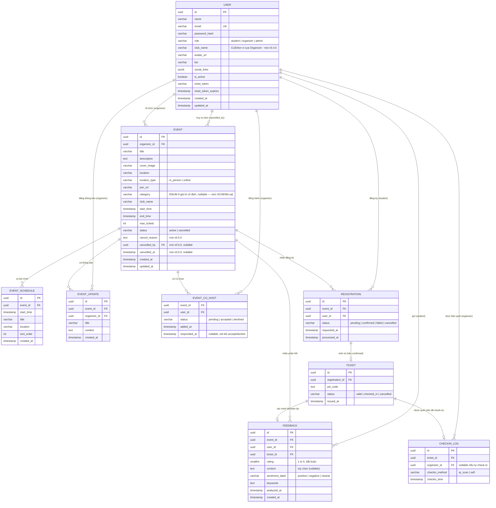
```mermaid
erDiagram
    USER {
        uuid id PK
        varchar name
        varchar email UK
        varchar password_hash
        varchar role "student | organizer | admin"
        varchar club_name "CLB/don vi cua Organizer - moi v0.4.0"
        varchar avatar_url
        varchar bio
        jsonb social_links
        boolean is_active
        varchar reset_token
        timestamp reset_token_expires
        timestamp created_at
        timestamp updated_at
    }

    EVENT {
        uuid id PK
        uuid organizer_id FK
        varchar title
        text description
        varchar cover_image
        varchar location
        varchar location_type "in_person | online"
        varchar join_url
        varchar category "ENUM 9 giá trị cố định, nullable — xem SCHEMA.sql"
        varchar club_name
        timestamp start_time
        timestamp end_time
        int max_tickets
        varchar status "active | cancelled"
        text cancel_reason "moi v0.5.0"
        uuid cancelled_by FK "moi v0.5.0, nullable"
        timestamp cancelled_at "moi v0.5.0, nullable"
        timestamp created_at
        timestamp updated_at
    }

    EVENT_SCHEDULE {
        uuid id PK
        uuid event_id FK
        timestamp start_time
        varchar title
        varchar location
        int sort_order
        timestamp created_at
    }

    EVENT_UPDATE {
        uuid id PK
        uuid event_id FK
        uuid organizer_id FK
        varchar title
        text content
        timestamp created_at
    }

    EVENT_CO_HOST {
        uuid event_id FK
        uuid user_id FK
        varchar status "pending | accepted | declined"
        timestamp added_at
        timestamp responded_at "nullable, set khi accept/decline"
    }

    REGISTRATION {
        uuid id PK
        uuid event_id FK
        uuid user_id FK
        varchar status "pending | confirmed | failed | cancelled"
        timestamp requested_at
        timestamp processed_at
    }

    TICKET {
        uuid id PK
        uuid registration_id FK
        text jwt_code
        varchar status "valid | checked_in | cancelled"
        timestamp issued_at
    }

    FEEDBACK {
        uuid id PK
        uuid event_id FK
        uuid user_id FK
        uuid ticket_id FK
        smallint rating "1 to 5, bắt buộc"
        text content "tuỳ chọn (nullable)"
        varchar sentiment_label "positive | negative | neutral"
        text keywords
        timestamp analyzed_at
        timestamp created_at
    }

    CHECKIN_LOG {
        uuid id PK
        uuid ticket_id FK
        uuid organizer_id FK "nullable nếu tự check-in"
        varchar checkin_method "qr_scan | self"
        timestamp checkin_time
    }

    USER ||--o{ EVENT           : "huy su kien (cancelled_by)"
    USER ||--o{ EVENT           : "tổ chức (organizer)"
    USER ||--o{ REGISTRATION    : "đăng ký (student)"
    USER ||--o{ FEEDBACK        : "gửi (student)"
    USER ||--o{ CHECKIN_LOG     : "thực hiện quét (organizer)"
    USER ||--o{ EVENT_UPDATE    : "đăng thông báo (organizer)"
    USER ||--o{ EVENT_CO_HOST   : "đồng hành (organizer)"
    EVENT ||--o{ REGISTRATION   : "nhận đăng ký"
    EVENT ||--o{ FEEDBACK       : "nhận phản hồi"
    EVENT ||--o{ EVENT_SCHEDULE : "có lịch trình"
    EVENT ||--o{ EVENT_UPDATE   : "có thông báo"
    EVENT ||--o{ EVENT_CO_HOST  : "có Co-host"
    REGISTRATION ||--o| TICKET      : "sinh vé (nếu confirmed)"
    TICKET       ||--o| CHECKIN_LOG : "được quét (nếu đã check-in)"
    TICKET       ||--o| FEEDBACK    : "xác minh đã tham dự"
```

_Hình 1: Sơ đồ quan hệ thực thể (ERD) hệ thống UniEvent Flow — phạm vi 42 FR. Lưu ý: mô hình dữ liệu (9 bảng) **không thay đổi cấu trúc** kể từ FR-38; các FR bổ sung về sau (FR-39 Tra cứu quản trị, FR-40 Tải ảnh — tái dùng cột `cover_image`/`avatar_url`, FR-41 Danh sách người đăng ký, FR-42 Xem phản hồi đã gửi) đều là endpoint đọc/nghiệp vụ trên schema sẵn có, không phát sinh bảng/cột mới (mã nguồn Mermaid ở trên, nhóm tự render bằng công cụ vẽ sơ đồ)_

## 2.2 Lược đồ quy trình nghiệp vụ (Workflow)

Mỗi module dưới đây gồm một đoạn tóm tắt luồng bằng văn bản và một sơ đồ hoạt động (activity diagram) viết bằng cú pháp **Mermaid**. mã nguồn Mermaid được đưa trực tiếp vào tài liệu thay cho ảnh, để nhóm tự render bằng công cụ vẽ sơ đồ và để mọi thay đổi về luồng đều truy vết được qua lịch sử phiên bản của chính tài liệu này. Quy ước đọc sơ đồ: hình thoi là điểm rẽ nhánh, khối chữ nhật là hành động của hệ thống, ghi chú trong ngoặc là mã BR chi phối bước đó.

### 2.2.1 Auth module overview

Đăng ký (chỉ tạo tài khoản role=student) → Đăng nhập (rate-limit qua Redis) → cấp JWT → các thao tác hồ sơ (xem/sửa/đổi mật khẩu) → Quên mật khẩu (2 giai đoạn qua reset_token). Song song: Quản trị viên tạo tài khoản Organizer (FR-38, Provisioning-based) → hệ thống sinh mật khẩu tạm, gửi email → Organizer đăng nhập bằng mật khẩu tạm, có thể tự đổi qua UC-04.

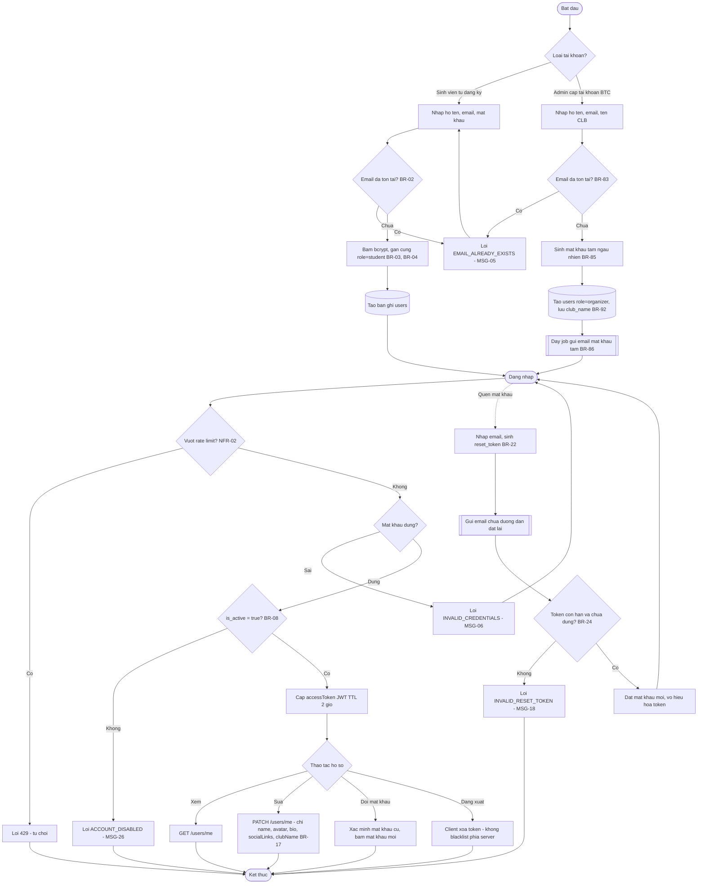
```mermaid
flowchart TD
    A([Bat dau]) --> B{Loai tai khoan?}

    B -->|Sinh vien tu dang ky| C[Nhap ho ten, email, mat khau]
    C --> D{Email da ton tai? BR-02}
    D -->|Co| E[Loi EMAIL_ALREADY_EXISTS - MSG-05]
    E --> C
    D -->|Chua| F[Bam bcrypt, gan cung role=student BR-03, BR-04]
    F --> G[(Tao ban ghi users)]

    B -->|Admin cap tai khoan BTC| H[Nhap ho ten, email, ten CLB]
    H --> I{Email da ton tai? BR-83}
    I -->|Co| E
    I -->|Chua| J[Sinh mat khau tam ngau nhien BR-85]
    J --> K[(Tao users role=organizer, luu club_name BR-92)]
    K --> L[[Day job gui email mat khau tam BR-86]]

    G --> M([Dang nhap])
    L --> M
    M --> N{Vuot rate limit? NFR-02}
    N -->|Co| O[Loi 429 - tu choi]
    N -->|Khong| P{Mat khau dung?}
    P -->|Sai| Q[Loi INVALID_CREDENTIALS - MSG-06]
    Q --> M
    P -->|Dung| R{is_active = true? BR-08}
    R -->|Khong| S[Loi ACCOUNT_DISABLED - MSG-26]
    R -->|Co| T[Cap accessToken JWT TTL 2 gio]

    T --> U{Thao tac ho so}
    U -->|Xem| V[GET /users/me]
    U -->|Sua| W[PATCH /users/me - chi name, avatar, bio, socialLinks, clubName BR-17]
    U -->|Doi mat khau| X[Xac minh mat khau cu, bam mat khau moi]
    U -->|Dang xuat| Y[Client xoa token - khong blacklist phia server]

    M -.->|Quen mat khau| Z1[Nhap email, sinh reset_token BR-22]
    Z1 --> Z2[[Gui email chua duong dan dat lai]]
    Z2 --> Z3{Token con han va chua dung? BR-24}
    Z3 -->|Khong| Z4[Loi INVALID_RESET_TOKEN - MSG-18]
    Z3 -->|Co| Z5[Dat mat khau moi, vo hieu hoa token]
    Z5 --> M

    V --> ZZ([Ket thuc])
    W --> ZZ
    X --> ZZ
    Y --> ZZ
    O --> ZZ
    S --> ZZ
    Z4 --> ZZ
```

_Hình 5: Activity Diagram — Module Quản lý tài khoản (Auth)_

### 2.2.2 Event management

Tạo sự kiện (chọn in_person/online) → khởi tạo bộ đếm Redis → Sửa/Huỷ (chỉ chủ sự kiện, guard max_tickets) → Đăng thông báo & quản lý lịch trình & check-in (chủ sự kiện HOẶC Co-host đã accepted) → gắn Co-host mới (status=pending) → người được mời accept/decline → nếu accepted, Co-host xuất hiện trong danh sách “Sự kiện của tôi” của người đó và có quyền thao tác.

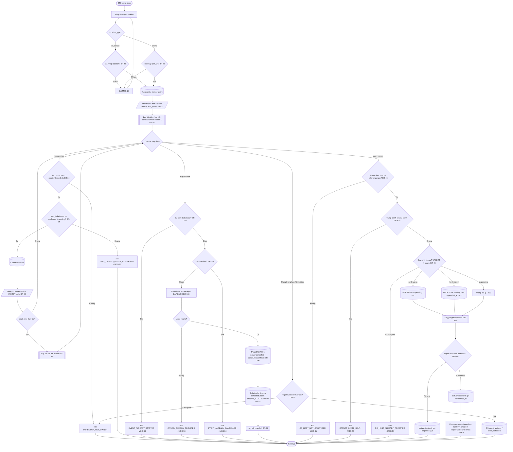
```mermaid
flowchart TD
    A([BTC dang nhap]) --> B[Nhap thong tin su kien]
    B --> C{location_type?}
    C -->|in_person| D{Da nhap location? BR-28}
    C -->|online| E{Da nhap join_url? BR-28}
    D -->|Chua| F[Loi MSG-21]
    E -->|Chua| F
    F --> B
    D -->|Roi| G[(Tao events, status=active)]
    E -->|Roi| G
    G --> H[/Khoi tao bo dem ve tren Redis = max_tickets BR-31/]
    H --> I[[Len lich job nhac lich reminder:eventId BR-57, BR-97]]

    I --> J{Thao tac tiep theo}

    J -->|Sua su kien| K{La chu su kien? requireOwnerOnly BR-34}
    K -->|Khong| L[403 FORBIDDEN_NOT_OWNER]
    K -->|Co| M{max_tickets moi >= confirmed + pending? BR-35}
    M -->|Khong| N[422 MAX_TICKETS_BELOW_CONFIRMED - MSG-22]
    M -->|Co| O[(Cap nhat events)]
    O --> P[/Dong bo bo dem Redis: INCRBY delta BR-90/]
    P --> Q{start_time thay doi?}
    Q -->|Co| R[[Huy job cu, len lich lai BR-97]]
    Q -->|Khong| J
    R --> J

    J -->|Huy su kien| S{Su kien da bat dau? BR-37b}
    S -->|Roi| T[422 EVENT_ALREADY_STARTED - MSG-33]
    S -->|Chua| U{Da cancelled? BR-37c}
    U -->|Roi| V[409 EVENT_ALREADY_CANCELLED - MSG-34]
    U -->|Chua| U1[Nhap ly do 10-500 ky tu BAT BUOC BR-106]
    U1 --> U2{Ly do hop le?}
    U2 -->|Khong| U3[422 CANCEL_REASON_REQUIRED - MSG-50]
    U2 -->|Co| W[(TRANSACTION: status=cancelled + cancel_reason/by/at BR-106)]
    W --> X[(Ticket valid chuyen cancelled; ticket checked_in GIU NGUYEN BR-37)]
    X --> Y[[Huy job nhac lich BR-97]]

    J -->|Moi Co-host| Z{Nguoi duoc moi co role=organizer? BR-45}
    Z -->|Khong| Z1[422 CO_HOST_NOT_ORGANIZER - MSG-31]
    Z -->|Co| ZA{Trung chinh chu su kien? BR-45b}
    ZA -->|Co| ZB[422 CANNOT_INVITE_SELF - MSG-40]
    ZA -->|Khong| ZC{Ban ghi hien co? UPSERT 4 nhanh BR-46}
    ZC -->|a. Chua co| Z2[(INSERT status=pending - 201)]
    ZC -->|b. declined| ZD[(UPDATE ve pending, xoa responded_at - 200)]
    ZC -->|c. pending| ZE[Khong doi gi - 200]
    ZC -->|d. accepted| ZF[409 CO_HOST_ALREADY_ACCEPTED - MSG-51]
    Z2 --> ZG[[Day job gui email moi BR-46b]]
    ZD --> ZG
    ZE --> ZG
    ZG --> Z3{Nguoi duoc moi phan hoi - BR-46d}
    Z3 -->|Chap nhan| Z4[(status=accepted, ghi responded_at)]
    Z3 -->|Tu choi| Z5[(status=declined, ghi responded_at)]
    Z4 --> Z6[Co quyen: dang thong bao, lich trinh, check-in requireOwnerOrCoHost CBR 6]

    J -->|Dang thong bao / Lich trinh| Z7{requireOwnerOrCoHost? CBR 6}
    Z7 -->|Khong dat| L
    Z7 -->|Dat| Z8[(Ghi event_updates / event_schedule)]

    L --> ZZ([Ket thuc])
    N --> ZZ
    T --> ZZ
    U3 --> ZZ
    V --> ZZ
    Y --> ZZ
    Z1 --> ZZ
    ZB --> ZZ
    ZF --> ZZ
    Z5 --> ZZ
    Z6 --> ZZ
    Z8 --> ZZ
```

_Hình 6: Activity Diagram — Module Quản lý sự kiện_

### 2.2.3 Đăng ký & Vé điện tử (Registration & Ticket)

Kiểm tra điều kiện tiên quyết (BR-87: đúng vai trò Sinh viên, sự kiện đang active, chưa tới giờ bắt đầu) → kiểm tra trùng đăng ký (BR-49) → Redis atomic decrement (còn vé/hết vé) → đặt khoá giữ chỗ **và** hẹn giờ job bù trừ, cùng thời hạn `REGISTRATION_HOLD_TTL_SECONDS` (BR-88) → BullMQ sinh vé + gửi email xác nhận kèm mã QR → nếu worker thất bại (hết retry) hoặc job hẹn giờ tới hạn khi vẫn còn `pending`: hoàn 1 vé về Redis, Registration chuyển `failed` (BR-89, idempotent theo BR-93) → Sinh viên xem vé → có thể tự huỷ (Registration **và** Ticket cùng chuyển `cancelled`, hoàn vé về Redis — BR-55/56) → hệ thống tự gửi email nhắc lịch trước giờ diễn ra cho các đăng ký còn hiệu lực tại thời điểm gửi (BR-58).

luồng này là một giao dịch hai pha có chủ đích — Redis giữ vai trò tồn kho tốc độ cao (pha 1, nguyên tử, chống oversell) và PostgreSQL giữ vai trò sổ cái bền vững (pha 2). Mọi nhánh thoát khỏi pha 2 (worker lỗi, hết TTL, người dùng tự huỷ) đều **bắt buộc** có thao tác bù trừ ngược lại lên bộ đếm Redis, nếu không tồn kho hai bên sẽ trôi dần khỏi nhau. View `v_event_registration_stats` trong SCHEMA.sql dùng để đối soát định kỳ giữa hai nguồn.

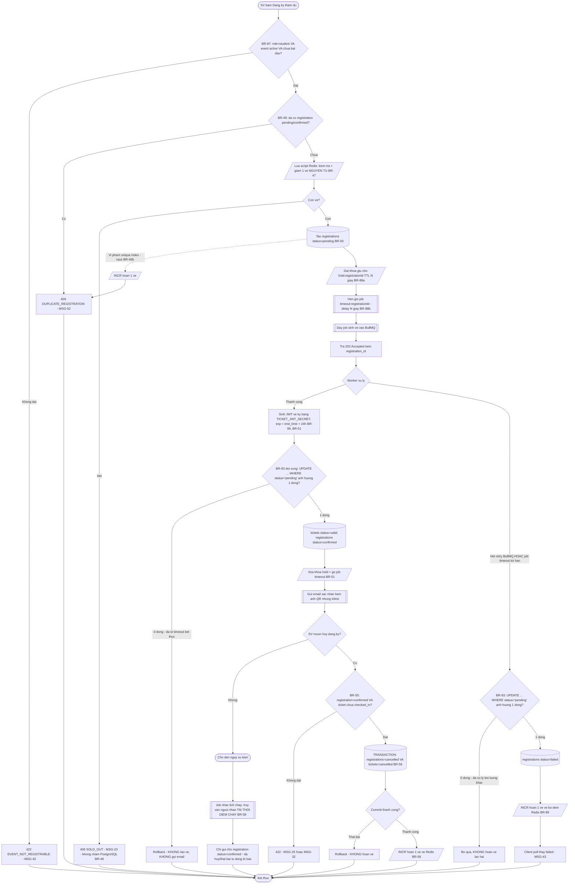
```mermaid
flowchart TD
    A([SV bam Dang ky tham du]) --> B{BR-87: role=student VA event active VA chua bat dau?}
    B -->|Khong dat| C[422 EVENT_NOT_REGISTRABLE - MSG-42]
    B -->|Dat| D{BR-49: da co registration pending/confirmed?}
    D -->|Co| E[409 DUPLICATE_REGISTRATION - MSG-52]
    D -->|Chua| F[/Lua script Redis: kiem tra + giam 1 ve NGUYEN TU BR-47/]

    F --> G{Con ve?}
    G -->|Het| H[409 SOLD_OUT - MSG-23 - khong cham PostgreSQL BR-48]
    G -->|Con| I[(Tao registrations status=pending BR-50)]
    I -.->|Vi pham unique index - race BR-49b| I2[/INCR hoan 1 ve/] --> E
    I --> J[/Dat khoa giu cho hold:registrationId TTL N giay BR-88a/]
    J --> J2[[Hen gio job timeout:registrationId - delay N giay BR-88b]]
    J2 --> K[[Day job sinh ve vao BullMQ]]
    K --> L[Tra 202 Accepted kem registration_id]

    L --> M{Worker xu ly}
    M -->|Thanh cong| N[Sinh JWT ve ky bang TICKET_JWT_SECRET, exp = end_time + 24h BR-99, BR-51]
    N --> N2{BR-93 doi xung: UPDATE ... WHERE status='pending' anh huong 1 dong?}
    N2 -->|0 dong - da bi timeout ket thuc| N3[Rollback - KHONG tao ve, KHONG gui email]
    N2 -->|1 dong| O[(tickets status=valid; registrations status=confirmed)]
    O --> P[/Xoa khoa hold + go job timeout BR-51/]
    P --> Q[[Gui email xac nhan kem anh QR nhung inline]]

    M -->|Het retry BullMQ HOAC job timeout toi han| R{BR-93: UPDATE ... WHERE status='pending' anh huong 1 dong?}
    R -->|0 dong - da xu ly boi luong khac| S[Bo qua, KHONG hoan ve lan hai]
    R -->|1 dong| T[(registrations status=failed)]
    T --> U[/INCR hoan 1 ve ve bo dem Redis BR-89/]
    U --> V[Client poll thay failed - MSG-43]

    Q --> W{SV muon huy dang ky?}
    W -->|Khong| X([Cho den ngay su kien])
    W -->|Co| Y{BR-55: registration=confirmed VA ticket chua checked_in?}
    Y -->|Khong dat| Z[422 - MSG-25 hoac MSG-32]
    Y -->|Dat| AA[(TRANSACTION: registrations=cancelled VA tickets=cancelled BR-56)]
    AA --> AB{Commit thanh cong?}
    AB -->|That bai| AC[Rollback - KHONG hoan ve]
    AB -->|Thanh cong| AD[/INCR hoan 1 ve ve Redis BR-56/]

    X --> AE[[Job nhac lich chay: truy van nguoi nhan TAI THOI DIEM CHAY BR-58]]
    AE --> AF[Chi gui cho registration status=confirmed - da huy/that bai tu dong bi loai]

    C --> ZZ([Ket thuc])
    E --> ZZ
    H --> ZZ
    N3 --> ZZ
    S --> ZZ
    V --> ZZ
    Z --> ZZ
    AC --> ZZ
    AD --> ZZ
    AF --> ZZ
```

_Hình 7: Activity Diagram — Module Đăng ký & Vé điện tử (thể hiện đầy đủ các nhánh bù trừ tồn kho vé)_

### 2.2.4 Check-in tại cổng sự kiện (Gate Check-in)

Sự kiện in_person: quét QR → xác thực chữ ký JWT → **đặt khoá check-in nguyên tử trên Redis (BR-91)** để chốt kết quả hợp lệ/đã dùng ngay trong luồng đồng bộ (<1s) → ghi checkin_logs và cập nhật ticket.status bất đồng bộ. Sự kiện online: sinh viên bấm “Vào phòng họp” — thao tác này VỪA mở join_url VỪA gọi endpoint tự check-in (BR-107), không còn bước xác nhận riêng → ghi log với checkin_method=self, organizer_id=NULL.

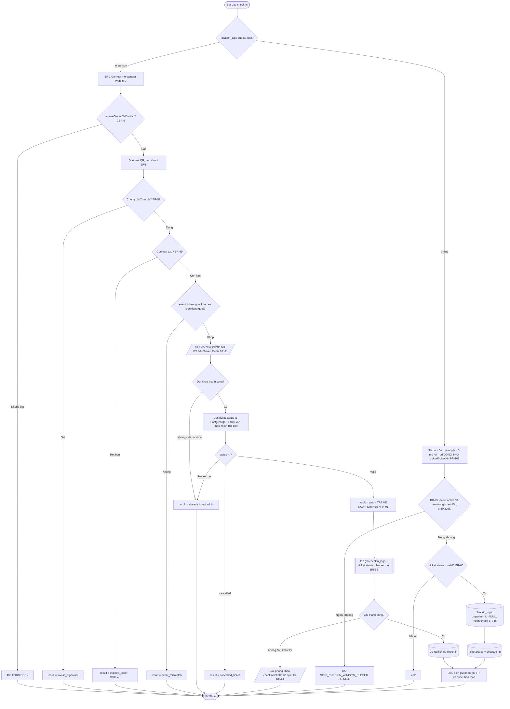
```mermaid
flowchart TD
    A([Bat dau check-in]) --> B{location_type cua su kien?}

    B -->|in_person| C[BTC/Co-host mo camera WebRTC]
    C --> D{requireOwnerOrCoHost? CBR 6}
    D -->|Khong dat| E[403 FORBIDDEN]
    D -->|Dat| F[Quet ma QR, doc chuoi JWT]
    F --> G{Chu ky JWT hop le? BR-59}
    G -->|Sai| H[result = invalid_signature]
    G -->|Dung| I{Con han exp? BR-99}
    I -->|Het han| J[result = expired_ticket - MSG-45]
    I -->|Con han| K{event_id trong ve khop su kien dang quet?}
    K -->|Khong| L[result = event_mismatch]
    K -->|Khop| M[/SET checkin:ticketId NX EX 86400 tren Redis BR-91/]
    M --> N{Dat khoa thanh cong?}
    N -->|Khong - da co khoa| O[result = already_checked_in]
    N -->|Co| P[Doc ticket.status tu PostgreSQL - 1 truy van khoa chinh BR-109]
    P --> Q{status = ?}
    Q -->|cancelled| R[result = cancelled_ticket]
    Q -->|checked_in| O
    Q -->|valid| S[result = valid - TRA VE NGAY, tong <1s NFR-01]
    S --> T[[Job ghi checkin_logs + ticket.status=checked_in BR-62]]
    T --> U{Ghi thanh cong?}
    U -->|Khong sau khi retry| V[/Giai phong khoa checkin:ticketId de quet lai BR-94/]
    U -->|Co| W[(Da luu lich su check-in)]

    B -->|online| X[SV bam 'Vao phong hop' - mo join_url DONG THOI goi self-checkin BR-107]
    X --> Y{"BR-95: event active VA now trong [start-15p, end+30p]?"}
    Y -->|Ngoai khoang| Z[422 SELF_CHECKIN_WINDOW_CLOSED - MSG-44]
    Y -->|Trong khoang| AA{ticket.status = valid? BR-66}
    AA -->|Khong| AB[422]
    AA -->|Co| AC[(checkin_logs: organizer_id=NULL, method=self BR-66)]
    AC --> AD[(ticket.status = checked_in)]

    W --> AE[Dieu kien gui phan hoi FR-23 duoc thoa man]
    AD --> AE

    E --> ZZ([Ket thuc])
    H --> ZZ
    J --> ZZ
    L --> ZZ
    O --> ZZ
    R --> ZZ
    V --> ZZ
    Z --> ZZ
    AB --> ZZ
    AE --> ZZ
```

_Hình 8: Activity Diagram — Module Check-in (hai nhánh: quét QR tại cổng và tự check-in trực tuyến)_

### 2.2.5 Phản hồi & Phân tích cảm xúc bằng AI (Feedback & AI Sentiment)

Điều kiện: ticket.status=checked_in (đạt được từ cả 2 luồng check-in ở 2.2.4) → gửi phản hồi (rating bắt buộc + content tuỳ chọn) → gộp batch → gọi LLM → lưu sentiment_label/keywords.

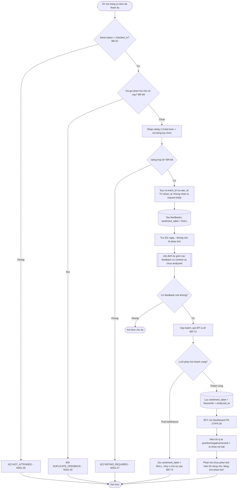
```mermaid
flowchart TD
    A([SV mo trang su kien da tham du]) --> B{ticket.status = checked_in? BR-67}
    B -->|Khong| C[422 NOT_ATTENDED - MSG-28]
    B -->|Co| D{Da gui phan hoi cho ve nay? BR-69}
    D -->|Roi| E[409 DUPLICATE_FEEDBACK - MSG-29]
    D -->|Chua| F[Nhap rating 1-5 bat buoc + noi dung tuy chon]
    F --> G{rating hop le? BR-68}
    G -->|Khong| H[422 RATING_REQUIRED - MSG-27]
    G -->|Co| I[Suy ra event_id va user_id TU ticket_id, khong nhan tu request body]
    I --> J[(Tao feedbacks, sentiment_label = NULL)]
    J --> K[Tra 201 ngay - khong cho AI phan tich]

    K --> L[[Job dinh ky gom cac feedback co content va chua analyzed]]
    L --> M{Co feedback moi khong?}
    M -->|Khong| N([Ket thuc chu ky])
    M -->|Co| O[Gop batch, goi API LLM BR-72]
    O --> P{LLM phan hoi thanh cong?}
    P -->|That bai/timeout| Q[Giu sentiment_label = NULL, retry o chu ky sau BR-73]
    P -->|Thanh cong| R[(Luu sentiment_label + keywords + analyzed_at)]

    R --> S[BTC mo Dashboard FR-27/FR-28]
    S --> T[Hien thi ty le positive/negative/neutral + tu khoa noi bat]
    T --> U[Phan hoi chua phan tich hien thi rieng nhu 'dang cho phan tich']

    C --> ZZ([Ket thuc])
    E --> ZZ
    H --> ZZ
    Q --> ZZ
    U --> ZZ
```

_Hình 9: Activity Diagram — Module Phản hồi & Phân tích cảm xúc bằng AI_

### 2.2.6 Quản trị hệ thống (System Administration)

Quản trị viên đăng nhập (role=admin) → tra cứu người dùng/sự kiện → vô hiệu hoá tài khoản hoặc buộc huỷ sự kiện (bỏ qua ownership) → hành động được ghi nhận. Song song: Quản trị viên tạo tài khoản Organizer mới (FR-38) — nhập tên, email (bất kỳ, không cần do trường cấp phát, chỉ cần chưa tồn tại trong hệ thống), tên CLB → hệ thống sinh mật khẩu tạm, tạo user role=organizer, gửi email thông tin đăng nhập.

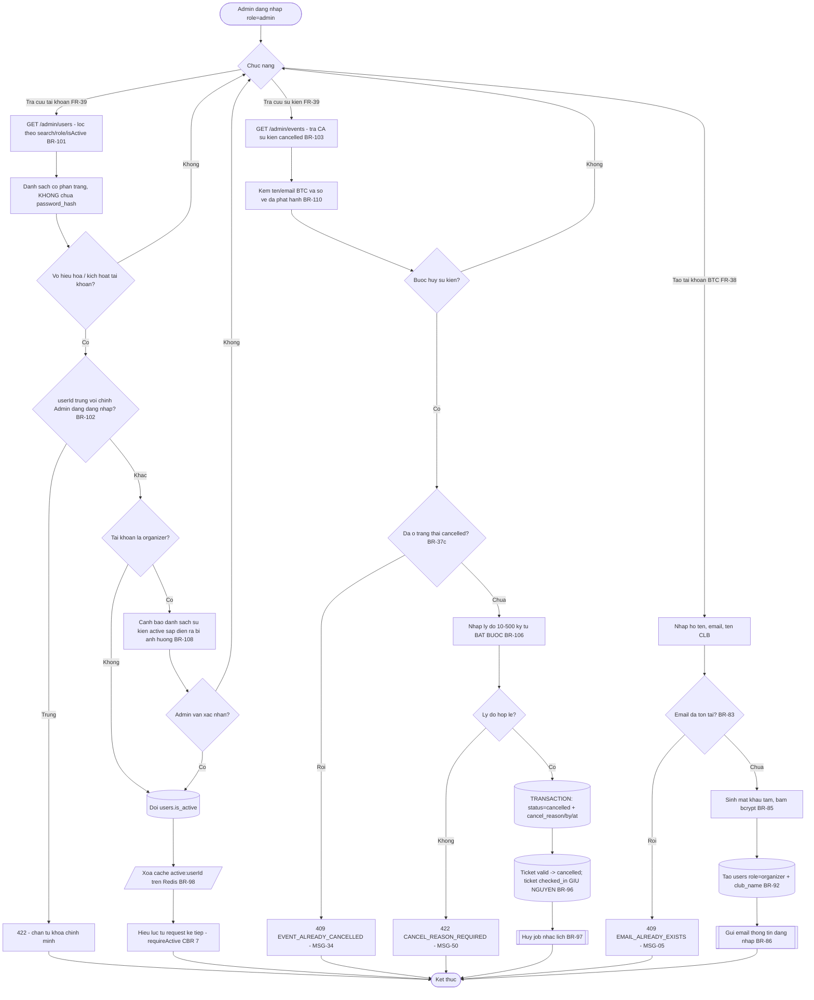
```mermaid
flowchart TD
    A([Admin dang nhap role=admin]) --> B{Chuc nang}

    B -->|Tra cuu tai khoan FR-39| C[GET /admin/users - loc theo search/role/isActive BR-101]
    C --> D[Danh sach co phan trang, KHONG chua password_hash]
    D --> E{Vo hieu hoa / kich hoat tai khoan?}
    E -->|Khong| B
    E -->|Co| F{userId trung voi chinh Admin dang dang nhap? BR-102}
    F -->|Trung| G[422 - chan tu khoa chinh minh]
    F -->|Khac| H{Tai khoan la organizer?}
    H -->|Co| I[Canh bao danh sach su kien active sap dien ra bi anh huong BR-108]
    H -->|Khong| J[(Doi users.is_active)]
    I --> K{Admin van xac nhan?}
    K -->|Khong| B
    K -->|Co| J
    J --> L[/Xoa cache active:userId tren Redis BR-98/]
    L --> M[Hieu luc tu request ke tiep - requireActive CBR 7]

    B -->|Tra cuu su kien FR-39| N[GET /admin/events - tra CA su kien cancelled BR-103]
    N --> O[Kem ten/email BTC va so ve da phat hanh BR-110]
    O --> P{Buoc huy su kien?}
    P -->|Khong| B
    P -->|Co| Q{Da o trang thai cancelled? BR-37c}
    Q -->|Roi| R[409 EVENT_ALREADY_CANCELLED - MSG-34]
    Q -->|Chua| S[Nhap ly do 10-500 ky tu BAT BUOC BR-106]
    S --> T{Ly do hop le?}
    T -->|Khong| U[422 CANCEL_REASON_REQUIRED - MSG-50]
    T -->|Co| V[(TRANSACTION: status=cancelled + cancel_reason/by/at)]
    V --> W[(Ticket valid -> cancelled; ticket checked_in GIU NGUYEN BR-96)]
    W --> X[[Huy job nhac lich BR-97]]

    B -->|Tao tai khoan BTC FR-38| Y[Nhap ho ten, email, ten CLB]
    Y --> Z{Email da ton tai? BR-83}
    Z -->|Roi| AA[409 EMAIL_ALREADY_EXISTS - MSG-05]
    Z -->|Chua| AB[Sinh mat khau tam, bam bcrypt BR-85]
    AB --> AC[(Tao users role=organizer + club_name BR-92)]
    AC --> AD[[Gui email thong tin dang nhap BR-86]]

    G --> ZZ([Ket thuc])
    M --> ZZ
    R --> ZZ
    U --> ZZ
    X --> ZZ
    AA --> ZZ
    AD --> ZZ
```

_Hình 10: Activity Diagram — Module Quản trị hệ thống_

## 2.3 Sơ đồ chuyển trạng thái (State Transition Diagram)

Ba thực thể có vòng đời trạng thái rõ ràng là Event, Registration và Ticket.

bản trước khẳng định việc mở rộng phạm vi “không phát sinh trạng thái mới nào”. Điều này **không còn đúng**: rà soát Đợt 1 cho thấy FR-34 (tự huỷ đăng ký) bắt buộc phải đưa Registration về một trạng thái kết thúc riêng, nếu không bản ghi đã huỷ vẫn bị hệ thống coi là `confirmed` (chi tiết hệ quả tại BR-56). Vì vậy tập trạng thái Registration được bổ sung giá trị **`cancelled`**. Ticket và Event giữ nguyên tập trạng thái cũ.

### 2.3.1 Event

`active → cancelled` — một chiều, soft-cancel qua UC-12 (chủ sự kiện) hoặc UC-37 (Admin buộc huỷ), cùng đích trạng thái. Không có đường quay lại `active`: khôi phục một sự kiện đã huỷ nằm ngoài phạm vi đồ án (vé đã bị huỷ theo, việc khôi phục sẽ kéo theo bài toán phát hành lại vé không đáng đánh đổi trong 7 tuần).

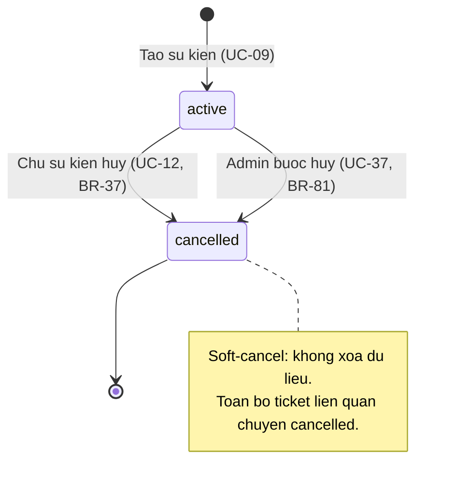
```mermaid
stateDiagram-v2
    [*] --> active : Tao su kien (UC-09)
    active --> cancelled : Chu su kien huy (UC-12, BR-37)
    active --> cancelled : Admin buoc huy (UC-37, BR-81)
    cancelled --> [*]
    note right of cancelled
        Soft-cancel: khong xoa du lieu.
        Toan bo ticket lien quan chuyen cancelled.
    end note
```

_Hình 2: Sơ đồ chuyển trạng thái thực thể Event_

### 2.3.2 Registration

Tập trạng thái: `pending | confirmed | failed | cancelled` (bổ sung `cancelled`).

- `pending → confirmed`: worker BullMQ xử lý thành công, Ticket được sinh (BR-51).
- `pending → failed`: worker xử lý thất bại sau khi hết retry **hoặc** job hẹn giờ giữ chỗ tới hạn khi bản ghi vẫn `pending` (BR-88, BR-89). Cả hai nhánh đi qua **cùng một thủ tục bù trừ** và đều **hoàn 1 vé về bộ đếm Redis**, đúng một lần (BR-93).
- `confirmed → cancelled`: sinh viên tự huỷ đăng ký (UC-23, BR-55/56), kèm hoàn vé về Redis và chuyển Ticket sang `cancelled`.
- Không có đường quay lại `pending`. `failed` và `cancelled` đều là trạng thái kết thúc; sinh viên muốn tham dự lại phải tạo một Registration mới (được phép, vì unique index chỉ chặn các bản ghi `pending`/`confirmed` — xem BR-49).

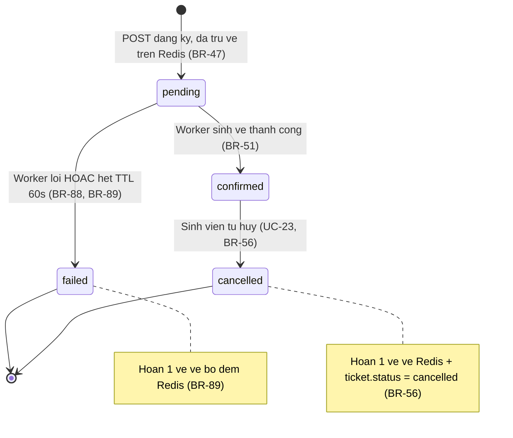
```mermaid
stateDiagram-v2
    [*] --> pending : POST dang ky, da tru ve tren Redis (BR-47)
    pending --> confirmed : Worker sinh ve thanh cong (BR-51)
    pending --> failed : Worker loi HOAC het TTL 60s (BR-88, BR-89)
    confirmed --> cancelled : Sinh vien tu huy (UC-23, BR-56)
    failed --> [*]
    cancelled --> [*]
    note right of failed
        Hoan 1 ve ve bo dem Redis (BR-89)
    end note
    note right of cancelled
        Hoan 1 ve ve Redis + ticket.status = cancelled (BR-56)
    end note
```

_Hình 3: Sơ đồ chuyển trạng thái thực thể Registration_

### 2.3.3 Ticket

`valid → checked_in` (quét QR tại cổng — UC-25/26, hoặc tự check-in sự kiện online — UC-29); `valid → cancelled` (sinh viên tự huỷ đăng ký — UC-23, hoặc sự kiện bị huỷ — UC-12/UC-37). `checked_in` là trạng thái cuối: vé đã dùng thì không huỷ được nữa (BR-55, lỗi CANNOT_CANCEL_CHECKED_IN_TICKET).

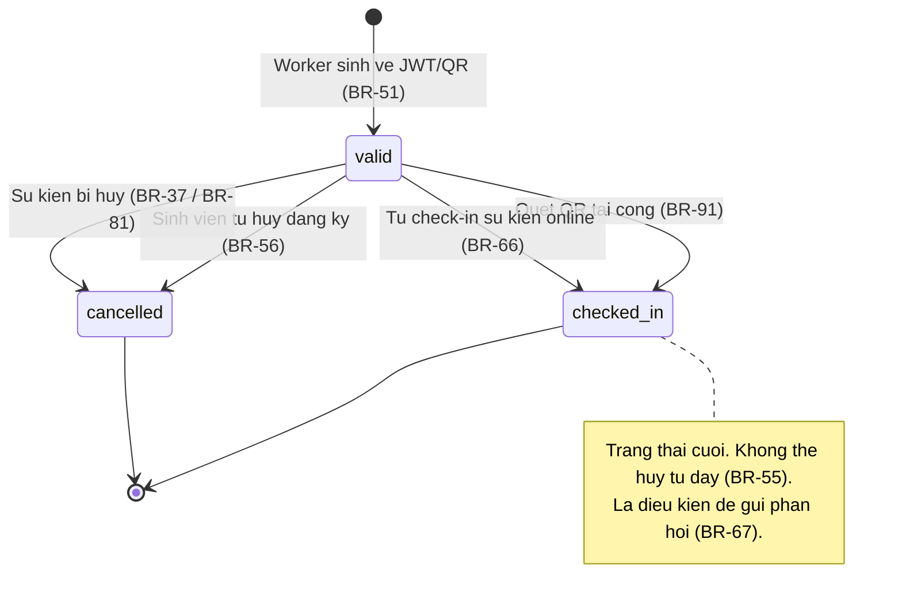
```mermaid
stateDiagram-v2
    [*] --> valid : Worker sinh ve JWT/QR (BR-51)
    valid --> checked_in : Quet QR tai cong (BR-91)
    valid --> checked_in : Tu check-in su kien online (BR-66)
    valid --> cancelled : Sinh vien tu huy dang ky (BR-56)
    valid --> cancelled : Su kien bi huy (BR-37 / BR-81)
    checked_in --> [*]
    cancelled --> [*]
    note right of checked_in
        Trang thai cuoi. Khong the huy tu day (BR-55).
        La dieu kien de gui phan hoi (BR-67).
    end note
```

_Hình 4: Sơ đồ chuyển trạng thái thực thể Ticket_

## 2.4 Sơ đồ Use Case (Use Case Diagram)

Sơ đồ trường hợp sử dụng ở đây thể hiện mục tiêu cụ thể hoặc cách người dùng tương tác với hệ thống. Hình elip ở ranh giới hệ thống đại diện cho trường hợp sử dụng/chức năng của hệ thống, trong khi hình người que đại diện cho tác nhân/người dùng của hệ thống. Đường thẳng nối tác nhân và trường hợp sử dụng cho thấy tác nhân có thể thực hiện chức năng đó trong hệ thống để đạt được mục tiêu.

Mermaid không có kiểu sơ đồ use case chuẩn UML, nên các sơ đồ dưới đây dùng `flowchart LR` để mô phỏng: tác nhân biểu diễn bằng khối bo tròn `([Tác nhân])`, use case biểu diễn bằng hình elip `((Use Case))`, ranh giới hệ thống biểu diễn bằng `subgraph`. Quan hệ `<<include>>` và `<<extend>>` biểu diễn bằng mũi tên nét đứt có nhãn. Khi nhóm vẽ lại bằng công cụ UML chuyên dụng (draw.io, StarUML), hãy chuyển về ký pháp UML chuẩn — mã Mermaid ở đây đóng vai trò **đặc tả nội dung** (ai làm được gì, quan hệ ra sao), không phải bản vẽ cuối cùng.

### 2.4.1 Quản lý tài khoản

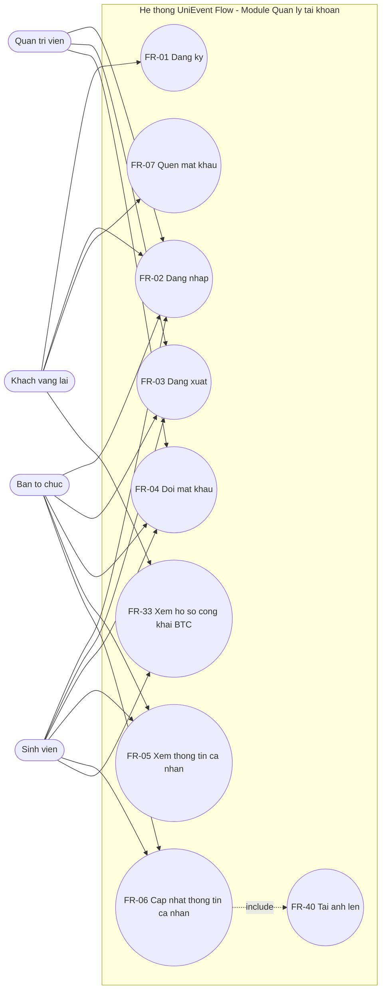
```mermaid
flowchart LR
    SV([Sinh vien])
    BTC([Ban to chuc])
    AD([Quan tri vien])
    GUEST([Khach vang lai])

    subgraph SYS[He thong UniEvent Flow - Module Quan ly tai khoan]
        UC01((FR-01 Dang ky))
        UC02((FR-02 Dang nhap))
        UC03((FR-03 Dang xuat))
        UC04((FR-04 Doi mat khau))
        UC05((FR-05 Xem thong tin ca nhan))
        UC06((FR-06 Cap nhat thong tin ca nhan))
        UC07((FR-07 Quen mat khau))
        UC33((FR-33 Xem ho so cong khai BTC))
        UC40((FR-40 Tai anh len))
    end

    GUEST --> UC01
    GUEST --> UC02
    GUEST --> UC07
    GUEST --> UC33

    SV --> UC02
    SV --> UC03
    SV --> UC04
    SV --> UC05
    SV --> UC06
    SV --> UC33

    BTC --> UC02
    BTC --> UC03
    BTC --> UC04
    BTC --> UC05
    BTC --> UC06

    AD --> UC02
    AD --> UC03
    AD --> UC04

    UC06 -.->|include| UC40
```

_Hình 11: Use Case Diagram — Module Quản lý tài khoản_

**Ghi chú đọc sơ đồ:** FR-01 chỉ tạo được tài khoản vai trò Sinh viên (BR-03); tài khoản Ban tổ chức đến từ FR-38 nên không có mũi tên nào từ tác nhân Ban tổ chức tới FR-01. FR-33 là use case duy nhất trong module này không yêu cầu đăng nhập.

_Figure 11: Use Case Diagram for Account Management Module_

| **#** | **UC Name**                                                     | **Description**                                                                                                                                                                                             |
| ----- | --------------------------------------------------------------- | ----------------------------------------------------------------------------------------------------------------------------------------------------------------------------------------------------------- |
| 1     | Đăng ký (Register)                                              | Cho phép người dùng tạo định danh mới trên hệ thống với vai trò Sinh viên. Đây là hình thức duy nhất để có tài khoản Sinh viên; tài khoản Ban tổ chức **không** được tạo qua luồng này (xem FR-38) (FR-01). |
| 2     | Đăng nhập (Log in)                                              | Xác thực danh tính người dùng, cấp phát JWT Access Token (FR-02).                                                                                                                                           |
| 3     | Đăng xuất (Log out)                                             | Kết thúc phiên làm việc hiện tại của người dùng (FR-03).                                                                                                                                                    |
| 4     | Đổi mật khẩu (Change Password)                                  | Cho phép người dùng đã đăng nhập tự đổi mật khẩu tài khoản của mình (FR-04).                                                                                                                                |
| 5     | Xem thông tin cá nhân (View Profile)                            | Truy xuất hồ sơ cá nhân của người dùng hiện tại (FR-05).                                                                                                                                                    |
| 6     | Cập nhật thông tin cá nhân (Update Profile)                     | Chỉnh sửa họ tên, ảnh đại diện, tiểu sử và liên kết mạng xã hội (FR-06).                                                                                                                                    |
| 7     | Quên mật khẩu (Forgot Password)                                 | Khôi phục quyền truy cập tài khoản qua email đã đăng ký (FR-07).                                                                                                                                            |
| 8     | Xem hồ sơ công khai Ban tổ chức (View Organizer Public Profile) | Cho phép mọi người xem trang hồ sơ công khai của một Ban tổ chức, gồm thông tin cơ bản và danh sách sự kiện đang tổ chức (FR-33).                                                                           |

### 2.4.2 Quản lý sự kiện

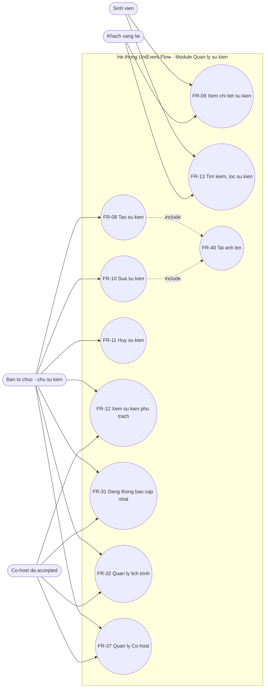
```mermaid
flowchart LR
    BTC([Ban to chuc - chu su kien])
    CH([Co-host da accepted])
    SV([Sinh vien])
    GUEST([Khach vang lai])

    subgraph SYS[He thong UniEvent Flow - Module Quan ly su kien]
        UC08((FR-08 Tao su kien))
        UC09((FR-09 Xem chi tiet su kien))
        UC10((FR-10 Sua su kien))
        UC11((FR-11 Huy su kien))
        UC12((FR-12 Xem su kien phu trach))
        UC13((FR-13 Tim kiem, loc su kien))
        UC31((FR-31 Dang thong bao cap nhat))
        UC32((FR-32 Quan ly lich trinh))
        UC37((FR-37 Quan ly Co-host))
        UC40((FR-40 Tai anh len))
    end

    BTC --> UC08
    BTC --> UC10
    BTC --> UC11
    BTC --> UC12
    BTC --> UC31
    BTC --> UC32
    BTC --> UC37

    CH --> UC12
    CH --> UC31
    CH --> UC32
    CH --> UC37

    SV --> UC09
    SV --> UC13
    GUEST --> UC09
    GUEST --> UC13

    UC08 -.->|include| UC40
    UC10 -.->|include| UC40
```

_Hình 12: Use Case Diagram — Module Quản lý sự kiện_

**Ghi chú đọc sơ đồ — ranh giới quyền của Co-host (CBR 6):** Co-host đã `accepted` **không** nối tới FR-10 (sửa) và FR-11 (huỷ) vì hai chức năng này dùng `requireOwnerOnly`. Với FR-37, Co-host chỉ tham gia ở phần chấp nhận/từ chối lời mời của chính mình (UC-17b), **không** được mời hay gỡ Co-host khác.

_Figure 12: Use Case Diagram for Event Management Module_

| **#** | **UC Name**                                                                             | **Description**                                                                                                                                                                                                                                                                   |
| ----- | --------------------------------------------------------------------------------------- | --------------------------------------------------------------------------------------------------------------------------------------------------------------------------------------------------------------------------------------------------------------------------------- |
| 1     | Tạo sự kiện (Create Event)                                                              | Cho phép Ban tổ chức tạo sự kiện mới, chọn hình thức Trực tiếp (In Person) hoặc Trực tuyến (Online) (FR-08).                                                                                                                                                                      |
| 2     | Xem chi tiết sự kiện (View Event Detail)                                                | Hiển thị thông tin chi tiết của một sự kiện kèm số vé còn lại theo thời gian thực (FR-09).                                                                                                                                                                                        |
| 3     | Sửa sự kiện (Update Event)                                                              | Cho phép Ban tổ chức chỉnh sửa thông tin sự kiện do mình phụ trách (FR-10).                                                                                                                                                                                                       |
| 4     | Huỷ sự kiện (Cancel Event)                                                              | Cho phép Ban tổ chức huỷ (soft-cancel) sự kiện do mình phụ trách (FR-11).                                                                                                                                                                                                         |
| 5     | Xem danh sách sự kiện phụ trách (View My Events)                                        | Hiển thị danh sách sự kiện mà Ban tổ chức đang đăng nhập phụ trách (FR-12).                                                                                                                                                                                                       |
| 6     | Tìm kiếm, lọc sự kiện (Search & Filter Events)                                          | Cho phép tìm kiếm và lọc sự kiện công khai theo từ khoá, danh mục, CLB, khoảng thời gian (FR-13).                                                                                                                                                                                 |
| 7     | Đăng thông báo sự kiện (Post Event Update)                                              | Cho phép Ban tổ chức đăng thông báo mới lên trang sự kiện để thông tin đến người đã đăng ký (FR-31).                                                                                                                                                                              |
| 8     | Quản lý lịch trình sự kiện (Manage Event Schedule)                                      | Cho phép Ban tổ chức thêm, sửa, xoá các mốc thời gian trong lịch trình chi tiết của sự kiện (FR-32).                                                                                                                                                                              |
| 9     | Gắn Co-host / Chấp nhận-Từ chối lời mời (Add Event Co-host / Accept-Decline Invitation) | Cho phép chủ sự kiện mời một tài khoản Organizer khác làm Co-host; người được mời phải tự chấp nhận lời mời (status pending → accepted) mới có quyền đăng thông báo, quản lý lịch trình và check-in cho sự kiện đó — không được sửa/huỷ sự kiện hay quản lý Co-host khác (FR-37). |

### 2.4.3 Đăng ký & Vé điện tử

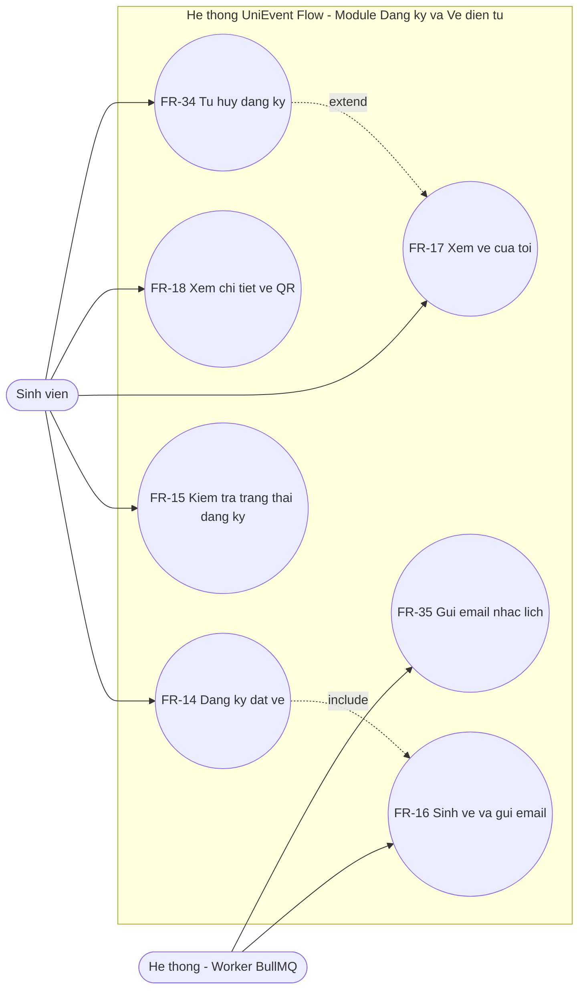
```mermaid
flowchart LR
    SV([Sinh vien])
    SYSACT([He thong - Worker BullMQ])

    subgraph SYS[He thong UniEvent Flow - Module Dang ky va Ve dien tu]
        UC14((FR-14 Dang ky dat ve))
        UC15((FR-15 Kiem tra trang thai dang ky))
        UC16((FR-16 Sinh ve va gui email))
        UC17((FR-17 Xem ve cua toi))
        UC18((FR-18 Xem chi tiet ve QR))
        UC34((FR-34 Tu huy dang ky))
        UC35((FR-35 Gui email nhac lich))
    end

    SV --> UC14
    SV --> UC15
    SV --> UC17
    SV --> UC18
    SV --> UC34

    SYSACT --> UC16
    SYSACT --> UC35

    UC14 -.->|include| UC16
    UC34 -.->|extend| UC17
```

_Hình 13: Use Case Diagram — Module Đăng ký & Vé điện tử_

**Ghi chú đọc sơ đồ:** FR-16 và FR-35 có tác nhân là **Hệ thống** (worker nền), không phải người dùng — đây là hai use case duy nhất trong module không được kích hoạt trực tiếp bởi thao tác người dùng. Quan hệ `include` giữa FR-14 và FR-16 là **bất đồng bộ**: FR-14 trả về 202 ngay và FR-16 chạy sau (BR-50).

_Figure 13: Use Case Diagram for Registration** \*\***&\***\* **Ticket Module_

| **#** | **UC Name**                                             | **Description**                                                                                                |
| ----- | ------------------------------------------------------- | -------------------------------------------------------------------------------------------------------------- |
| 1     | Đăng ký / đặt vé (Register for Event)                   | Cho phép Sinh viên đăng ký tham dự một sự kiện, hệ thống chống bán vượt vé qua Redis atomic decrement (FR-14). |
| 2     | Sinh mã vé QR/JWT (Generate Ticket)                     | Hệ thống sinh vé điện tử (JWT/QR) sau khi Registration được xử lý thành công (FR-15).                          |
| 3     | Gửi vé qua email bất đồng bộ (Send Ticket Email)        | Hệ thống gửi email chứa vé điện tử cho sinh viên qua hàng đợi bất đồng bộ (FR-16).                             |
| 4     | Xem danh sách vé cá nhân (View My Tickets)              | Cho phép Sinh viên xem danh sách toàn bộ vé đã đăng ký (FR-17).                                                |
| 5     | Xem chi tiết một vé (View Ticket Detail)                | Cho phép Sinh viên xem chi tiết một vé kèm mã QR (FR-18).                                                      |
| 6     | Tự huỷ đăng ký (Cancel My Registration)                 | Cho phép Sinh viên tự huỷ một đăng ký đã xác nhận, hệ thống hoàn lại vé vào bộ đếm Redis (FR-34).              |
| 7     | Gửi email nhắc lịch trước sự kiện (Send Event Reminder) | Hệ thống tự động gửi email nhắc lịch cho các vé đã xác nhận trước giờ sự kiện diễn ra (FR-35).                 |

### 2.4.4 Check-in tại cổng sự kiện

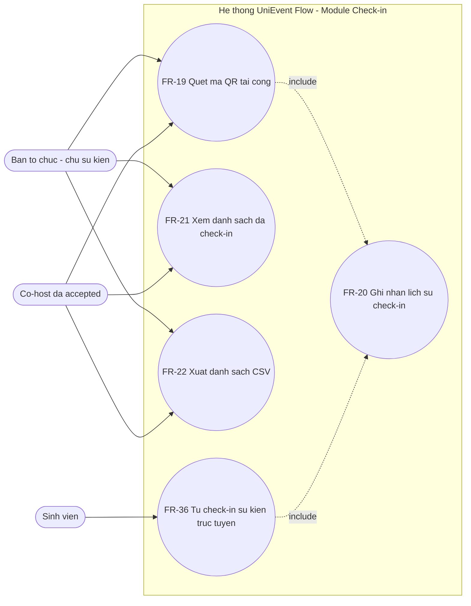
```mermaid
flowchart LR
    BTC([Ban to chuc - chu su kien])
    CH([Co-host da accepted])
    SV([Sinh vien])

    subgraph SYS[He thong UniEvent Flow - Module Check-in]
        UC19((FR-19 Quet ma QR tai cong))
        UC20((FR-20 Ghi nhan lich su check-in))
        UC21((FR-21 Xem danh sach da check-in))
        UC22((FR-22 Xuat danh sach CSV))
        UC36((FR-36 Tu check-in su kien truc tuyen))
    end

    BTC --> UC19
    BTC --> UC21
    BTC --> UC22
    CH --> UC19
    CH --> UC21
    CH --> UC22
    SV --> UC36

    UC19 -.->|include| UC20
    UC36 -.->|include| UC20
```

_Hình 14: Use Case Diagram — Module Check-in_

**Ghi chú đọc sơ đồ:** FR-19 chỉ áp dụng cho sự kiện `location_type = in_person`, FR-36 chỉ áp dụng cho `online` — hai use case loại trừ lẫn nhau theo loại sự kiện (BR-65), nhưng cùng `include` FR-20 để dữ liệu lịch sử tham dự đồng nhất ở cả hai hình thức, nhờ đó điều kiện gửi phản hồi (BR-67) không cần phân biệt loại sự kiện.

_Figure 14: Use Case Diagram for Gate Check-in Module_

| **#** | **UC Name**                                                     | **Description**                                                                                                  |
| ----- | --------------------------------------------------------------- | ---------------------------------------------------------------------------------------------------------------- |
| 1     | Xác thực & giải mã QR khi check-in (Scan & Verify QR)           | Cho phép Ban tổ chức quét mã QR tại cổng, hệ thống xác thực chữ ký JWT và trả kết quả trong dưới 1 giây (FR-19). |
| 2     | Ghi nhận check-in (Record Check-in Log)                         | Hệ thống ghi nhận lịch sử check-in và cập nhật trạng thái vé (FR-20).                                            |
| 3     | Xem lịch sử check-in (View Check-in History)                    | Cho phép Ban tổ chức xem danh sách người đã check-in của sự kiện mình phụ trách (FR-21).                         |
| 4     | Xuất danh sách CSV (Export Check-in CSV)                        | Cho phép Ban tổ chức xuất danh sách check-in ra file CSV (FR-22).                                                |
| 5     | Tự check-in sự kiện trực tuyến (Self Check-in for Online Event) | Cho phép Sinh viên tự xác nhận tham dự đối với sự kiện trực tuyến, không cần quét QR tại cổng (FR-36).           |

### 2.4.5 Phản hồi & Phân tích cảm xúc bằng AI

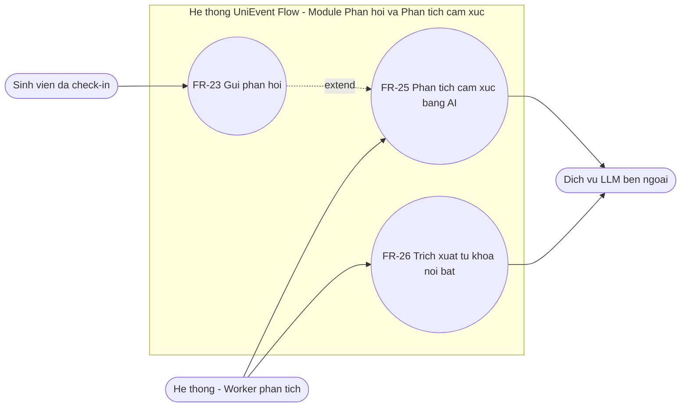
```mermaid
flowchart LR
    SV([Sinh vien da check-in])
    SYSACT([He thong - Worker phan tich])
    LLM([Dich vu LLM ben ngoai])

    subgraph SYS[He thong UniEvent Flow - Module Phan hoi va Phan tich cam xuc]
        UC23((FR-23 Gui phan hoi))
        UC25((FR-25 Phan tich cam xuc bang AI))
        UC26((FR-26 Trich xuat tu khoa noi bat))
    end

    SV --> UC23
    SYSACT --> UC25
    SYSACT --> UC26
    UC25 --> LLM
    UC26 --> LLM
    UC23 -.->|extend| UC25
```

_Hình 15: Use Case Diagram — Module Phản hồi & Phân tích cảm xúc bằng AI_

**Ghi chú đọc sơ đồ:** quan hệ giữa FR-23 và FR-25 là `extend` chứ không phải `include` — phản hồi chỉ có điểm đánh giá mà không có nội dung văn bản thì **không** kích hoạt phân tích AI. Dịch vụ LLM là tác nhân ngoài hệ thống; khi dịch vụ này không phản hồi, FR-23 vẫn hoạt động bình thường và `sentiment_label` được giữ NULL để xử lý lại ở chu kỳ sau (BR-73).

_Figure 15: Use Case Diagram for Feedback** \*\***&\***\* **AI Sentiment Module_

| **#** | **UC Name**                                                  | **Description**                                                                                                                       |
| ----- | ------------------------------------------------------------ | ------------------------------------------------------------------------------------------------------------------------------------- |
| 1     | Gửi phản hồi sau sự kiện (Submit Feedback)                   | Cho phép Sinh viên đã tham dự (ticket.status = checked_in) gửi đánh giá sao (1–5, bắt buộc) kèm nội dung nhận xét (tuỳ chọn) (FR-23). |
| 2     | Xem danh sách phản hồi (View Feedback List)                  | Cho phép Ban tổ chức xem danh sách phản hồi của sự kiện mình phụ trách, lọc theo nhãn cảm xúc (FR-24).                                |
| 3     | Gọi LLM API phân tích cảm xúc (Run Sentiment Analysis)       | Cho phép Ban tổ chức kích hoạt phân tích cảm xúc hàng loạt cho các phản hồi chưa xử lý, hoặc hệ thống tự động chạy theo lịch (FR-25). |
| 4     | Lưu nhãn cảm xúc & từ khoá (Save Sentiment Label & Keywords) | Hệ thống lưu kết quả phân loại cảm xúc và từ khoá nổi bật sau khi LLM xử lý xong (FR-26).                                             |

### 2.4.6 Dashboard & Báo cáo thống kê

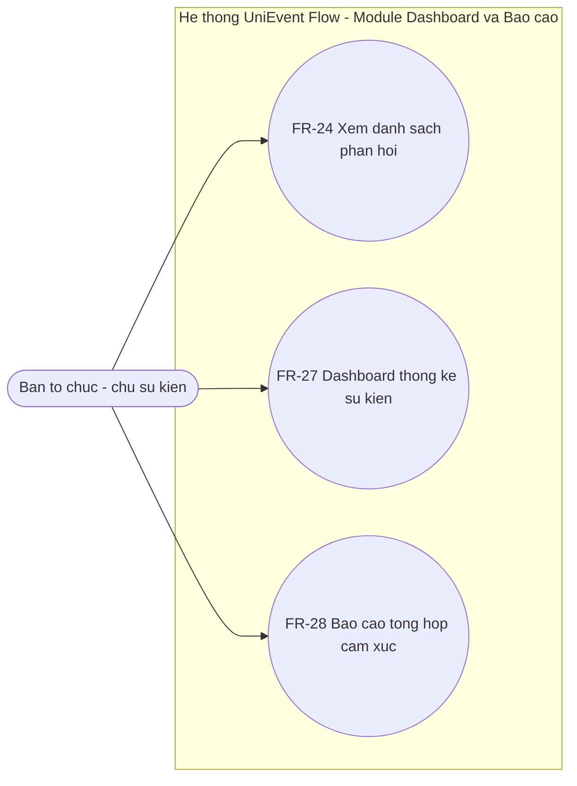
```mermaid
flowchart LR
    BTC([Ban to chuc - chu su kien])

    subgraph SYS[He thong UniEvent Flow - Module Dashboard va Bao cao]
        UC24((FR-24 Xem danh sach phan hoi))
        UC27((FR-27 Dashboard thong ke su kien))
        UC28((FR-28 Bao cao tong hop cam xuc))
    end

    BTC --> UC24
    BTC --> UC27
    BTC --> UC28
```

_Hình 16: Use Case Diagram — Module Dashboard & Báo cáo thống kê_

**Ghi chú đọc sơ đồ:** đây là module duy nhất **không** có mũi tên từ tác nhân Co-host. Ranh giới này là quyết định có chủ đích: Co-host được cấp quyền vận hành (check-in, thông báo, lịch trình) nhưng không được cấp quyền xem dữ liệu đánh giá của sự kiện, vốn thuộc về đơn vị chủ trì (xem CBR 6 và ghi chú tại Ma trận phân quyền mục 2.5).

_Figure 16: Use Case Diagram for Dashboard** \*\***&\***\* **Statistics Module_

| **#** | **UC Name**                                           | **Description**                                                                                           |
| ----- | ----------------------------------------------------- | --------------------------------------------------------------------------------------------------------- |
| 1     | Xem dashboard đăng ký (View Registration Dashboard)   | Cho phép Ban tổ chức xem số liệu tổng hợp về đăng ký, check-in theo thời gian thực (FR-27).               |
| 2     | Xem báo cáo phân loại cảm xúc (View Sentiment Report) | Cho phép Ban tổ chức xem báo cáo phân loại cảm xúc, từ khoá phổ biến và điểm phản hồi trung bình (FR-28). |

### 2.4.7 Quản trị hệ thống

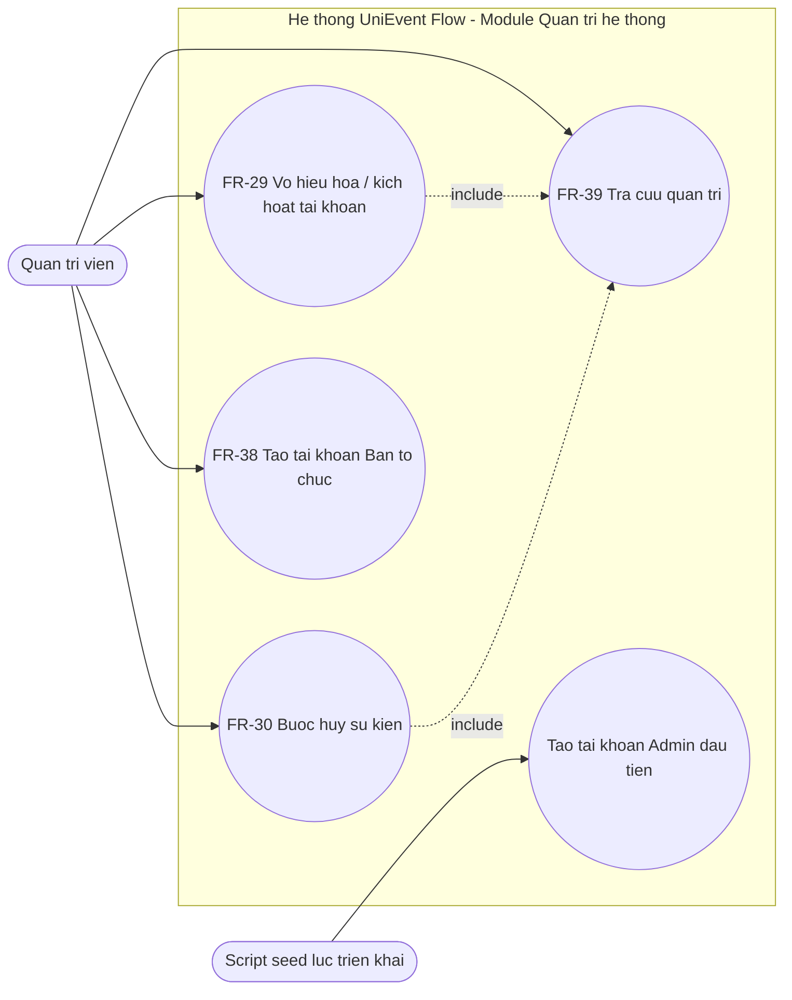
```mermaid
flowchart LR
    AD([Quan tri vien])
    SEED([Script seed luc trien khai])

    subgraph SYS[He thong UniEvent Flow - Module Quan tri he thong]
        UC29((FR-29 Vo hieu hoa / kich hoat tai khoan))
        UC30((FR-30 Buoc huy su kien))
        UC38((FR-38 Tao tai khoan Ban to chuc))
        UC39((FR-39 Tra cuu quan tri))
        ADMIN0((Tao tai khoan Admin dau tien))
    end

    AD --> UC29
    AD --> UC30
    AD --> UC38
    AD --> UC39
    SEED --> ADMIN0

    UC29 -.->|include| UC39
    UC30 -.->|include| UC39
```

_Hình 17: Use Case Diagram — Module Quản trị hệ thống_

**Ghi chú đọc sơ đồ:** quan hệ `include` từ FR-29 và FR-30 tới FR-39 thể hiện chính lỗ hổng đã được phát hiện ở Đợt 2 — hai chức năng quản trị **không thể thực hiện** nếu không có bước tra cứu để lấy `userId`/`eventId`. Tác nhân "Script seed" nằm ngoài giao diện người dùng, thể hiện Assumption #11: tài khoản Quản trị viên đầu tiên là mắt xích duy nhất của chuỗi cấp quyền không được tạo qua hệ thống.

_Figure 17: Use Case Diagram for System Administration Module_

| **#** | **UC Name**                                                               | **Description**                                                                                                                                                                          |
| ----- | ------------------------------------------------------------------------- | ---------------------------------------------------------------------------------------------------------------------------------------------------------------------------------------- |
| 1     | Vô hiệu hoá / kích hoạt tài khoản người dùng (Toggle User Account Status) | Cho phép Quản trị viên vô hiệu hoá hoặc kích hoạt lại tài khoản của bất kỳ người dùng nào (FR-29).                                                                                       |
| 2     | Buộc huỷ sự kiện (Force Cancel Event)                                     | Cho phép Quản trị viên buộc huỷ bất kỳ sự kiện nào, bỏ qua kiểm tra quyền sở hữu (FR-30).                                                                                                |
| 3     | Tạo tài khoản Ban tổ chức (Provision Organizer Account) mới               | Cho phép Quản trị viên tạo trực tiếp một tài khoản role=organizer cho CLB/giảng viên/cán bộ đã được nhà trường công nhận, thay cho việc tự đăng ký (mô hình Provisioning-based) (FR-38). |
| 4     | Tra cứu tài khoản người dùng (Admin User Lookup)                          | Cho phép Quản trị viên tìm, lọc và phân trang danh sách tài khoản để lấy userId phục vụ FR-29 (FR-39).                                                                                   |
| 5     | Tra cứu sự kiện toàn hệ thống (Admin Event Lookup)                        | Cho phép Quản trị viên tra cứu mọi sự kiện, gồm cả sự kiện đã huỷ, để lấy eventId phục vụ FR-30 và phục vụ đối soát (FR-39).                                                             |

**Nhóm 8: Tiện ích dùng chung (Shared Utilities)**

| **#** | **UC Name**                | **Description**                                                                                                                                        |
| ----- | -------------------------- | ------------------------------------------------------------------------------------------------------------------------------------------------------ |
| 1     | Tải ảnh lên (Upload Image) | Cho phép người dùng đã đăng nhập tải tệp ảnh lên dịch vụ lưu trữ và nhận về URL công khai, dùng cho ảnh bìa sự kiện và ảnh đại diện tài khoản (FR-40). |

## 2.5 Ma trận phân quyền (Permission Matrix)

Permission Matrix ánh xạ chức năng và vai trò người dùng cho ứng dụng UniEvent Flow, cập nhật đầy đủ cho toàn bộ **42 FR** (37 FR gốc + FR-38 Provisioning-based, FR-39 Tra cứu quản trị, FR-40 Tải ảnh lên, FR-41 Xem danh sách người đăng ký, FR-42 Xem phản hồi đã gửi của tôi) và vai trò Quản trị viên (Admin), được mô tả như sau:

Chú thích:

| **Ký hiệu** | **Ý nghĩa**                                                                                                             |
| ----------- | ----------------------------------------------------------------------------------------------------------------------- |
| X           | Người dùng có quyền thực hiện chức năng này với tất cả các record.                                                      |
| X (Public)  | Người dùng có quyền thực hiện chức năng mà không yêu cầu đăng nhập.                                                     |
| X\*         | Người dùng chỉ có quyền thực hiện chức năng này với các record đang chờ xử lý hoặc thuộc về người dùng đó (chủ sở hữu). |
| X\*\* mới   | Chủ sở hữu HOẶC Co-host đã accepted của record đó (xem CBR 6, mục 3.8).                                                 |

**Nhóm 1: Quản lý tài khoản**

| **Chức năng**                               | **Sinh viên (Student)** | **Ban tổ chức (Organizer)** | **Quản trị viên (Admin)** | **Hệ thống (System)** |
| ------------------------------------------- | ----------------------- | --------------------------- | ------------------------- | --------------------- |
| Đăng ký tài khoản — chỉ tạo Student (FR-01) | X (Public)              |                             |                           |                       |
| Đăng nhập (FR-02)                           | X (Public)              | X (Public)                  | X (Public)                |                       |
| Đăng xuất (FR-03)                           | X                       | X                           | X                         |                       |
| Đổi mật khẩu (FR-04)                        | X\*                     | X\*                         | X\*                       |                       |
| Xem thông tin cá nhân (FR-05)               | X\*                     | X\*                         | X\*                       |                       |
| Cập nhật thông tin cá nhân (FR-06)          | X\*                     | X\*                         |                           |                       |
| Quên mật khẩu (FR-07)                       | X (Public)              | X (Public)                  |                           |                       |
| Xem hồ sơ công khai Ban tổ chức (FR-33)     | X (Public)              | X (Public)                  | X (Public)                |                       |

**Nhóm 2: Quản lý sự kiện (Event Management)**

| **Chức năng**                                   | **Sinh viên (Student)** | **Ban tổ chức (Organizer)**     | **Quản trị viên (Admin)** | **Hệ thống (System)** |
| ----------------------------------------------- | ----------------------- | ------------------------------- | ------------------------- | --------------------- |
| Tạo sự kiện (FR-08)                             |                         | X                               |                           |                       |
| Xem chi tiết sự kiện (FR-09)                    | X (Public)              | X (Public)                      | X (Public)                |                       |
| Sửa sự kiện (FR-10)                             |                         | X\*                             |                           |                       |
| Xoá / Huỷ sự kiện (FR-11)                       |                         | X\*                             |                           |                       |
| Xem danh sách sự kiện đang phụ trách (FR-12)    |                         | X\*                             |                           |                       |
| Tìm kiếm, lọc sự kiện (FR-13)                   | X (Public)              | X (Public)                      | X (Public)                |                       |
| Đăng thông báo sự kiện (FR-31)                  |                         | X\*\*                           |                           |                       |
| Quản lý lịch trình sự kiện (FR-32)              |                         | X\*\*                           |                           |                       |
| Gắn Co-host (mời) (FR-37)                       |                         | X\*                             |                           |                       |
| Chấp nhận / Từ chối lời mời Co-host (FR-37) mới |                         | X\* (chỉ record mời chính mình) |                           |                       |

**Nhóm 3: Đăng ký \*\***&\***\* Vé điện tử (Registration \*\***&\***\* Ticket)**

| **Chức năng**                             | **Sinh viên (Student)** | **Ban tổ chức (Organizer)** | **Quản trị viên (Admin)** | **Hệ thống (System)** |
| ----------------------------------------- | ----------------------- | --------------------------- | ------------------------- | --------------------- |
| Đăng ký / đặt vé (FR-14)                  | X                       |                             |                           |                       |
| Sinh mã vé QR/JWT (FR-15)                 |                         |                             |                           | X                     |
| Gửi vé qua email bất đồng bộ (FR-16)      |                         |                             |                           | X                     |
| Xem danh sách vé cá nhân (FR-17)          | X\*                     |                             |                           |                       |
| Xem chi tiết một vé (FR-18)               | X\*                     |                             |                           |                       |
| Tự huỷ đăng ký (FR-34)                    | X\*                     |                             |                           |                       |
| Gửi email nhắc lịch trước sự kiện (FR-35) |                         |                             |                           | X                     |

**Nhóm 4: Check-in tại cổng sự kiện (Gate Check-in)**

| **Chức năng**                              | **Sinh viên (Student)** | **Ban tổ chức (Organizer)** | **Quản trị viên (Admin)** | **Hệ thống (System)** |
| ------------------------------------------ | ----------------------- | --------------------------- | ------------------------- | --------------------- |
| Xác thực & giải mã QR khi check-in (FR-19) |                         | X\*\*                       |                           | X                     |
| Ghi nhận check-in / CheckinLog (FR-20)     |                         | X\*\*                       |                           | X                     |
| Xem lịch sử check-in (FR-21)               |                         | X\*\*                       |                           |                       |
| Xem danh sách người đăng ký (FR-41) ⭐     |                         | X\*\*                       |                           |                       |
| Xuất danh sách CSV (FR-22)                 |                         | X\*\*                       |                           |                       |
| Tự check-in sự kiện trực tuyến (FR-36)     | X\*                     |                             |                           |                       |

**Nhóm 5: Phản hồi \*\***&\***\* Phân tích cảm xúc bằng AI (Feedback \*\***&\***\* AI Sentiment)**

| **Chức năng**                         | **Sinh viên (Student)** | **Ban tổ chức (Organizer)** | **Quản trị viên (Admin)** | **Hệ thống (System)** |
| ------------------------------------- | ----------------------- | --------------------------- | ------------------------- | --------------------- |
| Gửi phản hồi sau sự kiện (FR-23)      | X\*                     |                             |                           |                       |
| Xem phản hồi đã gửi của tôi (FR-42) ⭐ | X\*                     |                             |                           |                       |
| Xem danh sách phản hồi (FR-24)        |                         | X\*                         |                           |                       |
| Gọi LLM API phân tích cảm xúc (FR-25) |                         | X\*                         |                           | X                     |
| Lưu nhãn cảm xúc & từ khoá (FR-26)    |                         |                             |                           | X                     |

**Nhóm 6: Dashboard \*\***&\***\* Báo cáo thống kê (Dashboard \*\***&\***\* Statistics)**

| **Chức năng**                         | **Sinh viên (Student)** | **Ban tổ chức (Organizer)** | **Quản trị viên (Admin)** | **Hệ thống (System)** |
| ------------------------------------- | ----------------------- | --------------------------- | ------------------------- | --------------------- |
| Xem dashboard đăng ký (FR-27)         |                         | X\*                         |                           |                       |
| Xem báo cáo phân loại cảm xúc (FR-28) |                         | X\*                         |                           |                       |

**Nhóm 7: Quản trị hệ thống (System Administration)**

| **Chức năng**                                                | **Sinh viên (Student)** | **Ban tổ chức (Organizer)** | **Quản trị viên (Admin)** | **Hệ thống (System)** |
| ------------------------------------------------------------ | ----------------------- | --------------------------- | ------------------------- | --------------------- |
| Vô hiệu hoá / kích hoạt tài khoản người dùng (FR-29)         |                         |                             | X                         |                       |
| Buộc huỷ sự kiện (FR-30)                                     |                         |                             | X                         |                       |
| Tạo tài khoản Ban tổ chức (FR-38) mới                        |                         |                             | X                         |                       |
| Tra cứu tài khoản người dùng / sự kiện toàn hệ thống (FR-39) |                         |                             | X                         |                       |

**Nhóm 8: Tiện ích dùng chung (Shared Utilities)**

| **Chức năng**       | **Sinh viên (Student)** | **Ban tổ chức (Organizer)** | **Quản trị viên (Admin)** | **Hệ thống (System)** |
| ------------------- | ----------------------- | --------------------------- | ------------------------- | --------------------- |
| Tải ảnh lên (FR-40) | X                       | X                           | X                         |                       |

## 2.6 Kiến trúc hệ thống (System Architecture)

Mục 1.2 nêu hai bài toán kỹ thuật cốt lõi của đồ án: chống bán vượt số vé dưới truy cập đồng thời, và xác thực vé dưới 1 giây tại cổng. Mục này đặc tả kiến trúc hiện thực chúng, gồm một sơ đồ kiến trúc triển khai và hai sơ đồ tuần tự (sequence diagram) cho đúng hai luồng đó.

### 2.6.1 Sơ đồ kiến trúc triển khai (Deployment Architecture)

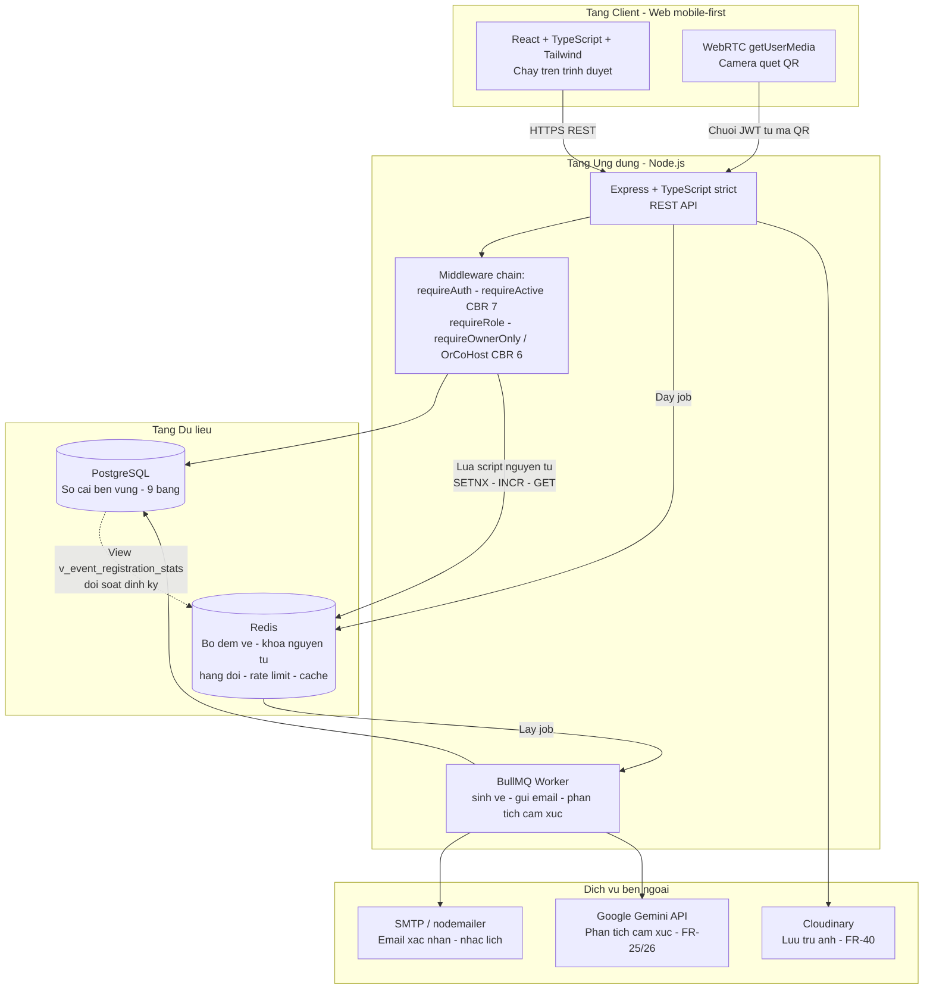
```mermaid
flowchart TB
    subgraph CLIENT[Tang Client - Web mobile-first]
        BROWSER[React + TypeScript + Tailwind<br/>Chay tren trinh duyet]
        CAM[WebRTC getUserMedia<br/>Camera quet QR]
    end

    subgraph SERVER[Tang Ung dung - Node.js]
        API[Express + TypeScript strict<br/>REST API]
        MW[Middleware chain:<br/>requireAuth - requireActive CBR 7<br/>requireRole - requireOwnerOnly / OrCoHost CBR 6]
        WORKER[BullMQ Worker<br/>sinh ve - gui email - phan tich cam xuc]
    end

    subgraph DATA[Tang Du lieu]
        PG[(PostgreSQL<br/>So cai ben vung - 9 bang)]
        REDIS[(Redis<br/>Bo dem ve - khoa nguyen tu<br/>hang doi - rate limit - cache)]
    end

    subgraph EXT[Dich vu ben ngoai]
        SMTP[SMTP / nodemailer<br/>Email xac nhan - nhac lich]
        LLMAPI[Google Gemini API<br/>Phan tich cam xuc - FR-25/26]
        STORAGE[Cloudinary<br/>Luu tru anh - FR-40]
    end

    BROWSER -->|HTTPS REST| API
    CAM -->|Chuoi JWT tu ma QR| API
    API --> MW
    MW --> PG
    MW -->|Lua script nguyen tu<br/>SETNX - INCR - GET| REDIS
    API -->|Day job| REDIS
    REDIS -->|Lay job| WORKER
    WORKER --> PG
    WORKER --> SMTP
    WORKER --> LLMAPI
    API --> STORAGE

    PG -.->|View v_event_registration_stats<br/>doi soat dinh ky| REDIS
```

_Hình 18: Sơ đồ kiến trúc triển khai hệ thống UniEvent Flow_

**Ba điểm cần lưu ý khi đọc sơ đồ:**

1. **Redis đảm nhiệm năm vai trò khác nhau**, không chỉ là bộ nhớ đệm: bộ đếm tồn kho vé (BR-47, BR-89, BR-90), khoá nguyên tử chống check-in trùng (BR-91), khoá giữ chỗ (BR-88) và khoá chống trùng request (`Idempotency-Key`, xem API §1.7), hàng đợi công việc của BullMQ, giới hạn tần suất đăng nhập (NFR 6.1), và cache trạng thái tài khoản (CBR 7). ⭐ **Ghi chú v0.6.10:** hệ thống **không** dùng keyspace notifications của Redis cho bất kỳ nghiệp vụ nào — mọi việc “tới hạn thì làm gì đó” đều đi qua job hẹn giờ của BullMQ (BR-88, BR-97), vì tính năng đó phải bật ở cấu hình máy chủ và không đảm bảo có trên dịch vụ Redis managed. Việc dồn nhiều vai trò vào một thành phần là đánh đổi có ý thức — giảm số hạ tầng phải vận hành trong 7 tuần, đổi lấy việc Redis trở thành điểm hỏng đơn (single point of failure); hệ quả và cách giảm thiểu được nêu ở NFR 6.6.
2. **Đường nét đứt từ PostgreSQL về Redis** không phải luồng dữ liệu thời gian thực mà là cơ chế **đối soát**: view `v_event_registration_stats` cho phép so sánh số vé Redis đang báo với số vé thực tế trong sổ cái, phát hiện trôi lệch do lỗi bù trừ (BR-89, BR-90).
3. **Worker và API dùng chung mã nguồn nhưng là tiến trình tách biệt.** Mọi tác vụ chậm hoặc phụ thuộc dịch vụ ngoài (gửi email, gọi LLM, sinh vé) đều nằm ở phía Worker, giữ cho luồng request-response của API không bị chặn — đây là điều kiện để đạt NFR-01.

4. **⭐ v0.7.0 — Hai ràng buộc CHỈ tồn tại ở tầng SQL, tầng ứng dụng phải tự chặn.** Prisma introspect không biểu diễn được `CHECK` constraint, nên hai quy tắc sau nằm trong `schema.sql` mà **không** có mặt trong `schema.prisma`:
   - `chk_checkin_method_organizer` — `checkin_method = 'self'` **buộc** đi kèm `organizer_id IS NULL`, và `'qr_scan'` **buộc** có `organizer_id`. Luồng FR-36 (tự check-in) phải tự đảm bảo điều này.
   - `rating BETWEEN 1 AND 5` trên `feedbacks` — FR-23 phải chặn ở tầng Zod (BR-68).

   Không chặn ở tầng ứng dụng thì CSDL ném lỗi thô và người dùng nhận HTTP 500 thay vì lỗi nghiệp vụ rõ ràng.

5. **⭐ v0.7.0 — View `v_event_registration_stats` không có trong Prisma schema.** File `schema.prisma` chưa bật `previewFeatures = ["views"]`, nên mọi nơi cần số liệu tổng hợp (FR-27 Dashboard, `tickets_remaining` đối soát) phải truy vấn bằng `$queryRaw` thay vì Prisma Client. Đây là ràng buộc kỹ thuật cần biết trước khi viết truy vấn mới, không phải thiếu sót của CSDL.

### 2.6.2 Sequence Diagram — Luồng đăng ký chống bán vượt vé (FR-14)

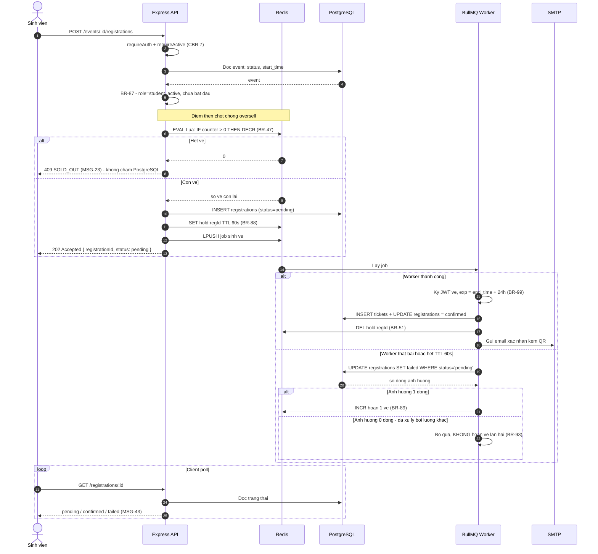
```mermaid
sequenceDiagram
    autonumber
    actor SV as Sinh vien
    participant API as Express API
    participant R as Redis
    participant PG as PostgreSQL
    participant W as BullMQ Worker
    participant M as SMTP

    SV->>API: POST /events/:id/registrations
    API->>API: requireAuth + requireActive (CBR 7)
    API->>PG: Doc event: status, start_time
    PG-->>API: event
    API->>API: BR-87 - role=student, active, chua bat dau

    Note over API,R: Diem then chot chong oversell
    API->>R: EVAL Lua: IF counter > 0 THEN DECR (BR-47)
    alt Het ve
        R-->>API: 0
        API-->>SV: 409 SOLD_OUT (MSG-23) - khong cham PostgreSQL
    else Con ve
        R-->>API: so ve con lai
        API->>PG: INSERT registrations (status=pending)
        API->>R: SET hold:regId TTL 60s (BR-88)
        API->>R: LPUSH job sinh ve
        API-->>SV: 202 Accepted { registrationId, status: pending }
    end

    R->>W: Lay job
    alt Worker thanh cong
        W->>W: Ky JWT ve, exp = end_time + 24h (BR-99)
        W->>PG: INSERT tickets + UPDATE registrations = confirmed
        W->>R: DEL hold:regId (BR-51)
        W->>M: Gui email xac nhan kem QR
    else Worker that bai hoac het TTL 60s
        W->>PG: UPDATE registrations SET failed WHERE status='pending'
        PG-->>W: so dong anh huong
        alt Anh huong 1 dong
            W->>R: INCR hoan 1 ve (BR-89)
        else Anh huong 0 dong - da xu ly boi luong khac
            W->>W: Bo qua, KHONG hoan ve lan hai (BR-93)
        end
    end

    loop Client poll
        SV->>API: GET /registrations/:id
        API->>PG: Doc trang thai
        API-->>SV: pending / confirmed / failed (MSG-43)
    end
```

_Hình 19: Sequence Diagram — Luồng đăng ký vé, thể hiện cơ chế hai pha và các nhánh bù trừ_

**Vì sao Lua script là điểm then chốt:** nếu tách thành hai lệnh riêng (`GET` để kiểm tra rồi `DECR` để trừ), hai request đến gần nhau đều có thể đọc được giá trị 1 rồi cùng trừ, tạo ra bán vượt. Gói cả kiểm tra và trừ vào một Lua script khiến Redis thực thi chúng như một đơn vị không thể xen kẽ. Đây cũng là nội dung sẽ được kiểm chứng bằng thực nghiệm và so sánh với các phương án thay thế ở Đợt 4.

### 2.6.3 Sequence Diagram — Luồng check-in dưới 1 giây (FR-19)

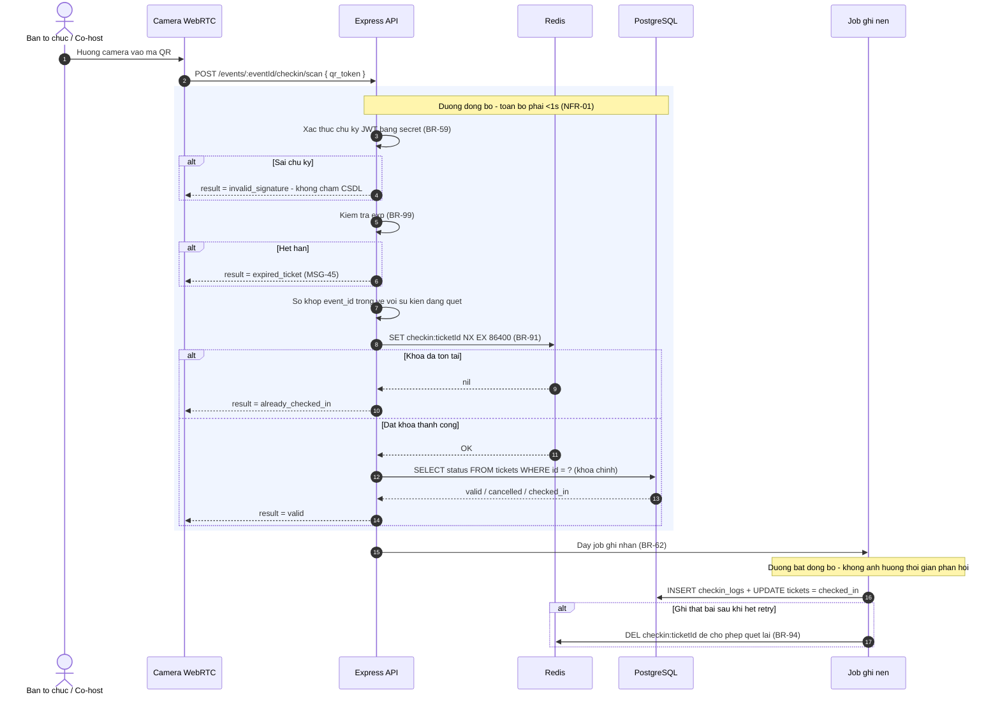
```mermaid
sequenceDiagram
    autonumber
    actor BTC as Ban to chuc / Co-host
    participant CAM as Camera WebRTC
    participant API as Express API
    participant R as Redis
    participant PG as PostgreSQL
    participant Q as Job ghi nen

    BTC->>CAM: Huong camera vao ma QR
    CAM->>API: POST /events/:eventId/checkin/scan { qr_token }

    rect rgb(240, 245, 255)
    Note over API,PG: Duong dong bo - toan bo phai <1s (NFR-01)
    API->>API: Xac thuc chu ky JWT bang secret (BR-59)
    alt Sai chu ky
        API-->>CAM: result = invalid_signature - khong cham CSDL
    end
    API->>API: Kiem tra exp (BR-99)
    alt Het han
        API-->>CAM: result = expired_ticket (MSG-45)
    end
    API->>API: So khop event_id trong ve voi su kien dang quet
    API->>R: SET checkin:ticketId NX EX 86400 (BR-91)
    alt Khoa da ton tai
        R-->>API: nil
        API-->>CAM: result = already_checked_in
    else Dat khoa thanh cong
        R-->>API: OK
        API->>PG: SELECT status FROM tickets WHERE id = ? (khoa chinh)
        PG-->>API: valid / cancelled / checked_in
        API-->>CAM: result = valid
    end
    end

    API->>Q: Day job ghi nhan (BR-62)
    Note over Q: Duong bat dong bo - khong anh huong thoi gian phan hoi
    Q->>PG: INSERT checkin_logs + UPDATE tickets = checked_in
    alt Ghi that bai sau khi het retry
        Q->>R: DEL checkin:ticketId de cho phep quet lai (BR-94)
    end
```

_Hình 20: Sequence Diagram — Luồng check-in tại cổng, phân tách rõ đường đồng bộ và đường bất đồng bộ_

**Ba lớp phòng vệ chống check-in trùng, theo thứ tự chi phí tăng dần:** khoá Redis `SETNX` (~0,2 ms, đồng bộ, là lớp quyết định kết quả trả về) → kiểm tra `ticket.status` trong PostgreSQL (nguồn dữ liệu bền vững, bắt các trường hợp khoá Redis đã hết hạn hoặc bị mất) → ràng buộc `UNIQUE` trên `checkin_logs.ticket_id` (bảo đảm cuối cùng ở tầng CSDL, không thể vượt qua). Thiết kế nhiều lớp ở đây không phải thừa: mỗi lớp xử lý một chế độ hỏng khác nhau, và chỉ lớp đầu tiên nằm trên đường đồng bộ nên chỉ nó ảnh hưởng tới NFR-01.

# 3. Đặc tả Use Case (Use Case Specifications)

## 3.1 Quản lý tài khoản

### 3.1.1 UC-01: Đăng ký tài khoản mới (FR-01)

| **Objective:**      | Cho phép người dùng chưa có tài khoản tự tạo tài khoản Sinh viên bằng email và mật khẩu. Đây là luồng tự đăng ký duy nhất của hệ thống — không có lựa chọn vai trò nào khác. |
| ------------------- | ---------------------------------------------------------------------------------------------------------------------------------------------------------------------------- |
| **Actor:**          | Khách (chưa đăng nhập) — sẽ trở thành Sinh viên sau khi đăng ký thành công.                                                                                                  |
| **Trigger:**        | Người dùng chọn “Đăng ký” trên màn hình đăng nhập và điền đầy đủ thông tin.                                                                                                  |
| **Pre-condition:**  | Người dùng chưa có tài khoản trong hệ thống với email đang nhập.                                                                                                             |
| **Post-condition:** | Tài khoản mới được tạo thành công với role = student, mật khẩu được mã hoá.                                                                                                  |

**Activities Flow**

```mermaid
flowchart TB
    START(( )) --> N1
    subgraph LU["Khách vãng lai"]
    direction TB
        N1["(1) Người dùng chọn 'Đăng ký' trên màn hình đăng nhập và điền đầ…"]
        N3["(3) Nhập dữ liệu và bấm gửi yêu cầu"]
    end
    subgraph LS["Hệ thống"]
    direction TB
        N2["(2) Hiển thị màn hình / biểu mẫu tương ứng"]
        N4["(4) Validation Rules"]
        N5["(5) Uniqueness Rule"]
        N6["(6) Fixed Role Rule"]
        N7["(7) Creating Rule"]
        N8["(8) Lưu và trả kết quả: Tài khoản mới được tạo thành công với role = student"]
    end
    N1 --> N2
    N2 --> N3
    N3 --> N4
    N4 --> N5
    N5 --> N6
    N6 --> N7
    N7 --> N8
    N8 --> ENDN(((END)))
    N4 -.->|Không hợp lệ| N3
```

**Business Rules**

| **Step** | **BR Code** | **Description**                                                                                                                                                                                                                                                                                                 |
| -------- | ----------- | --------------------------------------------------------------------------------------------------------------------------------------------------------------------------------------------------------------------------------------------------------------------------------------------------------------- |
| (4)      | **BR-01**   | Validation Rules: Áp dụng CBR1: nếu [Họ tên], [Email], [Mật khẩu] để trống hoặc sai định dạng/độ dài tối thiểu, hệ thống hiển thị lỗi tương ứng.                                                                                                                                                                |
| (5)      | **BR-02**   | Uniqueness Rule: Hệ thống tra cứu [Email] đã tồn tại chưa (ràng buộc UNIQUE ở CSDL trên cột email). Nếu đã tồn tại, trả lỗi EMAIL_ALREADY_EXISTS (HTTP 409).                                                                                                                                                    |
| (6)      | **BR-03**   | Fixed Role Rule: POST /auth/register không nhận trường role hay organizerCode từ request; hệ thống luôn gán cứng role = 'student' phía server. Đây là thay đổi có chủ đích: tài khoản Organizer chỉ được tạo qua FR-38 (Quản trị viên tạo), không qua đăng ký công khai — xem Assumption liên quan tại mục 6.9. |
| (7)      | **BR-04**   | Creating Rule: Băm [Mật khẩu] bằng bcrypt trước khi lưu (NFR-08). Thiết lập is_active = true, role = student, created_at/updated_at = thời điểm hiện tại. Trả HTTP 201 kèm thông tin user vừa tạo (không gồm password_hash).                                                                                    |

### 3.1.2 UC-02: Đăng nhập (FR-02)

| **Objective:**      | Xác thực danh tính người dùng đã có tài khoản và cấp phát JWT Access Token để truy cập các chức năng yêu cầu đăng nhập. |
| ------------------- | ----------------------------------------------------------------------------------------------------------------------- |
| **Actor:**          | Sinh viên, Ban tổ chức, Quản trị viên.                                                                                  |
| **Trigger:**        | Người dùng nhập email/mật khẩu và chọn “Đăng nhập”.                                                                     |
| **Pre-condition:**  | Người dùng đã có tài khoản hợp lệ trong hệ thống.                                                                       |
| **Post-condition:** | Người dùng nhận được accessToken hợp lệ trong 2 giờ để gọi các API yêu cầu xác thực.                                    |

**Activities Flow**

```mermaid
flowchart TB
    START(( )) --> N1
    subgraph LU["Quản trị viên"]
    direction TB
        N1["(1) Người dùng nhập email/mật khẩu và chọn 'Đăng nhập'"]
        N3["(3) Nhập dữ liệu và bấm gửi yêu cầu"]
    end
    subgraph LS["Hệ thống"]
    direction TB
        N2["(2) Hiển thị màn hình / biểu mẫu tương ứng"]
        N4["(4) Validation Rules"]
        N5["(5) Rate Limiting Rule"]
        N6["(6) Authentication Rule"]
        N7["(7) Account Status Rule"]
        N8["(8) Token Issuance Rule"]
        N9["(9) Lưu và trả kết quả: Người dùng nhận được accessToken hợp lệ trong 2 giờ "]
    end
    N1 --> N2
    N2 --> N3
    N3 --> N4
    N4 --> N5
    N5 --> N6
    N6 --> N7
    N7 --> N8
    N8 --> N9
    N9 --> ENDN(((END)))
    N4 -.->|Không hợp lệ| N3
```

**Business Rules**

| **Step** | **BR Code** | **Description**                                                                                                                                                                                                     |
| -------- | ----------- | ------------------------------------------------------------------------------------------------------------------------------------------------------------------------------------------------------------------- |
| (4)      | **BR-05**   | Validation Rules: Nếu [Email] hoặc [Mật khẩu] để trống, hệ thống hiển thị lỗi bắt buộc nhập (CBR1).                                                                                                                 |
| (5)      | **BR-06**   | Rate Limiting Rule: POST /auth/login áp dụng rate limit qua Redis (express-rate-limit + rate-limit-redis). Vượt ngưỡng → HTTP 429.                                                                                  |
| (6)      | **BR-07**   | Authentication Rule: So khớp mật khẩu nhập với password_hash bằng bcrypt.compare. Sai email hoặc mật khẩu → thông báo lỗi chung INVALID_CREDENTIALS (HTTP 401), không tiết lộ email nào sai.                        |
| (7)      | **BR-08**   | Account Status Rule: Nếu is_active = false (tài khoản đã bị Quản trị viên vô hiệu hoá — FR-29), từ chối đăng nhập dù mật khẩu đúng, trả lỗi ACCOUNT_DISABLED (HTTP 403).                                            |
| (8)      | **BR-09**   | Token Issuance Rule: Sinh JWT { sub: userId, role, iat, exp }, ký bằng secret server. Access token hiệu lực 2 giờ, không kèm refresh token trong phạm vi 7 tuần. Trả HTTP 200 kèm { accessToken, expiresIn, user }. |

### 3.1.3 UC-03: Đăng xuất (FR-03)

| **Objective:**      | Cho phép người dùng đã đăng nhập kết thúc phiên làm việc hiện tại.       |
| ------------------- | ------------------------------------------------------------------------ |
| **Actor:**          | Sinh viên, Ban tổ chức, Quản trị viên.                                   |
| **Trigger:**        | Người dùng chọn “Đăng xuất”.                                             |
| **Pre-condition:**  | Người dùng đã đăng nhập (có accessToken hợp lệ).                         |
| **Post-condition:** | Phiên làm việc kết thúc; accessToken không còn được sử dụng phía client. |

**Activities Flow**

```mermaid
flowchart TB
    START(( )) --> N1
    subgraph LU["Quản trị viên"]
    direction TB
        N1["(1) Người dùng chọn 'Đăng xuất'"]
        N3["(3) Nhập dữ liệu và bấm gửi yêu cầu"]
    end
    subgraph LS["Hệ thống"]
    direction TB
        N2["(2) Hiển thị màn hình / biểu mẫu tương ứng"]
        N4["(4) Session Termination Rule"]
        N5["(5) Lưu và trả kết quả: Phiên làm việc kết thúc"]
    end
    N1 --> N2
    N2 --> N3
    N3 --> N4
    N4 --> N5
    N5 --> ENDN(((END)))
```

**Business Rules**

| **Step** | **BR Code** | **Description**                                                                                                                                                                                                                             |
| -------- | ----------- | ------------------------------------------------------------------------------------------------------------------------------------------------------------------------------------------------------------------------------------------- |
| (4)      | **BR-10**   | Session Termination Rule: JWT là stateless nên đăng xuất chủ yếu thực hiện ở client (xoá token). Server trả HTTP 204 khi nhận yêu cầu hợp lệ. Có thể bổ sung blacklist token trên Redis (TTL = thời gian còn lại) — không bắt buộc cho MVP. |

### 3.1.4 UC-04: Đổi mật khẩu (FR-04)

| **Objective:**      | Cho phép người dùng đã đăng nhập tự đổi mật khẩu tài khoản của chính mình.             |
| ------------------- | -------------------------------------------------------------------------------------- |
| **Actor:**          | Sinh viên, Ban tổ chức, Quản trị viên.                                                 |
| **Trigger:**        | Người dùng chọn “Đổi mật khẩu” trong trang hồ sơ cá nhân.                              |
| **Pre-condition:**  | Người dùng đã đăng nhập.                                                               |
| **Post-condition:** | Mật khẩu mới được băm và lưu thành công; các lần đăng nhập sau phải dùng mật khẩu mới. |

**Activities Flow**

```mermaid
flowchart TB
    START(( )) --> N1
    subgraph LU["Quản trị viên"]
    direction TB
        N1["(1) Người dùng chọn 'Đổi mật khẩu' trong trang hồ sơ cá nhân"]
        N3["(3) Nhập dữ liệu và bấm gửi yêu cầu"]
    end
    subgraph LS["Hệ thống"]
    direction TB
        N2["(2) Hiển thị màn hình / biểu mẫu tương ứng"]
        N4["(4) Validation Rules"]
        N5["(5) Verification Rule"]
        N6["(6) Update Rule"]
        N7["(7) Lưu và trả kết quả: Mật khẩu mới được băm và lưu thành công"]
    end
    N1 --> N2
    N2 --> N3
    N3 --> N4
    N4 --> N5
    N5 --> N6
    N6 --> N7
    N7 --> ENDN(((END)))
    N4 -.->|Không hợp lệ| N3
```

**Business Rules**

| **Step** | **BR Code** | **Description**                                                                                                                                              |
| -------- | ----------- | ------------------------------------------------------------------------------------------------------------------------------------------------------------ |
| (4)      | **BR-11**   | Validation Rules: Áp dụng CBR1 cho [Mật khẩu hiện tại] và [Mật khẩu mới] (không để trống, đủ độ dài tối thiểu).                                              |
| (5)      | **BR-12**   | Verification Rule: So khớp [Mật khẩu hiện tại] với password_hash bằng bcrypt.compare. Không khớp → từ chối, thông báo “Mật khẩu hiện tại không đúng”.        |
| (6)      | **BR-13**   | Update Rule: Băm lại [Mật khẩu mới] bằng bcrypt trước khi ghi đè (NFR-08). Không log/trả plaintext mật khẩu ở bất kỳ đâu. Cập nhật updated_at, trả HTTP 200. |

### 3.1.5 UC-05: Xem thông tin cá nhân (FR-05)

| **Objective:**      | Cho phép người dùng đã đăng nhập xem thông tin hồ sơ tài khoản của chính mình. |
| ------------------- | ------------------------------------------------------------------------------ |
| **Actor:**          | Sinh viên, Ban tổ chức, Quản trị viên.                                         |
| **Trigger:**        | Người dùng chọn mục “Hồ sơ của tôi”.                                           |
| **Pre-condition:**  | Người dùng đã đăng nhập thành công.                                            |
| **Post-condition:** | Thông tin cá nhân được hiển thị chính xác.                                     |

**Activities Flow**

```mermaid
flowchart TB
    START(( )) --> N1
    subgraph LU["Quản trị viên"]
    direction TB
        N1["(1) Người dùng chọn mục 'Hồ sơ của tôi'"]
    end
    subgraph LS["Hệ thống"]
    direction TB
        N2["(2) Tiếp nhận yêu cầu, kiểm tra quyền truy cập"]
        N3["(3) Ownership Rule"]
        N4["(4) Display Rule"]
        N5["(5) Trả dữ liệu: Thông tin cá nhân được hiển thị chính xác"]
    end
    N1 --> N2
    N2 --> N3
    N3 --> N4
    N4 --> N5
    N5 --> ENDN(((END)))
```

**Business Rules**

| **Step** | **BR Code** | **Description**                                                                                                                                        |
| -------- | ----------- | ------------------------------------------------------------------------------------------------------------------------------------------------------ |
| (3)      | **BR-14**   | Ownership Rule: Danh tính người dùng lấy từ trường sub trong JWT, không nhận id từ query string/path param, đảm bảo chỉ xem được hồ sơ của chính mình. |
| (4)      | **BR-15**   | Display Rule: Trường password_hash không bao giờ được đưa vào response.                                                                                |

### 3.1.6 UC-06: Cập nhật thông tin cá nhân (FR-06)

| **Objective:**      | Cho phép người dùng đã đăng nhập cập nhật họ tên, ảnh đại diện, tiểu sử và liên kết mạng xã hội trong hồ sơ cá nhân. |
| ------------------- | -------------------------------------------------------------------------------------------------------------------- |
| **Actor:**          | Sinh viên, Ban tổ chức, Quản trị viên.                                                                               |
| **Trigger:**        | Người dùng chỉnh sửa thông tin và chọn “Lưu thay đổi” trên trang hồ sơ.                                              |
| **Pre-condition:**  | Người dùng đã đăng nhập thành công.                                                                                  |
| **Post-condition:** | Thông tin hồ sơ được cập nhật thành công và phản ánh ngay trên giao diện.                                            |

**Activities Flow**

```mermaid
flowchart TB
    START(( )) --> N1
    subgraph LU["Quản trị viên"]
    direction TB
        N1["(1) Người dùng chỉnh sửa thông tin và chọn 'Lưu thay đổi' trên t…"]
        N3["(3) Nhập dữ liệu và bấm gửi yêu cầu"]
    end
    subgraph LS["Hệ thống"]
    direction TB
        N2["(2) Hiển thị màn hình / biểu mẫu tương ứng"]
        N4["(4) Validation Rules"]
        N5["(5) Field Restriction Rule"]
        N6["(6) Social Links Format Rule"]
        N7["(7) Update Rule"]
        N8["(8) Lưu và trả kết quả: Thông tin hồ sơ được cập nhật thành công và phản ánh"]
    end
    N1 --> N2
    N2 --> N3
    N3 --> N4
    N4 --> N5
    N5 --> N6
    N6 --> N7
    N7 --> N8
    N8 --> ENDN(((END)))
    N4 -.->|Không hợp lệ| N3
```

**Business Rules**

| **Step** | **BR Code** | **Description**                                                                                                                                                                                                                                                                                                                                                                                                                                                                           |
| -------- | ----------- | ----------------------------------------------------------------------------------------------------------------------------------------------------------------------------------------------------------------------------------------------------------------------------------------------------------------------------------------------------------------------------------------------------------------------------------------------------------------------------------------- |
| (4)      | **BR-16**   | Validation Rules: Áp dụng CBR1 cho các trường bắt buộc gửi lên (ví dụ [Họ tên] không được để trống nếu có gửi trường này).                                                                                                                                                                                                                                                                                                                                                                |
| (5)      | **BR-17**   | Field Restriction Rule: PATCH /users/me chỉ cho phép sửa {name, avatarUrl, bio, socialLinks, clubName}. Riêng clubName chỉ có ý nghĩa và chỉ được chấp nhận khi req.user.role = organizer — tài khoản Sinh viên/Quản trị viên gửi trường này sẽ bị bỏ qua (không báo lỗi, vì đây là trường không áp dụng chứ không phải giá trị sai). Không cho phép sửa [email], [role], [password_hash] qua endpoint này — đổi mật khẩu dùng UC-04; đổi email không hỗ trợ trong 7 tuần (out-of-scope). |
| (6)      | **BR-18**   | Social Links Format Rule: socialLinks lưu dạng JSONB, là object với khoá chỉ thuộc đúng tập cố định {facebook, website, tiktok, discord, instagram, zalo} (xem mục 5.2) — không chấp nhận khoá ngoài tập này, không có cơ chế tự nhận diện domain để gán icon. Khoá vắng mặt/rỗng thì icon tương ứng ẩn trên trang công khai (UC-08). Giá trị không phải object hợp lệ hoặc chứa khoá lạ → lỗi validation 400.                                                                            |
| (7)      | **BR-19**   | Update Rule: Trigger CSDL set_updated_at_users tự động gán lại updated_at. Trả HTTP 200 kèm thông tin user đã cập nhật.                                                                                                                                                                                                                                                                                                                                                                   |

### 3.1.7 UC-07: Quên mật khẩu (FR-07)

| **Objective:**      | Cho phép người dùng chưa đăng nhập (đã quên mật khẩu) khôi phục quyền truy cập tài khoản qua email đã đăng ký, gồm 2 giai đoạn: yêu cầu đặt lại và đặt mật khẩu mới.                       |
| ------------------- | ------------------------------------------------------------------------------------------------------------------------------------------------------------------------------------------ |
| **Actor:**          | Khách (chưa đăng nhập) — Sinh viên hoặc Ban tổ chức đã có tài khoản.                                                                                                                       |
| **Trigger:**        | Người dùng chọn liên kết “Quên mật khẩu?” trên màn hình đăng nhập.                                                                                                                         |
| **Pre-condition:**  | Giai đoạn 1: người dùng nhập email đã đăng ký (hệ thống không xác nhận tài khoản có tồn tại hay không). Giai đoạn 2: người dùng đã nhận email chứa liên kết đặt lại mật khẩu còn hiệu lực. |
| **Post-condition:** | Mật khẩu mới được thiết lập thành công cho tài khoản.                                                                                                                                      |

**Activities Flow**

```mermaid
flowchart TB
    START(( )) --> N1
    subgraph LU["Người dùng"]
    direction TB
        N1["(1) Người dùng chọn liên kết 'Quên mật khẩu?' trên màn hình đăng…"]
        N3["(3) Nhập dữ liệu và bấm gửi yêu cầu"]
    end
    subgraph LS["Hệ thống"]
    direction TB
        N2["(2) Hiển thị màn hình / biểu mẫu tương ứng"]
        N4["(4) Validation Rule (Giai đoạn 1)"]
        N5["(5) Anti Email-Enumeration Rule"]
        N6["(6) Token Generation Rule"]
        N7["(7) Async Email Rule"]
        N8["(8) Token Validation Rule (Giai đoạn 2)"]
        N9["(9) Reset Rule"]
        N10["(10) Lưu và trả kết quả: Mật khẩu mới được thiết lập thành công cho tài khoản"]
    end
    N1 --> N2
    N2 --> N3
    N3 --> N4
    N4 --> N5
    N5 --> N6
    N6 --> N7
    N7 --> N8
    N8 --> N9
    N9 --> N10
    N10 --> ENDN(((END)))
    N4 -.->|Không hợp lệ| N3
```

**Business Rules**

| **Step** | **BR Code** | **Description**                                                                                                                                                                                                                                |
| -------- | ----------- | ---------------------------------------------------------------------------------------------------------------------------------------------------------------------------------------------------------------------------------------------- |
| (4)      | **BR-20**   | Validation Rule (Giai đoạn 1): Nếu [Email] để trống hoặc sai định dạng, hiển thị lỗi tương ứng (CBR1).                                                                                                                                         |
| (5)      | **BR-21**   | Anti Email-Enumeration Rule: POST /auth/forgot-password luôn trả HTTP 202 bất kể email có tồn tại hay không, tránh lộ thông tin email đã đăng ký.                                                                                              |
| (6)      | **BR-22**   | Token Generation Rule: Nếu email tồn tại, sinh reset_token ngẫu nhiên, lưu vào users.reset_token; thiết lập reset_token_expires = now + 20 phút.                                                                                               |
| (7)      | **BR-23**   | Async Email Rule: Email chứa liên kết đặt lại (kèm reset_token) gửi bất đồng bộ qua BullMQ, không chặn luồng phản hồi chính (trích dẫn “NFR-04” cũ không trỏ tới mục nào cụ thể trong mục 6 — thay bằng tham chiếu đúng: xem 6.6 Reliability). |
| (8)      | **BR-24**   | Token Validation Rule (Giai đoạn 2): Kiểm tra [token] khớp reset_token của một User VÀ chưa vượt quá reset_token_expires. Vi phạm → lỗi RESET_TOKEN_EXPIRED (HTTP 400).                                                                        |
| (9)      | **BR-25**   | Reset Rule: Token hợp lệ → băm [Mật khẩu mới] bằng bcrypt, cập nhật password_hash; set reset_token = NULL, reset_token_expires = NULL (one-time use). Trả HTTP 200.                                                                            |

### 3.1.8 UC-08: Xem hồ sơ công khai Ban tổ chức (FR-33)

| **Objective:**      | Cho phép bất kỳ ai (kể cả khách chưa đăng nhập) xem trang hồ sơ công khai của một Ban tổ chức, gồm thông tin cơ bản và danh sách sự kiện đang tổ chức. |
| ------------------- | ------------------------------------------------------------------------------------------------------------------------------------------------------ |
| **Actor:**          | Sinh viên, Khách (Public).                                                                                                                             |
| **Trigger:**        | Người dùng nhấp vào tên/avatar của một Ban tổ chức từ trang chi tiết sự kiện hoặc trang danh sách Co-host.                                             |
| **Pre-condition:**  | userId tương ứng tồn tại trong hệ thống.                                                                                                               |
| **Post-condition:** | Trang hồ sơ công khai của Ban tổ chức được hiển thị.                                                                                                   |

**Activities Flow**

```mermaid
flowchart TB
    START(( )) --> N1
    subgraph LU["Khách vãng lai"]
    direction TB
        N1["(1) Người dùng nhấp vào tên/avatar của một Ban tổ chức từ trang…"]
    end
    subgraph LS["Hệ thống"]
    direction TB
        N2["(2) Tiếp nhận yêu cầu, kiểm tra quyền truy cập"]
        N3["(3) Visibility Rule"]
        N4["(4) Public Access Rule"]
        N5["(5) Trả dữ liệu: Trang hồ sơ công khai của Ban tổ chức được hiển thị"]
    end
    N1 --> N2
    N2 --> N3
    N3 --> N4
    N4 --> N5
    N5 --> ENDN(((END)))
```

**Business Rules**

| **Step** | **BR Code** | **Description**                                                                                                                                                                                                                                                                                                   |
| -------- | ----------- | ----------------------------------------------------------------------------------------------------------------------------------------------------------------------------------------------------------------------------------------------------------------------------------------------------------------- |
| (3)      | **BR-26**   | Visibility Rule: GET /organizers/:userId chỉ trả dữ liệu nếu user.role = organizer; nếu không phải hoặc không tồn tại → HTTP 404. Trường trả về giới hạn: name, clubName (), avatarUrl, bio, socialLinks và danh sách sự kiện status=active do organizer này tổ chức — không bao giờ trả email hay password_hash. |
| (4)      | **BR-27**   | Public Access Rule: Endpoint không yêu cầu đăng nhập (Public).                                                                                                                                                                                                                                                    |

## 3.2 Quản lý sự kiện

### 3.2.1 UC-09: Tạo sự kiện (FR-08)

| **Objective:**      | Cho phép Ban tổ chức tạo một sự kiện mới, chọn hình thức Trực tiếp (In Person) hoặc Trực tuyến (Online). |
| ------------------- | -------------------------------------------------------------------------------------------------------- |
| **Actor:**          | Ban tổ chức.                                                                                             |
| **Trigger:**        | Ban tổ chức chọn “Tạo sự kiện” và điền biểu mẫu.                                                         |
| **Pre-condition:**  | Người dùng đã đăng nhập với vai trò organizer.                                                           |
| **Post-condition:** | Sự kiện được tạo với status = active; bộ đếm vé còn lại trên Redis được khởi tạo bằng max_tickets.       |

**Activities Flow**

```mermaid
flowchart TB
    START(( )) --> N1
    subgraph LU["Ban tổ chức"]
    direction TB
        N1["(1) Ban tổ chức chọn 'Tạo sự kiện' và điền biểu mẫu"]
        N3["(3) Nhập dữ liệu và bấm gửi yêu cầu"]
    end
    subgraph LS["Hệ thống"]
    direction TB
        N2["(2) Hiển thị màn hình / biểu mẫu tương ứng"]
        N4["(4) Validation Rules"]
        N5["(5) Category Enum Rule"]
        N6["(6) Role Rule"]
        N7["(7) Location Type Rule"]
        N8["(8) Redis Initialization Rule"]
        N9["(9) Lưu và trả kết quả: Sự kiện được tạo với status = active"]
    end
    N1 --> N2
    N2 --> N3
    N3 --> N4
    N4 --> N5
    N5 --> N6
    N6 --> N7
    N7 --> N8
    N8 --> N9
    N9 --> ENDN(((END)))
    N4 -.->|Không hợp lệ| N3
```

**Business Rules**

| **Step** | **BR Code** | **Description**                                                                                                                                                                                                                                                                                                                                        |
| -------- | ----------- | ------------------------------------------------------------------------------------------------------------------------------------------------------------------------------------------------------------------------------------------------------------------------------------------------------------------------------------------------------ |
| (4)      | **BR-28**   | Validation Rules: Bắt buộc title, start_time, end_time, max_tickets > 0; end_time phải sau start_time (ràng buộc chk_event_time_range).                                                                                                                                                                                                                |
| (5)      | **BR-28b**  | Category Enum Rule: Trường category (nếu gửi lên) phải thuộc đúng tập giá trị cố định tại mục 5.2 (ràng buộc ENUM ở tầng CSDL, theo CBR 5); giá trị ngoài tập → lỗi validation HTTP 400. Trường vẫn là tuỳ chọn (nullable) — sự kiện không chọn danh mục hiển thị là “Chưa phân loại” trên giao diện, không ép buộc gán mặc định other ở tầng dữ liệu. |
| (6)      | **BR-29**   | Role Rule: Chỉ role = organizer được gọi (requireRole(‘organizer’)).                                                                                                                                                                                                                                                                                   |
| (7)      | **BR-30**   | Location Type Rule: Nếu locationType = in_person, trường location bắt buộc; nếu locationType = online, trường joinUrl bắt buộc. Thiếu trường tương ứng → lỗi validation HTTP 400.                                                                                                                                                                      |
| (8)      | **BR-31**   | Redis Initialization Rule: Khi tạo thành công, hệ thống khởi tạo bộ đếm vé còn lại trên Redis bằng max_tickets — đây là nguồn dữ liệu duy nhất cho luồng đăng ký chống oversell (SRS §5.2).                                                                                                                                                            |

### 3.2.2 UC-10: Xem chi tiết sự kiện (FR-09)

| **Objective:**      | Hiển thị thông tin chi tiết của một sự kiện, kèm số vé còn lại theo thời gian thực. |
| ------------------- | ----------------------------------------------------------------------------------- |
| **Actor:**          | Sinh viên, Ban tổ chức, Khách (Public).                                             |
| **Trigger:**        | Người dùng nhấp vào một sự kiện từ danh sách hoặc kết quả tìm kiếm.                 |
| **Pre-condition:**  | eventId tồn tại.                                                                    |
| **Post-condition:** | Thông tin sự kiện được hiển thị chính xác, gồm tickets_remaining thời gian thực.     |

**Activities Flow**

```mermaid
flowchart TB
    START(( )) --> N1
    subgraph LU["Người dùng"]
    direction TB
        N1["(1) Người dùng nhấp vào một sự kiện từ danh sách hoặc kết quả tì…"]
    end
    subgraph LS["Hệ thống"]
    direction TB
        N2["(2) Tiếp nhận yêu cầu, kiểm tra quyền truy cập"]
        N3["(3) Public Access Rule"]
        N4["(4) Real-time Ticket Count Rule"]
        N5["(5) Trả dữ liệu: Thông tin sự kiện được hiển thị chính xác, gồm ticke"]
    end
    N1 --> N2
    N2 --> N3
    N3 --> N4
    N4 --> N5
    N5 --> ENDN(((END)))
```

**Business Rules**

| **Step** | **BR Code**            | **Description**                                                                                                                                                                                                                                                                                                                                                                                                                                                                      |
| -------- | ---------------------- | ------------------------------------------------------------------------------------------------------------------------------------------------------------------------------------------------------------------------------------------------------------------------------------------------------------------------------------------------------------------------------------------------------------------------------------------------------------------------------------ |
| (3)      | **BR-32**              | Public Access Rule: GET /events/:eventId không yêu cầu đăng nhập.                                                                                                                                                                                                                                                                                                                                                                                                                    |
| (4)      | **BR-33**              | Real-time Ticket Count Rule: Trường tickets_remaining đọc trực tiếp từ Redis tại thời điểm request, không đọc từ PostgreSQL, đảm bảo phản ánh đúng số vé thực tế còn lại.                                                                                                                                                                                                                                                                                                             |
| (4b)     | **BR-33b** ⭐ mới v1.0 | Public Registered Count Rule: `GET /events/:id` (FR-09) và mỗi item của `GET /events` (FR-13) trả kèm `registered_count` = số đăng ký đang chiếm chỗ (`registrations.status IN ('confirmed','pending')`), dùng hiển thị công khai “X người tham gia”. Đây chỉ là **con số tổng hợp**, không lộ danh tính người đăng ký — danh sách chi tiết (kèm PII) thuộc FR-41 và chỉ dành cho người vận hành. Khi `tickets_remaining = 0`, giao diện hiển thị trạng thái hết vé (SOLD_OUT/MSG-23). |

### 3.2.3 UC-11: Sửa sự kiện (FR-10)

| **Objective:**      | Cho phép Ban tổ chức chỉnh sửa thông tin sự kiện do mình phụ trách.                                                                      |
| ------------------- | ---------------------------------------------------------------------------------------------------------------------------------------- |
| **Actor:**          | Ban tổ chức (chủ sự kiện).                                                                                                               |
| **Trigger:**        | Ban tổ chức chọn “Chỉnh sửa” trên trang quản lý sự kiện.                                                                                 |
| **Pre-condition:**  | Người dùng đã đăng nhập và là chủ sự kiện (event.organizer_id = req.user.id).                                                            |
| **Post-condition:** | Thông tin sự kiện được cập nhật thành công; nếu max_tickets thay đổi thì bộ đếm vé còn lại trên Redis đã được đồng bộ tương ứng (BR-90). |

**Activities Flow**

```mermaid
flowchart TB
    START(( )) --> N1
    subgraph LU["Ban tổ chức"]
    direction TB
        N1["(1) Ban tổ chức chọn 'Chỉnh sửa' trên trang quản lý sự kiện"]
        N3["(3) Nhập dữ liệu và bấm gửi yêu cầu"]
    end
    subgraph LS["Hệ thống"]
    direction TB
        N2["(2) Hiển thị màn hình / biểu mẫu tương ứng"]
        N4["(4) Ownership Rule"]
        N5["(5) Max Tickets Guard Rule"]
        N6["(6) Ticket Counter Resync Rule"]
        N7["(7) Lưu và trả kết quả: Thông tin sự kiện được cập nhật thành công"]
    end
    N1 --> N2
    N2 --> N3
    N3 --> N4
    N4 --> N5
    N5 --> N6
    N6 --> N7
    N7 --> ENDN(((END)))
    N4 -.->|Không hợp lệ| N3
```

**Business Rules**

| **Step** | **BR Code** | **Description**                                                                                                                                                                                                                                                                                                                                                                                                                                                                                                                                                                                                                                                                                         |
| -------- | ----------- | ------------------------------------------------------------------------------------------------------------------------------------------------------------------------------------------------------------------------------------------------------------------------------------------------------------------------------------------------------------------------------------------------------------------------------------------------------------------------------------------------------------------------------------------------------------------------------------------------------------------------------------------------------------------------------------------------------- |
| (4)      | **BR-34**   | Ownership Rule: Chỉ organizer_id = req.user.id mới sửa được (requireOwnerOnly —); khác → HTTP 403 FORBIDDEN_NOT_OWNER.                                                                                                                                                                                                                                                                                                                                                                                                                                                                                                                                                                                  |
| (5)      | **BR-35**   | Max Tickets Guard Rule: Nếu max_tickets mới nhỏ hơn tổng số registration đang chiếm chỗ của sự kiện — tức \`status IN ('confirmed', 'pending')\` — hệ thống từ chối và trả lỗi MAX_TICKETS_BELOW_CONFIRMED (HTTP 422). Ghi chú thiết kế: một cách tiếp cận thường gặp là chỉ đếm \`confirmed\`, bỏ sót các đăng ký đang ở \`pending\` (đã chiếm vé trên Redis nhưng worker chưa xử lý xong) — nếu chỉ đếm confirmed thì việc giảm max_tickets có thể cắt mất chỗ của người đang trong hàng đợi, gây oversell ngược. Các bản ghi \`failed\`/\`cancelled\` không được tính vì đã hoàn vé về Redis (BR-56, BR-89).                                                                                         |
| (6)      | **BR-90**   | Ticket Counter Resync Rule: Khi max_tickets thay đổi, hệ thống phải đồng bộ lại bộ đếm vé còn lại trên Redis, nếu không thay đổi này chỉ có tác dụng trên PostgreSQL còn luồng đăng ký thực tế vẫn chạy theo hạn mức cũ. Quy tắc: tính \`delta = max_tickets_mới − max_tickets_cũ\`, rồi thực hiện \`INCRBY delta\` lên bộ đếm Redis của sự kiện. Thao tác kiểm tra ràng buộc (BR-35) và INCRBY phải nằm trong cùng một Lua script để nguyên tử với các request đăng ký đang chạy song song (cùng lý do và cùng kỹ thuật với BR-47). ⭐ **Làm rõ v0.6.10 — phạm vi của yêu cầu Lua:** script chỉ cần thiết ở đây và ở BR-47 vì cả hai đều là chuỗi **đọc-rồi-mới-ghi** (đọc giá trị hiện tại, so điều kiện, rồi mới ghi) — tách thành 2 lệnh sẽ để lọt request chen vào giữa. Ngược lại, thao tác **hoàn vé ở BR-89 và BR-56 là \`INCR\` trần, KHÔNG cần bọc Lua**: đó là lệnh đơn, bản thân Redis đã đảm bảo tính nguyên tử, và không có điều kiện nào phải kiểm trước khi ghi. Ghi rõ điều này để câu “cùng kỹ thuật với BR-47” không bị hiểu thành “mọi thao tác lên bộ đếm đều phải viết bằng Lua”. Nếu cập nhật PostgreSQL thành công nhưng đồng bộ Redis thất bại, hệ thống ghi log cảnh báo mức ERROR để đối soát thủ công qua view \`v_event_registration_stats\`. |

### 3.2.4 UC-12: Huỷ sự kiện (FR-11)

| **Objective:**      | Cho phép Ban tổ chức huỷ (soft-cancel) sự kiện do mình phụ trách.                                  |
| ------------------- | -------------------------------------------------------------------------------------------------- |
| **Actor:**          | Ban tổ chức (chủ sự kiện).                                                                         |
| **Trigger:**        | Ban tổ chức chọn “Huỷ sự kiện” và xác nhận.                                                        |
| **Pre-condition:**  | Người dùng là chủ sự kiện; sự kiện đang ở status = active và chưa bắt đầu (start_time > hiện tại). |
| **Post-condition:** | Sự kiện chuyển sang status = cancelled; các vé liên quan chuyển sang cancelled.                    |

**Activities Flow**

```mermaid
flowchart TB
    START(( )) --> N1
    subgraph LU["Ban tổ chức"]
    direction TB
        N1["(1) Ban tổ chức chọn 'Huỷ sự kiện' và xác nhận"]
        N3["(3) Nhập dữ liệu và bấm gửi yêu cầu"]
    end
    subgraph LS["Hệ thống"]
    direction TB
        N2["(2) Hiển thị màn hình / biểu mẫu tương ứng"]
        N4["(4) Ownership Rule"]
        N5["(5) Soft-cancel Rule"]
        N6["(6) Not-Started Rule"]
        N7["(7) Idempotency Rule"]
        N8["(8) Lưu và trả kết quả: Sự kiện chuyển sang status = cancelled"]
    end
    N1 --> N2
    N2 --> N3
    N3 --> N4
    N4 --> N5
    N5 --> N6
    N6 --> N7
    N7 --> N8
    N8 --> ENDN(((END)))
    N4 -.->|Không hợp lệ| N3
```

**Business Rules**

| **Step** | **BR Code** | **Description**                                                                                                                                                                               |
| -------- | ----------- | --------------------------------------------------------------------------------------------------------------------------------------------------------------------------------------------- |
| (4)      | **BR-36**   | Ownership Rule: Áp dụng cùng quy tắc với BR-34 cho hành động huỷ.                                                                                                                             |
| (5)      | **BR-37**   | Soft-cancel Rule ⭐ **làm rõ v0.6.9**: Đổi status → cancelled, không dùng DELETE và không xoá dữ liệu (soft-cancel). Hệ quả dây chuyền nằm trong **cùng một transaction** với việc đổi status: ticket đang `valid` → `cancelled`, ticket đã `checked_in` **giữ nguyên** (dữ liệu lịch sử tham dự có thật, không được viết lại); huỷ job nhắc lịch còn treo (BR-97). Bản ghi `registrations` **không đổi trạng thái** — sổ ghi ai đã từng đăng ký vẫn giữ nguyên để đối soát. **Không hoàn vé về bộ đếm Redis** vì sự kiện không còn nhận đăng ký; khoá đếm được bỏ qua và tự hết hạn (cùng nguyên tắc với BR-96(c) của FR-30). |
| (6)      | **BR-37b**  | Not-Started Rule: Chỉ cho phép huỷ khi sự kiện chưa diễn ra (event.start_time > thời điểm hiện tại). Sự kiện đã bắt đầu hoặc đã kết thúc → từ chối, trả lỗi EVENT_ALREADY_STARTED (HTTP 422). |
| (7)      | **BR-37c**  | Idempotency Rule ⭐ **chốt v0.6.9**: Nếu event.status đã là cancelled, từ chối huỷ lại, trả lỗi EVENT_ALREADY_CANCELLED (**HTTP 409**, MSG-34). Mã trạng thái này áp dụng **thống nhất cho cả FR-11 lẫn FR-30** — bản trước ghi 422 ở luồng buộc huỷ (§4.8.2 / BR-96b), nay quy về 409 theo API §1.3 (409 = xung đột trạng thái). Một mã lỗi chỉ ứng với đúng một HTTP status để giao diện không phải rẽ nhánh theo endpoint. |
| (8)      | **BR-106**  | Mandatory Audit Reason Rule (xem §3.2.32): FR-11 **bắt buộc** kèm `reason` 10–500 ký tự; ghi `cancel_reason`, `cancelled_by` (= chính chủ sự kiện) và `cancelled_at` trong cùng transaction ở BR-37. Thiếu/sai độ dài → **422 `CANCEL_REASON_REQUIRED`**. |

### 3.2.5 UC-13: Xem danh sách sự kiện phụ trách (FR-12)

| **Objective:**      | Hiển thị danh sách sự kiện mà Ban tổ chức đang đăng nhập phụ trách — gồm cả sự kiện làm chủ và sự kiện được gắn Co-host đã chấp nhận.                                                                                                                          |
| ------------------- | -------------------------------------------------------------------------------------------------------------------------------------------------------------------------------------------------------------------------------------------------------------- |
| **Actor:**          | Ban tổ chức.                                                                                                                                                                                                                                                   |
| **Trigger:**        | Ban tổ chức chọn mục “Sự kiện của tôi”.                                                                                                                                                                                                                        |
| **Pre-condition:**  | Người dùng đã đăng nhập với vai trò organizer.                                                                                                                                                                                                                 |
| **Post-condition:** | Danh sách được hiển thị, chia 2 nhóm: “Tôi tổ chức” (organizer_id = user) và “Tôi đồng hành” (event_co_hosts.status = accepted); đây cũng là entry point duy nhất để vào các chức năng quản lý từng sự kiện (sửa/huỷ/lịch trình/thông báo/check-in/dashboard). |

**Activities Flow**

```mermaid
flowchart TB
    START(( )) --> N1
    subgraph LU["Ban tổ chức"]
    direction TB
        N1["(1) Ban tổ chức chọn mục 'Sự kiện của tôi'"]
    end
    subgraph LS["Hệ thống"]
    direction TB
        N2["(2) Tiếp nhận yêu cầu, kiểm tra quyền truy cập"]
        N3["(3) Ownership & Co-host Filter Rule"]
        N4["(4) mới Pending Invitation Banner Rule"]
        N5["(5) Trả dữ liệu: Danh sách được hiển thị, chia 2 nhóm: 'Tôi tổ chức' "]
    end
    N1 --> N2
    N2 --> N3
    N3 --> N4
    N4 --> N5
    N5 --> ENDN(((END)))
```

**Business Rules**

| **Step** | **BR Code** | **Description**                                                                                                                                                                                                                                                                                                                                                                                                                                                                                                                                                                                                                                                                                                                                                                  |
| -------- | ----------- | -------------------------------------------------------------------------------------------------------------------------------------------------------------------------------------------------------------------------------------------------------------------------------------------------------------------------------------------------------------------------------------------------------------------------------------------------------------------------------------------------------------------------------------------------------------------------------------------------------------------------------------------------------------------------------------------------------------------------------------------------------------------------------- |
| (3)      | **BR-38**   | Ownership & Co-host Filter Rule: GET /events/mine trả về sự kiện thuộc 2 tập: (a) sự kiện có organizer_id = req.user.id; (b) sự kiện có bản ghi event_co_hosts với user_id = req.user.id VÀ status = accepted. Hình dạng response đã chốt: hai tập được trả về thành hai mảng tách rời — \`{ owned: [...], co_hosting: [...] }\` — chứ không phải một mảng phẳng kèm trường phân biệt vai trò. Lý do chốt phương án này: đây là hợp đồng dữ liệu giữa backend và frontend nên hai tài liệu mâu thuẫn sẽ khiến hai thành viên hiện thực lệch nhau. Chọn phương án hai mảng vì giao diện “Sự kiện của tôi” vốn đã chia tab theo vai trò, nên client không phải lọc lại; đồng thời tránh trường hợp nhập nhằng khi một người vừa là chủ vừa được mời đồng hành cho cùng một sự kiện. |
| (4)      | **BR-38b**  | Pending Invitation Banner Rule: Nếu tồn tại bản ghi event_co_hosts với user_id = req.user.id VÀ status = pending, response GET /events/mine trả kèm mảng pending_invitations riêng để giao diện hiển thị banner “Lời mời đồng hành đang chờ” ở đầu trang (không dùng cơ chế notification toàn cục, xem NFR 6.8).                                                                                                                                                                                                                                                                                                                                                                                                                                                                  |

### 3.2.6 UC-14: Tìm kiếm, lọc sự kiện (FR-13)

| **Objective:**      | Cho phép tìm kiếm và lọc sự kiện công khai theo từ khoá, danh mục, CLB, khoảng thời gian. |
| ------------------- | ----------------------------------------------------------------------------------------- |
| **Actor:**          | Sinh viên, Ban tổ chức, Khách (Public).                                                   |
| **Trigger:**        | Người dùng nhập từ khoá hoặc chọn bộ lọc trên trang danh sách sự kiện.                    |
| **Pre-condition:**  | Không yêu cầu.                                                                            |
| **Post-condition:** | Danh sách sự kiện thoả điều kiện lọc được hiển thị, phân trang.                           |

**Activities Flow**

```mermaid
flowchart TB
    START(( )) --> N1
    subgraph LU["Người dùng"]
    direction TB
        N1["(1) Người dùng nhập từ khoá hoặc chọn bộ lọc trên trang danh sác…"]
    end
    subgraph LS["Hệ thống"]
    direction TB
        N2["(2) Tiếp nhận yêu cầu, kiểm tra quyền truy cập"]
        N3["(3) Public Search Rule"]
        N4["(4) Trả dữ liệu: Danh sách sự kiện thoả điều kiện lọc được hiển thị, "]
    end
    N1 --> N2
    N2 --> N3
    N3 --> N4
    N4 --> ENDN(((END)))
```

**Business Rules**

| **Step** | **BR Code** | **Description**                                                                                                                                                                                                                                                                                              |
| -------- | ----------- | ------------------------------------------------------------------------------------------------------------------------------------------------------------------------------------------------------------------------------------------------------------------------------------------------------------ |
| (3)      | **BR-39**   | Public Search Rule: GET /events không yêu cầu đăng nhập; hỗ trợ query q, category, club_name, from, to, page, limit, sort. : từ khi category chuyển sang ENUM (BR-28b, CBR 5), lọc theo category là so khớp chính xác giá trị enum (không còn so khớp chuỗi con dễ sai lệch do lỗi chính tả khi nhập tự do). |

### 3.2.7 UC-15: Đăng thông báo sự kiện (FR-31)

| **Objective:**      | Cho phép Ban tổ chức đăng thông báo mới lên trang sự kiện để thông tin đến những người đã đăng ký. |
| ------------------- | -------------------------------------------------------------------------------------------------- |
| **Actor:**          | Ban tổ chức (chủ sự kiện hoặc Co-host đã accepted).                                                |
| **Trigger:**        | Ban tổ chức/Co-host chọn “Đăng thông báo” trong trang quản lý sự kiện.                             |
| **Pre-condition:**  | Người dùng là chủ sự kiện, hoặc là Co-host với status = accepted cho sự kiện đó.                   |
| **Post-condition:** | Thông báo mới xuất hiện trên feed của trang chi tiết sự kiện, hiển thị mới nhất trước.             |

**Activities Flow**

```mermaid
flowchart TB
    START(( )) --> N1
    subgraph LU["Ban tổ chức"]
    direction TB
        N1["(1) Ban tổ chức/Co-host chọn 'Đăng thông báo' trong trang quản l…"]
        N3["(3) Nhập dữ liệu và bấm gửi yêu cầu"]
    end
    subgraph LS["Hệ thống"]
    direction TB
        N2["(2) Hiển thị màn hình / biểu mẫu tương ứng"]
        N4["(4) Owner-or-Co-host Rule"]
        N5["(5) Content Rule"]
        N6["(6) Lưu và trả kết quả: Thông báo mới xuất hiện trên feed của trang chi tiết"]
    end
    N1 --> N2
    N2 --> N3
    N3 --> N4
    N4 --> N5
    N5 --> N6
    N6 --> ENDN(((END)))
```

**Business Rules**

| **Step** | **BR Code** | **Description**                                                                                                                                                                                          |
| -------- | ----------- | -------------------------------------------------------------------------------------------------------------------------------------------------------------------------------------------------------- |
| (4)      | **BR-40**   | Owner-or-Co-host Rule: Middleware requireOwnerOrCoHost (CBR 6) cho phép chủ sự kiện (event.organizer_id = req.user.id) HOẶC Co-host có status = accepted đăng thông báo cho sự kiện đó; khác → HTTP 403. |
| (5)      | **BR-41**   | Content Rule: title và content bắt buộc, không để trống. Danh sách thông báo (GET) sắp xếp created_at DESC.                                                                                              |
| (6)      | **BR-40b** ⭐ v0.6.4 | Edit Rule: `PATCH /events/:eventId/updates/:updateId` dùng `requireOwnerOrCoHost` (như POST). `updateId` phải thuộc đúng `eventId` (khác → 404 `UPDATE_NOT_FOUND`). Body là partial `{title?, content?}` — ⭐ **bổ sung v0.6.9**: phải có **ít nhất một** trường, body rỗng `{}` → 400 `VALIDATION_ERROR` (không coi là thao tác hợp lệ vô hại, vì gửi body rỗng luôn là lỗi phía gọi). Sửa **chỉ thay đổi bản ghi trong feed**, **không** gửi lại email — email đã phát ở lần đăng đầu không thu hồi/không đồng bộ được (giới hạn có chủ đích, nêu rõ trên UI). |
| (7)      | **BR-40c** ⭐ v0.6.4 | Delete Rule: `DELETE /events/:eventId/updates/:updateId` dùng `requireOwnerOrCoHost`; `updateId` phải thuộc đúng `eventId` (khác → 404). Xoá gỡ thông báo khỏi feed hiển thị; email đã gửi trước đó **không thu hồi được**. |

### 3.2.8 UC-16: Quản lý lịch trình sự kiện (FR-32)

| **Objective:**      | Cho phép Ban tổ chức thêm, sửa, xoá các mốc thời gian trong lịch trình chi tiết của sự kiện (ví dụ: 8:00 Khai mạc, 9:00 Toạ đàm…). |
| ------------------- | ---------------------------------------------------------------------------------------------------------------------------------- |
| **Actor:**          | Ban tổ chức (chủ sự kiện hoặc Co-host đã accepted).                                                                                |
| **Trigger:**        | Ban tổ chức/Co-host thao tác trên tab “Lịch trình” của trang quản lý sự kiện.                                                      |
| **Pre-condition:**  | Người dùng là chủ sự kiện, hoặc là Co-host với status = accepted cho sự kiện đó.                                                   |
| **Post-condition:** | Lịch trình sự kiện được cập nhật và hiển thị đúng thứ tự trên trang chi tiết sự kiện.                                              |

**Activities Flow**

```mermaid
flowchart TB
    START(( )) --> N1
    subgraph LU["Ban tổ chức"]
    direction TB
        N1["(1) Ban tổ chức/Co-host thao tác trên tab 'Lịch trình' của trang…"]
        N3["(3) Nhập dữ liệu và bấm gửi yêu cầu"]
    end
    subgraph LS["Hệ thống"]
    direction TB
        N2["(2) Hiển thị màn hình / biểu mẫu tương ứng"]
        N4["(4) Owner-or-Co-host Rule"]
        N5["(5) Ordering Rule"]
        N6["(6) Lưu và trả kết quả: Lịch trình sự kiện được cập nhật và hiển thị đúng th"]
    end
    N1 --> N2
    N2 --> N3
    N3 --> N4
    N4 --> N5
    N5 --> N6
    N6 --> ENDN(((END)))
```

**Business Rules**

| **Step** | **BR Code** | **Description**                                                                                                                                                          |
| -------- | ----------- | ------------------------------------------------------------------------------------------------------------------------------------------------------------------------ |
| (4)      | **BR-42**   | Owner-or-Co-host Rule: Middleware requireOwnerOrCoHost (CBR 6) cho phép chủ sự kiện HOẶC Co-host có status = accepted thêm/sửa/xoá mốc lịch trình (bảng event_schedule). |
| (5)      | **BR-43**   | Ordering Rule: start_time và title bắt buộc cho mỗi mốc; trường sort_order quyết định thứ tự hiển thị trên giao diện.                                                    |

### 3.2.9 UC-17: Gắn Co-host, Chấp nhận/Từ chối lời mời (FR-37)

| **Objective:**      | Cho phép tài khoản Organizer được mời tự xác nhận có đồng ý làm Co-host cho sự kiện hay không.                                                            |
| ------------------- | --------------------------------------------------------------------------------------------------------------------------------------------------------- |
| **Actor:**          | Ban tổ chức (người được mời).                                                                                                                             |
| **Trigger:**        | Người được mời bấm “Chấp nhận”/“Từ chối” trên banner lời mời tại trang “Sự kiện của tôi” (xem BR-38b, UC-13).                                             |
| **Pre-condition:**  | Tồn tại bản ghi event_co_hosts với user_id = req.user.id VÀ status = pending.                                                                             |
| **Post-condition:** | status chuyển sang accepted (có ngay quyền thao tác — BR-40/BR-42/BR-59 trở đi) hoặc declined (không có quyền gì, chủ sự kiện có thể mời lại theo BR-46). |

**Activities Flow**

```mermaid
flowchart TB
    START(( )) --> N1
    subgraph LU["Ban tổ chức"]
    direction TB
        N1["(1) Người được mời bấm 'Chấp nhận'/'Từ chối' trên banner lời mời…"]
        N3["(3) Nhập dữ liệu và bấm gửi yêu cầu"]
    end
    subgraph LS["Hệ thống"]
    direction TB
        N2["(2) Hiển thị màn hình / biểu mẫu tương ứng"]
        N4["(4) Ownership Rule"]
        N5["(5) Co-host Eligibility Rule"]
        N6["(6) Self-Invite Guard Rule"]
        N7["(7) (xử lý đủ 4 nhánh trạng thái Invitation"]
        N8["(8) mới Invitation Email Rule"]
        N9["(9) mới Removal Rule"]
        N10["(10) mới Self-Confirmation Rule"]
        N11["(11) mới No Cross-Notification Rule"]
        N12["(12) Lưu và trả kết quả: status chuyển sang accepted (có ngay quyền thao tác"]
    end
    N1 --> N2
    N2 --> N3
    N3 --> N4
    N4 --> N5
    N5 --> N6
    N6 --> N7
    N7 --> N8
    N8 --> N9
    N9 --> N10
    N10 --> N11
    N11 --> N12
    N12 --> ENDN(((END)))
    N4 -.->|Không hợp lệ| N3
```

**Business Rules**

| **Step** | **BR Code** | **Description**                                                                                                                                                                                                                                                                                                                                                                                                                                                                                                                                                                                                                                                                                                                                                         |
| -------- | ----------- | ----------------------------------------------------------------------------------------------------------------------------------------------------------------------------------------------------------------------------------------------------------------------------------------------------------------------------------------------------------------------------------------------------------------------------------------------------------------------------------------------------------------------------------------------------------------------------------------------------------------------------------------------------------------------------------------------------------------------------------------------------------------------- |
| (4)      | **BR-44**   | Ownership Rule: Chỉ chủ sự kiện (organizer_id) được mời/xoá Co-host — dùng middleware requireOwnerOnly (CBR 6), không dùng requireOwnerOrCoHost.                                                                                                                                                                                                                                                                                                                                                                                                                                                                                                                                                                                                                        |
| (5)      | **BR-45**   | Co-host Eligibility Rule: user_id được mời phải có role = organizer đã tồn tại; kiểm tra ở tầng service (PostgreSQL không ràng buộc CHECK tham chiếu bảng khác). Không thoả → lỗi CO_HOST_NOT_ORGANIZER (HTTP 422).                                                                                                                                                                                                                                                                                                                                                                                                                                                                                                                                                     |
| (6)      | **BR-45b**  | Self-Invite Guard Rule: user_id được mời không được trùng với organizer_id của chính sự kiện đó (chủ sự kiện không thể tự mời chính mình làm Co-host của sự kiện mình sở hữu) → lỗi CANNOT_INVITE_SELF (HTTP 422).                                                                                                                                                                                                                                                                                                                                                                                                                                                                                                                                                      |
| (7)      | **BR-46**   | (xử lý đủ 4 nhánh trạng thái Invitation Upsert Rule: Khi chủ sự kiện mời một user_id: (a) chưa có bản ghi nào → tạo mới status = pending; (b) đã có bản ghi status = declined → cập nhật lại về pending (không giới hạn số lần mời lại); (c) đã có bản ghi status = pending → coi như thao tác lặp lại, không tạo bản ghi trùng, **vẫn gửi lại email mời** (⭐ **chốt v0.6.9**: bản trước ghi "có thể gửi lại" — nay khẳng định là CÓ, để người được mời không bị mất lời mời đã trôi khỏi hộp thư; chi phí spam đã được chặn bằng rate-limit 10 lần/giờ/user ở API §1.6); (d) đã có bản ghi status = accepted → từ chối thao tác, trả lỗi CO_HOST_ALREADY_ACCEPTED (HTTP 409), không được tự động đưa về pending — tránh vô tình tước quyền thao tác đang có hiệu lực của một Co-host đang hoạt động chỉ vì chủ sự kiện bấm nhầm nút mời. Trong mọi trường hợp, bản ghi mới/vừa cập nhật ở status = pending chưa có bất kỳ quyền thao tác nào cho tới khi được chấp nhận (xem UC-17b). |
| (8)      | **BR-46b**  | Invitation Email Rule ⭐ **làm rõ v0.6.9**: Ở **cả ba nhánh a, b và c** của BR-46, hệ thống đẩy job gửi email mời qua hàng đợi bất đồng bộ sẵn có (dùng chung hạ tầng với FR-16/FR-35). Nhánh d (đã accepted) trả lỗi nên **không** gửi email. Job chỉ mang `event_id` + `user_id`; nội dung email và người nhận được truy vấn tại thời điểm job chạy, nhờ vậy lời mời đã bị chủ sự kiện gỡ (BR-46c) trước khi job kịp chạy thì không gửi nữa.                                                                                                                                                                                                                                                                                                                                                                                                                                                                                                                                                                       |
| (9)      | **BR-46c**  | Removal Rule: Chủ sự kiện có thể DELETE một Co-host bất kỳ lúc nào, bất kể status đang là pending, accepted hay declined — không cần Co-host xác nhận việc bị gỡ.                                                                                                                                                                                                                                                                                                                                                                                                                                                                                                                                                                                                       |
| (10)     | **BR-46d**  | Self-Confirmation Rule: PATCH /events/:eventId/co-hosts/me/accept và PATCH /events/:eventId/co-hosts/me/decline chỉ tác động lên bản ghi có user_id = req.user.id (lấy từ JWT, theo CBR 3) — không nhận userId từ path/body. Không tồn tại bản ghi pending tương ứng → HTTP 404 (`CO_HOST_NOT_FOUND`). ⭐ **làm rõ v0.6.9**: `responded_at = now` được ghi ở **cả hai** nhánh accept và decline (bản trước chỉ nêu ở decline) — cột này ghi "thời điểm đã phản hồi", không phải "thời điểm đã từ chối", nên phải có giá trị ở mọi lối thoát khỏi trạng thái pending. Khi chủ sự kiện mời lại một bản ghi đang `declined` (nhánh b của BR-46), `responded_at` được xoá về NULL vì lời mời mới chưa được phản hồi.                                                                                                                                                                                                                                                                                                                                                                                                                                                                                        |
| (11)     | **BR-46e**  | No Cross-Notification Rule: Hệ thống không gửi thông báo ngược lại cho chủ sự kiện khi Co-host accept/decline — chủ sự kiện tự vào danh sách Co-host của sự kiện để xem trạng thái (quyết định có chủ đích, giữ đúng phạm vi MVP, xem NFR 6.8).                                                                                                                                                                                                                                                                                                                                                                                                                                                                                                                         |

## 3.3 Đăng ký & Vé điện tử

### 3.3.1 UC-18: Đăng ký / đặt vé (FR-14)

| **Objective:**      | Cho phép Sinh viên đăng ký tham dự một sự kiện; hệ thống đảm bảo không phát hành vé vượt số lượng cấu hình dù có tải đồng thời lớn. |
| ------------------- | ----------------------------------------------------------------------------------------------------------------------------------- |
| **Actor:**          | Sinh viên.                                                                                                                          |
| **Trigger:**        | Sinh viên chọn “Đăng ký tham dự” trên trang chi tiết sự kiện.                                                                       |
| **Pre-condition:**  | Sinh viên đã đăng nhập với role = student; sự kiện đang active và chưa tới giờ bắt đầu (được thực thi bằng BR-87).                  |
| **Post-condition:** | Registration được tạo ở trạng thái pending, kèm khoá giữ chỗ và job hẹn giờ bù trừ cùng thời hạn `REGISTRATION_HOLD_TTL_SECONDS` (BR-88), đang chờ worker xử lý thành confirmed hoặc failed. |

**Activities Flow**

```mermaid
flowchart TB
    START(( )) --> N1
    subgraph LU["Sinh viên"]
    direction TB
        N1["(1) Bấm 'Đăng ký tham dự' trên trang sự kiện"]
        N3["(3) Xác nhận đăng ký"]
    end
    subgraph LS["Hệ thống"]
    direction TB
        N2["(2) Hiển thị nút đăng ký và số vé còn lại"]
        N4["(4) Kiểm tra điều kiện tiên quyết (role, active, chưa bắt đầu)"]
        N5["(5) Kiểm tra trùng đăng ký"]
        N6["(6) Giảm 1 vé nguyên tử trên Redis (Lua script)"]
        DEC{"Còn vé?"}
        N7["(7) Tạo Registration pending + đặt khoá giữ chỗ TTL 60s"]
        N8["(8) Đẩy job sinh vé, trả 202"]
        FAIL["Trả 409 SOLD_OUT / EVENT_NOT_REGISTRABLE"]
    end
    N1 --> N2 --> N3 --> N4
    N4 -.->|Không hợp lệ| FAIL
    N4 --> N5
    N5 -.->|Đã đăng ký| FAIL
    N5 --> N6 --> DEC
    DEC -->|Hết vé| FAIL
    DEC -->|Còn vé| N7 --> N8 --> ENDN(((END)))
```

**Business Rules**

| **Step** | **BR Code** | **Description**                                                                                                                                                                                                                                                                                                                                                                                                                                                                                                                                                                                                                                                                                                                         |
| -------- | ----------- | --------------------------------------------------------------------------------------------------------------------------------------------------------------------------------------------------------------------------------------------------------------------------------------------------------------------------------------------------------------------------------------------------------------------------------------------------------------------------------------------------------------------------------------------------------------------------------------------------------------------------------------------------------------------------------------------------------------------------------------- |
| (4)      | **BR-87**   | Registration Eligibility Rule: Trước khi chạm tới bộ đếm Redis, hệ thống kiểm tra đủ 3 điều kiện: (a) requireRole('student') — chỉ vai trò Sinh viên được đăng ký, theo Assumption #9 mục 6.9; (b) event.status = active; (c) event.start_time > thời điểm hiện tại. Vi phạm bất kỳ điều kiện nào → HTTP 422 EVENT_NOT_REGISTRABLE (MSG-42). Lý do quy tắc này phải đứng ở bước 1, trước BR-47: nếu các điều kiện trên chỉ được ghi ở ô Pre-condition mà không có BR nào thực thi, sẽ phát sinh 2 hệ quả — lập trình viên đọc bảng Business Rules sẽ code thiếu guard, và về mặt kỹ thuật một request đăng ký vào sự kiện đã bị huỷ vẫn kịp trừ mất 1 vé khỏi bộ đếm Redis trước khi bị phát hiện.                                      |
| (6)      | **BR-47**   | Atomic Decrement Rule: Backend chạy Lua script trên Redis: kiểm tra và giảm 1 vé trong đúng một lệnh gọi nguyên tử, loại bỏ race condition giữa các request đồng thời.                                                                                                                                                                                                                                                                                                                                                                                                                                                                                                                                                                  |
| (6)      | **BR-48**   | Sold-out Rule: Hết vé → trả ngay HTTP 409 SOLD_OUT, không chạm PostgreSQL, không tạo Registration.                                                                                                                                                                                                                                                                                                                                                                                                                                                                                                                                                                                                                                      |
| (5)      | **BR-49**   | Duplicate Prevention Rule: 1 sinh viên chỉ có tối đa 1 Registration ở trạng thái pending/confirmed cho cùng 1 sự kiện (unique index uq_registration_active_per_user_event). Các bản ghi ở trạng thái failed/cancelled không nằm trong phạm vi unique index, nên sinh viên được phép đăng ký lại sau khi tự huỷ hoặc sau khi một lần đăng ký thất bại (). ⭐ **Bổ sung v0.6.10 — hai lớp thực thi:** (a) **kiểm tra chủ động TRƯỚC khi giảm bộ đếm** (đúng thứ tự ở sơ đồ mục 2.2.3): đã tồn tại bản ghi \`pending\`/\`confirmed\` thì trả 409 \`DUPLICATE_REGISTRATION\` (MSG-52) mà không chạm Redis — thao tác bấm lại thông thường vì vậy không tạo ra một vòng trừ-rồi-hoàn vô ích; (b) **lưới chắn race ở tầng CSDL**: hai request vào gần như đồng thời đều có thể qua được bước (a), request thua cuộc sẽ vi phạm unique index — khi đó hệ thống **bắt buộc hoàn 1 vé về Redis** rồi mới trả 409. Không hoàn ở nhánh này là một nguồn undersell nằm ngoài phạm vi BR-89/BR-93, vì cả hai quy tắc đó đều dựa trên một bản ghi Registration mà ở đây còn chưa kịp tồn tại.                                                                                                                                                                                                                                                                                                                                                                                |
| (8)      | **BR-50**   | Async Processing Rule: Còn vé → tạo Registration (status=pending), đẩy job vào BullMQ, trả ngay HTTP 202 { registrationId, status: pending }.                                                                                                                                                                                                                                                                                                                                                                                                                                                                                                                                                                                           |
| (7)      | **BR-88**   | Hold TTL Rule ⭐ **viết lại v0.6.10 (nêu rõ cơ chế thực thi)**: Đồng thời với việc tạo Registration, hệ thống làm **hai** việc: (a) đặt khoá giữ chỗ trên Redis theo mẫu \`hold:{registrationId}\` với TTL = N giây; (b) đẩy một **job hẹn giờ** vào hàng đợi BullMQ với độ trễ đúng bằng N giây và jobId cố định \`timeout-{registrationId}\`. Khi job này chạy, nó gọi đúng thủ tục bù trừ của BR-89 — nếu Registration vẫn còn \`pending\` thì chuyển \`failed\` và hoàn vé; nếu đã \`confirmed\` thì BR-93 khiến thao tác trở thành vô hại và job tự kết thúc. N cấu hình qua biến môi trường **\`REGISTRATION_HOLD_TTL_SECONDS\` (mặc định 60)**; 60 giây gấp nhiều lần thời gian xử lý bình thường của worker nhưng vẫn đủ ngắn để không giam vé lâu khi hệ thống trục trặc. **Bên chịu trách nhiệm quét hết hạn là job hẹn giờ (b), KHÔNG phải TTL của khoá (a).** Lý do tách bạch: Redis không tự chạy hành động nào khi một key hết hạn trừ khi bật keyspace notifications ở phía máy chủ — tính năng không đảm bảo có trên dịch vụ Redis managed (xem NFR 6.6), nên nếu đặc tả ngụ ý dựa vào TTL tự nhiên thì cơ chế bù trừ sẽ im lặng không bao giờ chạy khi triển khai thật. Khoá (a) vì vậy chỉ còn vai trò **quan sát/đối soát**: soi Redis là biết ngay đăng ký nào đang treo. Vấn đề được xử lý: nếu chỉ nói tới khái niệm “TTL giữ chỗ” mà không định nghĩa giá trị, nơi lưu và bên chịu trách nhiệm quét hết hạn, thì một job biến mất khỏi hàng đợi (worker chết giữa chừng, Redis khởi động lại) sẽ khiến vé bị giam vĩnh viễn mà không cơ chế nào phát hiện được. |

### 3.3.2 UC-19: Sinh mã vé QR/JWT (FR-15)

| **Objective:**      | Hệ thống sinh vé điện tử (JWT/QR) sau khi một Registration được worker xử lý thành công.                                                                                                     |
| ------------------- | -------------------------------------------------------------------------------------------------------------------------------------------------------------------------------------------- |
| **Actor:**          | Hệ thống (Worker BullMQ).                                                                                                                                                                    |
| **Trigger:**        | Worker nhận job xử lý Registration từ hàng đợi.                                                                                                                                              |
| **Pre-condition:**  | Registration đang ở trạng thái pending và đã được xác nhận còn vé ở bước UC-18.                                                                                                              |
| **Post-condition:** | Registration chuyển sang confirmed và một Ticket mới được tạo với jwt_code duy nhất; hoặc — nếu xử lý thất bại — Registration chuyển sang failed và 1 vé được hoàn lại bộ đếm Redis (BR-89). |

**Activities Flow**

```mermaid
flowchart TB
    START(( )) --> N1
    subgraph LS["Hệ thống (Worker BullMQ)"]
    direction TB
        N1["(1) Worker lấy job sinh vé từ hàng đợi"]
        N2["(2) Ký JWT vé, đặt exp = end_time + 24h"]
        DEC{"Xử lý thành công?"}
        N3["(3) Tạo Ticket valid, Registration = confirmed, xoá khoá giữ chỗ"]
        N4["(4) Đẩy job gửi email kèm QR"]
        N5["(5) Registration = failed (het retry worker / job hen gio toi han)"]
        N6["(6) Hoàn 1 vé về Redis (idempotent)"]
    end
    N1 --> N2 --> DEC
    DEC -->|Thành công| N3 --> N4 --> ENDN(((END)))
    DEC -->|Thất bại| N5 --> N6 --> ENDN(((END)))
```

**Business Rules**

| **Step** | **BR Code** | **Description**                                                                                                                                                                                                                                                                                                                                                                                                                                                                                                                                                                                                                                                                                                                                                                                     |
| -------- | ----------- | --------------------------------------------------------------------------------------------------------------------------------------------------------------------------------------------------------------------------------------------------------------------------------------------------------------------------------------------------------------------------------------------------------------------------------------------------------------------------------------------------------------------------------------------------------------------------------------------------------------------------------------------------------------------------------------------------------------------------------------------------------------------------------------------------- |
| (3)      | **BR-51**   | Ticket Generation Rule ⭐ **làm rõ v0.6.10**: Worker sinh JWT ký bằng **secret riêng của vé — biến môi trường \`TICKET_JWT_SECRET\`, tách khỏi \`JWT_SECRET\` của access token**; payload chứa **đúng ba** định danh registration_id/event_id/ticket_id cộng \`exp\` (BR-99) và **không thêm bất kỳ thông tin cá nhân nào**, vì mã QR bị chụp lại hoặc chia sẻ là chuyện bình thường nên nội dung vé phải vô hại khi lộ. Lý do tách secret: vé sống tới \`end_time + 24h\` và được in ra QR phát tán công khai, trong khi access token chỉ sống 2 giờ và nằm kín trong trình duyệt — dùng chung một secret thì lộ vé kéo theo giả mạo được phiên đăng nhập, và ngược lại. Việc xác nhận Registration (\`status = confirmed\`, \`processed_at = now()\`) và tạo Ticket nằm trong **cùng một transaction**, có điều kiện trạng thái theo BR-93. Khi hoàn tất thành công, worker xoá khoá giữ chỗ \`hold:{registrationId}\` (BR-88), gỡ job hẹn giờ \`timeout-{registrationId}\` cho đỡ một lượt chạy vô ích, rồi đẩy job **email xác nhận vé kèm mã QR** (xem mục 2.2.3).                                                                                                                                                                                                                                                                                                                                                                                                                                                              |
| (2)      | **BR-99**   | Ticket Expiry Rule: Payload JWT của vé bắt buộc có trường \`exp\`, đặt bằng event.end_time + 24 giờ. ⭐ **Làm rõ v0.6.10 — cách hiện thực:** \`exp\` là **mốc tuyệt đối** tính từ \`end_time\` của sự kiện, phải ghi thẳng vào payload khi ký; **không** được dùng tuỳ chọn “hết hạn sau N giờ” của thư viện JWT vì tuỳ chọn đó tính từ **thời điểm ký**, cho ra mốc hoàn toàn khác (vé sinh sớm 2 tuần sẽ hết hạn trước cả khi sự kiện diễn ra). Vé ký bằng \`TICKET_JWT_SECRET\` riêng theo BR-51. Vé quét sau mốc này → result = expired_ticket (MSG-45), không ghi checkin_logs. Lý do bắt buộc có exp: nếu vé không hết hạn, một secret bị lộ dù chỉ một lần sẽ khiến toàn bộ vé từng phát hành trong lịch sử hệ thống có thể bị giả mạo vĩnh viễn; có \`exp\` thì thiệt hại bị giới hạn trong các sự kiện chưa kết thúc. Biên 24 giờ đủ để xử lý sự kiện kéo dài qua đêm, lệch múi giờ, hoặc check-in bù cho trường hợp máy quét gặp sự cố, mà vẫn giới hạn được cửa sổ rủi ro. Giá trị này khớp với TTL 24 giờ của khoá check-in ở BR-91 để hai cơ chế cùng hết hiệu lực một lúc.                                                                                                            |
| (2)      | **BR-109**  | Ticket Verification Boundary Rule (làm rõ, không đổi hành vi): Chữ ký JWT chỉ chứng minh tính toàn vẹn và nguồn gốc của mã vé; trạng thái vé (valid/checked*in/cancelled) luôn phải tra từ bảng tickets. Do đó luồng check-in gồm: xác thực chữ ký (không chạm CSDL) → khoá nguyên tử Redis (BR-91) → một truy vấn theo khoá chính để đọc trạng thái. Vì sao ghi rõ điều này: mục 1.2 mô tả vé điện tử là “JWT tự xác thực”, dễ bị hiểu nhầm là không cần truy vấn CSDL. Giá trị thật của JWT ở đây là loại bỏ toàn bộ nhóm tấn công giả mạo và dò mã trước khi chạm tới CSDL — mã sai bị chặn ở tầng chữ ký với chi phí gần bằng không, thay vì mỗi lần quét đều phát sinh một truy vấn. Đây là lập luận cần chuẩn bị sẵn cho câu hỏi *“vì sao không dùng UUID tra thẳng CSDL cho đơn giản?”\_.    |
| (6)      | **BR-89**   | Ticket Compensation Rule ⭐ **làm rõ v0.6.10 — thời điểm kích hoạt**: Thủ tục bù trừ có **đúng hai lối vào, dùng chung một hàm**: (i) worker xử lý thất bại **sau khi đã hết số lần retry của BullMQ** — cố tình không bù trừ ngay ở lần lỗi đầu, vì retry có thể cứu được một trục trặc thoáng qua của CSDL, và toàn bộ chuỗi retry kết thúc trong vài giây nên vẫn còn xa mốc giữ chỗ; (ii) **job hẹn giờ của BR-88 tới hạn** khi Registration vẫn ở pending. Lối vào (ii) là lưới an toàn cuối cùng: nếu cả tiến trình worker chết thì (i) không bao giờ chạy, nhưng job hẹn giờ vẫn nằm trong Redis và sẽ được worker khác nhận. Ở cả hai lối vào, hệ thống thực hiện đúng 2 việc trong cùng một khối xử lý lỗi: (a) đặt registrations.status = failed, processed_at = now(); (b) INCR lại 1 đơn vị bộ đếm vé còn lại trên Redis, đối xứng với thao tác giảm ở BR-47. Ghi log mức WARN kèm registrationId để đối soát. Lý do bắt buộc phải có: vé đã bị trừ trên Redis ở BR-47; nếu không có đường hoàn lại khi luồng thất bại thì mỗi job lỗi làm “bốc hơi” vĩnh viễn 1 vé, khiến sự kiện 100 vé báo hết vé ở người thứ 95. Hệ thống khi đó chống được oversell nhưng lại sinh ra undersell; cả hai đều là lỗi kiểm soát tồn kho và đều mâu thuẫn với mục tiêu nghiệp vụ nêu ở mục 1.2. |
| (5)      | **BR-93**   | Idempotent Compensation Rule ⭐ **bổ sung nhánh đối xứng v0.6.10**: Thao tác hoàn vé ở BR-89 chỉ được thực hiện đúng một lần cho mỗi Registration. Cơ chế: chỉ hoàn vé khi câu lệnh \`UPDATE registrations SET status='failed' WHERE id=? AND status='pending'\` trả về đúng 1 dòng bị ảnh hưởng — nếu trả về 0 dòng nghĩa là bản ghi đã được xử lý bởi một luồng khác (worker retry và job hẹn giờ của BR-88 cùng chạm vào một bản ghi), khi đó không hoàn vé lần nữa. Nếu thiếu quy tắc này, chính cơ chế bù trừ lại trở thành nguồn gây oversell. **Quy tắc đối xứng ở nhánh THÀNH CÔNG (bắt buộc):** worker của BR-51 cũng phải xác nhận có điều kiện — \`UPDATE registrations SET status='confirmed', processed_at=now() WHERE id=? AND status='pending'\`, và **chỉ sinh Ticket khi câu lệnh này ảnh hưởng đúng 1 dòng**; 0 dòng nghĩa là job hẹn giờ đã kết thúc bản ghi và ĐÃ hoàn vé, khi đó worker phải rollback, không tạo vé và không gửi email. Lý do bổ sung: bản trước chỉ ràng buộc phía thất bại, để hở đúng một ca — một Registration đã bị đánh \`failed\` + hoàn vé vẫn có thể được worker chạy chậm xác nhận sau đó, tạo ra một vé không có suất tương ứng trong bộ đếm. Đây là oversell thật, sinh ra bởi chính cơ chế chống oversell.                                                                                                                                                                                                                                                                                                |

### 3.3.3 UC-20: Gửi vé qua email bất đồng bộ (FR-16)

| **Objective:**      | Hệ thống gửi email chứa vé điện tử cho sinh viên ngay sau khi vé được sinh, không làm chậm luồng chính. |
| ------------------- | ------------------------------------------------------------------------------------------------------- |
| **Actor:**          | Hệ thống (Worker BullMQ).                                                                               |
| **Trigger:**        | Ticket được tạo thành công ở UC-19.                                                                     |
| **Pre-condition:**  | Ticket tồn tại và ở trạng thái valid.                                                                   |
| **Post-condition:** | Email chứa vé điện tử được gửi đến địa chỉ email của sinh viên.                                         |

**Activities Flow**

```mermaid
flowchart TB
    START(( )) --> N1
    subgraph LS["Hệ thống"]
    direction TB
        N1["(1) Ticket được tạo thành công ở UC-19"]
        N2["(2) Queue Rule"]
        N3["(3) Kết thúc: Email chứa vé điện tử được gửi đến địa chỉ email của"]
    end
    N1 --> N2
    N2 --> N3
    N3 --> ENDN(((END)))
```

**Business Rules**

| **Step** | **BR Code** | **Description**                                                                                                                                                                |
| -------- | ----------- | ------------------------------------------------------------------------------------------------------------------------------------------------------------------------------ |
| (2)      | **BR-52**   | Queue Rule: Gửi email qua hàng đợi BullMQ riêng, không chặn luồng xử lý Registration. Job được lưu bền (persist) trên Redis, không mất khi server khởi động lại (Reliability). |

### 3.3.4 UC-21: Xem danh sách vé cá nhân (FR-17)

| **Objective:**      | Cho phép Sinh viên xem danh sách toàn bộ vé mình đã đăng ký. |
| ------------------- | ------------------------------------------------------------ |
| **Actor:**          | Sinh viên.                                                   |
| **Trigger:**        | Sinh viên chọn mục “Vé của tôi”.                             |
| **Pre-condition:**  | Sinh viên đã đăng nhập.                                      |
| **Post-condition:** | Danh sách vé của sinh viên được hiển thị.                    |

**Activities Flow**

```mermaid
flowchart TB
    START(( )) --> N1
    subgraph LU["Sinh viên"]
    direction TB
        N1["(1) Sinh viên chọn mục 'Vé của tôi'"]
    end
    subgraph LS["Hệ thống"]
    direction TB
        N2["(2) Tiếp nhận yêu cầu, kiểm tra quyền truy cập"]
        N3["(3) Ownership Rule"]
        N4["(4) Trả dữ liệu: Danh sách vé của sinh viên được hiển thị"]
    end
    N1 --> N2
    N2 --> N3
    N3 --> N4
    N4 --> ENDN(((END)))
```

**Business Rules**

| **Step** | **BR Code** | **Description**                                                                               |
| -------- | ----------- | --------------------------------------------------------------------------------------------- |
| (3)      | **BR-53**   | Ownership Rule: GET /users/me/tickets chỉ trả về vé thuộc registration.user_id = req.user.id. |

### 3.3.5 UC-22: Xem chi tiết một vé (FR-18)

| **Objective:**      | Cho phép Sinh viên xem chi tiết một vé kèm mã QR để sử dụng khi check-in. |
| ------------------- | ------------------------------------------------------------------------- |
| **Actor:**          | Sinh viên.                                                                |
| **Trigger:**        | Sinh viên chọn một vé từ danh sách “Vé của tôi”.                          |
| **Pre-condition:**  | Sinh viên là chủ sở hữu vé.                                               |
| **Post-condition:** | Chi tiết vé và mã QR được hiển thị.                                       |

**Activities Flow**

```mermaid
flowchart TB
    START(( )) --> N1
    subgraph LU["Sinh viên"]
    direction TB
        N1["(1) Sinh viên chọn một vé từ danh sách 'Vé của tôi'"]
    end
    subgraph LS["Hệ thống"]
    direction TB
        N2["(2) Tiếp nhận yêu cầu, kiểm tra quyền truy cập"]
        N3["(3) Ownership & QR Rendering Rule"]
        N4["(4) Trả dữ liệu: Chi tiết vé và mã QR được hiển thị"]
    end
    N1 --> N2
    N2 --> N3
    N3 --> N4
    N4 --> ENDN(((END)))
```

**Business Rules**

| **Step** | **BR Code** | **Description**                                                                                                                                 |
| -------- | ----------- | ----------------------------------------------------------------------------------------------------------------------------------------------- |
| (3)      | **BR-54**   | Ownership & QR Rendering Rule: Chỉ chủ vé xem được (kiểm tra qua registration.user_id); response trả kèm qrCodeDataUrl sinh từ ticket.jwt_code. |

### 3.3.6 UC-23: Tự huỷ đăng ký (FR-34)

| **Objective:**      | Cho phép Sinh viên tự huỷ một đăng ký đã xác nhận khi không thể tham dự, trả lại vé cho hệ thống.            |
| ------------------- | ------------------------------------------------------------------------------------------------------------ |
| **Actor:**          | Sinh viên.                                                                                                   |
| **Trigger:**        | Sinh viên chọn “Huỷ đăng ký” trên trang chi tiết vé.                                                         |
| **Pre-condition:**  | Sinh viên là chủ registration; registration đang ở trạng thái confirmed; ticket chưa checked_in.             |
| **Post-condition:** | registration.status = cancelled và ticket.status = cancelled ; bộ đếm vé còn lại trên Redis được cộng lại 1. |

**Activities Flow**

```mermaid
flowchart TB
    START(( )) --> N1
    subgraph LU["Sinh viên"]
    direction TB
        N1["(1) Bấm 'Huỷ đăng ký' trên vé"]
    end
    subgraph LS["Hệ thống"]
    direction TB
        N2["(2) Kiểm tra sở hữu + trạng thái (confirmed, vé chưa checked_in)"]
        DEC{"Hợp lệ?"}
        N3["(3) Transaction: Registration = cancelled VÀ Ticket = cancelled"]
        N4["(4) Sau commit: hoàn 1 vé về Redis"]
        FAIL["Trả 422 (MSG-25 / MSG-32)"]
    end
    N1 --> N2 --> DEC
    DEC -->|Không| FAIL
    DEC -->|Có| N3 --> N4 --> ENDN(((END)))
```

**Business Rules**

| **Step** | **BR Code** | **Description**                                                                                                                                                                                                                                                                                                                                                                                                                                           |
| -------- | ----------- | --------------------------------------------------------------------------------------------------------------------------------------------------------------------------------------------------------------------------------------------------------------------------------------------------------------------------------------------------------------------------------------------------------------------------------------------------------- |
| (2)      | **BR-55**   | Ownership & Status Rule: Chỉ sinh viên sở hữu registration ở trạng thái confirmed mới huỷ được. Registration ở trạng thái pending/failed/cancelled → lỗi REGISTRATION_NOT_CANCELLABLE (HTTP 422, MSG-32). Vé đã checked_in không được huỷ, trả lỗi CANNOT_CANCEL_CHECKED_IN_TICKET (HTTP 422, MSG-25).                                                                                                                                                    |
| (3)      | **BR-56**   | Cancellation & Counter Restoration Rule: Huỷ thành công, hệ thống thực hiện theo đúng thứ tự: (a) trong cùng một transaction PostgreSQL, đặt \`registrations.status = cancelled\` và \`tickets.status = cancelled\`; (b) sau khi transaction commit thành công mới INCR 1 đơn vị bộ đếm vé còn lại trên Redis (đối xứng với bước giảm ở BR-47). Thứ tự này có chủ đích: nếu hoàn vé trước rồi transaction thất bại, hệ thống sẽ phát hành dư một suất vé. |

### 3.3.7 UC-24: Gửi email nhắc lịch trước sự kiện (FR-35)

| **Objective:**      | Hệ thống tự động gửi email nhắc lịch cho các vé đã xác nhận trước giờ sự kiện diễn ra. |
| ------------------- | -------------------------------------------------------------------------------------- |
| **Actor:**          | Hệ thống (Worker BullMQ — sendEventReminder).                                          |
| **Trigger:**        | Job được lên lịch tự động dựa trên event.start_time.                                   |
| **Pre-condition:**  | Sự kiện đang active; tồn tại registration.status = confirmed cho sự kiện đó.           |
| **Post-condition:** | Email nhắc lịch được gửi tới toàn bộ sinh viên có vé đã xác nhận.                      |

**Activities Flow**

```mermaid
flowchart TB
    START(( )) --> N1
    subgraph LS["Hệ thống"]
    direction TB
        N1["(1) Job được lên lịch tự động dựa trên event.start_time"]
        N2["(2) Scheduling Rule"]
        N3["(3) Reminder Job Lifecycle Rule"]
        N4["(4) Recipient Rule"]
        N5["(5) Kết thúc: Email nhắc lịch được gửi tới toàn bộ sinh viên có vé"]
    end
    N1 --> N2
    N2 --> N3
    N3 --> N4
    N4 --> N5
    N5 --> ENDN(((END)))
```

**Business Rules**

| **Step** | **BR Code** | **Description**                                                                                                                                                                                                                                                                                                                                                                                                                                                                                                                                                                                                                                                                                                                                                                                                                                                                                                                             |
| -------- | ----------- | ------------------------------------------------------------------------------------------------------------------------------------------------------------------------------------------------------------------------------------------------------------------------------------------------------------------------------------------------------------------------------------------------------------------------------------------------------------------------------------------------------------------------------------------------------------------------------------------------------------------------------------------------------------------------------------------------------------------------------------------------------------------------------------------------------------------------------------------------------------------------------------------------------------------------------------------- |
| (2)      | **BR-57**   | Scheduling Rule ⭐ **làm rõ v0.6.9**: Job BullMQ lên lịch chạy theo event.start_time trừ N giờ, với **N = biến môi trường `REMINDER_LEAD_TIME_HOURS`, mặc định 24**. Job được tạo ngay tại thời điểm tạo sự kiện (FR-08) và có vòng đời theo BR-97. Nếu mốc `start_time − N giờ` đã trôi qua tại thời điểm lên lịch thì **bỏ qua**, không tạo job — nhắc lịch chỉ có ý nghĩa khi diễn ra trước sự kiện.                                                                                                                                                                                                                                                                                                                                                                                                                                                                                                                                                                                                                                                                                                                                                                                                                                                |
| (3)      | **BR-97**   | Reminder Job Lifecycle Rule: Job nhắc lịch có vòng đời gắn với sự kiện, không chỉ được tạo một lần rồi bỏ mặc. Ba tình huống bắt buộc xử lý: (a) \`event.start_time\` thay đổi (FR-10) → huỷ job cũ theo jobId và tạo lại job mới theo mốc thời gian mới; (b) sự kiện chuyển sang cancelled (FR-11 hoặc FR-30) → huỷ job còn treo; (c) job chạy đúng hạn → tự kết thúc. Quy ước jobId cố định suy ra từ eventId theo mẫu \`reminder-{eventId}\` để tra cứu và huỷ mà không cần lưu thêm bảng ánh xạ (⭐ **sửa v0.6.9**: bản trước ghi \`reminder:{eventId}\` — BullMQ **cấm** dấu \`:\` trong custom job id vì đó là ký tự phân tách khoá Redis của thư viện, request sẽ ném lỗi "Custom Id cannot contain :"; đổi sang dấu \`-\` giữ nguyên tính chất "suy ra được từ eventId, không cần bảng ánh xạ"). Ngoài ra job nhắc lịch được lên lịch ngay tại thời điểm tạo sự kiện (FR-08); nếu mốc nhắc đã trôi qua (sự kiện tạo sát giờ hoặc dời lịch vào quá gần) thì bỏ qua, không lên lịch job chạy ngay. Nếu thao tác huỷ job thất bại, ghi log mức WARN và để BR-58 làm lớp phòng vệ: job có chạy nhầm cũng không gửi email được vì danh sách người nhận được truy vấn tại thời điểm chạy và sự kiện đã cancelled sẽ cho tập rỗng. Vấn đề được xử lý: nếu job chỉ được đăng ký lúc tạo sự kiện mà không có quy tắc cho việc sửa hay huỷ, hệ quả là sinh viên nhận email nhắc dự một sự kiện đã bị huỷ, hoặc nhận email báo sai giờ sau khi Ban tổ chức dời lịch. |
| (4)      | **BR-58**   | Recipient Rule: Gửi tới toàn bộ user có registration.status = confirmed cho sự kiện đó, mỗi vé nhận 1 email. Danh sách người nhận được truy vấn tại thời điểm job chạy, không phải tại thời điểm lên lịch — nhờ vậy người đã tự huỷ đăng ký (nay chuyển sang \`cancelled\`, BR-56) và người có đăng ký thất bại (\`failed\`, BR-89) tự động bị loại khỏi danh sách mà không cần cơ chế huỷ job riêng cho từng người.                                                                                                                                                                                                                                                                                                                                                                                                                                                                                                                        |

## 3.4 Check-in tại cổng sự kiện

### 3.4.1 UC-25: Xác thực & giải mã QR khi check-in (FR-19)

| **Objective:**      | Cho phép Ban tổ chức quét mã QR của sinh viên tại cổng; hệ thống xác thực vé và trả kết quả tức thời.                                                                                                                                                                               |
| ------------------- | ----------------------------------------------------------------------------------------------------------------------------------------------------------------------------------------------------------------------------------------------------------------------------------- |
| **Actor:**          | Ban tổ chức (chủ sự kiện hoặc Co-host đã accepted).                                                                                                                                                                                                                                 |
| **Trigger:**        | Ban tổ chức/Co-host quét mã QR bằng camera trình duyệt (WebRTC getUserMedia).                                                                                                                                                                                                       |
| **Pre-condition:**  | Người dùng là chủ sự kiện, hoặc là Co-host với status = accepted cho sự kiện đó; sự kiện có location_type = in_person.                                                                                                                                                              |
| **Post-condition:** | Kết quả xác thực (valid/already_checked_in/invalid_signature/event_mismatch/cancelled_ticket) được trả về và hiển thị ngay trên giao diện quét; với kết quả valid, khoá check-in nguyên tử đã được đặt trên Redis (BR-91) nên mọi lần quét lại cùng vé đều nhận already_checked_in. |

**Activities Flow**

```mermaid
flowchart TB
    START(( )) --> N1
    subgraph LU["Ban tổ chức / Co-host"]
    direction TB
        N1["(1) Quét mã QR của người tham dự"]
    end
    subgraph LS["Hệ thống"]
    direction TB
        N2["(2) Kiểm tra quyền (Owner-or-CoHost) và loại sự kiện in_person"]
        N3["(3) Xác thực chữ ký JWT + kiểm exp"]
        N4["(4) Đặt khoá check-in nguyên tử SETNX trên Redis"]
        DEC{"Đặt khoá được?"}
        N5["(5) Đọc ticket.status, trả result = valid (< 1s)"]
        DUP["Trả result = already_checked_in"]
    end
    N1 --> N2 --> N3 --> N4 --> DEC
    DEC -->|Đã có khoá| DUP
    DEC -->|Thành công| N5 --> ENDN(((END)))
```

**Business Rules**

| **Step** | **BR Code** | **Description**                                                                                                                                                                                                                                                                                                                                                                                                                                                                                                                                                                                                                                                                                                                                                                                                                                                                                                                                                                                                                                                                                                                                                                                        |
| -------- | ----------- | ------------------------------------------------------------------------------------------------------------------------------------------------------------------------------------------------------------------------------------------------------------------------------------------------------------------------------------------------------------------------------------------------------------------------------------------------------------------------------------------------------------------------------------------------------------------------------------------------------------------------------------------------------------------------------------------------------------------------------------------------------------------------------------------------------------------------------------------------------------------------------------------------------------------------------------------------------------------------------------------------------------------------------------------------------------------------------------------------------------------------------------------------------------------------------------------------------ |
| (3)      | **BR-59**   | Signature Verification Rule: Xác thực chữ ký JWT bằng secret server. Sai chữ ký → result = invalid_signature.                                                                                                                                                                                                                                                                                                                                                                                                                                                                                                                                                                                                                                                                                                                                                                                                                                                                                                                                                                                                                                                                                          |
| (2)      | **BR-60**   | Performance Rule (NFR-01): Phản hồi đồng bộ trong ≤ 1 giây/request, thử với ≥ 5 lượt quét/giây tại một cổng. Chỉ áp dụng cho sự kiện location_type = in_person; không áp dụng cho luồng tự check-in trực tuyến (UC-29).                                                                                                                                                                                                                                                                                                                                                                                                                                                                                                                                                                                                                                                                                                                                                                                                                                                                                                                                                                                |
| (4)      | **BR-91**   | Atomic Check-in Guard Rule: Sau khi xác thực chữ ký thành công và trước khi trả kết quả về máy quét, hệ thống thực hiện đúng một lệnh Redis: \`SET checkin:{ticketId} <organizerId> NX EX 86400\` (TTL cấu hình qua biến môi trường **`CHECKIN_LOCK_TTL_SECONDS`**, mặc định 86400 giây = 24 giờ, khớp biên hết hạn vé ở BR-99). Lệnh trả về nil (khoá đã tồn tại) ⇒ vé đã được quét trước đó ⇒ result = already_checked_in. Chỉ khi đặt khoá thành công mới trả result = valid và kích hoạt UC-26. Vấn đề được xử lý: nếu việc phát hiện trùng chỉ dựa vào ticket.status (BR-61) trong khi trạng thái này được ghi bất đồng bộ sau khi đã trả response (BR-62) — hai lần quét cùng một mã QR cách nhau vài chục mili-giây (hai cổng khác nhau, hoặc một người bấm quét hai lần) đều đọc được status = valid và đều nhận kết quả hợp lệ. Ràng buộc UNIQUE trên checkin_logs.ticket_id có chặn ở tầng CSDL, nhưng lúc đó màn hình cả hai cổng đã hiển thị “hợp lệ” và lỗi chỉ phát sinh trong tiến trình nền, không ai nhìn thấy. Chi phí: 1 lệnh Redis (~0,2 ms), không ảnh hưởng ngưỡng NFR-01. TTL 86400 giây (24 giờ) đủ dài để phủ toàn bộ thời gian diễn ra một sự kiện học đường mà vẫn tự dọn dẹp bộ nhớ Redis; nguồn dữ liệu bền vững vẫn là bảng checkin_logs, khoá Redis chỉ đóng vai trò chốt nguyên tử trong luồng nóng. |
| (5)      | **BR-61**   | Duplicate Check-in Rule: Nếu ticket.status đã là checked_in → result = already_checked_in, không ghi log mới. Quy tắc này nay đóng vai trò lớp phòng vệ thứ hai cho các trường hợp khoá Redis ở BR-91 đã hết hạn hoặc bị mất (Redis restart, eviction) — lớp phòng vệ thứ nhất là BR-91, lớp thứ ba là ràng buộc UNIQUE trên checkin_logs.ticket_id ở tầng CSDL. Ba lớp này có chủ đích: lớp 1 nhanh và đồng bộ, lớp 2 đúng theo dữ liệu bền vững, lớp 3 là bảo đảm cuối cùng không thể vượt qua.                                                                                                                                                                                                                                                                                                                                                                                                                                                                                                                                                                                                                                                                                                      |

### 3.4.2 UC-26: Ghi nhận check-in / CheckinLog (FR-20)

| **Objective:**      | Hệ thống ghi nhận lịch sử check-in hợp lệ và cập nhật trạng thái vé.     |
| ------------------- | ------------------------------------------------------------------------ |
| **Actor:**          | Hệ thống.                                                                |
| **Trigger:**        | UC-25 trả kết quả result = valid.                                        |
| **Pre-condition:**  | Vé hợp lệ, chưa được check-in trước đó.                                  |
| **Post-condition:** | Bản ghi checkin_logs mới được tạo; ticket.status chuyển sang checked_in. |

**Activities Flow**

```mermaid
flowchart TB
    START(( )) --> N1
    subgraph LS["Hệ thống"]
    direction TB
        N1["(1) UC-25 trả kết quả result = valid"]
        N2["(2) Async Write Rule"]
        N3["(3) Write Failure Recovery Rule"]
        N4["(4) Kết thúc: Bản ghi checkin_logs mới được tạo"]
    end
    N1 --> N2
    N2 --> N3
    N3 --> N4
    N4 --> ENDN(((END)))
```

**Business Rules**

| **Step** | **BR Code** | **Description**                                                                                                                                                                                                                                                                                                                                                                                                                                                                       |
| -------- | ----------- | ------------------------------------------------------------------------------------------------------------------------------------------------------------------------------------------------------------------------------------------------------------------------------------------------------------------------------------------------------------------------------------------------------------------------------------------------------------------------------------- |
| (2)      | **BR-62**   | Async Write Rule: Ghi checkin_logs và cập nhật ticket.status ngay sau khi trả response cho request quét (đẩy job vào hàng đợi nhẹ), không làm chậm phản hồi chính, đảm bảo NFR-01. Điều kiện áp dụng: việc ghi bất đồng bộ chỉ an toàn vì tính đúng đắn của kết quả trả về đã được chốt đồng bộ bằng khoá Redis ở BR-91 — bản thân thao tác ghi không còn là nơi quyết định vé hợp lệ hay không. Nếu bỏ BR-91 thì BR-62 lập tức trở thành lỗ hổng race condition.                     |
| (3)      | **BR-94**   | Write Failure Recovery Rule: Nếu job ghi checkin_logs thất bại sau khi khoá BR-91 đã được đặt (vé đã bị đánh dấu là đã dùng nhưng chưa có bản ghi lịch sử), hệ thống retry job theo cấu hình BullMQ; hết số lần retry thì ghi log mức ERROR kèm ticketId và giải phóng khoá \`checkin:{ticketId}\` để nhân viên cổng có thể quét lại. Không được im lặng bỏ qua: mất bản ghi check-in đồng nghĩa với việc sinh viên đó không đủ điều kiện gửi phản hồi (BR-67) dù đã thực sự tham dự. |

### 3.4.3 UC-27: Xem lịch sử check-in (FR-21)

| **Objective:**      | Cho phép Ban tổ chức xem danh sách người đã check-in của sự kiện mình phụ trách. |
| ------------------- | -------------------------------------------------------------------------------- |
| **Actor:**          | Ban tổ chức (chủ sự kiện hoặc Co-host đã accepted).                              |
| **Trigger:**        | Ban tổ chức/Co-host chọn tab “Lịch sử check-in” trên trang quản lý sự kiện.      |
| **Pre-condition:**  | Người dùng là chủ sự kiện, hoặc là Co-host với status = accepted cho sự kiện đó. |
| **Post-condition:** | Danh sách check-in được hiển thị, có thể phân trang.                             |

**Activities Flow**

```mermaid
flowchart TB
    START(( )) --> N1
    subgraph LU["Ban tổ chức"]
    direction TB
        N1["(1) Ban tổ chức/Co-host chọn tab 'Lịch sử check-in' trên trang q…"]
    end
    subgraph LS["Hệ thống"]
    direction TB
        N2["(2) Tiếp nhận yêu cầu, kiểm tra quyền truy cập"]
        N3["(3) Owner-or-Co-host Rule"]
        N4["(4) Trả dữ liệu: Danh sách check-in được hiển thị, có thể phân trang"]
    end
    N1 --> N2
    N2 --> N3
    N3 --> N4
    N4 --> ENDN(((END)))
```

**Business Rules**

| **Step** | **BR Code** | **Description**                                                                                                                                                   |
| -------- | ----------- | ----------------------------------------------------------------------------------------------------------------------------------------------------------------- |
| (3)      | **BR-63**   | Owner-or-Co-host Rule: GET /events/:eventId/checkins dùng middleware requireOwnerOrCoHost (CBR 6) — chủ sự kiện HOẶC Co-host status = accepted mới truy cập được. |

### 3.4.4 UC-28: Xuất danh sách CSV (FR-22)

| **Objective:**      | Cho phép Ban tổ chức xuất danh sách check-in của sự kiện ra file CSV.            |
| ------------------- | -------------------------------------------------------------------------------- |
| **Actor:**          | Ban tổ chức (chủ sự kiện hoặc Co-host đã accepted).                              |
| **Trigger:**        | Ban tổ chức/Co-host chọn “Xuất CSV” trên trang lịch sử check-in.                 |
| **Pre-condition:**  | Người dùng là chủ sự kiện, hoặc là Co-host với status = accepted cho sự kiện đó. |
| **Post-condition:** | File CSV chứa danh sách check-in được tải về.                                    |

**Activities Flow**

```mermaid
flowchart TB
    START(( )) --> N1
    subgraph LU["Ban tổ chức"]
    direction TB
        N1["(1) Ban tổ chức/Co-host chọn 'Xuất CSV' trên trang lịch sử check…"]
        N3["(3) Nhập dữ liệu và bấm gửi yêu cầu"]
    end
    subgraph LS["Hệ thống"]
    direction TB
        N2["(2) Hiển thị màn hình / biểu mẫu tương ứng"]
        N4["(4) Owner-or-Co-host & Export Rule"]
        N5["(5) Lưu và trả kết quả: File CSV chứa danh sách check-in được tải về"]
    end
    N1 --> N2
    N2 --> N3
    N3 --> N4
    N4 --> N5
    N5 --> ENDN(((END)))
```

**Business Rules**

| **Step** | **BR Code** | **Description**                                                                                                                                                                                 |
| -------- | ----------- | ----------------------------------------------------------------------------------------------------------------------------------------------------------------------------------------------- |
| (4)      | **BR-64**   | Owner-or-Co-host & Export Rule: GET /events/:eventId/checkins/export dùng middleware requireOwnerOrCoHost (CBR 6), trả trực tiếp Content-Type: text/csv, không lưu file trung gian trên server. |

### 3.4.5 UC-29: Tự check-in sự kiện trực tuyến (FR-36)

| **Objective:**      | Cho phép Sinh viên tự xác nhận tham dự đối với sự kiện trực tuyến, thay thế cho việc quét QR tại cổng vốn không áp dụng được.                             |
| ------------------- | --------------------------------------------------------------------------------------------------------------------------------------------------------- |
| **Actor:**          | Sinh viên.                                                                                                                                                |
| **Trigger:**        | Sinh viên bấm “Vào phòng họp” (mở join_url) của sự kiện trực tuyến, trong khung giờ [start_time − 15 phút, end_time + 30 phút].                           |
| **Pre-condition:**  | Sinh viên là chủ vé; event.location_type = online; event.status = active; ticket.status = valid; thời điểm hiện tại nằm trong cửa sổ tự check-in (BR-95). |
| **Post-condition:** | ticket.status chuyển sang checked_in; điều kiện gửi feedback (UC-30) được thoả mãn giống như sự kiện trực tiếp.                                           |

**Activities Flow**

```mermaid
flowchart TB
    START(( )) --> N1
    subgraph LU["Sinh viên"]
    direction TB
        N1["(1) Bấm 'Vào phòng họp' → mở join_url + gọi self-checkin (sự kiện online)"]
    end
    subgraph LS["Hệ thống"]
    direction TB
        N2["(2) Kiểm tra sự kiện là online"]
        N3["(3) Kiểm tra cửa sổ thời gian [start-15p, end+30p] và event active"]
        N4["(4) Kiểm tra ticket.status = valid"]
        DEC{"Hợp lệ?"}
        N5["(5) Ghi checkin_logs (self) + ticket = checked_in"]
        FAIL["Trả 422 (EVENT_NOT_ONLINE / SELF_CHECKIN_WINDOW_CLOSED)"]
    end
    N1 --> N2 --> N3 --> N4 --> DEC
    DEC -->|Không| FAIL
    DEC -->|Có| N5 --> ENDN(((END)))
```

**Business Rules**

| **Step** | **BR Code** | **Description**                                                                                                                                                                                                                                                                                                                                                                                                                                                                                                                                                                                                                                                                                                                                                                                                                                                                                                                                                                       |
| -------- | ----------- | ------------------------------------------------------------------------------------------------------------------------------------------------------------------------------------------------------------------------------------------------------------------------------------------------------------------------------------------------------------------------------------------------------------------------------------------------------------------------------------------------------------------------------------------------------------------------------------------------------------------------------------------------------------------------------------------------------------------------------------------------------------------------------------------------------------------------------------------------------------------------------------------------------------------------------------------------------------------------------------- |
| (2)      | **BR-65**   | Event Type Guard Rule: POST /tickets/:ticketId/self-checkin chỉ hoạt động nếu event.location_type = online; gọi cho sự kiện in_person → lỗi HTTP 422 (MSG-30).                                                                                                                                                                                                                                                                                                                                                                                                                                                                                                                                                                                                                                                                                                                                                                                                                        |
| (3)      | **BR-95**   | Self Check-in Time Window Rule: Chỉ chấp nhận tự check-in khi thoả cả hai điều kiện: (a) event.status = active; (b) thời điểm hiện tại nằm trong khoảng [event.start_time − 15 phút, event.end_time + 30 phút]. Ngoài khoảng hoặc sự kiện đã huỷ → HTTP 422 SELF*CHECKIN_WINDOW_CLOSED (MSG-44). Biên 15 phút trước cho phép sinh viên vào phòng họp trực tuyến sớm; biên 30 phút sau xử lý trường hợp quên bấm xác nhận trong lúc đang theo dõi. Vấn đề được xử lý: nếu không ràng buộc thời gian, sinh viên có thể bấm “Vào phòng họp” (và do đó được ghi nhận tham dự — BR-107) nhiều tuần trước khi sự kiện diễn ra, rồi gửi phản hồi (FR-23 chỉ yêu cầu ticket.status = checked_in) cho một sự kiện chưa xảy ra. Hệ quả không chỉ là số liệu tham dự sai mà còn làm nhiễm dữ liệu đầu vào của phân tích cảm xúc (FR-25) — tính năng AI được lấy làm điểm nhấn của đồ án. Đây cũng là câu hỏi gần như chắc chắn sẽ được đặt ra: *“hệ thống căn cứ vào đâu để khẳng định sinh viên thực sự tham dự sự kiện trực tuyến?”\_ |
| (3)      | **BR-107**  | Join-Link = Self-Checkin Trigger Rule: Hành vi mở [join_url] CHÍNH LÀ hành vi ghi nhận tham dự — giao diện chỉ có MỘT hành động duy nhất “Vào phòng họp”, KHÔNG còn nút “Xác nhận tham dự” riêng. Khi sinh viên bấm, client mở [join_url] và ĐỒNG THỜI gọi POST /tickets/:ticketId/self-checkin. Bằng chứng tham dự là mốc thời gian do SERVER ghi tại thời điểm endpoint được gọi (checkin_logs.checkin_time), và mốc này bắt buộc nằm trong [start_time − 15 phút, end_time + 30 phút] theo BR-95. Hệ thống KHÔNG nhận mốc thời gian hay bằng chứng nào do client gửi lên — cơ chế “client ghi thời điểm bấm link rồi gửi kèm” của bản trước đã bị bỏ, vì dữ liệu do client tự khai không có giá trị chứng minh. Vì mở link và được-tính-tham-dự là cùng một sự kiện, nút “Vào phòng họp” chỉ bật trong đúng cửa sổ BR-95; ngoài khoảng thì không mở link được — không tồn tại trạng thái “đã mở phòng nhưng chưa được tính tham dự”. Giới hạn đã biết, nêu rõ để không phóng đại: cơ chế này không chứng minh sinh viên thực sự theo dõi sự kiện — nó chỉ nâng rào cản từ “bấm một nút bất kỳ lúc nào” lên “phải mở đúng đường dẫn, trong đúng khung giờ”. Việc xác minh mức độ tham dự thực chất (thời lượng xem, tương tác) đòi hỏi tích hợp API của nền tảng hội nghị trực tuyến, nằm ngoài phạm vi 7 tuần — xem Assumption #12.                                                                                                                                                                                                                                                                                                                                                          |
| (5)      | **BR-66**   | Self Check-in Rule: Hệ thống ghi checkin_logs với organizer_id = NULL, checkin_method = self, cập nhật ticket.status = checked_in. Nhờ vậy FR-23 (điều kiện gửi feedback yêu cầu checked_in) vẫn nhất quán cho cả 2 loại sự kiện.                                                                                                                                                                                                                                                                                                                                                                                                                                                                                                                                                                                                                                                                                                                                                     |

## 3.5 Phản hồi & Phân tích cảm xúc bằng AI

### 3.5.1 UC-30: Gửi phản hồi sau sự kiện (FR-23)

| **Objective:**      | Cho phép Sinh viên đã tham dự gửi đánh giá sao (bắt buộc) kèm nội dung nhận xét (tuỳ chọn) cho sự kiện.     |
| ------------------- | ----------------------------------------------------------------------------------------------------------- |
| **Actor:**          | Sinh viên.                                                                                                  |
| **Trigger:**        | Sinh viên chọn “Gửi phản hồi” sau khi sự kiện kết thúc.                                                     |
| **Pre-condition:**  | Sinh viên có ticket.status = checked_in cho sự kiện đó (đã tham dự); chưa từng gửi feedback cho ticket này. |
| **Post-condition:** | Bản ghi Feedback mới được tạo, chờ được phân tích cảm xúc (nếu có content).                                 |

**Activities Flow**

```mermaid
flowchart TB
    START(( )) --> N1
    subgraph LU["Sinh viên"]
    direction TB
        N1["(1) Sinh viên chọn 'Gửi phản hồi' sau khi sự kiện kết thúc"]
        N3["(3) Nhập dữ liệu và bấm gửi yêu cầu"]
    end
    subgraph LS["Hệ thống"]
    direction TB
        N2["(2) Hiển thị màn hình / biểu mẫu tương ứng"]
        N4["(4) Attendance Condition Rule"]
        N5["(5) Rating Required Rule"]
        N6["(6) Content Optional Rule"]
        N7["(7) One Feedback Per Ticket Rule"]
        N8["(8) Lưu và trả kết quả: Bản ghi Feedback mới được tạo, chờ được phân tích cả"]
    end
    N1 --> N2
    N2 --> N3
    N3 --> N4
    N4 --> N5
    N5 --> N6
    N6 --> N7
    N7 --> N8
    N8 --> ENDN(((END)))
    N5 -.->|Không hợp lệ| N3
```

**Business Rules**

| **Step** | **BR Code** | **Description**                                                                                                                                                                                                                    |
| -------- | ----------- | ---------------------------------------------------------------------------------------------------------------------------------------------------------------------------------------------------------------------------------- |
| (4)      | **BR-67**   | Attendance Condition Rule: Chỉ chấp nhận nếu ticket.status = checked_in cho sự kiện đó — điều kiện “đã tham dự”, áp dụng chung cho cả check-in tại cổng (UC-25/26) lẫn tự check-in online (UC-29).                                 |
| (5)      | **BR-68**   | Rating Required Rule: Trường rating bắt buộc, giá trị nguyên trong khoảng 1–5 (ràng buộc CHECK ở CSDL). Thiếu hoặc sai khoảng → lỗi validation HTTP 400. ⭐ **v0.6.8:** trường content tuỳ chọn nhưng nếu có thì tối đa 500 ký tự; vượt → HTTP 400 `CONTENT_TOO_LONG`. Giới hạn thực thi ở tầng ứng dụng (Zod), không đổi cột `feedbacks.content` (vẫn `TEXT`); mục đích là kiểm soát chi phí token cho phân tích cảm xúc LLM (FR-25) và khớp bộ đếm ký tự trên giao diện gửi phản hồi.                                                                           |
| (6)      | **BR-122** ⭐ v0.6.5 | Own-Feedback Read Rule (FR-42): `GET /users/me/feedbacks` chỉ trả về các phản hồi do **chính người dùng đăng nhập** đã gửi (`feedbacks.user_id = sub` trong JWT); danh sách chỉ đọc — phản hồi đã gửi không sửa/không xoá. Đây là màn “Phản hồi đã gửi” của sinh viên (§4.6.3), khác với FR-24 (danh sách phản hồi của Ban tổ chức). Không lộ phản hồi của người khác. |
| (6)      | **BR-69**   | Content Optional Rule: Trường content không bắt buộc (cột content đã được nới lỏng NOT NULL) — cho phép sinh viên chỉ đánh giá sao mà không cần viết nhận xét, đúng theo form đã chốt (“Chia sẻ thêm cảm nhận… — không bắt buộc”). |
| (7)      | **BR-70**   | One Feedback Per Ticket Rule: Mỗi ticket chỉ gửi được tối đa 1 feedback (ràng buộc UNIQUE feedbacks.ticket_id).                                                                                                                    |

### 3.5.2 UC-31: Xem danh sách phản hồi (FR-24)

| **Objective:**      | Cho phép Ban tổ chức xem danh sách phản hồi của sự kiện mình phụ trách, lọc theo nhãn cảm xúc.   |
| ------------------- | ------------------------------------------------------------------------------------------------ |
| **Actor:**          | Ban tổ chức (chủ sự kiện).                                                                       |
| **Trigger:**        | Ban tổ chức chọn tab “Phản hồi” trên trang quản lý sự kiện.                                      |
| **Pre-condition:**  | Ban tổ chức là chủ sự kiện.                                                                      |
| **Post-condition:** | Danh sách phản hồi (kèm rating, content nếu có, sentiment_label nếu đã phân tích) được hiển thị. |

**Activities Flow**

```mermaid
flowchart TB
    START(( )) --> N1
    subgraph LU["Ban tổ chức"]
    direction TB
        N1["(1) Ban tổ chức chọn tab 'Phản hồi' trên trang quản lý sự kiện"]
    end
    subgraph LS["Hệ thống"]
    direction TB
        N2["(2) Tiếp nhận yêu cầu, kiểm tra quyền truy cập"]
        N3["(3) Ownership Rule"]
        N4["(4) Trả dữ liệu: Danh sách phản hồi (kèm rating, content nếu có, sent"]
    end
    N1 --> N2
    N2 --> N3
    N3 --> N4
    N4 --> ENDN(((END)))
```

**Business Rules**

| **Step** | **BR Code** | **Description**                                                                                                                            |
| -------- | ----------- | ------------------------------------------------------------------------------------------------------------------------------------------ |
| (3)      | **BR-71**   | Ownership Rule: GET /events/:eventId/feedbacks chỉ cho chủ sự kiện truy cập; hỗ trợ lọc sentiment=positive│negative│neutral và phân trang. |

### 3.5.3 UC-32: Gọi LLM API phân tích cảm xúc (FR-25)

| **Objective:**      | Phân tích cảm xúc hàng loạt cho các phản hồi chưa xử lý bằng LLM API, kích hoạt thủ công hoặc tự động theo lịch. |
| ------------------- | ---------------------------------------------------------------------------------------------------------------- |
| **Actor:**          | Ban tổ chức (kích hoạt thủ công) hoặc Hệ thống (cron tự động).                                                   |
| **Trigger:**        | Ban tổ chức nhấn nút “Phân tích ngay”, hoặc job cron chạy theo lịch định kỳ.                                     |
| **Pre-condition:**  | Tồn tại ít nhất một feedback có content khác rỗng và analyzed_at IS NULL.                                        |
| **Post-condition:** | Job phân tích được đẩy vào hàng đợi; API trả 202 rỗng. ⭐ **v1.0.0 — bỏ `jobId`**: không có endpoint nào tra cứu được id đó, nên Ban tổ chức theo dõi tiến độ bằng cách xem lại màn tổng hợp phản hồi (`GET /events/:eventId/feedbacks/summary`) cho tới khi số liệu đổi. |

**Activities Flow**

```mermaid
flowchart TB
    START(( )) --> N1
    subgraph LS["Hệ thống"]
    direction TB
        N1["(1) Ban tổ chức nhấn nút 'Phân tích ngay', hoặc job cron chạy th…"]
        N2["(2) Batch Rule"]
        N3["(3) Trigger Rule"]
        N4["(4) Kết thúc: Job phân tích được đẩy vào hàng đợi, API trả 202 rỗng"]
    end
    N1 --> N2
    N2 --> N3
    N3 --> N4
    N4 --> ENDN(((END)))
```

**Business Rules**

| **Step** | **BR Code** | **Description**                                                                                                                                                                             |
| -------- | ----------- | ------------------------------------------------------------------------------------------------------------------------------------------------------------------------------------------- |
| (2)      | **BR-72**   | Batch Rule ⭐ **chốt nhà cung cấp v0.7.0**: Gộp các feedback có content khác rỗng và chưa phân tích (analyzed_at IS NULL) thành 1 batch, gọi LLM API. Feedback chỉ có rating, không có content **bị loại khỏi batch hoàn toàn** — không tốn token cho thứ không có gì để đọc. Nhà cung cấp đã chốt là **Google Gemini** (biến môi trường `GEMINI_API_KEY`, model cấu hình qua `GEMINI_MODEL`, mặc định **`gemini-3.5-flash-lite`** — ⭐ **sửa v1.0.0**, bản trước ghi `gemini-2.5-flash` nhưng Google đã khoá cả họ `gemini-2.5-*` với tài khoản mới và trả 404, làm hỏng toàn bộ FR-25/26; **cấm dùng bí danh trôi** như `gemini-flash-latest` vì mô hình phía sau đổi thì kết quả phân tích tự đổi mà không có thay đổi nào trong mã nguồn); request ép định dạng trả về bằng JSON schema để không phải phân tích văn bản tự do. Batch lớn được **chia lô** (50 phản hồi/lần gọi) để không vượt giới hạn token; một lô lỗi chỉ bỏ qua lô đó, các phản hồi trong lô vẫn giữ `analyzed_at IS NULL` nên lần chạy sau tự lấy lại. ⭐ **v1.0.0 — phân biệt hai loại lỗi**: quy tắc "bỏ qua lô lỗi" chỉ áp dụng cho lỗi **cục bộ, tạm thời** (5xx thoáng qua, đứt mạng, JSON hỏng). Lỗi **dịch vụ/cấu hình** — sai khoá (401/403), sai tên model (404), hết quota (429) — phải làm job **thất bại** để nổi lên log giám sát, vì mọi lô sau chắc chắn hỏng y hệt. Thêm lưới chắn: nếu **toàn bộ** các lô đều lỗi thì đây không còn là sự cố cục bộ, job cũng phải thất bại. Vấn đề được xử lý: nuốt cả hai loại như nhau khiến job báo thành công với 0 kết quả, `analyzed_at` giữ NULL vĩnh viễn, và không ai biết mô hình đã bị nhà cung cấp khai tử. |
| (3)      | **BR-73**   | Trigger Rule ⭐ **thu hẹp v0.7.0**: Kích hoạt **thủ công** qua nút “Phân tích ngay” trên dashboard (`POST /events/:eventId/feedbacks/analyze` → 202). Phương án chạy tự động theo lịch (cron mỗi N giờ) **nằm ngoài phạm vi 7 tuần** — bản trước dùng chữ “hoặc” nên một nhánh là đủ, và việc tự gọi dịch vụ trả phí khi không có người trông là rủi ro chi phí không cần thiết cho đồ án.                                                                      |

### 3.5.4 UC-33: Lưu nhãn cảm xúc & từ khoá (FR-26)

| **Objective:**      | Hệ thống lưu kết quả phân loại cảm xúc và từ khoá nổi bật sau khi LLM xử lý xong một batch. |
| ------------------- | ------------------------------------------------------------------------------------------- |
| **Actor:**          | Hệ thống.                                                                                   |
| **Trigger:**        | LLM API trả kết quả phân tích cho một batch feedback.                                       |
| **Pre-condition:**  | Batch đã được gửi đi ở UC-32.                                                               |
| **Post-condition:** | sentiment_label, keywords, analyzed_at được cập nhật cho từng feedback trong batch.         |

**Activities Flow**

```mermaid
flowchart TB
    START(( )) --> N1
    subgraph LS["Hệ thống"]
    direction TB
        N1["(1) LLM API trả kết quả phân tích cho một batch feedback"]
        N2["(2) Persistence Rule"]
        N3["(3) Kết thúc: sentiment_label, keywords, analyzed_at được cập nhật"]
    end
    N1 --> N2
    N2 --> N3
    N3 --> ENDN(((END)))
```

**Business Rules**

| **Step** | **BR Code** | **Description**                                                                                                                                                               |
| -------- | ----------- | ----------------------------------------------------------------------------------------------------------------------------------------------------------------------------- |
| (2)      | **BR-74**   | Persistence Rule ⭐ **làm rõ định dạng v0.7.0**: Lưu sentiment_label (positive/negative/neutral), keywords, analyzed_at = now() sau khi LLM trả kết quả. Feedback chưa phân tích giữ sentiment_label = NULL. **Cột `feedbacks.keywords` kiểu TEXT, KHÔNG phải mảng** — quy ước lưu là chuỗi các từ khoá **phân tách bằng dấu phẩy, chữ thường, đã trim**, tối đa 5 từ khoá mỗi phản hồi. Chỉ số `top_keywords` (FR-28) được suy ra ở tầng ứng dụng bằng cách tách chuỗi rồi đếm tần suất, vì kiểu TEXT không gộp được bằng SQL thuần. |

## 3.6 Dashboard & Báo cáo thống kê

### 3.6.1 UC-34: Xem dashboard đăng ký (FR-27)

| **Objective:**      | Cho phép Ban tổ chức xem số liệu tổng hợp về đăng ký và check-in của sự kiện theo thời gian thực. |
| ------------------- | ------------------------------------------------------------------------------------------------- |
| **Actor:**          | Ban tổ chức (chủ sự kiện).                                                                        |
| **Trigger:**        | Ban tổ chức mở trang “Dashboard” của sự kiện.                                                     |
| **Pre-condition:**  | Ban tổ chức là chủ sự kiện.                                                                       |
| **Post-condition:** | Các chỉ số total/confirmed/checkedIn/remaining được hiển thị.                                     |

**Activities Flow**

```mermaid
flowchart TB
    START(( )) --> N1
    subgraph LU["Ban tổ chức"]
    direction TB
        N1["(1) Ban tổ chức mở trang 'Dashboard' của sự kiện"]
    end
    subgraph LS["Hệ thống"]
    direction TB
        N2["(2) Tiếp nhận yêu cầu, kiểm tra quyền truy cập"]
        N3["(3) Ownership Rule"]
        N4["(4) Data Source Rule"]
        N5["(5) Trả dữ liệu: Các chỉ số total/confirmed/checkedIn/remaining được "]
    end
    N1 --> N2
    N2 --> N3
    N3 --> N4
    N4 --> N5
    N5 --> ENDN(((END)))
```

**Business Rules**

| **Step** | **BR Code** | **Description**                                                                                                                                  |
| -------- | ----------- | ------------------------------------------------------------------------------------------------------------------------------------------------ |
| (3)      | **BR-75**   | Ownership Rule: GET /events/:eventId/dashboard chỉ cho chủ sự kiện truy cập.                                                                     |
| (4)      | **BR-76**   | Data Source Rule: Chỉ số remaining đọc từ Redis (nguồn thật, real-time); các chỉ số còn lại đọc từ PostgreSQL / view v_event_registration_stats. |

### 3.6.2 UC-35: Xem báo cáo phân loại cảm xúc (FR-28)

| **Objective:**      | Cho phép Ban tổ chức xem báo cáo phân loại cảm xúc, từ khoá phổ biến và điểm phản hồi trung bình của sự kiện. |
| ------------------- | ------------------------------------------------------------------------------------------------------------- |
| **Actor:**          | Ban tổ chức (chủ sự kiện).                                                                                    |
| **Trigger:**        | Ban tổ chức mở tab “Báo cáo cảm xúc” trên dashboard.                                                          |
| **Pre-condition:**  | Ban tổ chức là chủ sự kiện.                                                                                   |
| **Post-condition:** | sentimentBreakdown, topKeywords và điểm “Điểm phản hồi AI” trung bình được hiển thị.                          |

**Activities Flow**

```mermaid
flowchart TB
    START(( )) --> N1
    subgraph LU["Ban tổ chức"]
    direction TB
        N1["(1) Ban tổ chức mở tab 'Báo cáo cảm xúc' trên dashboard"]
    end
    subgraph LS["Hệ thống"]
    direction TB
        N2["(2) Tiếp nhận yêu cầu, kiểm tra quyền truy cập"]
        N3["(3) Rating Average Rule"]
        N4["(4) Sentiment Breakdown Rule"]
        N5["(5) Trả dữ liệu: sentimentBreakdown, topKeywords và điểm 'Điểm phản h"]
    end
    N1 --> N2
    N2 --> N3
    N3 --> N4
    N4 --> N5
    N5 --> ENDN(((END)))
```

**Business Rules**

| **Step** | **BR Code** | **Description**                                                                                                                                                                                                                                                |
| -------- | ----------- | -------------------------------------------------------------------------------------------------------------------------------------------------------------------------------------------------------------------------------------------------------------- |
| (3)      | **BR-77**   | Rating Average Rule: Chỉ số “Điểm phản hồi AI” trên dashboard được tính là giá trị trung bình cộng (literal average) của cột feedbacks.rating cho toàn bộ feedback đã gửi của sự kiện — không suy ra điểm số từ sentiment_label (quyết định sản phẩm đã chốt). |
| (4)      | **BR-78**   | Sentiment Breakdown Rule: Trả thêm sentimentBreakdown {positive, negative, neutral} và topKeywords dựa trên các feedback đã được phân tích (sentiment_label IS NOT NULL).                                                                                      |

### 3.6.3 UC-42: Xem danh sách người đăng ký (FR-41) ⭐ mới v1.0

| **Objective:**      | Cho phép Ban tổ chức (chủ sự kiện hoặc Co-host đã accepted) xem danh sách người đã đăng ký sự kiện, phục vụ vận hành và check-in. |
| ------------------- | --------------------------------------------------------------------------------------------------------------------------------- |
| **Actor:**          | Ban tổ chức (chủ sự kiện / Co-host).                                                                                              |
| **Trigger:**        | Mở tab “Người tham gia & Check-in” trong không gian quản lý sự kiện (§4.3.0/§4.3.7).                                              |
| **Pre-condition:**  | Người gọi là chủ sự kiện hoặc Co-host `status=accepted`.                                                                          |
| **Post-condition:** | Danh sách `{name, email, registeredAt, regStatus, checkinStatus}` được trả về theo trang.                                         |

**Business Rules**

| **Step** | **BR Code**   | **Description**                                                                                                                                                                                                                                                                          |
| -------- | ------------- | ---------------------------------------------------------------------------------------------------------------------------------------------------------------------------------------------------------------------------------------------------------------------------------------- |
| (1)      | **BR-113** ⭐ | Access Rule: `GET /events/:eventId/registrations` dùng `requireOwnerOrCoHost` — chủ sự kiện hoặc Co-host `accepted` mới truy cập được (cùng ranh giới quyền với check-in FR-19/21, CBR 6). Vai trò khác → HTTP 403.                                                                      |
| (2)      | **BR-114** ⭐ | PII Exposure Rule: Danh sách chứa `email` người đăng ký — là dữ liệu cá nhân, **chỉ** lộ cho người vận hành sự kiện, **không** endpoint public nào trả trường này. `checkinStatus` suy ra từ `tickets.status`/`checkin_logs`. Phân trang bằng `page, limit`; lọc tuỳ chọn theo `status`; tìm kiếm tuỳ chọn theo `search` (khớp một phần trên `name`, không phân biệt hoa thường — ⭐ v0.6.7, phục vụ ô "Tìm theo tên…"). |

## 3.7 Quản trị hệ thống

### 3.7.1 UC-36: Vô hiệu hoá / kích hoạt tài khoản người dùng (FR-29)

| **Objective:**      | Cho phép Quản trị viên vô hiệu hoá hoặc kích hoạt lại tài khoản của bất kỳ người dùng nào vi phạm chính sách sử dụng. |
| ------------------- | --------------------------------------------------------------------------------------------------------------------- |
| **Actor:**          | Quản trị viên.                                                                                                        |
| **Trigger:**        | Quản trị viên chọn “Vô hiệu hoá”/“Kích hoạt lại” trên trang quản lý người dùng.                                       |
| **Pre-condition:**  | Quản trị viên đã đăng nhập với role = admin; userId chỉ định tồn tại.                                                 |
| **Post-condition:** | users.is_active của tài khoản chỉ định được cập nhật.                                                                 |

**Activities Flow**

```mermaid
flowchart TB
    START(( )) --> N1
    subgraph LU["Quản trị viên"]
    direction TB
        N1["(1) Quản trị viên chọn 'Vô hiệu hoá'/'Kích hoạt lại' trên trang…"]
        N3["(3) Nhập dữ liệu và bấm gửi yêu cầu"]
    end
    subgraph LS["Hệ thống"]
    direction TB
        N2["(2) Hiển thị màn hình / biểu mẫu tương ứng"]
        N4["(4) Role Rule"]
        N5["(5) Toggle Rule"]
        N6["(6) Immediate Revocation Rule"]
        N7["(7) Orphaned Event Warning Rule"]
        N8["(8) Lưu và trả kết quả: users"]
    end
    N1 --> N2
    N2 --> N3
    N3 --> N4
    N4 --> N5
    N5 --> N6
    N6 --> N7
    N7 --> N8
    N8 --> ENDN(((END)))
    N4 -.->|Không hợp lệ| N3
```

**Business Rules**

| **Step** | **BR Code** | **Description**                                                                                                                                                                                                                                                                                                                                                                                                                                                                                                                                                                                                                                                                                                                                      |
| -------- | ----------- | ---------------------------------------------------------------------------------------------------------------------------------------------------------------------------------------------------------------------------------------------------------------------------------------------------------------------------------------------------------------------------------------------------------------------------------------------------------------------------------------------------------------------------------------------------------------------------------------------------------------------------------------------------------------------------------------------------------------------------------------------------- |
| (4)      | **BR-79**   | Role Rule: PATCH /admin/users/:userId/status yêu cầu requireRole(‘admin’).                                                                                                                                                                                                                                                                                                                                                                                                                                                                                                                                                                                                                                                                           |
| (5)      | **BR-80**   | Toggle Rule: Chuyển is_active giữa true/false cho user chỉ định. Tài khoản is_active = false không đăng nhập được dù mật khẩu đúng (xem BR-08, UC-02).                                                                                                                                                                                                                                                                                                                                                                                                                                                                                                                                                                                               |
| (6)      | **BR-98**   | Immediate Revocation Rule: Việc vô hiệu hoá có hiệu lực từ request kế tiếp, không chờ accessToken hiện tại hết hạn. Thực thi bằng middleware \`requireActive\` (CBR 7): đọc khoá cache \`active:{userId}\` trên Redis (giá trị `'1'` = đang hoạt động, `'0'` = đã vô hiệu hoá — lưu **cả hai chiều** để tài khoản bị khoá cũng không phải truy vấn lại mỗi request); cache rỗng thì tra PostgreSQL rồi ghi lại với TTL **`ACTIVE_CACHE_TTL_SECONDS`** (biến môi trường, mặc định 60 giây). Khi FR-29 đổi trạng thái, hệ thống **xoá ngay** khoá đó để không phải chờ hết TTL. ⭐ **Bổ sung v0.7.0 — hành vi khi Redis hỏng:** lỗi đọc/ghi cache KHÔNG được chặn request; middleware lùi về truy vấn PostgreSQL. Đây là lùi về nguồn sự thật, không phải cho qua vô điều kiện — quy tắc bảo mật vẫn được thực thi, chỉ mất phần tối ưu. Vấn đề được xử lý: nếu \`is_active\` chỉ được kiểm tra tại bước đăng nhập (BR-08), một tài khoản vừa bị vô hiệu hoá vẫn thao tác bình thường tối đa 2 giờ — đúng bằng TTL của accessToken. Với một chức năng mà mục đích chính là xử lý người dùng vi phạm chính sách, độ trễ 2 giờ là lỗ hổng thật chứ không phải chi tiết học thuật.                                                                                                                      |
| (7)      | **BR-108**  | Orphaned Event Warning Rule: Trước khi xác nhận vô hiệu hoá một tài khoản role = organizer, hệ thống trả về cho Quản trị viên danh sách các sự kiện đang active và chưa diễn ra mà tài khoản đó làm chủ sự kiện, kèm số vé đã phát hành, để Quản trị viên cân nhắc. Hệ thống không tự động huỷ các sự kiện này — quyết định thuộc về Quản trị viên (có thể buộc huỷ riêng qua FR-30, hoặc để Co-host tiếp tục vận hành). Lý do: khoá ngoại \`events.organizer_id\` dùng ON DELETE RESTRICT nên tài khoản không thể bị xoá, nhưng \`is_active = false\` lại không có ràng buộc nào — nếu không cảnh báo, một sự kiện sắp diễn ra có thể mất hoàn toàn người vận hành (không ai đăng nhập được để quét vé) mà không ai phát hiện cho tới ngày tổ chức. |

| (8)      | **BR-121** ⭐ v0.6.5 | Admin Self/Peer Protection Rule: FR-29 **không được** vô hiệu hoá (a) chính tài khoản Quản trị viên đang thực hiện thao tác, (b) bất kỳ tài khoản `role = admin` nào khác, và (c) admin cuối cùng đang `is_active = true` của hệ thống. Vi phạm → HTTP 403 `CANNOT_DISABLE_ADMIN` (MSG-49). ⭐ **Làm rõ v0.7.0 — quan hệ giữa ba nhánh:** nhánh (b) đã chặn **mọi** tài khoản `role = admin`, nên với đặc tả hiện tại nhánh (c) **không bao giờ tới được** — nó là **lưới an toàn** phòng khi (b) được nới lỏng sau này (ví dụ cho phép vô hiệu hoá admin khác khi hệ thống có nhiều admin), chứ không phải một điều kiện độc lập cần kiểm riêng. Hiện thực vẫn giữ đủ cả ba nhánh để việc nới lỏng (b) không vô tình mở đường khoá cứng hệ thống. Ngoài ra, ba nhánh này **chỉ áp dụng khi VÔ HIỆU HOÁ**: kích hoạt lại một admin đang bị tắt là thao tác khôi phục, không có rủi ro nào. Lý do: theo Assumption #11, tài khoản Quản trị viên là mắt xích duy nhất của chuỗi cấp quyền; cho phép tự-vô-hiệu hoặc vô hiệu admin khác có thể **khoá cứng toàn hệ thống** (không ai đăng nhập lại được để khôi phục). Giao diện FR-29 phải khoá/ẩn công tắc bật-tắt trên dòng của chính admin và trên mọi dòng vai trò Quản trị (§4.8.1). |

### 3.7.2 UC-37: Buộc huỷ sự kiện (FR-30)

| **Objective:**      | Cho phép Quản trị viên buộc huỷ bất kỳ sự kiện nào vi phạm chính sách, bỏ qua kiểm tra quyền sở hữu. |
| ------------------- | ---------------------------------------------------------------------------------------------------- |
| **Actor:**          | Quản trị viên.                                                                                       |
| **Trigger:**        | Quản trị viên chọn “Buộc huỷ sự kiện” trên trang quản trị.                                           |
| **Pre-condition:**  | Quản trị viên đã đăng nhập với role = admin; eventId chỉ định tồn tại và đang active.                |
| **Post-condition:** | Sự kiện chuyển sang status = cancelled bất kể ai là chủ sự kiện.                                     |

**Activities Flow**

```mermaid
flowchart TB
    START(( )) --> N1
    subgraph LU["Quản trị viên"]
    direction TB
        N1["(1) Chọn 'Buộc huỷ sự kiện'"]
        N3["(3) Nhập lý do (10-500 ký tự) và xác nhận"]
    end
    subgraph LS["Hệ thống"]
    direction TB
        N2["(2) Hiển thị hộp thoại buộc huỷ, yêu cầu lý do"]
        N4["(4) Kiểm tra sự kiện chưa cancelled (bỏ qua chặn 'đã bắt đầu')"]
        DEC{"Hợp lệ?"}
        N5["(5) Transaction: status=cancelled + ghi cancel_reason/by/at; vé valid -> cancelled"]
        N6["(6) Huỷ job nhắc lịch"]
        FAIL["Trả 422 EVENT_ALREADY_CANCELLED"]
    end
    N1 --> N2 --> N3 --> N4 --> DEC
    DEC -->|Đã huỷ| FAIL
    DEC -->|Hợp lệ| N5 --> N6 --> ENDN(((END)))
```

**Business Rules**

| **Step** | **BR Code** | **Description**                                                                                                                                                                                                                                                                                                                                                                                                                                                                                                                                                                                                                                                                                                                                                                                                                                                                                                                                                                                                                                                       |
| -------- | ----------- | --------------------------------------------------------------------------------------------------------------------------------------------------------------------------------------------------------------------------------------------------------------------------------------------------------------------------------------------------------------------------------------------------------------------------------------------------------------------------------------------------------------------------------------------------------------------------------------------------------------------------------------------------------------------------------------------------------------------------------------------------------------------------------------------------------------------------------------------------------------------------------------------------------------------------------------------------------------------------------------------------------------------------------------------------------------------- |
| (4)      | **BR-81**   | Role & Force Cancel Rule: POST /admin/events/:eventId/force-cancel yêu cầu requireRole(‘admin’), bỏ qua requireOwnerOnly (). Hành vi soft-cancel dùng chung code path với UC-12.                                                                                                                                                                                                                                                                                                                                                                                                                                                                                                                                                                                                                                                                                                                                                                                                                                                                                      |
| (5)      | **BR-96**   | Force-Cancel Scope & Cascade Rule: Làm rõ ba điểm mà cách diễn đạt rút gọn “giống UC-12” để ngỏ: (a) Quản trị viên KHÔNG bị chặn bởi BR-37b — được phép buộc huỷ cả sự kiện đang diễn ra hoặc đã kết thúc, vì tình huống sử dụng của chức năng này là xử lý vi phạm chính sách, mà vi phạm thường chỉ bị phát hiện sau khi sự kiện đã bắt đầu; nếu áp dụng BR-37b thì chức năng mất phần lớn giá trị thực tế. (b) Quản trị viên VẪN bị chặn bởi BR-37c — sự kiện đã ở trạng thái cancelled thì trả lỗi EVENT_ALREADY_CANCELLED (**HTTP 409**, MSG-34), vì huỷ lại một sự kiện đã huỷ không có ý nghĩa và có thể kích hoạt lặp các tác vụ dây chuyền. ⭐ **Sửa v0.6.9**: bản trước ghi 422 ở luồng này trong khi §3.1/FR-11 ghi 409 cho cùng một mã lỗi — nay thống nhất **409** cho cả hai luồng theo BR-37c (mâu thuẫn M2 trong audit khép lại). (c) Hệ quả dây chuyền bắt buộc, thực hiện trong cùng transaction với việc đổi event.status: toàn bộ ticket của sự kiện đang ở trạng thái valid chuyển sang cancelled (ticket đã checked_in giữ nguyên, vì đó là dữ liệu lịch sử tham dự có thật, không được viết lại); huỷ job nhắc lịch còn treo của sự kiện (BR-97). Không hoàn vé về bộ đếm Redis vì sự kiện không còn nhận đăng ký; khoá đếm sẽ được bỏ qua và tự hết hạn. |
| (3)      | **BR-106**  | Mandatory Audit Reason Rule ⭐ **sửa v0.6.9**: **Cả hai** luồng huỷ — chủ sự kiện tự huỷ (FR-11) và Quản trị viên buộc huỷ (FR-30) — đều bắt buộc kèm trường [reason] (chuỗi, 10–500 ký tự); thiếu, ngắn hơn 10 hoặc dài hơn 500 ký tự → **HTTP 422 `CANCEL_REASON_REQUIRED`** (CBR 1). Lý do, người thực hiện và thời điểm được ghi vào 3 cột của bảng events: cancel_reason (text, nullable), cancelled_by (uuid FK → users.id, nullable) và cancelled_at (timestamptz, nullable). Với FR-11 thì cancelled_by = chính chủ sự kiện; với FR-30 thì cancelled_by = adminId. Nhờ vậy mọi sự kiện ở trạng thái cancelled đều truy ngược được ai huỷ và vì sao. Ghi chú thay đổi: bản trước ghi "FR-11 có thể để cancel_reason trống vì tự huỷ không cần giải trình" — điều này mâu thuẫn với §4.3.8 (modal xác nhận **bắt buộc nhập lý do**) và làm mất dấu vết ở đúng luồng huỷ phổ biến nhất. Nay thống nhất bắt buộc ở cả hai luồng; 3 cột vẫn để nullable ở tầng CSDL vì sự kiện chưa huỷ thì không có giá trị nào để ghi. Ghi chú thiết kế: việc ghi vết ở đây được đặt ở mức bắt buộc thay vì khuyến nghị. Với một hành động ghi đè quyền sở hữu và huỷ vé của người khác, việc ghi vết không thể là tuỳ chọn — đây chính là ranh giới phân biệt Admin Override hợp lệ với lạm quyền, và là câu hỏi nhiều khả năng được đặt ra khi hội đồng đọc tới CBR 4.                                                                                                                             |

### 3.7.3 UC-38: Tạo tài khoản Ban tổ chức (FR-38)

| **Objective:**      | Cho phép Quản trị viên tạo trực tiếp một tài khoản role = organizer cho CLB/giảng viên/cán bộ đã được nhà trường công nhận (mô hình Provisioning-based), thay vì để người dùng tự đăng ký và chờ duyệt. |
| ------------------- | ------------------------------------------------------------------------------------------------------------------------------------------------------------------------------------------------------- |
| **Actor:**          | Quản trị viên.                                                                                                                                                                                          |
| **Trigger:**        | Quản trị viên chọn “Tạo tài khoản Ban tổ chức” trong mục “Quản lý” và điền biểu mẫu (tên, email, tên CLB).                                                                                              |
| **Pre-condition:**  | Quản trị viên đã đăng nhập với role = admin; email nhập vào chưa tồn tại trong hệ thống.                                                                                                                |
| **Post-condition:** | Tài khoản mới được tạo với role = organizer, is_active = true, club_name được lưu (nếu có nhập), mật khẩu tạm được sinh và gửi qua email.                                                               |

**Activities Flow**

```mermaid
flowchart TB
    START(( )) --> N1
    subgraph LU["Quản trị viên"]
    direction TB
        N1["(1) Quản trị viên chọn 'Tạo tài khoản Ban tổ chức' trong mục 'Qu…"]
        N3["(3) Nhập dữ liệu và bấm gửi yêu cầu"]
    end
    subgraph LS["Hệ thống"]
    direction TB
        N2["(2) Hiển thị màn hình / biểu mẫu tương ứng"]
        N4["(4) Role Rule"]
        N5["(5) Validation & Uniqueness Rule"]
        N6["(6) Organizer Club Name Rule"]
        N7["(7) Identity Separation Rule"]
        N8["(8) Temporary Password Rule"]
        N9["(9) Async Email Rule"]
        N10["(10) Lưu và trả kết quả: Tài khoản mới được tạo với role = organizer, is_acti"]
    end
    N1 --> N2
    N2 --> N3
    N3 --> N4
    N4 --> N5
    N5 --> N6
    N6 --> N7
    N7 --> N8
    N8 --> N9
    N9 --> N10
    N10 --> ENDN(((END)))
    N4 -.->|Không hợp lệ| N3
```

**Business Rules**

| **Step** | **BR Code** | **Description**                                                                                                                                                                                                                                                                                                                                                                                                                                                                                                                                                                                                                                                                                                                   |
| -------- | ----------- | --------------------------------------------------------------------------------------------------------------------------------------------------------------------------------------------------------------------------------------------------------------------------------------------------------------------------------------------------------------------------------------------------------------------------------------------------------------------------------------------------------------------------------------------------------------------------------------------------------------------------------------------------------------------------------------------------------------------------------- |
| (4)      | **BR-82**   | Role Rule: POST /admin/organizers yêu cầu requireRole('admin').                                                                                                                                                                                                                                                                                                                                                                                                                                                                                                                                                                                                                                                                   |
| (5)      | **BR-83**   | Validation & Uniqueness Rule: Áp dụng CBR1 cho [Họ tên], [Email]; áp dụng lại đúng ràng buộc UNIQUE trên email như BR-02 — email đã tồn tại (dù là tài khoản Student hay Organizer khác) → lỗi EMAIL_ALREADY_EXISTS (HTTP 409). Email nhập vào không bắt buộc phải do nhà trường cấp phát chính thức — chỉ cần là email cá nhân/công vụ mà người được cấp tài khoản kiểm soát được và chưa tồn tại trong hệ thống (xem Assumption liên quan, mục 6.9).                                                                                                                                                                                                                                                                            |
| (6)      | **BR-92**   | Organizer Club Name Rule: Trường [Tên CLB] nhập ở biểu mẫu được lưu vào cột users.club_name (tuỳ chọn, tối đa 150 ký tự). Giá trị này được dùng để: (a) hiển thị trên trang hồ sơ công khai của Ban tổ chức (FR-33, BR-26); (b) điền sẵn trường club_name khi tài khoản đó tạo sự kiện mới (FR-08) — Ban tổ chức vẫn sửa được từng sự kiện, vì một đơn vị có thể đứng tên tổ chức hộ hoặc phối hợp liên đơn vị. Chủ tài khoản tự sửa được club_name sau này qua FR-06 (BR-17). Lý do cần cột riêng trên bảng users: nếu biểu mẫu FR-38 nhận trường clubName mà không có cột tương ứng, giá trị này sẽ bị mất ngay sau khi tạo tài khoản, và trang hồ sơ công khai FR-33 không còn thông tin định danh đơn vị nào ngoài tên người. |
| (7)      | **BR-84**   | Identity Separation Rule: Hệ thống không kiểm tra hay liên kết tài khoản Organizer mới tạo với bất kỳ tài khoản Student nào đã có của cùng một người — hai tài khoản (nếu người đó có cả hai) luôn độc lập, không chia sẻ dữ liệu đăng ký/vé.                                                                                                                                                                                                                                                                                                                                                                                                                                                                                     |
| (8)      | **BR-85**   | Temporary Password Rule: Hệ thống sinh mật khẩu ngẫu nhiên (không đoán được), băm bằng bcrypt trước khi lưu (CBR 2). Mật khẩu tạm ở dạng plaintext chỉ tồn tại trong nội dung email gửi đi, không lưu, không log ở bất kỳ nơi nào khác. Người nhận có thể đăng nhập ngay bằng mật khẩu tạm, không bắt buộc phải đổi ngay — tự đổi qua UC-04 khi muốn.                                                                                                                                                                                                                                                                                                                                                                             |
| (9)      | **BR-86**   | Async Email Rule: Email chứa thông tin đăng nhập (email + mật khẩu tạm) được gửi bất đồng bộ qua hàng đợi sẵn có (cùng hạ tầng BullMQ với FR-16/FR-35), không chặn luồng phản hồi chính. Trả HTTP 201 kèm thông tin tài khoản vừa tạo (không gồm mật khẩu).                                                                                                                                                                                                                                                                                                                                                                                                                                                                       |

### 3.7.4 UC-39: Tra cứu tài khoản người dùng (FR-39)

| **Objective:**      | Cho phép Quản trị viên tìm và lọc danh sách tài khoản trong hệ thống, làm bước tiền đề để thực hiện FR-29 (vô hiệu hoá/kích hoạt). |
| ------------------- | ---------------------------------------------------------------------------------------------------------------------------------- |
| **Actor:**          | Quản trị viên.                                                                                                                     |
| **Trigger:**        | Quản trị viên mở màn hình “Quản lý người dùng” hoặc nhập từ khoá vào ô tìm kiếm.                                                   |
| **Pre-condition:**  | Quản trị viên đã đăng nhập với role = admin.                                                                                       |
| **Post-condition:** | Danh sách tài khoản khớp điều kiện lọc được trả về theo trang, kèm userId để thực hiện FR-29.                                      |

**Activities Flow**

```mermaid
flowchart TB
    START(( )) --> N1
    subgraph LU["Quản trị viên"]
    direction TB
        N1["(1) Quản trị viên mở màn hình 'Quản lý người dùng' hoặc nhập từ…"]
    end
    subgraph LS["Hệ thống"]
    direction TB
        N2["(2) Tiếp nhận yêu cầu, kiểm tra quyền truy cập"]
        N3["(3) Admin Lookup Role Rule"]
        N4["(4) Filter & Pagination Rule"]
        N5["(5) Self-Protection Rule"]
        N6["(6) Trả dữ liệu: Danh sách tài khoản khớp điều kiện lọc được trả về t"]
    end
    N1 --> N2
    N2 --> N3
    N3 --> N4
    N4 --> N5
    N5 --> N6
    N6 --> ENDN(((END)))
```

**Business Rules**

| **Step** | **BR Code** | **Description**                                                                                                                                                                                                                                                                                                                                                                                                       |
| -------- | ----------- | --------------------------------------------------------------------------------------------------------------------------------------------------------------------------------------------------------------------------------------------------------------------------------------------------------------------------------------------------------------------------------------------------------------------- |
| (3)      | **BR-100**  | Admin Lookup Role Rule: GET /admin/users yêu cầu requireRole('admin'). Đây là endpoint duy nhất trong hệ thống trả về địa chỉ email của người dùng khác — mọi endpoint public (BR-26) đều loại bỏ email khỏi response.                                                                                                                                                                                                |
| (4)      | **BR-101**  | Filter & Pagination Rule: Hỗ trợ các tham số: [search] (khớp một phần trên name hoặc email, không phân biệt hoa thường), [role] (student │ organizer │ admin), [isActive] (true │ false), [page], [limit] (mặc định 20, tối đa 100). Kết quả sắp xếp theo created_at giảm dần. Response không bao giờ chứa password_hash hay reset_token, kể cả với vai trò Quản trị viên (CBR 2).                                    |
| (5)      | **BR-102**  | Self-Protection Rule: Danh sách trả về có gắn cờ để giao diện vô hiệu hoá nút thao tác trên chính tài khoản Quản trị viên đang đăng nhập; ở tầng backend, FR-29 từ chối request có userId trùng với req.user.id — **HTTP 403 `CANNOT_DISABLE_ADMIN`** theo BR-121. ⭐ **Sửa v0.7.0 (chốt mâu thuẫn M1):** bản trước ghi HTTP 422 ở đây trong khi BR-121 (v0.6.5) ghi 403 cho cùng một hành động; nay thống nhất **403** cho cả ba nhánh của BR-121, đúng nguyên tắc “một mã lỗi ↔ một HTTP status” đã áp dụng ở M2. Ngăn tình huống Quản trị viên tự khoá tài khoản của mình và làm hệ thống mất hoàn toàn quyền quản trị — vì không có luồng nào tạo lại tài khoản admin ngoài script seed (Assumption #11). |

### 3.7.5 UC-40: Tra cứu sự kiện toàn hệ thống (FR-39)

| **Objective:**      | Cho phép Quản trị viên tra cứu toàn bộ sự kiện, bao gồm cả sự kiện đã bị huỷ, làm bước tiền đề cho FR-30 và phục vụ đối soát. |
| ------------------- | ----------------------------------------------------------------------------------------------------------------------------- |
| **Actor:**          | Quản trị viên.                                                                                                                |
| **Trigger:**        | Quản trị viên mở màn hình “Quản lý sự kiện toàn hệ thống”.                                                                    |
| **Pre-condition:**  | Quản trị viên đã đăng nhập với role = admin.                                                                                  |
| **Post-condition:** | Danh sách sự kiện khớp điều kiện lọc được trả về theo trang, kèm eventId để thực hiện FR-30.                                  |

**Activities Flow**

```mermaid
flowchart TB
    START(( )) --> N1
    subgraph LU["Quản trị viên"]
    direction TB
        N1["(1) Quản trị viên mở màn hình 'Quản lý sự kiện toàn hệ thống'"]
    end
    subgraph LS["Hệ thống"]
    direction TB
        N2["(2) Tiếp nhận yêu cầu, kiểm tra quyền truy cập"]
        N3["(3) Full Visibility Rule"]
        N4["(4) Event Filter Rule"]
        N5["(5) Trả dữ liệu: Danh sách sự kiện khớp điều kiện lọc được trả về the"]
    end
    N1 --> N2
    N2 --> N3
    N3 --> N4
    N4 --> N5
    N5 --> ENDN(((END)))
```

**Business Rules**

| **Step** | **BR Code** | **Description**                                                                                                                                                                                                                                                                                                                                                                                         |
| -------- | ----------- | ------------------------------------------------------------------------------------------------------------------------------------------------------------------------------------------------------------------------------------------------------------------------------------------------------------------------------------------------------------------------------------------------------- |
| (3)      | **BR-103**  | Full Visibility Rule: GET /admin/events yêu cầu requireRole('admin') và trả về sự kiện ở mọi trạng thái, gồm cả status = cancelled. Đây là điểm khác biệt then chốt so với GET /events (BR-27) vốn chỉ trả sự kiện active cho người dùng công khai — nếu Quản trị viên dùng chung endpoint public thì không bao giờ nhìn thấy sự kiện đã huỷ để đối soát hay kiểm tra lại quyết định buộc huỷ trước đó. |
| (4)      | **BR-110**  | Event Filter Rule: Hỗ trợ các tham số: [search] (khớp một phần trên title hoặc club_name), [status] (active │ cancelled), [organizerId], [page], [limit] (mặc định 20, tối đa 100). Mỗi bản ghi trả kèm tên và email người tổ chức, số vé đã phát hành, để Quản trị viên đánh giá mức độ ảnh hưởng trước khi quyết định buộc huỷ (BR-96).                                                               |

## 3.8 Tiện ích dùng chung

### 3.8.1 UC-41: Tải ảnh lên (FR-40)

| **Objective:**      | Cho phép người dùng tải tệp ảnh lên và nhận về một URL công khai, dùng cho ảnh bìa sự kiện (FR-08/FR-31) và ảnh đại diện tài khoản (FR-06).             |
| ------------------- | ------------------------------------------------------------------------------------------------------------------------------------------------------- |
| **Actor:**          | Sinh viên (ảnh đại diện), Ban tổ chức (ảnh đại diện + ảnh bìa sự kiện), Quản trị viên.                                                                  |
| **Trigger:**        | Người dùng chọn tệp ảnh trong biểu mẫu chỉnh sửa hồ sơ hoặc biểu mẫu tạo/sửa sự kiện.                                                                   |
| **Pre-condition:**  | Người dùng đã đăng nhập (bất kể vai trò); tệp chọn là ảnh hợp lệ theo BR-104.                                                                           |
| **Post-condition:** | Tệp được lưu trên dịch vụ lưu trữ bên thứ ba; hệ thống trả về URL công khai để client gán vào trường [coverImage] hoặc [avatarUrl] ở request tiếp theo. |

**Activities Flow**

```mermaid
flowchart TB
    START(( )) --> N1
    subgraph LU["Quản trị viên"]
    direction TB
        N1["(1) Người dùng chọn tệp ảnh trong biểu mẫu chỉnh sửa hồ sơ hoặc…"]
        N3["(3) Nhập dữ liệu và bấm gửi yêu cầu"]
    end
    subgraph LS["Hệ thống"]
    direction TB
        N2["(2) Hiển thị màn hình / biểu mẫu tương ứng"]
        N4["(4) Authorization & Rate Limit Rule"]
        N5["(5) File Validation Rule"]
        N6["(6) Storage & URL Persistence Rule"]
        N7["(7) Lưu và trả kết quả: Tệp được lưu trên dịch vụ lưu trữ bên thứ ba"]
    end
    N1 --> N2
    N2 --> N3
    N3 --> N4
    N4 --> N5
    N5 --> N6
    N6 --> N7
    N7 --> ENDN(((END)))
    N4 -.->|Không hợp lệ| N3
```

**Business Rules**

| **Step** | **BR Code** | **Description**                                                                                                                                                                                                                                                                                                                                                                                                                                                                                                                                                                                          |
| -------- | ----------- | -------------------------------------------------------------------------------------------------------------------------------------------------------------------------------------------------------------------------------------------------------------------------------------------------------------------------------------------------------------------------------------------------------------------------------------------------------------------------------------------------------------------------------------------------------------------------------------------------------- |
| (4)      | **BR-105**  | Authorization & Rate Limit Rule: POST /uploads/image yêu cầu requireAuth + requireActive (CBR 7), không giới hạn theo vai trò. Áp dụng rate limit 10 lần/giờ/tài khoản để endpoint không trở thành nơi lưu trữ miễn phí cho bên thứ ba — đây là endpoint duy nhất trong hệ thống nhận dữ liệu nhị phân, nên cũng là bề mặt tấn công đáng chú ý nhất về mặt lạm dụng tài nguyên.                                                                                                                                                                                                                          |
| (5)      | **BR-104**  | File Validation Rule: Kiểm tra hai lớp: (a) phần mở rộng và MIME type do client khai báo, chỉ chấp nhận image/jpeg, image/png, image/webp — sai → HTTP 422 INVALID_FILE_TYPE (MSG-47); (b) magic bytes ở đầu tệp phải khớp với định dạng khai báo, vì MIME type do client gửi lên có thể bị giả mạo dễ dàng. Dung lượng tối đa 5 MB — vượt → HTTP 413 FILE_TOO_LARGE (MSG-46). Tên tệp gốc do người dùng đặt không được dùng để tạo đường dẫn lưu trữ (tránh path traversal); hệ thống tự sinh tên theo UUID.                                                                                            |
| (6)      | **BR-111**  | Storage & URL Persistence Rule ⭐ **chốt nhà cung cấp v0.7.0**: Tệp được đẩy lên **Cloudinary** (xem Assumption #13 — bản trước để ngỏ “Cloudinary hoặc Supabase Storage”), cấu hình qua `CLOUDINARY_CLOUD_NAME` / `CLOUDINARY_API_KEY` / `CLOUDINARY_API_SECRET` / `CLOUDINARY_FOLDER`; hệ thống chỉ lưu URL trả về vào CSDL, không lưu tệp nhị phân trên máy chủ ứng dụng và không lưu vào PostgreSQL. Dịch vụ lưu trữ không phản hồi hoặc trả lỗi → HTTP 502 UPLOAD_FAILED (MSG-48), không tạo bản ghi nào. Endpoint chỉ trả về URL; việc gán URL đó vào sự kiện hay hồ sơ là một request riêng (FR-08/FR-31/FR-06) — tách hai bước giúp người dùng xem trước ảnh trước khi lưu, và tránh việc một lần tải ảnh thất bại làm hỏng cả thao tác tạo sự kiện. |

## 3.9 Quy tắc nghiệp vụ dùng chung (Common Business Rules)

| **Mã BR** | **Mô tả**                                                                                                                                                                                                                                                                                                                                                                                                                                                                                                                                                                                                                                                                                                                                                                                                                                                                                                               |
| --------- | ----------------------------------------------------------------------------------------------------------------------------------------------------------------------------------------------------------------------------------------------------------------------------------------------------------------------------------------------------------------------------------------------------------------------------------------------------------------------------------------------------------------------------------------------------------------------------------------------------------------------------------------------------------------------------------------------------------------------------------------------------------------------------------------------------------------------------------------------------------------------------------------------------------------------- |
| CBR 1     | Validation Rules chung, áp dụng cho mọi form nhập liệu trong toàn hệ thống: nếu giá trị của bất kỳ trường bắt buộc nào để trống, hệ thống hiển thị thông báo lỗi tương ứng và không cho phép submit. Nếu giá trị nhập sai định dạng (ví dụ Email không đúng cú pháp), hệ thống hiển thị thông báo lỗi định dạng. Nếu Mật khẩu nhập vào ngắn hơn độ dài tối thiểu quy định (khuyến nghị ≥ 8 ký tự), hệ thống hiển thị thông báo lỗi độ dài.                                                                                                                                                                                                                                                                                                                                                                                                                                                                              |
| CBR 2     | Security & Password Rules chung (tham chiếu NFR-08), áp dụng cho mọi nơi hệ thống xử lý mật khẩu: mọi mật khẩu (khi tạo mới hoặc khi đổi) đều được băm bằng bcrypt trước khi lưu vào CSDL; không bao giờ lưu, log hoặc trả về plaintext password ở bất kỳ bảng hay dòng log nào. Toàn bộ traffic giữa client và server phải được truyền qua HTTPS. JWT được ký bằng secret key phía server; vé/token không thể bị giả mạo nếu không có secret key của hệ thống.                                                                                                                                                                                                                                                                                                                                                                                                                                                         |
| CBR 3     | Ownership Pattern chung — áp dụng cho mọi UC có ký hiệu “X\*” trong Ma trận phân quyền (2.5): danh tính chủ sở hữu được xác định qua trường sub trong JWT của accessToken kèm theo request, so khớp với trường organizer_id/user_id của resource tương ứng; hệ thống không nhận id đối tượng từ query string hay path param để xác định quyền sở hữu.                                                                                                                                                                                                                                                                                                                                                                                                                                                                                                                                                                   |
| CBR 4     | Admin Override — hành động của Quản trị viên (FR-29, FR-30, và các endpoint tra cứu của FR-39) yêu cầu middleware requireRole(‘admin’) và được thiết kế để bỏ qua middleware **requireOwnerOnly / requireOwnerOrCoHost** tương ứng của chức năng gốc; đây là ngoại lệ duy nhất cho phép thao tác lên record không thuộc sở hữu của người gọi. (Tên middleware cũ `requireOwnership` được tách làm hai — xem CBR 6.)                                                                                                                                                                                                                                                                                                                                                                                                                                                                                                     |
| CBR 5     | Free-text vs Enum — các trường tự do (club_name, bio, content phản hồi) không áp dụng validate theo danh sách cố định; các trường trạng thái/loại (status, role, location_type, checkin_method, sentiment_label, **category** — chuyển từ free-text sang enum ở bản này) áp dụng ràng buộc ENUM ở tầng CSDL, không chấp nhận giá trị ngoài tập cho phép.                                                                                                                                                                                                                                                                                                                                                                                                                                                                                                                                                                |
| CBR 7     | Active Account Enforcement — middleware `requireActive` chạy **ngay sau** `requireAuth` trên **mọi** endpoint yêu cầu xác thực, kiểm tra `users.is_active = true` của chủ token. Tài khoản đã bị vô hiệu hoá → HTTP 403 ACCOUNT_DISABLED (MSG-26), kèm hướng dẫn đăng xuất ở phía client. Để không phát sinh một truy vấn CSDL cho mỗi request, trạng thái được cache trên Redis theo khoá `active:{userId}` với **TTL 60 giây**; khoá bị xoá ngay khi FR-29 đổi trạng thái (BR-98), nên độ trễ thực tế gần bằng không trong trường hợp thường và tối đa 60 giây nếu thao tác xoá cache thất bại. **Đây là một đánh đổi có chủ đích** giữa mô hình JWT stateless thuần (không thu hồi được token trước hạn) và mô hình phiên có trạng thái (thu hồi tức thì nhưng tốn một truy vấn mỗi request): giải pháp lai này giữ được phần lớn ưu điểm về hiệu năng của stateless mà vẫn đáp ứng yêu cầu thu hồi quyền của FR-29. |
| CBR 6     | Owner-or-Co-host Pattern — áp dụng cho mọi UC có ký hiệu “X\*\*” trong Ma trận phân quyền (2.5): middleware tách làm 2 loại — requireOwnerOnly (chỉ event.organizer_id = req.user.id; dùng cho FR-10, FR-11, và thao tác mời/xoá Co-host của FR-37) và requireOwnerOrCoHost (chủ sự kiện HOẶC tồn tại bản ghi event_co_hosts với user_id = req.user.id VÀ status = accepted; dùng cho FR-19→22, FR-31, FR-32). Co-host ở status = pending hoặc declined không thoả điều kiện của requireOwnerOrCoHost.                                                                                                                                                                                                                                                                                                                                                                                                                  |

# 4. Mockups Screen

Mục này liệt kê khung tiêu đề cho toàn bộ màn hình giao diện tương ứng với **42 FR** đã chốt phạm vi (37 FR gốc + FR-38, FR-39, FR-40, FR-41, FR-42). Ngoại trừ màn hình “Forgot Password” (đã hoàn thiện nội dung ở phiên làm việc trước), các màn hình còn lại hiện chưa được đưa nội dung mockup (ảnh thiết kế + bảng đặc tả component) vào tài liệu — sẽ được bổ sung ở bước thiết kế UI chi tiết tiếp theo. Bộ màn hình cũ sinh bằng Google Stitch AI đang được rà soát và vẽ lại bằng Claude Design theo đặc tả điều hướng ở mục 4.0 dưới đây (xem thêm NFR 6.7).

## 4.0 Điều hướng (Navigation / Information Architecture) theo vai trò

Bảng dưới đây đặc tả cấu trúc navbar dùng chung cho toàn bộ màn hình, làm chuẩn tham chiếu khi vẽ lại giao diện bằng Claude Design — tránh tình trạng mỗi màn hình có navbar khác nhau.

| **Mục nav**     | **Sinh viên**                                                                                 | **Ban tổ chức**                                                                                                        | **Quản trị viên**                                                                                                       |
| --------------- | --------------------------------------------------------------------------------------------- | ---------------------------------------------------------------------------------------------------------------------- | ----------------------------------------------------------------------------------------------------------------------- |
| Khám phá        | ✅ (FR-13/FR-09, Public)                                                                      | ✅                                                                                                                     | ✅                                                                                                                      |
| Sự kiện của tôi | ✅ — vé đã đăng ký/đã tham gia (FR-17), chia tab Sắp diễn ra/Đã tham gia/Đã huỷ               | ✅ — sự kiện làm chủ + đồng hành (FR-12 mở rộng, UC-13); là entry point duy nhất vào toàn bộ chức năng quản lý sự kiện | ❌ ẩn — Admin không sở hữu/tham dự sự kiện nào                                                                          |
| Quản lý         | ❌ ẩn                                                                                         | ❌ không cần mục riêng (đã gộp vào “Sự kiện của tôi”)                                                                  | ✅ — mục toàn cục: Quản lý người dùng (FR-29), Tạo tài khoản Ban tổ chức (FR-38), Quản lý sự kiện toàn hệ thống (FR-30) |
| Dropdown avatar | “Hồ sơ của tôi” (gộp xem/sửa hồ sơ + tab đổi mật khẩu, xem UC-05/06/04) + “Đăng xuất” (UC-03) | (như Sinh viên)                                                                                                        | (như Sinh viên)                                                                                                         |

Ghi chú thiết kế: không xây dựng notification center/bell icon toàn cục (xem NFR 6.8 — kênh thông báo real-time nằm ngoài phạm vi đồ án). Lời mời Co-host đang chờ được hiển thị dưới dạng banner tại đúng trang “Sự kiện của tôi” (BR-38b), không dùng cơ chế thông báo chung.

**Hành vi responsive (mobile-first,):** ở breakpoint mobile (<768px, xem NFR 6.5 #2), 3 mục điều hướng chính (Khám phá / Sự kiện của tôi / Quản lý tuỳ vai trò) hiển thị dạng **bottom tab bar cố định** — pattern chuẩn cho web mobile-first, thao tác một tay dễ hơn navbar trên cùng, đặc biệt phù hợp với luồng Gate Check-in vốn thao tác nhanh liên tục. Dropdown avatar gộp vào 1 icon “Tài khoản” trong cùng bottom tab bar. Từ breakpoint tablet (≥768px) trở lên, chuyển thành navbar ngang phía trên như mô tả trong bảng.

### 4.0.1 Chuẩn giao diện dùng chung (UI Standards) ⭐ v0.6.5

Đúc kết từ đợt rà soát 6 module trên Claude Design; áp cho mọi màn hình:

1. **Quy tắc copy — không lộ mã kỹ thuật:** text người dùng thấy **tuyệt đối không** chứa mã `FR-xx`, `BR-xx`, `MSG-xx`, thuật ngữ `JWT`/`token`/`enum`, hay tên cột CSDL (`location`, `join_url`, `club_name`…). Chỉ tiếng Việt đời thường. (Đây là lỗi lặp lại nhiều màn trong đợt rà soát — tạo TK Ban tổ chức, tự check-in, tạo sự kiện, từ chối QR.)
2. **Trạng thái bắt buộc mỗi màn (không chỉ happy-path):** mặc định · **đang tải (skeleton)** · **rỗng** · **lỗi** · và nơi gọi server thêm **mất kết nối**. Cụ thể phải có: hết vé (SOLD_OUT/MSG-23), hết giờ giữ chỗ 60s (BR-88), camera bị từ chối quyền + mất kết nối ở màn quét QR, link đặt lại mật khẩu hết hạn, vượt giới hạn đăng nhập, thành công sau mỗi hành động ghi dữ liệu (tạo TK, buộc huỷ, gửi phản hồi).
3. **Mã vé rút gọn (vd `A1B2-3C4D`) là mã tham chiếu hiển thị**, suy ra từ id vé — **không** là cột riêng trong CSDL và **không** có luồng nhập tay. Nghiệp vụ **nhập mã thủ công đã loại khỏi phạm vi**; check-in chỉ qua quét QR (JWT) và tự check-in online.
4. **`checkin_method` chỉ có 2 giá trị hiển thị:** “Quét QR” và “Tự check-in”. Không có nhãn “Nhập tay”; không hiển thị dữ liệu cổng/trạm (CSDL không lưu).
5. **Tự check-in online phải gate theo khung giờ (BR-95):** nút chỉ bật trong `[start − 15 phút, end + 30 phút]`; ngoài khoảng → disabled kèm dòng đếm ngược. Không hiển thị mã BR trên UI.
6. **Nhãn vòng đời sự kiện (Đang mở / Sắp mở / Đã kết thúc) là giá trị suy ra** từ thời gian + trạng thái `active/cancelled`, không hàm ý một mốc “mở đăng ký” riêng (hệ thống không lưu mốc này).
7. **Không có “Lưu nháp”** — hệ thống không có trạng thái `draft`; tạo sự kiện là xuất bản luôn ở `active`.
8. **Quản trị — khoá công tắc vô hiệu trên dòng admin:** màn Quản lý người dùng (§4.8.1) phải khoá/ẩn công tắc bật-tắt trên dòng của chính admin và mọi dòng vai trò Quản trị (BR-121); nút “Buộc huỷ” (FR-30, §4.8.2) không hiển thị trên sự kiện đã ở trạng thái đã huỷ.
9. **Đổi mật khẩu là màn riêng** (có back-arrow) mở từ trang Hồ sơ — chấp nhận thay cho phương án “tab Bảo mật” ở §4.2.2 (phù hợp mobile hơn).

## 4.1 General

### 4.1.1 Đăng ký (Register)

_[Nội dung mockup — ảnh thiết kế và bảng đặc tả component — sẽ được bổ sung ở bước thiết kế UI chi tiết tiếp theo.]_

### 4.1.2 Đăng nhập (Log in)

_[Nội dung mockup — ảnh thiết kế và bảng đặc tả component — sẽ được bổ sung ở bước thiết kế UI chi tiết tiếp theo.]_

### 4.1.3 Forgot Password

_[Nội dung mockup — ảnh thiết kế và bảng đặc tả component — sẽ được bổ sung ở bước thiết kế UI chi tiết tiếp theo.]_

### 4.1.4 Khám phá — Trang chủ / Danh sách sự kiện (Discover / Landing) ⭐ đặc tả v1.0

Trang **Khám phá** là điểm vào công khai (FR-13 + FR-09), dựng **một layout responsive duy nhất, mobile-first, theo chiều dọc** (không làm 2 bản mobile/PC tách rời). Cấu trúc từ trên xuống:

1. **Hero** — tiêu đề + phụ đề ngắn.
2. **Thanh tìm kiếm** (dính/sticky) + nút Bộ lọc + Sắp xếp.
3. **Hàng chip lọc nhanh** — Tất cả, Hôm nay, Tuần này, và các **danh mục ENUM** (Workshop, Âm nhạc, Thể thao, CLB…). ⭐ **v1.0:** _không_ có chip “Sắp hết vé” — hệ thống **không** xử lý logic lọc/sắp theo mức sắp hết vé (T4 đã loại); thẻ sự kiện chỉ thể hiện 2 trạng thái **đăng ký được** / **hết vé** (`tickets_remaining = 0`). “Hôm nay/Tuần này” chỉ là preset của `from/to`.
4. **“Sắp diễn ra”** — 3 thẻ nổi bật (sự kiện sắp diễn ra sớm nhất theo `start_time`, **suy ra**, không có cột `is_featured`). Mỗi thẻ: ảnh bìa, badge đếm ngược, danh mục, tiêu đề, thanh tiến độ vé + `tickets_remaining`, nút Đăng ký nhanh.
5. **“Tất cả sự kiện”** — danh sách thẻ (ảnh, ngày, địa điểm, đơn vị tổ chức, **“X người tham gia”** = `registered_count`, badge trạng thái) + phân trang.

**Hành vi responsive:** `<768px` — hero gọn, chip cuộn ngang, “Sắp diễn ra” dạng **carousel vuốt** hoặc xếp dọc, “Tất cả sự kiện” **1 cột**, điều hướng **bottom tab bar**. `≥768px` — “Sắp diễn ra” thành **grid 3 cột**, “Tất cả sự kiện” list full-width, chip wrap, **navbar ngang**. Dùng **chung một component thẻ sự kiện** cho mọi breakpoint để đảm bảo mạch lạc mobile↔PC.

_[Ảnh thiết kế + bảng component — bổ sung ở bước thiết kế UI; tham khảo mockup Stitch cũ.]_

## 4.2 Quản lý tài khoản (Account Management)

### 4.2.1 Hồ sơ cá nhân — xem & chỉnh sửa (My Profile — view & edit mode)

Trang “Hồ sơ của tôi” chia 2 tab: **“\*\***Thông tin cá nhân\***\*”** (tên, avatar, bio, social links — UC-05/06) và **“\*\***Bảo mật\***\*”** (đổi mật khẩu — UC-04, xem 4.2.2). Social links dùng bộ 6 nền tảng cố định (icon + ô nhập sẵn, không tự thêm nền tảng tuỳ ý): **Facebook, Website, TikTok, Discord, Instagram, Zalo** — trống thì ẩn icon tương ứng trên trang công khai (UC-08).

_[Nội dung mockup — ảnh thiết kế và bảng đặc tả component — sẽ được bổ sung ở bước thiết kế UI chi tiết tiếp theo.]_

### 4.2.2 Đổi mật khẩu (Change Password)

Đặt thành tab “Bảo mật” ngay trong trang Hồ sơ (4.2.1) — không phải màn hình riêng, không đặt trên dropdown avatar.

_[Nội dung mockup — ảnh thiết kế và bảng đặc tả component — sẽ được bổ sung ở bước thiết kế UI chi tiết tiếp theo.]_

### 4.2.3 Hồ sơ công khai Ban tổ chức (Organizer Public Profile)

_[Nội dung mockup — ảnh thiết kế và bảng đặc tả component — sẽ được bổ sung ở bước thiết kế UI chi tiết tiếp theo.]_

## 4.3 Quản lý sự kiện (Event Management)

### 4.3.0 Không gian quản lý sự kiện (Organizer Event Workspace) — IA ⭐ mới v1.0

Khi Ban tổ chức mở một sự kiện từ tab **“Sự kiện của tôi”** (4.3.3), hệ thống vào **không gian quản lý sự kiện** — một trang có tiêu đề sự kiện + breadcrumb + **7 tab quản lý cố định** (⭐ chốt v0.6.4). Đây là chuẩn IA để Claude Design vẽ, tránh mỗi màn một kiểu điều hướng khác nhau. Trên desktop 7 tab là thanh ngang/sidebar; trên mobile (<768px) rút gọn, phần ít dùng gộp vào menu “…”. **Thứ tự tab cố định:** Tổng quan · Người tham gia & Check-in · Lịch trình · Thông báo · Đồng tổ chức · Dashboard & Phản hồi · Cài đặt.

| Tab                           | Nội dung & FR ánh xạ                                                                                                                                                                                     | Quyền                                                   |
| ----------------------------- | -------------------------------------------------------------------------------------------------------------------------------------------------------------------------------------------------------- | ------------------------------------------------------- |
| **Tổng quan**                 | Meta sự kiện (tiêu đề, thời gian, địa điểm, ảnh bìa), tiến độ vé, 4 chỉ số FR-27 (total/confirmed/checkedIn/remaining), nút hành động nhanh (Quét QR, Đăng thông báo, Sửa), preview lịch trình (chỉ đọc) | Owner / Co-host                                         |
| **Người tham gia & Check-in** | Danh sách người đăng ký (**FR-41**, §4.3.7) + nút **Quét QR** (FR-19/20) + lịch sử/trạng thái check-in (FR-21) + tự-check-in online (FR-36). _Đây là nơi trả lời “BTC bấm nút nào để check-in”_          | Owner / Co-host                                         |
| **Lịch trình**                | Quản lý mốc lịch trình — thêm/sửa/xoá (FR-32, §4.3.4). **Tab riêng** (không gộp với Thông báo hay Đồng tổ chức)                                                                                          | Owner / Co-host                                         |
| **Thông báo**                 | Đăng / **sửa / xoá** thông báo sự kiện (FR-31, §4.3.5). **Tab riêng**                                                                                                                                    | Owner / Co-host                                         |
| **Đồng tổ chức**              | Mời/gỡ/trạng thái Co-host (FR-37, §4.3.6) — **tách riêng**, không gộp vào Tổng quan hay Lịch trình                                                                                                       | Chỉ Owner (Co-host chỉ accept/decline lời mời của mình) |
| **Dashboard & Phản hồi**      | Thống kê đăng ký (FR-27) + báo cáo cảm xúc (FR-28) + danh sách phản hồi (§4.6)                                                                                                                           | Chỉ Owner                                               |
| **Cài đặt**                   | Sửa thông tin sự kiện (FR-10) + **Vùng nguy hiểm**: Huỷ sự kiện (FR-11) — xem §4.3.8. **Không có “Lưu nháp”** — hệ thống không có trạng thái `draft`, tạo sự kiện là xuất bản luôn ở trạng thái `active` | Chỉ Owner                                               |

**Ghi chú thiết kế:** trang **Chi tiết sự kiện công khai** (§4.3.2) là góc nhìn của người tham dự (about, lịch trình đầy đủ, thông báo, địa điểm, hộp vé) — **khác** với không gian quản lý ở trên (góc nhìn vận hành theo tab). Không trộn 2 góc nhìn này vào một màn.

### 4.3.1 Tạo / Chỉnh sửa sự kiện (Create & Edit Event)

: trường “Danh mục” đổi từ ô nhập tự do sang **dropdown chọn 1 trong 9 giá trị cố định** (mục 5.2), có thể để trống. Không tự thêm danh mục mới ngoài danh sách. ⭐ **v1.0:** hai trường **Thời gian bắt đầu / kết thúc** tách thành **ô ngày + ô giờ riêng** ở tầng input (ghép lại thành 1 ISO datetime trước khi gửi — không đổi kiểu `TIMESTAMPTZ` ở schema/API). Màn Sửa dùng lại bố cục này và được đặt trong tab **Cài đặt** (§4.3.8).

: trường “Danh mục” đổi từ ô nhập tự do sang **dropdown chọn 1 trong 9 giá trị cố định** (mục 5.2), có thể để trống. Không tự thêm danh mục mới ngoài danh sách.

_[Nội dung mockup — ảnh thiết kế và bảng đặc tả component — sẽ được bổ sung ở bước thiết kế UI chi tiết tiếp theo.]_

### 4.3.2 Chi tiết sự kiện (Event Detail)

⭐ **v1.0 — thành phần & trạng thái bắt buộc.** Trang phải hiển thị đầy đủ dữ liệu mà `GET /events/:id` (FR-09) đã trả: **Giới thiệu**, **Lịch trình đầy đủ** (mảng `schedule`, không chỉ giờ bắt đầu/kết thúc), **Thông báo** (`updates`, 5 mới nhất), **Ban tổ chức + Co-host** (`co_hosts` đã accepted), **Địa điểm** (bản đồ với `in_person`, hoặc nút vào phòng với `online`), và **hộp vé** hiển thị `tickets_remaining` + `registered_count` (“X người tham gia”).

**Các trạng thái đăng ký phải vẽ (state matrix):**

| Trạng thái            | Điều kiện                                                   | Giao diện                                                                                                   |
| --------------------- | ----------------------------------------------------------- | ----------------------------------------------------------------------------------------------------------- |
| Đang mở đăng ký       | `status=active`, `tickets_remaining > 0`, `start_time > now` | Nút **Đăng ký** hoạt động, hiện số vé còn lại                                                               |
| **Hết vé (Sold-out)** | `tickets_remaining = 0`                                      | Nút **khoá** “Đã hết vé”, thông báo _“Sự kiện đã đủ số lượng đăng ký tối đa”_ (MSG-23), thanh vé đầy màu đỏ |
| Đã đóng đăng ký       | `start_time ≤ now` hoặc `status=cancelled`                  | Nút khoá, nhãn phù hợp (đã bắt đầu / đã huỷ — MSG-42)                                                       |

_(Đây là bộ trạng thái mà output Claude Design hiện tại còn thiếu — đặc biệt là state Sold-out. Không có tính năng “vé không giới hạn”, nên mọi sự kiện đều có ngưỡng hữu hạn và đều có thể rơi vào state Sold-out.)_

_[Ảnh thiết kế chi tiết + bảng component — bổ sung ở bước thiết kế UI.]_

### 4.3.3 Sự kiện của tôi — Ban tổ chức (My Events — Organizer)

_[Nội dung mockup — ảnh thiết kế và bảng đặc tả component — sẽ được bổ sung ở bước thiết kế UI chi tiết tiếp theo.]_

### 4.3.4 Lịch trình sự kiện (Event Schedule)

⭐ **v0.6.4:** là **một tab riêng** trong không gian quản lý (§4.3.0), **không** gộp vào "Nội dung" hay "Đồng tổ chức". Mỗi mốc lịch trình có nút **sửa / xoá** riêng (FR-32). Chức năng thêm/sửa/xoá mốc giữ nguyên.

_[Ảnh thiết kế + bảng component — bổ sung ở bước thiết kế UI.]_

### 4.3.5 Thông báo sự kiện (Event Announcements Feed)

⭐ **v0.6.4:** là **một tab riêng**. Nhãn hiển thị là **“Thông báo”** (bỏ từ “Cập nhật”); bảng dữ liệu `event_updates` giữ nguyên ở tầng code. Mỗi thông báo đã đăng có menu **“…” với hành động Sửa / Xoá** (FR-31, BR-40b/BR-40c). **Lưu ý nghiệp vụ:** sửa/xoá **chỉ tác động bản hiển thị trong feed** — email đã gửi cho người đăng ký ở lần đăng đầu **không thu hồi hay cập nhật được**; giao diện phải nêu rõ điều này khi người dùng bấm Sửa/Xoá.

_[Ảnh thiết kế + bảng component — bổ sung ở bước thiết kế UI.]_

### 4.3.6 Co-host — Mời / Danh sách / Chấp nhận-Từ chối (Event Co-hosts)

Gồm 3 phần: (a) form mời Co-host (chủ sự kiện) — tìm kiếm tài khoản Organizer, gửi lời mời; (b) danh sách Co-host kèm trạng thái pending/accepted/declined, nút gỡ (chủ sự kiện xem, không có cơ chế báo ngược khi accept/decline — BR-46e); (c) banner lời mời đang chờ tại đầu trang “Sự kiện của tôi” (4.3.3) với 2 nút Chấp nhận/Từ chối (BR-38b, UC-17b).

⭐ **Bổ sung v0.6.9 — nguồn dữ liệu cho phần (b):** trước đây màn hình này không có endpoint nào phục vụ. `GET /events/:eventId` là endpoint **công khai** nên chỉ trả Co-host `status = accepted` (không lộ danh sách đang `pending`/`declined` ra ngoài, API §3.1), còn `GET /events/mine` chỉ trả lời mời của **chính người đang đăng nhập**. Vì vậy bổ sung endpoint **`GET /events/:eventId/co-hosts`** (`requireOwnerOnly`, API §3.4a) trả đủ 3 trạng thái kèm `added_at`/`responded_at` — đây là dữ liệu quản trị của chủ sự kiện, không phải dữ liệu công khai.

_[Nội dung mockup — ảnh thiết kế và bảng đặc tả component — sẽ được bổ sung ở bước thiết kế UI chi tiết tiếp theo.]_

### 4.3.7 Người tham gia & Check-in (Participants & Check-in) — FR-41 + FR-19/20/21/36 ⭐ mới v1.0

Tab gộp toàn bộ thao tác liên quan tới người dự vào **một chỗ**:

- **Danh sách người đăng ký** (FR-41, `GET /events/:id/registrations`): cột Tên, Email, Thời điểm đăng ký, Trạng thái đăng ký, Trạng thái check-in; hỗ trợ lọc theo trạng thái + phân trang. ⚠️ Email là PII, chỉ hiển thị cho chủ sự kiện/Co-host (BR-114).
- **Nút Quét QR** (FR-19/20): mở màn quét mã (§4.5.1) — trả lời trực tiếp “BTC bấm nút nào để check-in”.
- **Lịch sử/trạng thái check-in** (FR-21) hiển thị ngay trên từng dòng người tham gia, gồm cả `checkin_method` (quét tại cổng vs tự check-in online FR-36).

_[Ảnh thiết kế + bảng component — bổ sung ở bước thiết kế UI.]_

### 4.3.8 Cài đặt sự kiện (Event Settings) — FR-10 + FR-11 ⭐ mới v1.0

Tab **Cài đặt** gom hai chức năng vốn đã có, tham khảo bố cục thiết kế cũ (Stitch): **Thông tin cơ bản** (tên, mô tả, ảnh bìa), **Thời gian & Địa điểm** (ngày–giờ tách riêng), **Phân loại & Sức chứa** (danh mục ENUM, đơn vị tổ chức, `max_tickets` — **không có tuỳ chọn “không giới hạn”**), nút **Lưu / Huỷ thay đổi** (FR-10); và **Vùng nguy hiểm** tách biệt ở cuối trang với nút **Huỷ sự kiện** kèm modal xác nhận + bắt buộc nhập lý do 10–500 ký tự (FR-11, BR-106 — ⭐ **v0.6.9**: yêu cầu này của giao diện nay đã khớp với contract, xem API §3.1; trước đây BR-106 ghi lý do "có thể để trống" ở FR-11 nên UI và contract mâu thuẫn). Không phải chức năng mới — chỉ là cách sắp xếp IA cho FR-10 và FR-11.

_[Ảnh thiết kế + bảng component — bổ sung ở bước thiết kế UI.]_

## 4.4 Đăng ký & Vé điện tử (Registration & Ticket)

### 4.4.1 Xác nhận đăng ký (Registration Confirmation — trạng thái pending/confirmed/failed)

_[Nội dung mockup — ảnh thiết kế và bảng đặc tả component — sẽ được bổ sung ở bước thiết kế UI chi tiết tiếp theo.]_

### 4.4.2 Vé của tôi (My Tickets)

_[Nội dung mockup — ảnh thiết kế và bảng đặc tả component — sẽ được bổ sung ở bước thiết kế UI chi tiết tiếp theo.]_

### 4.4.3 Chi tiết vé điện tử (Electronic Ticket Detail — mã QR)

_[Nội dung mockup — ảnh thiết kế và bảng đặc tả component — sẽ được bổ sung ở bước thiết kế UI chi tiết tiếp theo.]_

### 4.4.4 Huỷ đăng ký (Cancel Registration)

_[Nội dung mockup — ảnh thiết kế và bảng đặc tả component — sẽ được bổ sung ở bước thiết kế UI chi tiết tiếp theo.]_

## 4.5 Check-in tại cổng sự kiện (Gate Check-in)

### 4.5.1 Màn hình quét QR (QR Scanner)

_[Nội dung mockup — ảnh thiết kế và bảng đặc tả component — sẽ được bổ sung ở bước thiết kế UI chi tiết tiếp theo.]_

### 4.5.2 Lịch sử check-in (Check-in History)

_[Nội dung mockup — ảnh thiết kế và bảng đặc tả component — sẽ được bổ sung ở bước thiết kế UI chi tiết tiếp theo.]_

### 4.5.3 Tự check-in sự kiện trực tuyến (Online Self Check-in)

_[Ảnh thiết kế sẽ được bổ sung ở bước thiết kế UI chi tiết tiếp theo. Phần dưới đặc tả **mô hình tương tác** đã chốt — đây là ràng buộc thiết kế bắt buộc, không phải mockup minh hoạ.]_

**Một hành động duy nhất.** Màn hình chi tiết vé của sự kiện trực tuyến chỉ có nút chính **“Vào phòng họp”**. KHÔNG có nút “Xác nhận tham dự” riêng: một lần bấm vừa mở đường dẫn phòng họp vừa ghi nhận tham dự (BR-107). Lý do bỏ mô hình hai nút của bản trước: sinh viên thường quên bước xác nhận thứ hai, khiến Ban tổ chức không biết ai đã thực sự vào phòng.

| **Trạng thái**  | **Điều kiện**                                                      | **Hiển thị**                                          | **Hành vi khi bấm**                                                      |
| --------------- | ------------------------------------------------------------------ | ----------------------------------------------------- | ------------------------------------------------------------------------ |
| `too_early`     | Trước mốc [start_time − 15 phút]                                   | Nút **vô hiệu hoá** + đếm ngược “Mở từ HH:MM · dd/mm” | Không có (nút không bấm được)                                            |
| `ready`         | Trong khoảng [start_time − 15p, end_time + 30p] và vé chưa tham dự | Nút **bật**, nhãn “Vào phòng họp”                     | Mở join_url **VÀ** gọi endpoint tự check-in — cùng một lần bấm           |
| `checked_in`    | Vé đã ở trạng thái checked_in                                      | “Đã tham dự ✓” + liên kết phụ “Vào lại phòng họp”     | Liên kết phụ **chỉ mở lại join_url**, KHÔNG gọi lại endpoint tự check-in |
| `window_closed` | Sau mốc [end_time + 30 phút] mà vé vẫn chưa tham dự                | Trạng thái đã đóng, **không còn nút**                 | Không có                                                                 |

Ghi chú thiết kế:

1. Bốn trạng thái trên **loại trừ lẫn nhau** — tại mỗi thời điểm màn hình chỉ ở đúng một trạng thái. Hai ranh giới `too_early` và `window_closed` chính là hai biên của cửa sổ BR-95, nên không tồn tại trường hợp “đã mở được phòng họp nhưng chưa được tính tham dự”.
2. Nút **“Huỷ đăng ký”** (FR-34) vẫn hiển thị như cũ, không đổi hành vi.
3. Tuân thủ quy tắc copy ở mục 4.7: chữ người dùng nhìn thấy không được chứa mã FR/BR/MSG hay tên cột CSDL (`join_url`) — các mã này trong bảng chỉ dùng để đặc tả cho lập trình viên.

## 4.6 Phản hồi & Phân tích cảm xúc bằng AI (Feedback & AI Sentiment)

### 4.6.1 Gửi phản hồi (Submit Feedback — rating & nhận xét)

_[Nội dung mockup — ảnh thiết kế và bảng đặc tả component — sẽ được bổ sung ở bước thiết kế UI chi tiết tiếp theo.]_

### 4.6.2 Danh sách phản hồi (Feedback List)

_[Nội dung mockup — ảnh thiết kế và bảng đặc tả component — sẽ được bổ sung ở bước thiết kế UI chi tiết tiếp theo.]_

### 4.6.3 Phản hồi đã gửi của tôi (My Feedback) — FR-42 ⭐ v0.6.5

Màn phía Sinh viên: danh sách **chỉ đọc** các phản hồi chính người dùng đã gửi (tên sự kiện, số sao, trích nhận xét, ngày gửi) — `GET /users/me/feedbacks` (BR-122). Có empty state ("Chưa có phản hồi nào") khi chưa gửi phản hồi nào. Vì mỗi phản hồi là một lần và không sửa được, entry point ở màn vé/sự kiện tương ứng hiển thị **"Đã gửi phản hồi"** thay vì mời gửi lại. **Khác** với §4.6.2 (danh sách phản hồi của Ban tổ chức — FR-24).

_[Ảnh thiết kế + bảng component — bổ sung ở bước thiết kế UI.]_

## 4.7 Dashboard & Báo cáo thống kê (Dashboard & Statistics)

⭐ **v1.0 — IA:** hai màn dưới đây (FR-27, FR-28) cùng với **Danh sách phản hồi** (§4.6.2) được gom vào **một tab “Dashboard & Phản hồi”** trong không gian quản lý sự kiện (§4.3.0), chỉ chủ sự kiện truy cập.

### 4.7.1 Dashboard tổng quan sự kiện (Event Dashboard)

_[Nội dung mockup — ảnh thiết kế và bảng đặc tả component — sẽ được bổ sung ở bước thiết kế UI chi tiết tiếp theo.]_

### 4.7.2 Báo cáo phân loại cảm xúc (Sentiment Report)

_[Nội dung mockup — ảnh thiết kế và bảng đặc tả component — sẽ được bổ sung ở bước thiết kế UI chi tiết tiếp theo.]_

## 4.8 Quản trị hệ thống (System Administration)

### 4.8.1 Quản lý người dùng (User Management) — FR-39 (tra cứu, lọc, phân trang) + FR-29 (vô hiệu hoá/kích hoạt)

_[Nội dung mockup — ảnh thiết kế và bảng đặc tả component — sẽ được bổ sung ở bước thiết kế UI chi tiết tiếp theo.]_

### 4.8.2 Quản lý sự kiện toàn hệ thống (All Events — Force Cancel) — FR-39 (tra cứu mọi trạng thái) + FR-30 (buộc huỷ, bắt buộc nhập lý do theo BR-106)

_[Nội dung mockup — ảnh thiết kế và bảng đặc tả component — sẽ được bổ sung ở bước thiết kế UI chi tiết tiếp theo.]_

### 4.8.3 Tạo tài khoản Ban tổ chức (Provision Organizer Account), FR-38

Form tối thiểu: Họ tên, Email, Tên CLB. Không có trường mật khẩu (hệ thống tự sinh, gửi qua email — BR-85/86). Thay thế hoàn toàn cho các màn hình “Nộp đơn Ban tổ chức”/“Duyệt đơn” từng được cân nhắc theo mô hình Application-based — không còn dùng.

_[Nội dung mockup — ảnh thiết kế và bảng đặc tả component — sẽ được bổ sung ở bước thiết kế UI chi tiết tiếp theo.]_

## 4.9 Thành phần dùng chung (Shared Components)

### 4.9.1 Bộ chọn và tải ảnh lên (Image Uploader) — FR-40

Không phải một màn hình độc lập mà là **thành phần dùng chung**, được nhúng vào 2 màn hình: 4.2.1 (avatar), 4.3.1 (ảnh bìa khi tạo/sửa sự kiện). Đặc tả hành vi tối thiểu: chọn tệp → kiểm tra dung lượng/định dạng ở phía client trước khi gửi (giảm tải cho server, nhưng **không** thay thế kiểm tra phía server theo BR-104) → hiển thị tiến trình tải → hiển thị ảnh xem trước kèm nút xoá/chọn lại → chỉ khi người dùng lưu biểu mẫu thì URL mới được gán vào sự kiện/hồ sơ.

_[Nội dung mockup — ảnh thiết kế và bảng đặc tả component — sẽ được bổ sung ở bước thiết kế UI chi tiết tiếp theo.]_

# 5. Appendices

## 5.1 Messages List

| **Message Code** | **Message**                                                                                                                           | **Description**                                                                                                                                                                                                                     |
| ---------------- | ------------------------------------------------------------------------------------------------------------------------------------- | ----------------------------------------------------------------------------------------------------------------------------------------------------------------------------------------------------------------------------------- |
| MSG-01           | Họ tên không được để trống.                                                                                                           | Lỗi validation                                                                                                                                                                                                                      |
| MSG-02           | Email không hợp lệ.                                                                                                                   | Lỗi validation                                                                                                                                                                                                                      |
| MSG-03           | Mật khẩu phải có ít nhất 8 ký tự.                                                                                                     | Lỗi validation                                                                                                                                                                                                                      |
| MSG-04           | Vai trò không hợp lệ.                                                                                                                 | ❌ **Không còn dùng** — gắn với luồng chọn vai trò lúc đăng ký ở BR-01 cũ, đã bị loại bỏ khi FR-01 chỉ còn tạo tài khoản Student (không nhận trường role). Giữ lại mã MSG-04 làm placeholder đã nghỉ hưu, không tái sử dụng số này. |
| MSG-05           | Email đã được sử dụng, vui lòng chọn email khác.                                                                                      | Lỗi nghiệp vụ (EMAIL_ALREADY_EXISTS)                                                                                                                                                                                                |
| MSG-06           | Tạo tài khoản thành công. Bạn có thể đăng nhập ngay.                                                                                  | Thành công                                                                                                                                                                                                                          |
| MSG-07           | Vui lòng nhập đầy đủ email và mật khẩu.                                                                                               | Lỗi validation                                                                                                                                                                                                                      |
| MSG-08           | Bạn đã thử đăng nhập quá nhiều lần, vui lòng thử lại sau ít phút.                                                                     | Lỗi giới hạn (429)                                                                                                                                                                                                                  |
| MSG-09           | Email hoặc mật khẩu không chính xác.                                                                                                  | Lỗi xác thực (INVALID_CREDENTIALS)                                                                                                                                                                                                  |
| MSG-10           | (Không hiển thị nội dung — chỉ xoá token phía client và điều hướng về màn hình Đăng nhập.)                                            | Thành công                                                                                                                                                                                                                          |
| MSG-11           | Vui lòng nhập đầy đủ mật khẩu hiện tại và mật khẩu mới (tối thiểu 8 ký tự).                                                           | Lỗi validation                                                                                                                                                                                                                      |
| MSG-12           | Mật khẩu hiện tại không đúng.                                                                                                         | Lỗi xác thực                                                                                                                                                                                                                        |
| MSG-13           | Đổi mật khẩu thành công.                                                                                                              | Thành công                                                                                                                                                                                                                          |
| MSG-14           | Họ tên không được để trống.                                                                                                           | Lỗi validation                                                                                                                                                                                                                      |
| MSG-15           | Cập nhật thông tin cá nhân thành công.                                                                                                | Thành công                                                                                                                                                                                                                          |
| MSG-16           | Email không hợp lệ.                                                                                                                   | Lỗi validation                                                                                                                                                                                                                      |
| MSG-17           | Nếu email tồn tại trong hệ thống, bạn sẽ nhận được email hướng dẫn đặt lại mật khẩu trong ít phút. Vui lòng kiểm tra cả thư mục Spam. | Thông báo                                                                                                                                                                                                                           |
| MSG-18           | Liên kết đặt lại mật khẩu đã hết hạn hoặc không hợp lệ, vui lòng gửi yêu cầu mới.                                                     | Lỗi nghiệp vụ (RESET_TOKEN_EXPIRED)                                                                                                                                                                                                 |
| MSG-19           | Đặt lại mật khẩu thành công. Vui lòng đăng nhập bằng mật khẩu mới.                                                                    | Thành công                                                                                                                                                                                                                          |
| MSG-20           | Mã đăng ký Ban tổ chức không hợp lệ.                                                                                                  | ❌ **Không còn dùng** — organizerCode đã bị loại bỏ khỏi FR-01 (thay bằng FR-38). Giữ lại mã MSG-20 làm placeholder đã nghỉ hưu, không tái sử dụng số này cho message khác.                                                         |
| MSG-21           | Vui lòng nhập địa điểm tổ chức (sự kiện trực tiếp) hoặc đường dẫn tham gia (sự kiện trực tuyến).                                      | Lỗi validation — mới, FR-08                                                                                                                                                                                                         |
| MSG-22           | Không thể giảm số vé tối đa xuống dưới số vé đã xác nhận hiện tại.                                                                    | Lỗi nghiệp vụ (MAX_TICKETS_BELOW_CONFIRMED) — mới, FR-10                                                                                                                                                                            |
| MSG-23           | Sự kiện đã hết vé.                                                                                                                    | Lỗi nghiệp vụ (SOLD_OUT)                                                                                                                                                                                                            |
| MSG-24           | Vui lòng chọn số sao đánh giá (1–5) trước khi gửi phản hồi.                                                                           | Lỗi validation — mới, FR-23                                                                                                                                                                                                         |
| MSG-25           | Vé đã được check-in, không thể huỷ đăng ký.                                                                                           | Lỗi nghiệp vụ (CANNOT_CANCEL_CHECKED_IN_TICKET) — mới, FR-34                                                                                                                                                                        |
| MSG-26           | Tài khoản của bạn đã bị vô hiệu hoá. Vui lòng liên hệ quản trị viên.                                                                  | Lỗi xác thực (ACCOUNT_DISABLED) — mới, FR-02/FR-29                                                                                                                                                                                  |
| MSG-27           | Vui lòng chọn số sao đánh giá hợp lệ (1–5) trước khi gửi phản hồi.                                                                    | Lỗi validation (RATING_REQUIRED) — mới, FR-23, đồng bộ theo API.md v2.0                                                                                                                                                             |
| MSG-28           | Bạn cần tham dự sự kiện trước khi gửi phản hồi.                                                                                       | Lỗi nghiệp vụ (NOT_ATTENDED) — mới, FR-23, đồng bộ theo API.md v2.0                                                                                                                                                                 |
| MSG-29           | Bạn đã gửi phản hồi cho vé này rồi.                                                                                                   | Lỗi nghiệp vụ (DUPLICATE_FEEDBACK) — mới, FR-23, đồng bộ theo API.md v2.0                                                                                                                                                           |
| MSG-30           | Chức năng tự check-in chỉ áp dụng cho sự kiện trực tuyến.                                                                             | Lỗi nghiệp vụ (EVENT_NOT_ONLINE) — mới, FR-36, đồng bộ theo API.md v2.0                                                                                                                                                             |
| MSG-31           | Người được mời phải là tài khoản Ban tổ chức đã tồn tại.                                                                              | Lỗi nghiệp vụ (CO_HOST_NOT_ORGANIZER) —) cho đúng ngữ cảnh “mời” thay vì “gắn”; giữ nguyên mã MSG-31, không tách thành mã riêng để tránh trùng lặp không cần thiết                                                                  |
| MSG-32           | Đăng ký này hiện không thể huỷ (đã bị huỷ hoặc chưa được xác nhận).                                                                   | Lỗi nghiệp vụ (REGISTRATION_NOT_CANCELLABLE) — mới, FR-34, đồng bộ theo API.md v2.0                                                                                                                                                 |
| MSG-33           | Sự kiện đã bắt đầu hoặc đã kết thúc, không thể huỷ.                                                                                   | Lỗi nghiệp vụ (EVENT_ALREADY_STARTED) — mới, FR-11                                                                                                                                                                                  |
| MSG-34           | Sự kiện này đã được huỷ trước đó.                                                                                                     | Lỗi nghiệp vụ (EVENT_ALREADY_CANCELLED) — mới, FR-11                                                                                                                                                                                |
| MSG-35           | Đã gửi lời mời đồng hành.                                                                                                             | Thành công                                                                                                                                                                                                                          |
| MSG-36           | Bạn không có lời mời đồng hành nào đang chờ cho sự kiện này.                                                                          | Lỗi nghiệp vụ (404)                                                                                                                                                                                                                 |
| MSG-37           | Bạn đã chấp nhận lời mời đồng hành.                                                                                                   | Thành công                                                                                                                                                                                                                          |
| MSG-38           | Bạn đã từ chối lời mời đồng hành.                                                                                                     | Thành công                                                                                                                                                                                                                          |
| MSG-39           | Người này đã là Co-host đang hoạt động của sự kiện.                                                                                   | Lỗi nghiệp vụ (CO_HOST_ALREADY_ACCEPTED, HTTP 409)                                                                                                                                                                                  |
| MSG-40           | Không thể tự mời chính mình làm Co-host cho sự kiện của mình.                                                                         | Lỗi nghiệp vụ (CANNOT_INVITE_SELF, HTTP 422) (rà soát BR-45b)                                                                                                                                                                       |
| MSG-41           | Tạo tài khoản Ban tổ chức thành công. Thông tin đăng nhập đã được gửi qua email.                                                      | Thành công. Lưu ý: lỗi email trùng khi tạo tài khoản Organizer (FR-38) tái sử dụng chính MSG-05 (EMAIL_ALREADY_EXISTS), không có mã riêng.                                                                                          |
| MSG-42           | Sự kiện này hiện không nhận đăng ký (đã bị huỷ hoặc đã bắt đầu).                                                                      | Lỗi nghiệp vụ (EVENT_NOT_REGISTRABLE, HTTP 422) —)                                                                                                                                                                                  |
| MSG-43           | Đăng ký không thành công. Vé đã được hoàn lại, bạn có thể thử đăng ký lại.                                                            | Lỗi nghiệp vụ (REGISTRATION_FAILED) —). Hiển thị khi frontend poll GET /registrations/:id và nhận status = failed.                                                                                                                  |
| MSG-44 ⭐ v0.7.2 | Nút vào phòng họp chỉ mở từ 15 phút trước khi sự kiện bắt đầu đến 30 phút sau khi kết thúc.                                           | Lỗi nghiệp vụ (SELF_CHECKIN_WINDOW_CLOSED, HTTP 422) — ⭐ **v0.7.2**: đổi copy theo BR-107 mới (chỉ còn một nút “Vào phòng họp”, không còn nút xác nhận riêng); mã lỗi giữ nguyên                                                                                                                                                                             |
| MSG-45           | Vé đã hết hiệu lực.                                                                                                                   | Kết quả check-in (expired_ticket) —)                                                                                                                                                                                                |
| MSG-46           | Tệp ảnh vượt quá dung lượng cho phép (tối đa 5 MB).                                                                                   | Lỗi validation (FILE_TOO_LARGE, HTTP 413) —)                                                                                                                                                                                        |
| MSG-47           | Định dạng tệp không được hỗ trợ. Chỉ chấp nhận JPG, PNG hoặc WEBP.                                                                    | Lỗi validation (INVALID_FILE_TYPE, HTTP 422) —)                                                                                                                                                                                     |
| MSG-48           | Tải ảnh lên thất bại. Vui lòng thử lại sau ít phút.                                                                                   | Lỗi hệ thống (UPLOAD_FAILED, HTTP 502) —). Dùng khi dịch vụ lưu trữ bên thứ ba không phản hồi.                                                                                                                                      |
| MSG-49 ⭐ v0.6.5 | Không thể vô hiệu hoá tài khoản Quản trị viên.                                                                                        | Lỗi nghiệp vụ (CANNOT_DISABLE_ADMIN, HTTP 403) — dùng khi FR-29 cố vô hiệu chính mình, một admin khác, hoặc admin cuối cùng đang hoạt động (BR-121).                                                                                 |
| MSG-50 ⭐ v0.6.9 | Vui lòng nhập lý do huỷ sự kiện (10–500 ký tự).                                                                                       | Lỗi nghiệp vụ (CANCEL_REASON_REQUIRED, HTTP 422) — dùng cho **cả** FR-11 (chủ sự kiện tự huỷ) và FR-30 (Quản trị viên buộc huỷ) khi thiếu `reason` hoặc độ dài ngoài khoảng 10–500 (BR-106).                                        |
| MSG-51 ⭐ v0.6.9 | Ban tổ chức này đã chấp nhận lời mời đồng tổ chức sự kiện.                                                                            | Lỗi nghiệp vụ (CO_HOST_ALREADY_ACCEPTED, HTTP 409) — nhánh (d) của BR-46: không tự động đưa bản ghi `accepted` về `pending` khi chủ sự kiện bấm mời lại.                                                                            |
| MSG-52 ⭐ v0.6.10 | Bạn đã đăng ký sự kiện này rồi.                                                                                                      | Lỗi nghiệp vụ (DUPLICATE_REGISTRATION, HTTP 409) — BR-49: đã tồn tại một Registration `pending`/`confirmed` cho cùng cặp (sự kiện, sinh viên). Trước v0.6.10 mã lỗi này xuất hiện trong sơ đồ mục 2.2.3 nhưng chưa có thông báo tương ứng. |
| MSG-53 ⭐ v0.7.0 | Nhận xét vượt quá 500 ký tự cho phép.                                                                                                | Lỗi validation (CONTENT_TOO_LONG, HTTP 400) — BR-68, FR-23. Bản trước nêu mã lỗi ở API §6 nhưng chưa có thông báo tương ứng.                                                                                                       |
| MSG-54 ⭐ v0.7.0 | Vé không hợp lệ.                                                                                                                     | Kết quả quét (`result = invalid_signature`, HTTP 200) — BR-59. Chữ ký JWT sai hoặc vé không còn trong sổ cái.                                                                                                                       |
| MSG-55 ⭐ v0.7.0 | Vé thuộc sự kiện khác.                                                                                                               | Kết quả quét (`result = event_mismatch`, HTTP 200) — vé thật nhưng `event_id` trong vé khác sự kiện đang quét.                                                                                                                      |
| MSG-56 ⭐ v0.7.0 | Vé đã bị huỷ.                                                                                                                        | Kết quả quét (`result = cancelled_ticket`, HTTP 200) — BR-109: trạng thái vé tra từ bảng `tickets`, không suy từ chữ ký.                                                                                                            |
| MSG-57 ⭐ v0.7.0 | Sự kiện trực tuyến không dùng luồng quét QR tại cổng.                                                                                 | Lỗi nghiệp vụ (**EVENT_NOT_IN_PERSON**, HTTP 422) — BR-60, hướng người dùng sang FR-36. ⭐ **v0.7.1**: mã đổi từ `EVENT_NOT_ONLINE` sang mã riêng để không lẫn với MSG-30 (ca ngược chiều, BR-65). |

> ✅ **Ghi chú v0.7.1 — đã tách mã lỗi cho hai ca ngược chiều nhau.** Trước v0.7.1, `EVENT_NOT_ONLINE` được dùng cho cả hai tình huống dưới đây; tên mã chỉ đúng với ca (b) nên giao diện rẽ nhánh theo `code` hiển thị sai thông điệp ở ca (a). Nay mỗi ca một mã riêng:
>
> | Ca | Endpoint | Điều kiện từ chối | Mã lỗi | Thông báo |
> | --- | --- | --- | --- | --- |
> | (a) | `POST /events/:eventId/checkin/scan` | sự kiện **không phải** `in_person` (BR-60) | **`EVENT_NOT_IN_PERSON`** ⭐ mới | MSG-57 |
> | (b) | `POST /tickets/:ticketId/self-checkin` | sự kiện **không phải** `online` (BR-65) | `EVENT_NOT_ONLINE` giữ nguyên | MSG-30 |

## 5.2 Dữ liệu tham chiếu (Reference Data)

| **Thực thể**                    | **Giá trị**                                         | **Description**                                                                                                                                                                                         |
| ------------------------------- | --------------------------------------------------- | ------------------------------------------------------------------------------------------------------------------------------------------------------------------------------------------------------- |
| users.role                      | student                                             | Sinh viên (Student) — vai trò tìm kiếm, đăng ký, nhận vé, gửi phản hồi.                                                                                                                                 |
| users.role                      | organizer                                           | Ban tổ chức (Organizer) — vai trò tạo/quản lý sự kiện, check-in, xem báo cáo.                                                                                                                           |
| users.role                      | admin                                               | Quản trị viên (Admin) — vai trò giám sát toàn hệ thống, vô hiệu hoá tài khoản, buộc huỷ sự kiện.                                                                                                        |
| events.status                   | active                                              | Sự kiện đang hoạt động, hiển thị công khai, nhận đăng ký.                                                                                                                                               |
| events.status                   | cancelled                                           | Sự kiện đã bị huỷ (soft-cancel — không xoá cứng dữ liệu).                                                                                                                                               |
| events.location_type            | in_person                                           | Sự kiện diễn ra trực tiếp tại một địa điểm cụ thể (location bắt buộc).                                                                                                                                  |
| events.location_type            | online                                              | Sự kiện diễn ra trực tuyến qua đường dẫn tham gia join_url (bắt buộc).                                                                                                                                  |
| events.category                 | academic                                            | Học thuật / Chuyên môn (hội thảo khoa học, seminar chuyên ngành).                                                                                                                                       |
| events.category                 | competition                                         | Cuộc thi (lập trình, học thuật, sáng tạo…).                                                                                                                                                             |
| events.category                 | seminar_workshop                                    | Hội thảo / Workshop / Talkshow.                                                                                                                                                                         |
| events.category                 | career                                              | Hướng nghiệp / Tuyển dụng / Ngày hội việc làm.                                                                                                                                                          |
| events.category                 | volunteer                                           | Tình nguyện / Hoạt động cộng đồng.                                                                                                                                                                      |
| events.category                 | arts_entertainment                                  | Văn nghệ / Giải trí.                                                                                                                                                                                    |
| events.category                 | sports                                              | Thể thao.                                                                                                                                                                                               |
| events.category                 | orientation                                         | Sinh hoạt công dân / Định hướng, chào tân sinh viên.                                                                                                                                                    |
| events.category                 | other                                               | Khác — dùng khi không thuộc các danh mục trên; khác với NULL (chưa chọn danh mục).                                                                                                                      |
| registrations.status            | pending                                             | Đang giữ chỗ tạm (TTL), chờ worker xử lý bất đồng bộ.                                                                                                                                                   |
| registrations.status            | confirmed                                           | Worker đã xử lý thành công, Ticket đã được sinh.                                                                                                                                                        |
| registrations.status            | failed                                              | Worker xử lý thất bại hoặc hết hạn khoá giữ chỗ 60 giây (BR-88, BR-89). Vé đã được hoàn lại bộ đếm Redis.                                                                                               |
| registrations.status            | cancelled                                           | Sinh viên tự huỷ đăng ký (FR-34, BR-56). Vé đã được hoàn lại bộ đếm Redis và ticket tương ứng cũng chuyển sang cancelled. Là trạng thái kết thúc; sinh viên được phép tạo đăng ký mới cho cùng sự kiện. |
| tickets.status                  | valid                                               | Vé hợp lệ, chưa được sử dụng để check-in.                                                                                                                                                               |
| tickets.status                  | checked_in                                          | Vé đã được quét hợp lệ tại cổng, hoặc tự check-in (sự kiện online).                                                                                                                                     |
| tickets.status                  | cancelled                                           | Vé bị huỷ do sự kiện tương ứng bị huỷ, hoặc do sinh viên tự huỷ đăng ký. (mở rộng)                                                                                                                      |
| checkin_logs.checkin_method     | qr_scan                                             | Check-in bằng quét mã QR tại cổng (Ban tổ chức hoặc Co-host thực hiện).                                                                                                                                 |
| checkin_logs.checkin_method     | self                                                | Tự check-in cho sự kiện trực tuyến — organizer_id = NULL.                                                                                                                                               |
| event_co_hosts.status           | pending                                             | Lời mời đồng hành đã gửi, chưa được người nhận xác nhận — chưa có quyền thao tác. ()                                                                                                                    |
| event_co_hosts.status           | accepted                                            | Người được mời đã chấp nhận — có quyền đăng thông báo/quản lý lịch trình/check-in (FR-31/32/19→22). ()                                                                                                  |
| event_co_hosts.status           | declined                                            | Người được mời đã từ chối — không có quyền thao tác; chủ sự kiện có thể mời lại (chuyển về pending). ()                                                                                                 |
| feedbacks.rating                | 1 – 5                                               | Đánh giá sao bắt buộc khi gửi phản hồi. “Điểm phản hồi AI” trên dashboard = trung bình cộng của cột này.                                                                                                |
| feedbacks.sentiment_label       | positive │ negative │ neutral                       | Nhãn cảm xúc do LLM gán sau khi phân tích (FR-26).                                                                                                                                                      |
| feedbacks.sentiment_label       | NULL                                                | Feedback chưa được phân tích cảm xúc (giá trị mặc định khi tạo).                                                                                                                                        |
| users.club_name                 | (chuỗi tự do, ≤150 ký tự, nullable)                 | Tên CLB/đơn vị mà tài khoản Ban tổ chức đại diện (FR-38, BR-92). Chỉ có ý nghĩa với role = organizer. Không phải danh mục cố định — hệ thống không quản lý danh sách CLB tập trung (xem CBR 5).         |
| users.social_links (khoá JSONB) | facebook, website, tiktok, discord, instagram, zalo | Bộ 6 khoá cố định cho trang hồ sơ (UC-06/UC-08) — không tự thêm khoá tuỳ ý, không tự nhận diện domain để gán icon. Danh sách khoá này là tập đóng; khoá ngoài danh sách bị bỏ qua.                      |

## 5.3 Quy ước mã trạng thái HTTP và mã lỗi API

| **Mã HTTP** | **Description**                                                                                                                                                 |
| ----------- | --------------------------------------------------------------------------------------------------------------------------------------------------------------- |
| 200         | Thành công, trả dữ liệu ngay.                                                                                                                                   |
| 201         | Tạo mới thành công (trả về resource vừa tạo).                                                                                                                   |
| 202         | Đã nhận yêu cầu, đang xử lý bất đồng bộ (đăng ký vé, phân tích cảm xúc, quên mật khẩu).                                                                         |
| 204         | Thành công, không có nội dung trả về (đăng xuất).                                                                                                               |
| 400         | Request sai định dạng / lỗi validation (chi tiết trong error.details).                                                                                          |
| 401         | Chưa đăng nhập / token hết hạn / sai thông tin đăng nhập.                                                                                                       |
| 403         | Đã đăng nhập nhưng không đủ quyền (sai role, không phải chủ sở hữu resource, hoặc tài khoản bị vô hiệu hoá).                                                    |
| 404         | Không tìm thấy resource.                                                                                                                                        |
| 409         | Xung đột trạng thái (hết vé, email đã tồn tại, đã check-in rồi).                                                                                                |
| 422         | Request hợp lệ về cú pháp nhưng vi phạm business rule (ví dụ: vi phạm điều kiện tiên quyết của nghiệp vụ, giảm vé dưới ngưỡng đã xác nhận, huỷ vé đã check-in). |
| 429         | Vượt giới hạn tốc độ (rate limit).                                                                                                                              |
| 500         | Lỗi hệ thống.                                                                                                                                                   |

## 5.4 Ma trận truy vết (Traceability Matrix)

Bảng dưới đây ánh xạ toàn bộ 42 FR sang các thành phần đặc tả liên quan. Mục đích kép: (a) chứng minh **mọi yêu cầu chức năng đều có đặc tả nghiệp vụ, endpoint, giao diện và cách kiểm chứng** — không có FR nào bị bỏ rơi giữa các tầng tài liệu; (b) làm công cụ **tự kiểm tra** trong suốt quá trình hiện thực — bất kỳ ô trống nào trong bảng đều là dấu hiệu của một khoảng trống đặc tả cần xử lý trước khi viết code.

**Cách đọc:** cột Business Rules liệt kê theo **thứ tự thực thi** trong use case, không theo thứ tự số (xem quy ước đánh mã ở đầu mục 3). Cột MSG chỉ liệt kê các thông báo được nhắc tên trực tiếp trong đặc tả BR của FR đó; các lỗi validation dùng chung (CBR 1) và lỗi phân quyền dùng chung (403/404) áp dụng cho mọi FR nên không lặp lại ở từng dòng. Ký hiệu `— (nền)` ở cột Màn hình nghĩa là chức năng do worker thực hiện, không có giao diện người dùng trực tiếp. Mã test case ở cột cuối là **khung định danh** sẽ được điền đầy đủ khi xây dựng bộ kiểm thử; tiêu chí nghiệm thu cho các FR rủi ro cao đã có tại mục 5.5.

| **FR**                | **Tên chức năng**                            | **UC**       | **Business Rules**                                          | **MSG**                | **Endpoint**                                             | **Màn hình**             | **Test case** |
| --------------------- | -------------------------------------------- | ------------ | ----------------------------------------------------------- | ---------------------- | -------------------------------------------------------- | ------------------------ | ------------- |
| **FR-01**             | Đăng ký tài khoản mới                        | UC-01        | BR-01, BR-02, BR-03, BR-04                                  | —                      | `POST /auth/register`                                    | 4.1.1                    | TC-01-01→nn   |
| **FR-02**             | Đăng nhập                                    | UC-02        | BR-05, BR-06, BR-07, BR-08, BR-09                           | —                      | `POST /auth/login`                                       | 4.1.2                    | TC-02-01→nn   |
| **FR-03**             | Đăng xuất                                    | UC-03        | BR-10                                                       | —                      | `POST /auth/logout`                                      | navbar (mọi màn hình)    | TC-03-01→nn   |
| **FR-04**             | Đổi mật khẩu                                 | UC-04        | BR-11, BR-12, BR-13                                         | —                      | `POST /auth/change-password`                             | 4.2.2                    | TC-04-01→nn   |
| **FR-05**             | Xem thông tin cá nhân                        | UC-05        | BR-14, BR-15                                                | —                      | `GET /users/me`                                          | 4.2.1                    | TC-05-01→nn   |
| **FR-06**             | Cập nhật thông tin cá nhân                   | UC-06        | BR-16, BR-17, BR-18, BR-19                                  | —                      | `PATCH /users/me`                                        | 4.2.1                    | TC-06-01→nn   |
| **FR-07**             | Quên mật khẩu                                | UC-07        | BR-20, BR-21, BR-22, BR-23, BR-24, BR-25                    | —                      | `POST /auth/forgot-password · POST /auth/reset-password` | 4.1.3                    | TC-07-01→nn   |
| **FR-08**             | Tạo sự kiện                                  | UC-09        | BR-28, BR-28b, BR-29, BR-30, BR-31                          | —                      | `POST /events`                                           | 4.3.1                    | TC-08-01→nn   |
| **FR-09**             | Xem chi tiết sự kiện                         | UC-10        | BR-32, BR-33                                                | —                      | `GET /events/:id`                                        | 4.3.2                    | TC-09-01→nn   |
| **FR-10**             | Sửa sự kiện                                  | UC-11        | BR-34, BR-35, BR-90                                         | —                      | `PATCH /events/:id`                                      | 4.3.1                    | TC-10-01→nn   |
| **FR-11**             | Huỷ sự kiện                                  | UC-12        | BR-36, BR-37, BR-37b, BR-37c, BR-106 ⭐                     | MSG-33, MSG-34, MSG-50 ⭐ | `POST /events/:id/cancel`                                | 4.3.1 / 4.3.3 (thao tác) | TC-11-01→nn   |
| **FR-12**             | Xem danh sách sự kiện phụ trách              | UC-13        | BR-38, BR-38b                                               | —                      | `GET /events/mine`                                       | 4.3.3                    | TC-12-01→nn   |
| **FR-13**             | Tìm kiếm, lọc sự kiện                        | UC-14        | BR-39                                                       | —                      | `GET /events`                                            | 4.1.4                    | TC-13-01→nn   |
| **FR-14**             | Đăng ký / đặt vé                             | UC-18        | BR-87, BR-49, BR-47, BR-48, BR-50, BR-88                    | MSG-23, MSG-42, MSG-52 ⭐ | `POST /events/:id/registrations`                         | 4.4.1                    | TC-14-01→nn   |
| **FR-15**             | Sinh mã vé QR/JWT                            | UC-19        | BR-51, BR-99, BR-109, BR-89, BR-93                          | MSG-43, MSG-45         | `GET /registrations/:id`                                 | 4.4.2                    | TC-15-01→nn   |
| **FR-16**             | Gửi vé qua email bất đồng bộ                 | UC-20        | BR-52                                                       | —                      | `(worker) sinh vé + gửi email`                           | — (nền)                  | TC-16-01→nn   |
| **FR-17**             | Xem danh sách vé cá nhân                     | UC-21        | BR-53                                                       | —                      | `GET /users/me/tickets`                                  | 4.4.2                    | TC-17-01→nn   |
| **FR-18**             | Xem chi tiết một vé                          | UC-22        | BR-54                                                       | —                      | `GET /tickets/:id`                                       | 4.4.3                    | TC-18-01→nn   |
| **FR-19**             | Xác thực & giải mã QR khi check-in           | UC-25        | BR-59, BR-60, BR-91, BR-61                                  | MSG-54, MSG-55, MSG-56, MSG-57 | `POST /events/:eventId/checkin/scan`                     | 4.5.1                    | TC-19-01→nn   |
| **FR-20**             | Ghi nhận check-in / CheckinLog               | UC-26        | BR-62, BR-94                                                | —                      | `(worker) ghi checkin_logs`                              | — (nền)                  | TC-20-01→nn   |
| **FR-21**             | Xem lịch sử check-in                         | UC-27        | BR-63                                                       | —                      | `GET /events/:id/checkins`                               | 4.5.2                    | TC-21-01→nn   |
| **FR-22**             | Xuất danh sách CSV                           | UC-28        | BR-64                                                       | —                      | `GET /events/:eventId/checkins/export`                   | 4.5.2                    | TC-22-01→nn   |
| **FR-23**             | Gửi phản hồi sau sự kiện                     | UC-30        | BR-67, BR-68, BR-69, BR-70                                  | MSG-24, MSG-27, MSG-28, MSG-29 | `POST /events/:eventId/feedbacks`                  | 4.6.1                    | TC-23-01→nn   |
| **FR-24**             | Xem danh sách phản hồi                       | UC-31        | BR-71                                                       | —                      | `GET /events/:id/feedbacks`                              | 4.6.2                    | TC-24-01→nn   |
| **FR-25**             | Gọi LLM API phân tích cảm xúc                | UC-32        | BR-72, BR-73                                                | —                      | `(worker) phân tích cảm xúc`                             | — (nền)                  | TC-25-01→nn   |
| **FR-26**             | Lưu nhãn cảm xúc & từ khoá                   | UC-33        | BR-74                                                       | —                      | `(worker) trích xuất từ khoá`                            | — (nền)                  | TC-26-01→nn   |
| **FR-27**             | Xem dashboard đăng ký                        | UC-34        | BR-75, BR-76                                                | —                      | `GET /events/:id/dashboard`                              | 4.7.1                    | TC-27-01→nn   |
| **FR-28**             | Xem báo cáo phân loại cảm xúc                | UC-35        | BR-77, BR-78                                                | —                      | `GET /events/:eventId/feedbacks/summary`                 | 4.7.2                    | TC-28-01→nn   |
| **FR-29**             | Vô hiệu hoá / kích hoạt tài khoản người dùng | UC-36        | BR-79, BR-80, BR-98, BR-108, BR-121 ⭐                      | MSG-49 ⭐               | `PATCH /admin/users/:userId/status`                      | 4.8.1                    | TC-29-01→nn   |
| **FR-30**             | Buộc huỷ sự kiện                             | UC-37        | BR-81, BR-96, BR-106                                        | MSG-34, MSG-50 ⭐      | `POST /admin/events/:eventId/force-cancel`               | 4.8.2                    | TC-30-01→nn   |
| **FR-31**             | Đăng / sửa / xoá thông báo sự kiện           | UC-15        | BR-40, BR-41, BR-40b, BR-40c ⭐                             | —                      | `POST · PATCH · DELETE /events/:id/updates`              | 4.3.5                    | TC-31-01→nn   |
| **FR-32**             | Quản lý lịch trình sự kiện                   | UC-16        | BR-42, BR-43                                                | —                      | `POST · PATCH · DELETE /events/:id/schedule`             | 4.3.4                    | TC-32-01→nn   |
| **FR-33**             | Xem hồ sơ công khai Ban tổ chức              | UC-08        | BR-26, BR-27                                                | —                      | `GET /organizers/:userId`                                | 4.2.3                    | TC-33-01→nn   |
| **FR-34**             | Tự huỷ đăng ký                               | UC-23        | BR-55, BR-56, BR-49                                         | MSG-25, MSG-32         | `POST /registrations/:id/cancel`                         | 4.4.4                    | TC-34-01→nn   |
| **FR-35**             | Gửi email nhắc lịch trước sự kiện            | UC-24        | BR-57, BR-97, BR-58                                         | —                      | `(worker) gửi email nhắc lịch`                           | — (nền)                  | TC-35-01→nn   |
| **FR-36**             | Tự check-in sự kiện trực tuyến               | UC-29        | BR-65, BR-95, BR-107, BR-66                                 | MSG-30, MSG-44         | `POST /tickets/:ticketId/self-checkin`                   | 4.5.3                    | TC-36-01→nn   |
| **FR-37**             | Gắn Co-host, Chấp nhận/Từ chối lời mời       | UC-17        | BR-44, BR-45, BR-45b, BR-46, BR-46b, BR-46c, BR-46d, BR-46e | MSG-31, MSG-40, MSG-51 ⭐ | `GET · POST /events/:eventId/co-hosts` ⭐ · `DELETE /events/:eventId/co-hosts/:userId` · `PATCH /events/:eventId/co-hosts/me/accept + /decline` | 4.3.6                    | TC-37-01→nn   |
| **FR-38**             | Tạo tài khoản Ban tổ chức                    | UC-38        | BR-82, BR-83, BR-92, BR-84, BR-85, BR-86                    | —                      | `POST /admin/organizers`                                 | 4.8.3                    | TC-38-01→nn   |
| **FR-39**             | Tra cứu sự kiện toàn hệ thống                | UC-39, UC-40 | BR-100, BR-101, BR-102, BR-103, BR-110                      | —                      | `GET /admin/users · GET /admin/events`                   | 4.8.1 · 4.8.2            | TC-39-01→nn   |
| **FR-40**             | Tải ảnh lên                                  | UC-41        | BR-105, BR-104, BR-111                                      | MSG-46, MSG-47, MSG-48 | `POST /uploads/image`                                    | 4.9.1                    | TC-40-01→nn   |
| **FR-41** ⭐ mới v1.0 | Xem danh sách người đăng ký                  | UC-42        | BR-113, BR-114                                              | —                      | `GET /events/:eventId/registrations`                     | 4.3.7                    | TC-41-01→nn   |
| **FR-42** ⭐ v0.6.5    | Xem phản hồi đã gửi của tôi                   | UC-23 (ext.) | BR-122                                                      | —                      | `GET /users/me/feedbacks`                                | 4.6.3                    | TC-42-01→nn   |

**Ba nhận xét rút ra từ chính bảng này:**

1. **Năm FR không có giao diện người dùng** (FR-16, FR-20, FR-25, FR-26, FR-35) — toàn bộ đều là tác vụ nền. Đây là dấu hiệu tốt cho thấy các tác vụ chậm đã được đẩy ra khỏi luồng request-response đúng như thiết kế ở mục 2.6.1, nhưng cũng có nghĩa là nhóm FR này **không kiểm thử được qua giao diện** và bắt buộc phải có unit/integration test riêng (NFR-15).
2. **Mật độ Business Rule không đều.** FR-14 (đăng ký), FR-19 (check-in), FR-37 (Co-host), FR-07 (quên mật khẩu) và FR-38 (cấp tài khoản BTC) mỗi FR có 6–8 BR, trong khi phần lớn FR còn lại chỉ có 1–2. Năm FR đó chính là nơi tập trung rủi ro nghiệp vụ, và cũng là nơi nên tập trung công sức kiểm thử theo NFR-15.
3. **FR-39 phục vụ hai use case, FR-40 được ba module khác include.** Đây là hai FR duy nhất có tính chất hạ tầng dùng chung; thay đổi ở chúng lan ra nhiều màn hình, nên cần được hiện thực và ổn định trước các FR phụ thuộc.

## 5.5 Tiêu chí nghiệm thu cho các chức năng rủi ro cao (Acceptance Criteria)

Mục 1.1 nêu rằng SRS là cơ sở xây dựng tiêu chí nghiệm thu. Mục này đặc tả tiêu chí dạng **Given–When–Then** cho **sáu FR có rủi ro nghiệp vụ cao nhất** theo phân tích ở mục 5.4 — không nhằm thay thế bộ kiểm thử đầy đủ, mà nhằm chốt cách hiểu chung về "thế nào là làm đúng" trước khi hiện thực.

### 5.5.1 FR-14 — Đăng ký vé (chống bán vượt và bù trừ tồn kho)

| **Mã**   | **Tiêu chí**                                                                                                                                                                                                                                                                                         |
| -------- | ---------------------------------------------------------------------------------------------------------------------------------------------------------------------------------------------------------------------------------------------------------------------------------------------------- |
| AC-14-01 | **Given** sự kiện còn đúng 1 vé, **when** 50 request đăng ký được gửi đồng thời từ 50 tài khoản Sinh viên khác nhau, **then** đúng 1 request nhận HTTP 202 và 49 request còn lại nhận HTTP 409 SOLD_OUT; sau khi worker xử lý xong, số bản ghi `registrations` ở trạng thái `confirmed` bằng đúng 1. |
| AC-14-02 | **Given** sự kiện đã bị huỷ (`status = cancelled`), **when** Sinh viên gửi request đăng ký, **then** nhận HTTP 422 EVENT_NOT_REGISTRABLE **và** bộ đếm vé trên Redis **không thay đổi** (kiểm chứng BR-87 chạy trước BR-47).                                                                         |
| AC-14-03 | **Given** một Registration ở trạng thái `pending` và worker bị dừng đột ngột, **when** quá 60 giây, **then** Registration chuyển sang `failed` và bộ đếm vé trên Redis tăng lại đúng 1 đơn vị.                                                                                                       |
| AC-14-04 | **Given** cùng một Registration `pending` bị cả worker retry và job hẹn giờ giữ chỗ xử lý, **when** cả hai cùng chạy, **then** bộ đếm vé chỉ tăng **đúng một lần** (kiểm chứng BR-93). **Và** given một Registration đã bị job hẹn giờ đánh `failed` + hoàn vé, **when** worker chạy chậm xử lý tiếp bản ghi đó, **then** KHÔNG có Ticket nào được tạo và bộ đếm không bị trừ thêm (kiểm chứng nhánh đối xứng của BR-93).                                                                                                                       |
| AC-14-05 | **Given** tài khoản đang đăng nhập có `role = organizer`, **when** gửi request đăng ký tham dự, **then** nhận HTTP 422 và không có bản ghi `registrations` nào được tạo.                                                                                                                             |

### 5.5.2 FR-19 — Check-in bằng mã QR

| **Mã**   | **Tiêu chí**                                                                                                                                                                                                                                            |
| -------- | ------------------------------------------------------------------------------------------------------------------------------------------------------------------------------------------------------------------------------------------------------- |
| AC-19-01 | **Given** một vé hợp lệ chưa check-in, **when** hai thiết bị quét cùng mã QR đó cách nhau dưới 100 ms, **then** đúng một thiết bị nhận `result = valid` và thiết bị còn lại nhận `already_checked_in`; bảng `checkin_logs` có đúng 1 bản ghi cho vé đó. |
| AC-19-02 | **Given** một chuỗi QR bị sửa đổi một ký tự, **when** quét, **then** nhận `result = invalid_signature` và **không** phát sinh truy vấn nào tới PostgreSQL.                                                                                              |
| AC-19-03 | **Given** một vé của sự kiện A, **when** quét tại giao diện check-in của sự kiện B, **then** nhận `result = event_mismatch`.                                                                                                                            |
| AC-19-04 | **Given** thời điểm hiện tại đã quá `event.end_time + 24 giờ`, **when** quét vé, **then** nhận `result = expired_ticket`.                                                                                                                               |
| AC-19-05 | **Given** tài khoản là Co-host ở trạng thái `pending`, **when** gọi endpoint quét, **then** nhận HTTP 403.                                                                                                                                              |
| AC-19-06 | **Given** 5 lượt quét/giây liên tục trong 30 giây, **when** đo thời gian phản hồi, **then** phân vị 95 (p95) ≤ 1 giây (kiểm chứng NFR-01).                                                                                                              |

### 5.5.3 FR-34 — Tự huỷ đăng ký

| **Mã**   | **Tiêu chí**                                                                                                                                                                                   |
| -------- | ---------------------------------------------------------------------------------------------------------------------------------------------------------------------------------------------- |
| AC-34-01 | **Given** một Registration `confirmed` với vé `valid`, **when** Sinh viên huỷ, **then** `registrations.status = cancelled` **và** `tickets.status = cancelled` **và** bộ đếm Redis tăng 1.     |
| AC-34-02 | **Given** Sinh viên vừa huỷ đăng ký cho sự kiện X, **when** đăng ký lại sự kiện X (còn vé), **then** request thành công — không bị chặn bởi unique index (kiểm chứng BR-49 sau khi sửa BR-56). |
| AC-34-03 | **Given** một vé đã `checked_in`, **when** Sinh viên huỷ đăng ký, **then** nhận HTTP 422 CANNOT_CANCEL_CHECKED_IN_TICKET và không bản ghi nào thay đổi.                                        |
| AC-34-04 | **Given** một sự kiện có 10 người đăng ký trong đó 3 người đã huỷ, **when** job nhắc lịch chạy, **then** đúng 7 email được gửi.                                                                |

### 5.5.4 FR-10 — Sửa sự kiện (đồng bộ bộ đếm vé)

| **Mã**   | **Tiêu chí**                                                                                                                                                                                            |
| -------- | ------------------------------------------------------------------------------------------------------------------------------------------------------------------------------------------------------- |
| AC-10-01 | **Given** sự kiện có `max_tickets = 100`, đã bán 40 vé (bộ đếm Redis = 60), **when** Ban tổ chức đổi `max_tickets` thành 150, **then** bộ đếm Redis bằng 110 và request đăng ký thứ 101 vẫn thành công. |
| AC-10-02 | **Given** sự kiện có 40 `confirmed` và 5 `pending`, **when** Ban tổ chức đặt `max_tickets = 42`, **then** nhận HTTP 422 MAX_TICKETS_BELOW_CONFIRMED (kiểm chứng BR-35 đếm cả `pending`).                |
| AC-10-03 | **Given** sự kiện đã có job nhắc lịch, **when** `start_time` được dời sang ngày khác, **then** job cũ không còn tồn tại và job mới được lên lịch theo mốc mới.                                          |

### 5.5.5 FR-36 — Tự check-in sự kiện trực tuyến

| **Mã**   | **Tiêu chí**                                                                                                                                                                                                                     |
| -------- | -------------------------------------------------------------------------------------------------------------------------------------------------------------------------------------------------------------------------------- |
| AC-36-01 | **Given** thời điểm hiện tại sớm hơn `start_time` 20 phút, **when** endpoint tự check-in bị gọi (giao diện đã vô hiệu hoá nút “Vào phòng họp” ở trạng thái này — BR-107), **then** nhận HTTP 422 SELF_CHECKIN_WINDOW_CLOSED.     |
| AC-36-02 | **Given** thời điểm hiện tại nằm giữa `start_time` và `end_time`, **when** Sinh viên bấm “Vào phòng họp”, **then** `ticket.status = checked_in` và `checkin_logs` có bản ghi với `organizer_id = NULL`, `checkin_method = self`. |
| AC-36-03 | **Given** sự kiện có `location_type = in_person`, **when** gọi endpoint tự check-in, **then** nhận HTTP 422 EVENT_NOT_ONLINE.                                                                                                    |

### 5.5.6 FR-29 — Vô hiệu hoá tài khoản (thu hồi quyền tức thời)

| **Mã**   | **Tiêu chí**                                                                                                                                                                                                                      |
| -------- | --------------------------------------------------------------------------------------------------------------------------------------------------------------------------------------------------------------------------------- |
| AC-29-01 | **Given** một người dùng đang đăng nhập với accessToken còn hạn, **when** Quản trị viên vô hiệu hoá tài khoản đó, **then** request tiếp theo của người dùng nhận HTTP 403 ACCOUNT_DISABLED (không phải chờ token hết hạn).        |
| AC-29-02 | **Given** Quản trị viên đang đăng nhập, **when** thử vô hiệu hoá chính tài khoản của mình, **then** nhận HTTP 422 và tài khoản không bị đổi trạng thái.                                                                           |
| AC-29-03 | **Given** một tài khoản Ban tổ chức đang phụ trách 2 sự kiện sắp diễn ra, **when** Quản trị viên mở hộp thoại vô hiệu hoá, **then** giao diện hiển thị danh sách 2 sự kiện đó kèm số vé đã phát hành trước khi cho phép xác nhận. |

## 5.6 Luận giải lựa chọn kỹ thuật (Technical Design Rationale)

Mục này ghi lại các phương án đã cân nhắc cho ba bài toán kỹ thuật khó nhất của hệ thống, tiêu chí lựa chọn, và **cách đo lường để kiểm chứng lựa chọn đó**. Mục đích không phải chứng minh phương án đã chọn là duy nhất đúng, mà là chứng minh nó được chọn **có căn cứ** — và nêu rõ trong điều kiện nào thì phương án khác sẽ tốt hơn.

### 5.6.1 Bài toán 1 — Chống bán vượt vé dưới truy cập đồng thời

| **Phương án**                           | **Cơ chế**                                                             | **Ưu điểm**                                                                                                         | **Nhược điểm**                                                                                                                                          |
| --------------------------------------- | ---------------------------------------------------------------------- | ------------------------------------------------------------------------------------------------------------------- | ------------------------------------------------------------------------------------------------------------------------------------------------------- |
| **A. Redis + Lua script** _(đã chọn)_   | Kiểm tra và giảm bộ đếm trong một script thực thi nguyên tử phía Redis | Độ trễ thấp nhất (thao tác trong bộ nhớ); không giữ khoá trên CSDL; từ chối sớm khi hết vé mà không chạm PostgreSQL | Tồn kho tách khỏi sổ cái ⇒ **bắt buộc** có cơ chế bù trừ (BR-89, BR-93) và đối soát (NFR-27); Redis trở thành điểm hỏng đơn                             |
| **B. `SELECT … FOR UPDATE`**            | Khoá bi quan trên dòng sự kiện trong transaction PostgreSQL            | Một nguồn sự thật duy nhất; không cần bù trừ; dễ suy luận về tính đúng đắn                                          | Mọi request đồng thời cho cùng sự kiện bị tuần tự hoá trên một dòng; thời gian giữ khoá bao gồm cả thời gian ghi ⇒ độ trễ tăng nhanh theo mức đồng thời |
| **C. Optimistic locking**               | Cột `version`, cập nhật có điều kiện, thất bại thì thử lại             | Không giữ khoá; hoạt động tốt khi tranh chấp thấp                                                                   | Tranh chấp cao (đúng kịch bản mở bán vé) ⇒ tỷ lệ retry tăng vọt, có thể tệ hơn cả phương án B                                                           |
| **D. Ràng buộc `CHECK`/trigger ở CSDL** | Để CSDL từ chối bản ghi vượt hạn mức                                   | Bảo đảm mạnh nhất, không thể vượt qua                                                                               | Không cho biết trước còn bao nhiêu vé (chỉ báo lỗi sau khi thử); khó trả thông báo thân thiện; logic nghiệp vụ nằm trong CSDL, khó kiểm thử (NFR-18)    |

**Tiêu chí quyết định:** (1) không bao giờ phát hành vé vượt hạn mức; (2) độ trễ p95 chấp nhận được ở mức 200 request đồng thời; (3) không tuần tự hoá toàn bộ luồng đăng ký của một sự kiện; (4) logic kiểm thử được ở tầng service.

**Lý do chọn phương án A:** tiêu chí (1) được cả bốn phương án đáp ứng, nên quyết định nằm ở (2) và (3). Phương án B và C đều tuần tự hoá hoặc thử-lại trên cùng một dòng dữ liệu — đúng vào điểm nghẽn của kịch bản mở bán vé, nơi hàng trăm người thao tác lên **một** sự kiện trong vài giây. Phương án A dời điểm tranh chấp sang một thao tác trong bộ nhớ. Cái giá phải trả — tồn kho tách khỏi sổ cái — được xử lý bằng nhóm quy tắc bù trừ BR-88/89/93 và script đối soát NFR-27.

**Điều kiện mà lựa chọn này không còn tối ưu:** nếu hệ thống về sau cần đảm bảo tính nhất quán tuyệt đối giữa tồn kho và sổ cái tại **mọi thời điểm** (ví dụ có yếu tố thanh toán), phương án B sẽ phù hợp hơn dù chậm hơn, vì khi đó chi phí của một lần lệch tồn kho lớn hơn chi phí độ trễ.

**Kế hoạch đo lường (bắt buộc thực hiện, NFR-43):**

| **Hạng mục**    | **Đặc tả**                                                                                                             |
| --------------- | ---------------------------------------------------------------------------------------------------------------------- |
| Công cụ         | k6 (hoặc artillery), chạy từ máy tách biệt với máy chủ ứng dụng                                                        |
| Kịch bản        | Sự kiện có `max_tickets = 100`; bắn 200 / 500 / 1000 request đăng ký đồng thời từ các tài khoản khác nhau              |
| Phương án đo    | Hiện thực tối thiểu **phương án A và phương án B** để có số liệu so sánh thực tế; phương án C và D phân tích định tính |
| Chỉ số thu thập | Số vé phát hành vượt mức (**phải bằng 0**); throughput (req/s); độ trễ p50, p95, p99; tỷ lệ lỗi                        |
| Cách trình bày  | Bảng số liệu + biểu đồ p95 theo mức đồng thời, đưa vào báo cáo đồ án và slide bảo vệ                                   |

### 5.6.2 Bài toán 2 — Chống check-in trùng trong luồng dưới 1 giây

| **Phương án**                              | **Cơ chế**                                                            | **Đánh giá**                                                                                                            |
| ------------------------------------------ | --------------------------------------------------------------------- | ----------------------------------------------------------------------------------------------------------------------- |
| **A. Redis `SET NX`** _(đã chọn — BR-91)_  | Đặt khoá theo `ticketId` ngay trong luồng đồng bộ                     | Chi phí ~0,2 ms, không đe doạ NFR-01; chốt được kết quả trả về ngay trước khi phản hồi                                  |
| **B. Transaction đồng bộ trên PostgreSQL** | Ghi `checkin_logs` và cập nhật `ticket.status` trước khi trả response | Đúng tuyệt đối, nhưng đưa toàn bộ thời gian ghi CSDL vào đường đồng bộ — mâu thuẫn trực tiếp với NFR-01                 |
| **C. Chỉ dựa vào ràng buộc `UNIQUE`**      | Để CSDL từ chối bản ghi thứ hai                                       | Bảo đảm dữ liệu đúng, nhưng lỗi phát sinh **sau khi** đã trả kết quả "hợp lệ" cho cả hai máy quét — người dùng thấy sai |

**Lý do chọn phương án A và vẫn giữ B, C làm lớp phòng vệ:** ba phương án không loại trừ nhau mà xử lý ba chế độ hỏng khác nhau. A chốt kết quả trả về trong luồng nóng; kiểm tra `ticket.status` (lớp B ở dạng bất đồng bộ) bắt trường hợp khoá Redis đã hết hạn hoặc mất; ràng buộc `UNIQUE` (C) là bảo đảm cuối cùng ở tầng dữ liệu. **Chỉ lớp A nằm trên đường đồng bộ**, nên chỉ nó ảnh hưởng tới NFR-01 — đây là điểm mấu chốt khiến thiết kế nhiều lớp không tốn thêm chi phí độ trễ.

**Kế hoạch đo lường:** kịch bản hai máy quét cùng một mã QR với độ lệch 0 ms / 50 ms / 200 ms, lặp 100 lần mỗi mức; tiêu chí đạt là **100% số lần có đúng một kết quả `valid`** và bảng `checkin_logs` có đúng một bản ghi (tương ứng AC-19-01).

### 5.6.3 Bài toán 3 — Phân tích cảm xúc phản hồi tiếng Việt

| **Phương án**                           | **Ưu điểm**                                                                                                          | **Nhược điểm**                                                                                                                |
| --------------------------------------- | -------------------------------------------------------------------------------------------------------------------- | ----------------------------------------------------------------------------------------------------------------------------- |
| **A. Gọi LLM API + prompt** _(đã chọn)_ | Không cần dữ liệu huấn luyện; hiểu được tiếng Việt có dấu/không dấu, teencode, câu mỉa mai; triển khai trong vài giờ | Phụ thuộc dịch vụ ngoài; có chi phí/hạn mức; kết quả không hoàn toàn tất định; phải gửi nội dung ra ngoài (xử lý bằng NFR-12) |
| **B. Fine-tune PhoBERT**                | Chạy nội bộ, không gửi dữ liệu ra ngoài, chi phí suy luận thấp                                                       | Cần tập dữ liệu gán nhãn đủ lớn và hạ tầng huấn luyện — không khả thi trong 7 tuần với 2 người                                |
| **C. Từ điển từ khoá cảm xúc**          | Đơn giản, tất định, không phụ thuộc gì                                                                               | Độ chính xác thấp với tiếng Việt đời thường; không xử lý được phủ định và mỉa mai; giá trị học thuật thấp                     |

**Lý do chọn phương án A:** ràng buộc quyết định là thời gian (7 tuần) và nhân lực (2 người). Phương án B cho kết quả tốt hơn về mặt tự chủ dữ liệu nhưng đòi hỏi chính thứ mà đồ án không có. Cần nói rõ khi bảo vệ: **đây là lựa chọn theo ràng buộc nguồn lực, không phải khẳng định LLM API vượt trội hơn mô hình fine-tune.** Với dữ liệu gán nhãn tích luỹ được sau vài học kỳ vận hành thực tế, phương án B là hướng phát triển hợp lý.

## 5.7 Phương pháp đánh giá độ chính xác phân tích cảm xúc

Tính năng phân tích cảm xúc (FR-25, FR-26) là điểm nhấn về AI của đồ án. Nếu chỉ gọi API và tin vào kết quả trả về mà không có bất kỳ phép đo nào, tính năng này không có gì để bảo vệ trước hội đồng. Mục này đặc tả cách đo.

### 5.7.1 Chỉ tiêu

**(NFR-42)** Độ chính xác (accuracy) phân loại cảm xúc đạt **≥ 80%** trên tập kiểm thử gồm **≥ 200 phản hồi tiếng Việt** được gán nhãn thủ công, phân loại 3 lớp: `positive`, `negative`, `neutral`.

### 5.7.2 Xây dựng tập dữ liệu gán nhãn

| **Bước** | **Nội dung**                                                                                                                                                                                                                                                                  |
| -------- | ----------------------------------------------------------------------------------------------------------------------------------------------------------------------------------------------------------------------------------------------------------------------------- |
| 1        | Thu thập ≥ 200 câu phản hồi tiếng Việt về sự kiện. Nguồn: phản hồi thật thu được trong quá trình chạy thử, bổ sung bằng câu do nhóm soạn mô phỏng phản hồi sinh viên (ghi rõ tỷ lệ thật/mô phỏng trong báo cáo).                                                              |
| 2        | Bảo đảm phân bố ba lớp không quá lệch (mỗi lớp ≥ 20% tập dữ liệu). Tập lệch quá mạnh sẽ khiến chỉ số accuracy mất ý nghĩa — mô hình chỉ cần đoán lớp đa số cũng đạt điểm cao.                                                                                                 |
| 3        | **Hai thành viên gán nhãn độc lập** cho toàn bộ tập, không trao đổi trong lúc gán.                                                                                                                                                                                            |
| 4        | Đo mức đồng thuận giữa hai người gán nhãn (tỷ lệ trùng khớp, hoặc hệ số Cohen's Kappa nếu có điều kiện). Các câu bất đồng được thảo luận để chốt nhãn cuối; **ghi lại số lượng câu bất đồng** — đây là số liệu có giá trị, cho thấy bài toán khó ở mức nào ngay cả với người. |
| 5        | Cố ý đưa vào tập dữ liệu các trường hợp khó: câu có phủ định ("không tệ như tôi nghĩ"), mỉa mai, teencode, tiếng Việt không dấu, câu trộn Anh–Việt. Đây là nơi khác biệt giữa ba phương án ở mục 5.6.3 bộc lộ rõ nhất.                                                        |

### 5.7.3 Cách trình bày kết quả

| **Nội dung**                          | **Yêu cầu**                                                                                                                                             |
| ------------------------------------- | ------------------------------------------------------------------------------------------------------------------------------------------------------- |
| Accuracy tổng thể                     | Một con số duy nhất, so với ngưỡng 80%                                                                                                                  |
| Confusion matrix 3×3                  | Bắt buộc — cho thấy mô hình nhầm lẫn theo hướng nào. Nhầm `neutral` thành `positive` có ý nghĩa nghiệp vụ khác hẳn với nhầm `negative` thành `positive` |
| Precision / Recall / F1 theo từng lớp | Đặc biệt quan trọng với lớp `negative`: bỏ sót phản hồi tiêu cực là loại lỗi gây thiệt hại nhất cho Ban tổ chức                                         |
| Phân tích lỗi định tính               | Chọn 5–10 câu bị phân loại sai, giải thích vì sao — phần này thường được đánh giá cao hơn cả con số accuracy                                            |

**Nếu không đạt ngưỡng 80%:** không che giấu. Trình bày con số thật, phân tích nguyên nhân (prompt chưa tối ưu, tập dữ liệu lệch, lớp `neutral` vốn khó phân biệt), và nêu hướng cải thiện. Một kết quả 74% được phân tích trung thực có giá trị học thuật cao hơn một con số 85% không rõ đo bằng cách nào.

### 5.7.4 Đo hiệu năng truy vấn tìm kiếm sự kiện

**(NFR-44)** Chỉ mục `idx_events_search` hiện hỗ trợ lọc theo `status`, `category`, `club_name`, `start_time`, nhưng **không** hỗ trợ tìm từ khoá trên `title` và `description` (FR-13 dùng `ILIKE`). Nhóm thực hiện phép đo sau và đưa vào báo cáo: sinh 10.000 sự kiện giả lập, đo thời gian truy vấn tìm kiếm từ khoá **trước và sau** khi bật `pg_trgm` và tạo chỉ mục GIN, trình bày bằng một biểu đồ so sánh kèm kết quả `EXPLAIN ANALYZE`. Phép đo này chi phí thấp nhưng cho thấy năng lực định lượng hoá quyết định tối ưu — cùng loại năng lực mà mục 5.6 hướng tới.

## 5.8 Rủi ro & Kế hoạch thực hiện

### 5.8.1 Bảng rủi ro

| **Mã** | **Rủi ro**                                                                            | **Khả năng** | **Ảnh hưởng**                                                                     | **Phương án giảm thiểu**                                                                                                                                                            |
| ------ | ------------------------------------------------------------------------------------- | ------------ | --------------------------------------------------------------------------------- | ----------------------------------------------------------------------------------------------------------------------------------------------------------------------------------- |
| R-01   | Hạn mức miễn phí của LLM API hết giữa chừng, không phân tích được cảm xúc             | Trung bình   | Cao — mất tính năng điểm nhấn                                                     | Thiết kế tầng gọi AI qua một interface duy nhất để đổi nhà cung cấp không ảnh hưởng phần còn lại; giữ sẵn tập kết quả đã phân tích để demo; FR-23 vẫn hoạt động khi AI hỏng (BR-73) |
| R-02   | Redis free-tier bị eviction hoặc khởi động lại, mất bộ đếm vé                         | Trung bình   | Cao — sai lệch tồn kho vé                                                         | Script đối soát theo NFR-27; ba lớp phòng vệ check-in (mục 5.6.2) đã tính tới trường hợp mất khoá Redis                                                                             |
| R-03   | Không có thiết bị Android thật để kiểm thử WebRTC, camera hoạt động khác với DevTools | Trung bình   | Cao — module check-in là điểm nhấn kỹ thuật, hỏng lúc demo là mất nhiều điểm nhất | Mượn/kiểm thử trên thiết bị thật từ tuần thứ 4, không để tới tuần cuối; chuẩn bị phương án dự phòng nhập mã vé thủ công tại màn hình check-in                                       |
| R-04   | Kiểm thử tải làm lộ ra khiếm khuyết thiết kế phải sửa lại kiến trúc                   | Thấp         | Cao                                                                               | Chạy kiểm thử tải **sớm**, ngay khi luồng đăng ký chạy được, không dồn về cuối                                                                                                      |
| R-05   | Phạm vi 40 FR vượt năng lực 2 người trong 7 tuần                                      | Trung bình   | Trung bình                                                                        | Ưu tiên theo thứ tự: luồng lõi (đăng ký, check-in) → quản trị → tiện ích. FR-40 (tải ảnh) và FR-26 (từ khoá) là hai mục có thể cắt mà không phá vỡ luồng chính                      |
| R-06   | Hai thành viên chặn nhau do hợp đồng API chưa rõ                                      | Trung bình   | Trung bình                                                                        | API.md là hợp đồng chốt trước khi code; frontend dùng dữ liệu giả theo đúng hợp đồng khi backend chưa xong                                                                          |
| R-07   | Dịch vụ email (SMTP) bị chặn hoặc vào thư rác, không demo được luồng vé               | Thấp         | Trung bình                                                                        | Kiểm thử gửi email từ tuần thứ 2; luôn hiển thị vé/QR ngay trên giao diện, không phụ thuộc email để xem vé                                                                          |
| R-08   | Thiết kế lại toàn bộ giao diện tốn nhiều thời gian hơn dự kiến                        | Cao          | Trung bình                                                                        | Vẽ theo thứ tự ưu tiên demo: check-in tại cổng → chi tiết vé → chi tiết sự kiện & đăng ký → dashboard → phần còn lại                                                                |

### 5.8.2 Kế hoạch thực hiện và phân công

Đồ án thực hiện trong khoảng **04/07/2026 – 22/08/2026** (7 tuần), nhóm 2 thành viên: **Trần Đình Nhật Quang** phụ trách backend, cơ sở dữ liệu và kiến trúc; **Hồ Tiến Dũng** phụ trách frontend và tích hợp.

| **Tuần** | **Backend (Quang)**                                                         | **Frontend (Dũng)**                                         | **Mốc hoàn thành**                            |
| -------- | --------------------------------------------------------------------------- | ----------------------------------------------------------- | --------------------------------------------- |
| 1        | Hoàn tất SRS/ERD; dựng CSDL; xác thực và hồ sơ (FR-01→07)                   | Dựng dự án, design system, các màn hình xác thực            | Đăng nhập chạy thông toàn tuyến               |
| 2        | Quản lý sự kiện (FR-08→13, FR-31, FR-32)                                    | Danh sách, chi tiết, tạo/sửa sự kiện                        | Vòng đời sự kiện chạy được                    |
| 3        | Đăng ký + vé điện tử (FR-14→18, FR-34, FR-35); Redis, BullMQ                | Luồng đăng ký, màn hình vé, mã QR                           | **Chạy kiểm thử tải lần 1** (giảm thiểu R-04) |
| 4        | Check-in (FR-19→22, FR-36); Co-host (FR-37)                                 | Màn hình quét QR, kiểm thử trên thiết bị Android thật       | Check-in đạt NFR-01 trên thiết bị thật        |
| 5        | Phản hồi + phân tích cảm xúc (FR-23→28)                                     | Form phản hồi, dashboard, biểu đồ                           | Tập dữ liệu gán nhãn hoàn tất (mục 5.7.2)     |
| 6        | Quản trị (FR-29, FR-30, FR-38, FR-39); tải ảnh (FR-40)                      | Màn hình quản trị; hoàn thiện các màn còn lại               | Đủ 40 FR                                      |
| 7        | Kiểm thử tải lần 2, benchmark so sánh (5.6), đánh giá độ chính xác AI (5.7) | Rà soát khả năng tiếp cận, kiểm thử đầu-cuối, chuẩn bị demo | Báo cáo + slide bảo vệ hoàn tất               |

**Nguyên tắc xuyên suốt:** các hạng mục đo lường ở tuần 7 (benchmark, đánh giá AI) là **sản phẩm bàn giao bắt buộc**, không phải phần làm thêm nếu còn thời gian. Nếu tiến độ chậm, cắt phạm vi tính năng theo R-05 chứ không cắt phần đo lường — vì đó chính là phần tạo ra khác biệt về chiều sâu phân tích của đồ án.

# 6. Non-functional Requirements and Others

## 6.1 Hiệu năng (Performance)

| **No.** | **Requirement**                                                                                                                                                                                                                                                                                                                                                                                                                                 |
| ------- | ----------------------------------------------------------------------------------------------------------------------------------------------------------------------------------------------------------------------------------------------------------------------------------------------------------------------------------------------------------------------------------------------------------------------------------------------- |
| 1.      | **(NFR-01)** Hiệu năng check-in: thời gian phản hồi của API xác thực mã QR ≤ 1 giây/request, thử với ≥ 5 lượt quét/giây tại một cổng. Áp dụng cho luồng check-in sự kiện location_type = in_person (BR-60, BR-62); không áp dụng cho luồng tự check-in sự kiện trực tuyến (FR-36), vốn không có ràng buộc “cổng” vật lý.                                                                                                                        |
| 2.      | Chống bán vượt vé: không phát hành vé vượt số lượng cấu hình khi có lượng truy cập đồng thời lớn — 0 vé vượt mức khi test ≥ 200 request đăng ký đồng thời cho sự kiện chỉ có 100 vé.                                                                                                                                                                                                                                                            |
| 3.      | **(NFR-02b)** Hiệu năng frontend trên thiết bị di động: điểm **Lighthouse Performance (chế độ Mobile, mạng 4G giả lập) ≥ 80** cho trang Landing/Danh sách sự kiện và trang Chi tiết sự kiện — đo bằng Chrome DevTools Lighthouse, kiểm tra tối thiểu 1 lần trước khi bảo vệ. Chọn ngưỡng 80 (mức “tốt” theo thang Lighthouse) thay vì 90+ để đủ chứng minh đầu tư nghiêm túc vào hiệu năng mobile mà không ép buộc tối ưu quá mức trong 7 tuần. |
| 4.      | **(NFR-42)** Chất lượng phân tích cảm xúc: độ chính xác (accuracy) phân loại 3 lớp đạt **≥ 80%** trên tập kiểm thử gồm **≥ 200 phản hồi tiếng Việt** được hai thành viên gán nhãn độc lập. Phương pháp xây dựng tập dữ liệu, cách xử lý bất đồng khi gán nhãn, và các chỉ số bắt buộc trình bày (confusion matrix, precision/recall/F1 theo lớp) đặc tả tại mục 5.7.                                                                            |
| 5.      | **(NFR-43)** Nghĩa vụ đo lường so sánh: nhóm phải hiện thực và đo **tối thiểu hai phương án** cho bài toán chống bán vượt vé (Redis + Lua script và `SELECT … FOR UPDATE`), thu thập throughput cùng độ trễ p50/p95/p99 ở các mức 200/500/1000 request đồng thời, và trình bày kết quả so sánh. Đặc tả kịch bản đo tại mục 5.6.1.                                                                                                               |
| 6.      | **(NFR-44)** Đo hiệu năng truy vấn tìm kiếm sự kiện (FR-13) trên tập 10.000 bản ghi, trước và sau khi bật `pg_trgm` kèm chỉ mục GIN, có kèm kết quả `EXPLAIN ANALYZE`. Đặc tả tại mục 5.7.4.                                                                                                                                                                                                                                                    |

## 6.2 Khả năng mở rộng (Scalability)

| **No.** | **Requirement**                                                                                                                                                                                                                                                               |
| ------- | ----------------------------------------------------------------------------------------------------------------------------------------------------------------------------------------------------------------------------------------------------------------------------- |
| 1.      | **(NFR-03)** Trong phạm vi 7 tuần, hệ thống chỉ cần chứng minh khả năng xử lý đúng khi có tải đồng thời lớn ở mức demo (≥ 200 request đăng ký đồng thời — theo NFR hiệu năng #2), không đặt mục tiêu scale-out nhiều instance.                                                |
| 2.      | **(NFR-04)** Kiến trúc vẫn được thiết kế theo hướng có thể mở rộng sau này: Redis đảm nhiệm phần trạng thái tốc độ cao (đếm vé, rate limit, hàng đợi) tách biệt khỏi PostgreSQL — cho phép scale backend theo chiều ngang (nhiều instance Node.js) mà không xung đột dữ liệu. |
| 3.      | **(NFR-05)** BullMQ cho phép chạy nhiều worker song song để tăng thông lượng xử lý hàng đợi (sinh vé, gửi email vé, gửi email nhắc lịch, phân tích cảm xúc) khi cần, chỉ bằng cách khởi động thêm tiến trình worker — không cần đổi kiến trúc.                                |

## 6.3 Bảo mật (Security)

| **No.** | **Requirement**                                                                                                                                                                                                                                                                                                 |
| ------- | --------------------------------------------------------------------------------------------------------------------------------------------------------------------------------------------------------------------------------------------------------------------------------------------------------------- |
| 1.      | **(NFR-06)** Vé được mã hoá JWT ký bằng secret key; mật khẩu hash bằng bcrypt; toàn bộ traffic qua HTTPS. Không thể giả mạo vé nếu không có secret key của hệ thống.                                                                                                                                            |
| 2.      | **(NFR-08)** Bảo vệ dữ liệu tài khoản: mật khẩu mới khi đổi (FR-04) hoặc đặt lại (FR-07) được hash lại bằng bcrypt trước khi lưu, không trả/log plaintext password. Kiểm tra CSDL và log server không chứa chuỗi mật khẩu thô ở bất kỳ bảng hoặc dòng log nào.                                                  |
| 3.      | **(NFR-36)** Phân quyền theo vai trò được thực thi ở tầng middleware (requireAuth, **requireActive** — xem CBR 7, requireRole, requireOwnerOnly, requireOwnerOrCoHost); riêng thao tác của Quản trị viên (FR-29, FR-30) là ngoại lệ duy nhất được phép bỏ qua hai middleware kiểm tra quyền sở hữu, theo CBR 4. |
| 4.      | **(NFR-07)** Tài khoản bị Quản trị viên vô hiệu hoá (is_active = false) không thể đăng nhập dù mật khẩu đúng (BR-08).                                                                                                                                                                                           |

## 6.4 Infrastructure

| **No.** | **Requirement**                                                                                                                                                                               |
| ------- | --------------------------------------------------------------------------------------------------------------------------------------------------------------------------------------------- |
| 1.      | **(NFR-37)** Backend triển khai trên nền tảng miễn phí/chi phí thấp: Render (Node.js service), Redis free-tier, PostgreSQL Docker (giai đoạn phát triển) → managed Postgres (giai đoạn demo). |

## 6.5 Nền tảng & Thiết bị (Platform & Device — Web-based, Mobile-first)

| **No.** | **Requirement**                                                                                                                                                                                                                                                                                                                                                                                                                |
| ------- | ------------------------------------------------------------------------------------------------------------------------------------------------------------------------------------------------------------------------------------------------------------------------------------------------------------------------------------------------------------------------------------------------------------------------------ |
| 1.      | **(Web-based, mới)** Ứng dụng là web application chạy hoàn toàn qua trình duyệt, truy cập bằng URL — không phát triển ứng dụng native (iOS/Android) trong phạm vi 7 tuần, không yêu cầu cài đặt qua App Store/Google Play.                                                                                                                                                                                                     |
| 2.      | **(Mobile-first, mới)** Giao diện thiết kế theo phương pháp mobile-first: bố cục, component và luồng thao tác được thiết kế/tối ưu cho màn hình di động trước (baseline ~360–390px), sau đó mở rộng dần responsive lên tablet (≥768px) và desktop (≥1024px) — không thiết kế cho desktop rồi thu nhỏ lại. Áp dụng nhất quán cho mọi màn hình ở mục 4, kể cả navbar (xem 4.0: chuyển thành bottom tab bar ở breakpoint mobile). |
| 3.      | **(NFR-38)** Chức năng quét mã QR dùng camera qua WebRTC getUserMedia của trình duyệt — không cần cài đặt ứng dụng hay thiết bị quét chuyên dụng.                                                                                                                                                                                                                                                                              |
| 4.      | **(Device tier, mới)** Mục tiêu vận hành mượt trên điện thoại Android tầm trung phổ biến (RAM ≥ 4GB, chip tương đương Snapdragon 6xx/Helio G-series đời 2021 trở lên) — không yêu cầu cấu hình cao cấp. Đo lường cụ thể qua chỉ tiêu Lighthouse Performance tại NFR 6.1 #3.                                                                                                                                                    |
| 5.      | **(Touch target, mới)** Kích thước vùng chạm tối thiểu 44×44px cho mọi nút/thao tác trên giao diện mobile (theo chuẩn Material Design/Apple HIG) — áp dụng đặc biệt nghiêm ngặt cho màn hình quét QR và check-in, nơi thao tác cần nhanh và thường dùng một tay.                                                                                                                                                               |
| 6.      | Phạm vi kiểm thử: Chrome (desktop); Chrome (mobile) qua DevTools responsive mode cho các breakpoint tablet/desktop; **tối thiểu 1 thiết bị Android tầm trung thật** (không chỉ giả lập) trước khi demo/bảo vệ — ưu tiên kiểm thử thật cho đúng 2 luồng nhạy cảm với thiết bị: quét QR check-in và tự check-in online.                                                                                                          |

## 6.6 Reliability

| **No.** | **Requirement**                                                                                                                                                                                                                       |
| ------- | ------------------------------------------------------------------------------------------------------------------------------------------------------------------------------------------------------------------------------------- |
| 1.      | **(NFR-39)** Email vé điện tử, email nhắc lịch trước sự kiện và email đặt lại mật khẩu không bị thất lạc kể cả khi server khởi động lại giữa lúc xử lý — job trong hàng đợi được lưu bền (persist) trên Redis, không mất khi restart. |

## 6.7 Interfaces

| **No.** | **Requirement**                                                                                                                                                                                                                                                                                                                                                                                                                                 |
| ------- | ----------------------------------------------------------------------------------------------------------------------------------------------------------------------------------------------------------------------------------------------------------------------------------------------------------------------------------------------------------------------------------------------------------------------------------------------- |
| 1.      | **(NFR-40)** Font chữ, bảng màu và các design token dùng thống nhất trên toàn bộ **40 FR** (xem mục 4 — Mockups Screen), nhất quán giữa giao diện Sinh viên, Ban tổ chức và Quản trị viên. Bộ màn hình ban đầu được sinh bằng Google Stitch AI; đang được rà soát và vẽ lại bằng Claude Design theo đặc tả điều hướng thống nhất tại mục 4.0, tham chiếu cùng một component navbar cho mọi màn hình để tránh lệch giao diện giữa các lượt sinh. |

## 6.8 Extensibility

| **No.** | **Requirement**                                                                                                                                                                                                                                  |
| ------- | ------------------------------------------------------------------------------------------------------------------------------------------------------------------------------------------------------------------------------------------------ |
| 1.      | **(NFR-41)** Kiến trúc tách bạch Redis (trạng thái tốc độ cao) và PostgreSQL (dữ liệu bền vững) cho phép mở rộng thêm kênh thông báo thời gian thực (push notification, SSE/WebSocket) sau phạm vi đồ án mà không cần đổi mô hình dữ liệu chính. |

## 6.9 Assumptions

| **No.** | **Requirement**                                                                                                                                                                                                                                                                                                                                                                                                                                                                                                                                                                                                                                |
| ------- | ---------------------------------------------------------------------------------------------------------------------------------------------------------------------------------------------------------------------------------------------------------------------------------------------------------------------------------------------------------------------------------------------------------------------------------------------------------------------------------------------------------------------------------------------------------------------------------------------------------------------------------------------- |
| 1.      | Thời gian thực hiện: 7 tuần, từ 04/07/2026 đến 22/08/2026.                                                                                                                                                                                                                                                                                                                                                                                                                                                                                                                                                                                     |
| 2.      | Ưu tiên hạ tầng miễn phí hoặc chi phí thấp: Render, Redis free-tier, gói miễn phí của LLM API.                                                                                                                                                                                                                                                                                                                                                                                                                                                                                                                                                 |
| 3.      | Đây là sản phẩm đồ án dùng để demo và bảo vệ, không yêu cầu vận hành thực tế 24/7.                                                                                                                                                                                                                                                                                                                                                                                                                                                                                                                                                             |
| 4.      | Không huấn luyện/tinh chỉnh (fine-tune) mô hình học máy riêng (BERT hoặc tương đương) — dùng LLM API có sẵn kết hợp Prompt Engineering để giữ khối lượng công việc khả thi trong 7 tuần.                                                                                                                                                                                                                                                                                                                                                                                                                                                       |
| 5.      | Hệ thống chỉ hỗ trợ một (1) Ban tổ chức chịu trách nhiệm chính (organizer_id) trên mỗi sự kiện, quyết định các thao tác không thể uỷ quyền (sửa/huỷ sự kiện, quản lý Co-host — FR-10/11/37). Mô hình đa tổ chức có quyền ngang hàng (multi-owner) không thuộc phạm vi đồ án. Nhu cầu để nhiều thành viên CLB cùng vận hành một sự kiện được đáp ứng qua cơ chế **Co-host có quyền thao tác giới hạn** (FR-37): sau khi tự chấp nhận lời mời, Co-host được đăng thông báo, quản lý lịch trình và check-in — **không thuần hiển thị**.                                                                                                           |
| 6.      | (thay thế hoàn toàn nội dung cũ về mã đăng ký tĩnh). Tài khoản Ban tổ chức được cấp theo mô hình **Provisioning-based**: chỉ Quản trị viên tạo trực tiếp (FR-38), không có luồng tự đăng ký hay tự nộp đơn xin duyệt nào cho vai trò này. Email dùng để tạo tài khoản Organizer không bắt buộc phải do nhà trường cấp phát chính thức — chỉ cần là email mà người được cấp quyền kiểm soát được và chưa tồn tại trong hệ thống (đúng theo ràng buộc UNIQUE sẵn có trên cột email); phù hợp cho cả 2 nhóm Ban tổ chức trong thực tế: giảng viên/cán bộ (đã có email công vụ riêng của trường) và sinh viên làm leader CLB (dùng email cá nhân). |
| 7.      | Hệ thống single-tenant: được thiết kế và triển khai riêng cho một (1) trường đại học cụ thể, không hỗ trợ mô hình đa tổ chức (multi-tenant) kiểu nhiều trường cùng đăng ký sử dụng. Không có thực thể schools/tenant nào trong dữ liệu.                                                                                                                                                                                                                                                                                                                                                                                                        |
| 8.      | Tài khoản Organizer do Quản trị viên tạo (FR-38) luôn là một bản ghi users hoàn toàn mới, tách biệt khỏi tài khoản Student mà cùng một người có thể đã sở hữu (nếu có) — hệ thống không có cơ chế “nâng cấp” hay hợp nhất 2 tài khoản. Đây là giả định có chủ đích giúp loại bỏ hoàn toàn vấn đề xử lý dữ liệu đăng ký/vé cũ khi đổi vai trò (không phát sinh vì không có bước đổi vai trò tại chỗ).                                                                                                                                                                                                                                           |
| 9.      | Tài khoản Organizer không dùng để tự đăng ký tham dự sự kiện với tư cách cá nhân (FR-14 chỉ áp dụng cho role = student) — đây là giới hạn có chủ đích, không phải lỗi thiết kế, dựa trên 2 nhóm người dùng thực tế của vai trò Organizer: (a) giảng viên/cán bộ — không cần tự đăng ký vì việc tham gia sự kiện do nhà trường sắp xếp trực tiếp theo chức vụ; (b) sinh viên làm leader CLB — đã có sẵn tài khoản Student riêng (Assumption #8) để tự đăng ký nếu muốn tham dự sự kiện khác với tư cách cá nhân.                                                                                                                                |
| 10.     | Ứng dụng là web thuần tuý, mobile-first (xem 1.2, NFR 6.5) — **không** phát triển ứng dụng native, **không** xây dựng PWA/offline-first (đã cân nhắc và loại khỏi phạm vi 7 tuần để tránh rủi ro kỹ thuật không cần thiết: service worker, chiến lược cache, hàng đợi offline). Phạm vi kiểm thử thiết bị không phủ toàn bộ ma trận hệ điều hành/trình duyệt — tập trung Chrome desktop, Chrome mobile (DevTools + tối thiểu 1 thiết bị Android tầm trung thật, NFR 6.5 #6); Safari/iOS có thể hoạt động được nhưng chưa được kiểm thử kỹ trong phạm vi đồ án.                                                                                 |

| 11. | **Tài khoản Quản trị viên đầu tiên** được tạo bằng script seed lúc triển khai (`npm run seed:admin` → `scripts/seedAdmin.ts`, đọc 3 biến môi trường **`ADMIN_SEED_EMAIL`, `ADMIN_SEED_PASSWORD`, `ADMIN_SEED_NAME`**), **không** qua giao diện và **không** qua bất kỳ endpoint public nào. Script dùng `upsert` theo email nên chạy lại nhiều lần được (ví dụ để đặt lại mật khẩu admin sau khi lộ). Hệ thống không hỗ trợ tự đăng ký vai trò admin (BR-03 gán cứng role = student cho mọi tài khoản đăng ký qua FR-01) và không có chức năng thăng cấp một tài khoản sẵn có lên admin. Các tài khoản admin bổ sung (nếu cần) cũng được tạo bằng script tương tự. **Lý do ghi rõ:** toàn bộ chuỗi cấp quyền của hệ thống là Admin → Organizer (FR-38) → sự kiện; nếu không đặc tả cách tạo mắt xích đầu tiên thì chuỗi này treo lơ lửng ở gốc, và người đọc không có cách nào dựng lại hệ thống từ đầu. |
| 12. | **Mức độ tham dự sự kiện trực tuyến không được xác minh sâu.** Hệ thống chỉ ghi nhận hành vi xác nhận có chủ đích của sinh viên trong đúng khung giờ và sau khi đã mở đường dẫn tham gia (BR-95, BR-107); hệ thống **không** đo thời lượng theo dõi, không kiểm tra sinh viên có thực sự hiện diện trong phòng họp trực tuyến hay không. Việc này đòi hỏi tích hợp API của nền tảng hội nghị (Zoom/Google Meet/MS Teams) — mỗi nền tảng một cơ chế riêng, cần tài khoản quản trị cấp tổ chức, nằm ngoài phạm vi 7 tuần. Đây là giới hạn có chủ đích và được nêu công khai, không phải lỗ hổng bị bỏ sót. |
| 13. | **Lưu trữ tệp ảnh dùng dịch vụ bên thứ ba** — ⭐ **chốt v0.7.0: Cloudinary** (gói miễn phí; bản trước để ngỏ “Cloudinary hoặc Supabase Storage”) chứ không lưu trên máy chủ ứng dụng — xem FR-40, BR-105. Hệ quả đã lường trước: hệ thống phụ thuộc vào tính sẵn sàng của dịch vụ ngoài, và ảnh đã tải lên **không** bị xoá tự động khi sự kiện bị huỷ hay tài khoản bị vô hiệu hoá (dọn dẹp thủ công định kỳ, không có cơ chế garbage collection trong phạm vi đồ án). Lựa chọn này đánh đổi tính tự chủ lấy việc không phải tự xử lý lưu trữ bền vững, CDN và tối ưu ảnh — những việc không đóng góp gì vào giá trị học thuật của đồ án. |

## 6.10 Quyền riêng tư & Bảo vệ dữ liệu cá nhân (Privacy & Data Protection)

| **No.** | **Requirement**                                                                                                                                                                                                                                                                                                                                                                                                      |
| ------- | -------------------------------------------------------------------------------------------------------------------------------------------------------------------------------------------------------------------------------------------------------------------------------------------------------------------------------------------------------------------------------------------------------------------- |
| 1.      | **(NFR-09)** Hệ thống thu thập các loại dữ liệu cá nhân sau và **không** thu thập gì thêm: họ tên, địa chỉ email, ảnh đại diện, tiểu sử và liên kết mạng xã hội (do người dùng tự cung cấp); lịch sử đăng ký và tham dự sự kiện; nội dung phản hồi kèm nhãn cảm xúc. Hệ thống **không** thu thập: mã số sinh viên, số điện thoại, số căn cước, địa chỉ cư trú, dữ liệu vị trí, hay bất kỳ dữ liệu sinh trắc học nào. |
| 2.      | **(NFR-10)** Mục đích sử dụng dữ liệu giới hạn trong: xác thực danh tính, phát hành và xác thực vé, gửi thông báo liên quan tới sự kiện đã đăng ký, và thống kê tổng hợp cho Ban tổ chức. Dữ liệu **không** được dùng cho mục đích tiếp thị, không chia sẻ với bên thứ ba ngoài các dịch vụ hạ tầng đã nêu tại Assumption #13.                                                                                       |
| 3.      | **(NFR-11)** Địa chỉ email chỉ hiển thị cho: chính chủ tài khoản, Ban tổ chức của sự kiện mà người dùng đã đăng ký (trong danh sách check-in và tệp CSV xuất ra), và Quản trị viên (qua FR-39). Mọi endpoint công khai loại bỏ email khỏi response (BR-26). Mật khẩu chỉ tồn tại dưới dạng băm bcrypt (CBR 2).                                                                                                       |
| 4.      | **(NFR-12)** Nội dung phản hồi được gửi tới dịch vụ LLM bên ngoài để phân tích cảm xúc. Vì vậy: **chỉ nội dung văn bản của phản hồi** được gửi đi, **không** kèm họ tên, email, hay bất kỳ định danh nào của người viết. Giao diện gửi phản hồi phải hiển thị thông báo rõ ràng cho người dùng biết nội dung sẽ được xử lý bằng AI trước khi họ bấm gửi.                                                             |
| 5.      | **(NFR-13)** Người dùng có quyền xem toàn bộ dữ liệu cá nhân của mình (FR-05, FR-17) và tự sửa (FR-06). Trong phạm vi 7 tuần, hệ thống **chưa** hiện thực chức năng xoá tài khoản và xuất toàn bộ dữ liệu cá nhân theo yêu cầu — đây là giới hạn được nêu công khai, cần bổ sung nếu triển khai thực tế tại trường.                                                                                                  |
| 6.      | **(NFR-14)** Thiết kế tham chiếu **Nghị định 13/2023/NĐ-CP về bảo vệ dữ liệu cá nhân** ở các nguyên tắc: thu thập tối thiểu (NFR-09), giới hạn mục đích (NFR-10), và minh bạch với chủ thể dữ liệu (NFR-12). Đồ án **không** tuyên bố tuân thủ đầy đủ nghị định — việc đó đòi hỏi quy trình pháp lý và tổ chức nằm ngoài phạm vi một sản phẩm phần mềm.                                                              |

**Ghi chú về vì sao mục này quan trọng với đồ án:** hệ thống lưu email và lịch sử tham dự sự kiện của sinh viên — đây là dữ liệu cá nhân thật, không phải dữ liệu giả lập. Mục tiêu nêu ở mục 1.2 là hướng tới khả năng nhà trường sử dụng thực tế, nên việc không có bất kỳ đặc tả nào về quyền riêng tư sẽ là điểm yếu rõ rệt khi bảo vệ.

## 6.11 Khả năng kiểm thử & Bảo trì (Testability & Maintainability)

| **No.** | **Requirement**                                                                                                                                                                                                                                                                  |
| ------- | -------------------------------------------------------------------------------------------------------------------------------------------------------------------------------------------------------------------------------------------------------------------------------- |
| 1.      | **(NFR-15)** Độ phủ unit test của **tầng service** (nơi chứa toàn bộ logic nghiệp vụ theo BR) đạt **≥ 60%**. Ưu tiên phủ 100% cho các hàm hiện thực BR-47, BR-56, BR-87→BR-94 — nhóm quy tắc liên quan tới tồn kho vé và check-in, nơi lỗi khó phát hiện bằng kiểm thử thủ công. |
| 2.      | **(NFR-16)** TypeScript bật chế độ `strict`; mã nguồn không được có `any` tường minh ở tầng service và tầng controller (cho phép ở tầng tích hợp thư viện ngoài, kèm chú thích lý do).                                                                                           |
| 3.      | **(NFR-17)** Mọi Business Rule được hiện thực phải có **chú thích tiếng Việt trích dẫn mã BR/MSG** ngay tại vị trí code tương ứng, để truy vết ngược từ mã nguồn về SRS. Tên biến và tên hàm dùng tiếng Anh.                                                                     |
| 4.      | **(NFR-18)** Logic nghiệp vụ không được đặt trong controller hay middleware; controller chỉ làm nhiệm vụ nhận request, gọi service, và định dạng response. Ràng buộc này nhằm bảo đảm mọi BR đều kiểm thử được mà không cần dựng HTTP server.                                    |
| 5.      | **(NFR-19)** Thay đổi lược đồ CSDL chỉ được thực hiện qua file SCHEMA.sql và áp dụng bằng Docker; **không** dùng `prisma migrate` để sinh migration. Prisma chỉ được dùng ở chế độ introspect (`prisma db pull`).                                                                |

## 6.12 Ghi log & Giám sát (Logging & Monitoring)

| **No.** | **Requirement**                                                                                                                                                                                                                                                                                                                                                                           |
| ------- | ----------------------------------------------------------------------------------------------------------------------------------------------------------------------------------------------------------------------------------------------------------------------------------------------------------------------------------------------------------------------------------------- |
| 1.      | **(NFR-20)** Log có cấu trúc dạng JSON (thư viện pino hoặc tương đương), mỗi dòng log kèm `requestId` để nối các dòng cùng một request.                                                                                                                                                                                                                                                   |
| 2.      | **(NFR-21)** Bắt buộc ghi log ở mức **WARN** cho: hoàn vé do worker thất bại (BR-89), huỷ job nhắc lịch thất bại (BR-97). Ở mức **ERROR** cho: đồng bộ bộ đếm Redis thất bại (BR-90), ghi `checkin_logs` thất bại sau khi hết retry (BR-94), gọi dịch vụ lưu trữ ảnh thất bại (BR-111). Đây đều là các tình huống hệ thống tự phục hồi được nhưng để lại sai lệch cần con người đối soát. |
| 3.      | **(NFR-22)** Ghi log **audit** cho mọi hành động Admin Override (FR-29, FR-30): ai thực hiện, lên đối tượng nào, thời điểm, và lý do (BR-106).                                                                                                                                                                                                                                            |
| 4.      | **(NFR-23)** Log **không bao giờ** chứa: mật khẩu thô, chuỗi JWT đầy đủ (chỉ ghi `ticketId`/`userId`), `reset_token`.                                                                                                                                                                                                                                                                     |
| 5.      | **(NFR-24)** Cung cấp endpoint `GET /health` trả về trạng thái kết nối tới PostgreSQL và Redis, phục vụ kiểm tra nhanh khi demo và khi chạy kiểm thử tải.                                                                                                                                                                                                                                 |

## 6.13 Tính sẵn sàng & Sao lưu (Availability & Backup)

| **No.** | **Requirement**                                                                                                                                                                                                                                                                                                                                                                                                                                                                                                                                                         |
| ------- | ----------------------------------------------------------------------------------------------------------------------------------------------------------------------------------------------------------------------------------------------------------------------------------------------------------------------------------------------------------------------------------------------------------------------------------------------------------------------------------------------------------------------------------------------------------------------- |
| 1.      | **(NFR-25)** Đồ án **không cam kết SLA** về thời gian hoạt động. Hệ thống triển khai một instance duy nhất, không có dự phòng, không có cân bằng tải — đây là giới hạn có chủ đích của phạm vi 7 tuần.                                                                                                                                                                                                                                                                                                                                                                  |
| 2.      | **(NFR-26)** Sao lưu CSDL bằng `pg_dump` trước mỗi buổi demo hoặc buổi bảo vệ, lưu ít nhất 2 bản gần nhất. Mục tiêu là khả năng khôi phục trạng thái demo, không phải khôi phục dữ liệu sản xuất.                                                                                                                                                                                                                                                                                                                                                                       |
| 3.      | **(NFR-27)** **Redis là điểm hỏng đơn của hệ thống** (xem mục 2.6.1). Khi Redis khởi động lại và mất dữ liệu, hệ quả và cách khắc phục: bộ đếm vé mất → khôi phục bằng script đối soát dựa trên view `v_event_registration_stats` (`max_tickets` trừ số registration `confirmed` và `pending`); khoá check-in mất → lớp phòng vệ thứ hai `ticket.status` vẫn hoạt động (BR-61); job trong hàng đợi mất → các Registration còn `pending` được cơ chế TTL đưa về `failed` và hoàn vé (BR-88). Script đối soát này là một sản phẩm bàn giao bắt buộc, không phải tuỳ chọn. |

## 6.14 Khả năng sử dụng & Tiếp cận (Usability & Accessibility)

| **No.** | **Requirement**                                                                                                                                                                                                                                                                      |
| ------- | ------------------------------------------------------------------------------------------------------------------------------------------------------------------------------------------------------------------------------------------------------------------------------------ |
| 1.      | **(NFR-28)** Tỷ lệ tương phản màu chữ trên nền đạt tối thiểu **WCAG 2.1 mức AA** (4.5:1 cho chữ thường, 3:1 cho chữ lớn). Ràng buộc này áp dụng khi xây dựng bảng màu trong DESIGN.md.                                                                                               |
| 2.      | **(NFR-29)** Mọi biểu mẫu thao tác được hoàn toàn bằng bàn phím; thứ tự tab đi theo thứ tự đọc trực quan; phần tử đang được chọn có viền focus nhìn thấy rõ.                                                                                                                         |
| 3.      | **(NFR-30)** Mọi ảnh có thuộc tính `alt`; mọi ô nhập liệu có `<label>` liên kết đúng; thông báo lỗi được liên kết với ô nhập tương ứng qua `aria-describedby`.                                                                                                                       |
| 4.      | **(NFR-31)** Màn hình quét QR tại cổng (FR-19) phải hiển thị kết quả bằng **cả màu sắc và văn bản** (không chỉ xanh/đỏ), để người dùng bị mù màu vẫn phân biệt được — đây là màn hình dùng dưới áp lực thời gian và ánh sáng ngoài trời, nên cũng cần cỡ chữ kết quả tối thiểu 24px. |
| 5.      | **(NFR-32)** Mọi thao tác dài quá 1 giây phải có chỉ báo trạng thái chờ; luồng đăng ký (FR-14, trả về 202 rồi poll) phải cho người dùng biết rõ vé đang được xử lý chứ không phải đã thất bại.                                                                                       |

## 6.15 Ngôn ngữ & Bản địa hoá (Language & Localization)

| **No.** | **Requirement**                                                                                                                                                                                                                                              |
| ------- | ------------------------------------------------------------------------------------------------------------------------------------------------------------------------------------------------------------------------------------------------------------ |
| 1.      | **(NFR-33)** Giao diện người dùng và toàn bộ thông báo (mục 5.1) dùng **tiếng Việt**. Hệ thống không hỗ trợ đa ngôn ngữ trong phạm vi đồ án.                                                                                                                 |
| 2.      | **(NFR-34)** Mã lỗi API (`SOLD_OUT`, `EVENT_NOT_REGISTRABLE`…) dùng **tiếng Anh** và giữ ổn định giữa các phiên bản; nội dung hiển thị cho người dùng được ánh xạ ở phía client. Tách biệt này cho phép sửa câu chữ tiếng Việt mà không phá vỡ hợp đồng API. |
| 3.      | **(NFR-35)** Mọi mốc thời gian lưu dưới kiểu `TIMESTAMPTZ` và truyền qua API theo chuẩn **ISO 8601 kèm offset**. Giao diện hiển thị theo múi giờ **Asia/Ho_Chi_Minh (UTC+7)**, định dạng ngày `dd/MM/yyyy`, giờ 24 tiếng.                                    |

## 6.16 Quy ước mã hoá yêu cầu phi chức năng

**Mọi yêu cầu phi chức năng đều có mã định danh duy nhất**, hiện ở dải **NFR-01 → NFR-44**. Các mục ở nhóm 6.5 (Nền tảng & Thiết bị) vốn đã có nhãn mô tả riêng (Web-based, Mobile-first, Device tier, Touch target) được giữ nguyên nhãn đó vì chúng đã đủ rõ để tham chiếu. Các mã đã tồn tại từ trước (NFR-01, NFR-02, NFR-02b, NFR-08) được giữ nguyên để không phá vỡ tham chiếu chéo hiện có.
